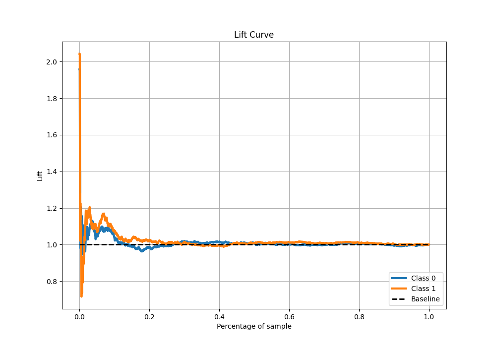

# Summary of 2_DecisionTree

[<< Go back](../README.md)

## Decision Tree

- **n_jobs**: -1
- **criterion**: gini
- **max_depth**: 3
- **explain_level**: 2

## Validation

- **validation_type**: split
- **train_ratio**: 0.75
- **shuffle**: True
- **stratify**: True

## Optimized metric

auc

## Training time

203.3 seconds

## Metric details

|           |    score |   threshold |
|:----------|---------:|------------:|
| logloss   | 0.696978 |  nan        |
| auc       | 0.503801 |  nan        |
| f1        | 0.657266 |    0.303093 |
| accuracy  | 0.509627 |    0.538457 |
| precision | 0.497866 |    0.538457 |
| recall    | 1        |    0.303093 |
| mcc       | 0.010766 |    0.33677  |

## Metric details with threshold from accuracy metric

|           |      score |   threshold |
|:----------|-----------:|------------:|
| logloss   | 0.696978   |  nan        |
| auc       | 0.503801   |  nan        |
| f1        | 0.293994   |    0.538457 |
| accuracy  | 0.509627   |    0.538457 |
| precision | 0.497866   |    0.538457 |
| recall    | 0.208582   |    0.538457 |
| mcc       | 0.00850245 |    0.538457 |

## Confusion matrix (at threshold=0.538457)

|              |   Predicted as 0 |   Predicted as 1 |
|:-------------|-----------------:|-----------------:|
| Labeled as 0 |             1397 |              353 |
| Labeled as 1 |             1328 |              350 |

## Learning curves

## Permutation-based Importance

## Confusion Matrix

## Normalized Confusion Matrix

## ROC Curve

## Kolmogorov-Smirnov Statistic

## Precision-Recall Curve

## Calibration Curve

## Cumulative Gains Curve

## Lift Curve

[<< Go back](../README.md)
