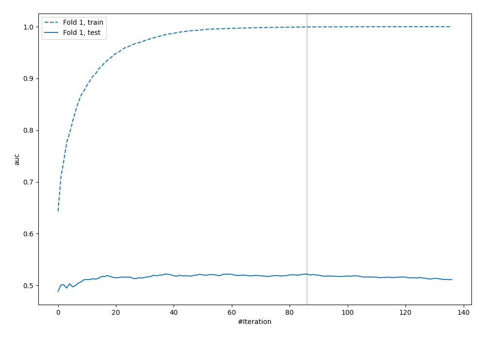
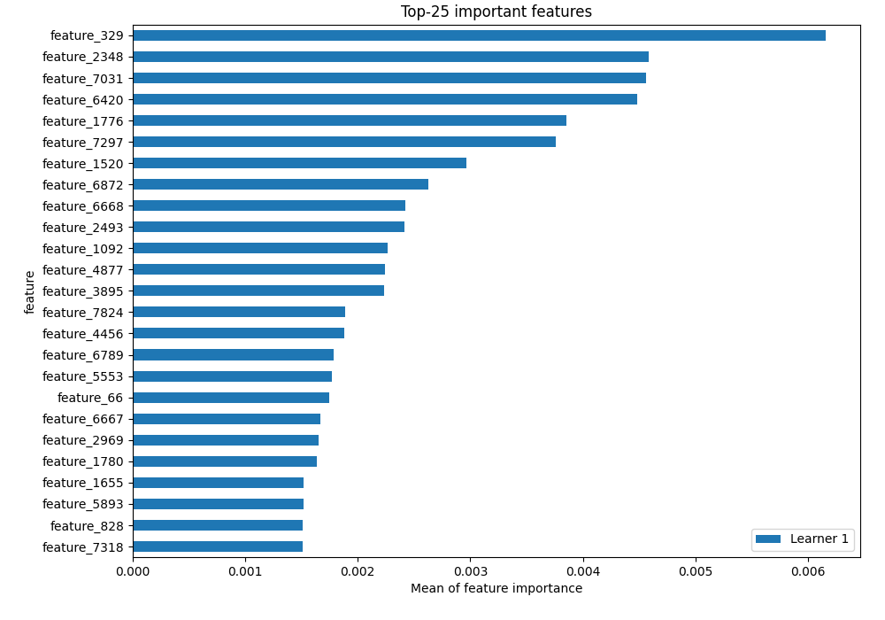
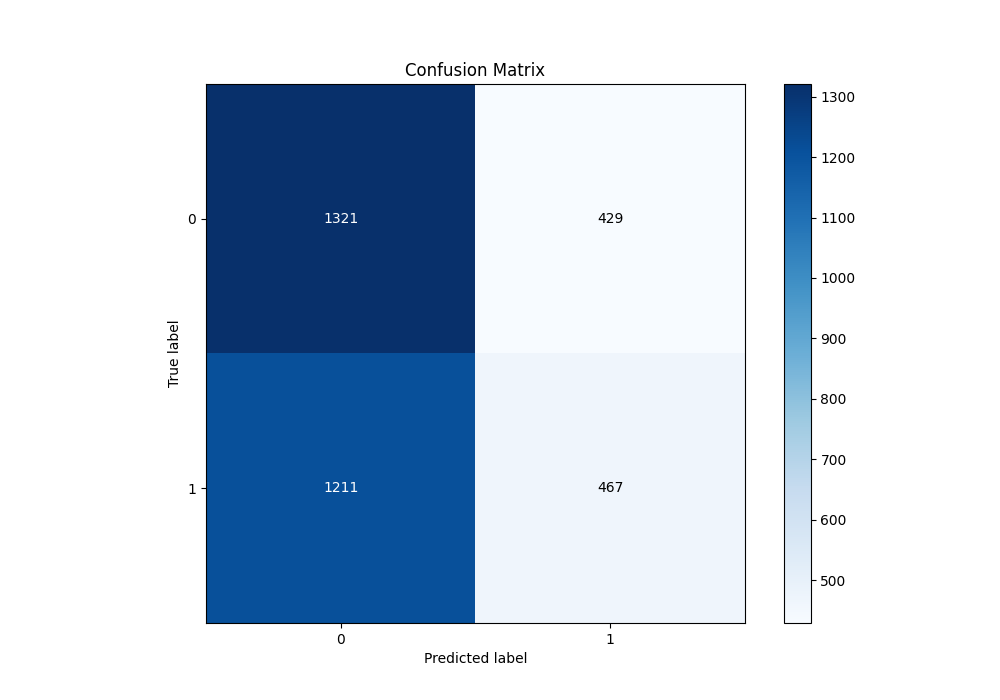
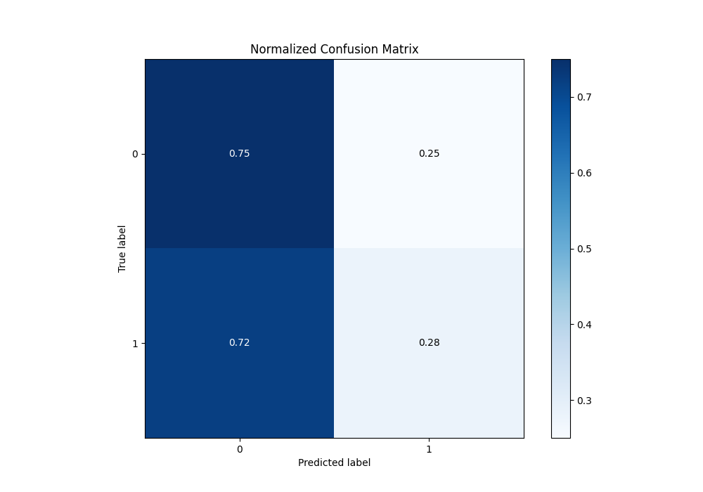
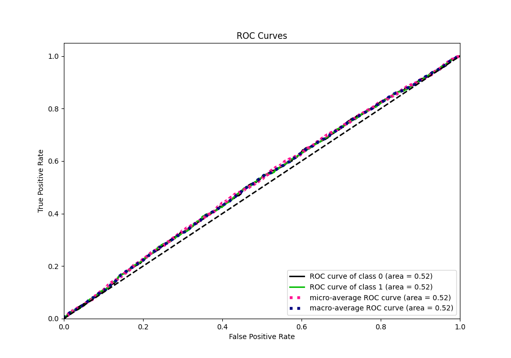
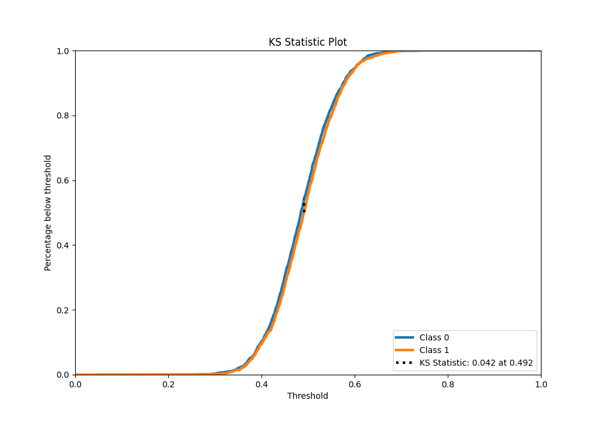
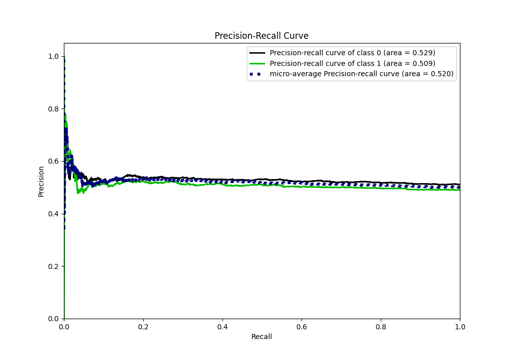
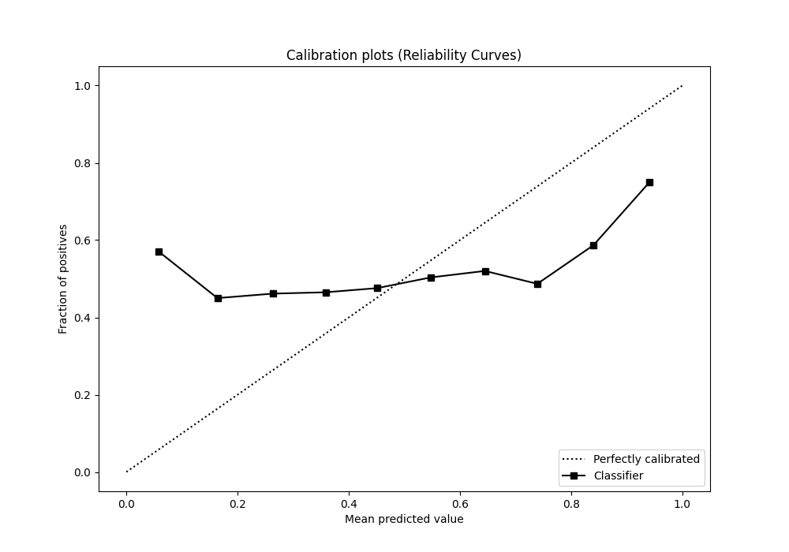
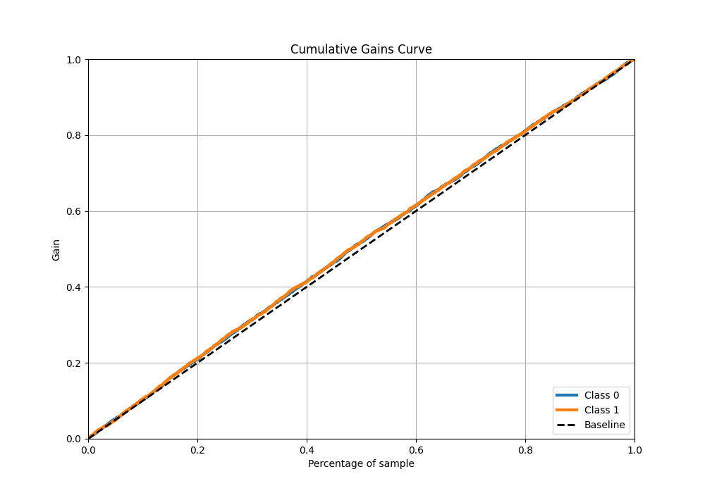
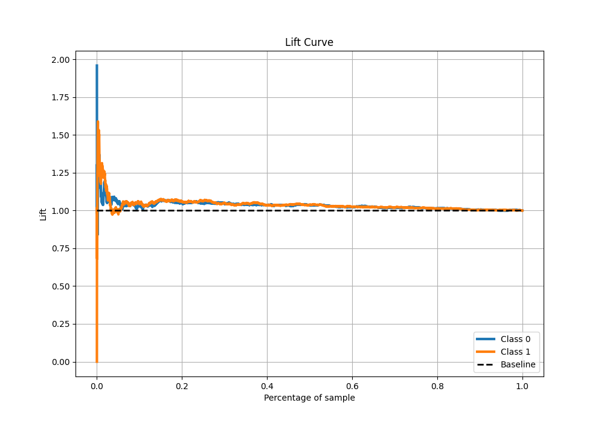

# Summary of 3_Default_LightGBM

[<< Go back](../README.md)

## LightGBM

- **n_jobs**: -1
- **objective**: binary
- **num_leaves**: 63
- **learning_rate**: 0.05
- **feature_fraction**: 0.9
- **bagging_fraction**: 0.9
- **min_data_in_leaf**: 10
- **metric**: auc
- **custom_eval_metric_name**: None
- **explain_level**: 2

## Validation

- **validation_type**: split
- **train_ratio**: 0.75
- **shuffle**: True
- **stratify**: True

## Optimized metric

auc

## Training time

233.5 seconds

## Metric details

|           |     score |   threshold |
|:----------|----------:|------------:|
| logloss   | 0.697145  |  nan        |
| auc       | 0.522084  |  nan        |
| f1        | 0.657266  |    0.220176 |
| accuracy  | 0.521587  |    0.531691 |
| precision | 0.52381   |    0.551385 |
| recall    | 1         |    0.220176 |
| mcc       | 0.0408055 |    0.485831 |

## Metric details with threshold from accuracy metric

|           |     score |   threshold |
|:----------|----------:|------------:|
| logloss   | 0.697145  |  nan        |
| auc       | 0.522084  |  nan        |
| f1        | 0.362859  |    0.531691 |
| accuracy  | 0.521587  |    0.531691 |
| precision | 0.521205  |    0.531691 |
| recall    | 0.278308  |    0.531691 |
| mcc       | 0.0377315 |    0.531691 |

## Confusion matrix (at threshold=0.531691)

|              |   Predicted as 0 |   Predicted as 1 |
|:-------------|-----------------:|-----------------:|
| Labeled as 0 |             1321 |              429 |
| Labeled as 1 |             1211 |              467 |

## Learning curves

## Permutation-based Importance

## Confusion Matrix

## Normalized Confusion Matrix

## ROC Curve

## Kolmogorov-Smirnov Statistic

## Precision-Recall Curve

## Calibration Curve

## Cumulative Gains Curve

## Lift Curve

[<< Go back](../README.md)
