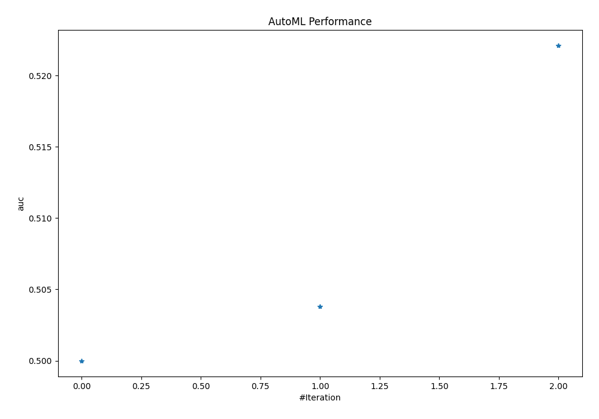
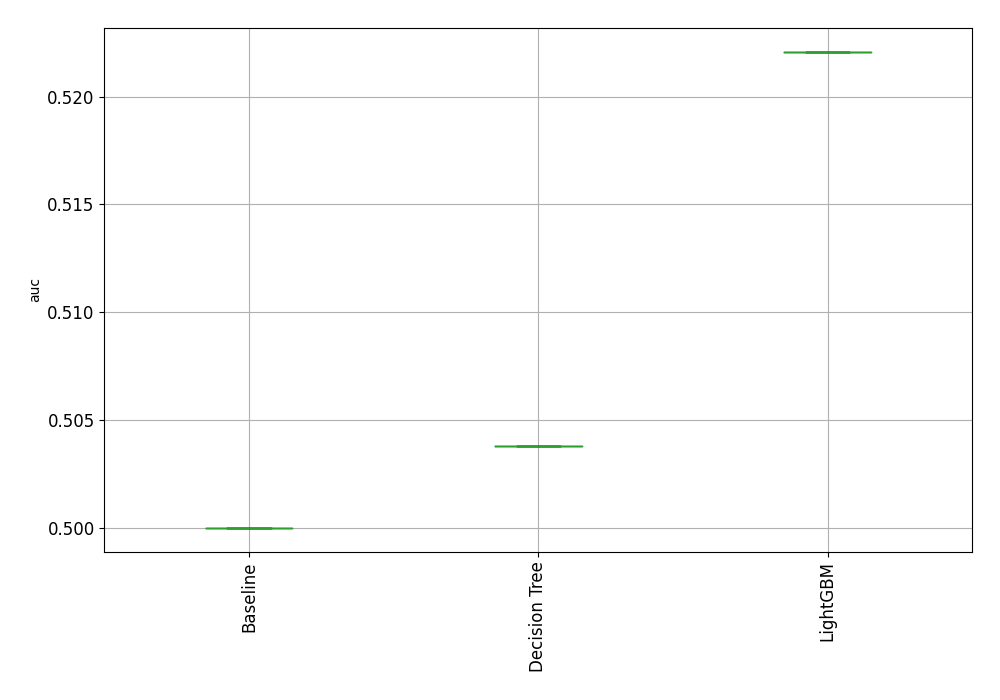

# AutoML Leaderboard

|  Best model | name                                               | model_type    | metric_type   |   metric_value |   train_time |
|:------------|:---------------------------------------------------|:--------------|:--------------|---------------:|-------------:|
|             | [1_Baseline](1_Baseline/README.md)                 | Baseline      | auc           |       0.5      |         4.76 |
|             | [2_DecisionTree](2_DecisionTree/README.md)         | Decision Tree | auc           |       0.503801 |       204.1  |
| **the
best**      | [3_Default_LightGBM](3_Default_LightGBM/README.md) | LightGBM      | auc           |       0.522084 |       233.5  |

| Metric | Value |
| ------ | -----|
| AUC | 0.51 |
| ACC | 0.52 |
| F1 | 0.45 |
| precision | 0.50|
| recall | 0.41 |

### AutoML Performance

### AutoML Performance Boxplot

