# Summary of 2_DecisionTree

[<< Go back](../README.md)

## Decision Tree

- **n_jobs**: -1
- **criterion**: gini
- **max_depth**: 3
- **explain_level**: 2

## Validation

- **validation_type**: split
- **train_ratio**: 0.75
- **shuffle**: True
- **stratify**: True

## Optimized metric

auc

## Training time

8.5 seconds

## Metric details

|           |     score |   threshold |
|:----------|----------:|------------:|
| logloss   | 0.693871  |  nan        |
| auc       | 0.513127  |  nan        |
| f1        | 0.657266  |    0.303158 |
| accuracy  | 0.510502  |    0.475589 |
| precision | 0.5       |    0.475589 |
| recall    | 1         |    0.303158 |
| mcc       | 0.0531113 |    0.438127 |

## Metric details with threshold from accuracy metric

|           |    score |   threshold |
|:----------|---------:|------------:|
| logloss   | 0.693871 |  nan        |
| auc       | 0.513127 |  nan        |
| f1        | 0.583829 |    0.475589 |
| accuracy  | 0.510502 |    0.475589 |
| precision | 0.5      |    0.475589 |
| recall    | 0.70143  |    0.475589 |
| mcc       | 0.031102 |    0.475589 |

## Confusion matrix (at threshold=0.475589)

|              |   Predicted as 0 |   Predicted as 1 |
|:-------------|-----------------:|-----------------:|
| Labeled as 0 |              573 |             1177 |
| Labeled as 1 |              501 |             1177 |

## Learning curves

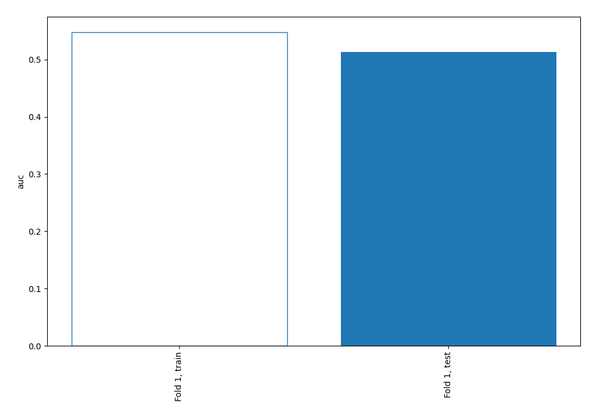

## Permutation-based Importance

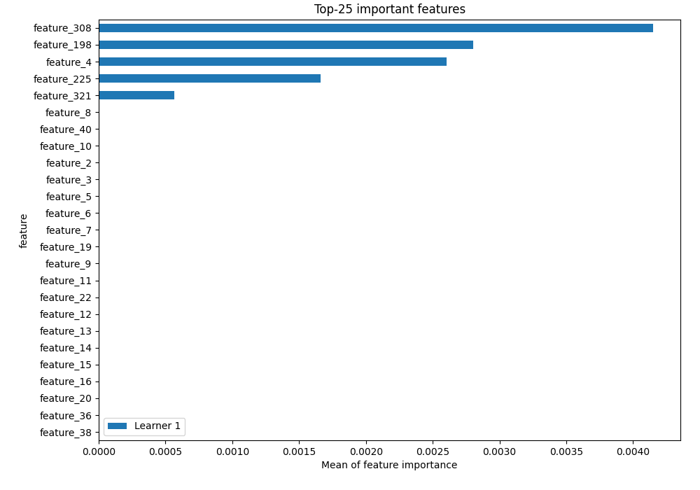

## Confusion Matrix

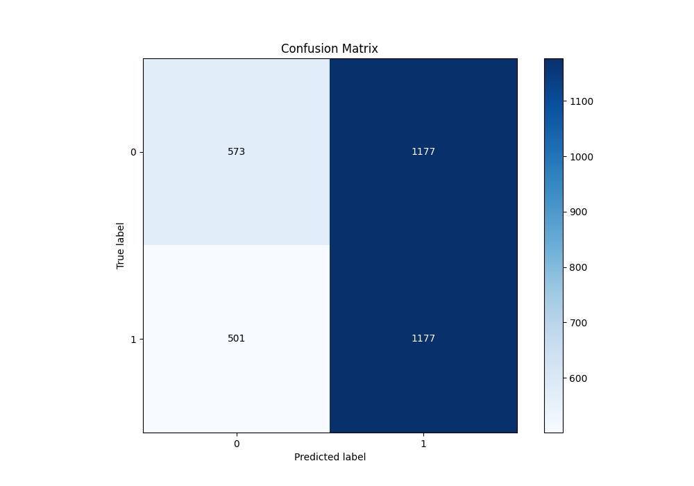

## Normalized Confusion Matrix

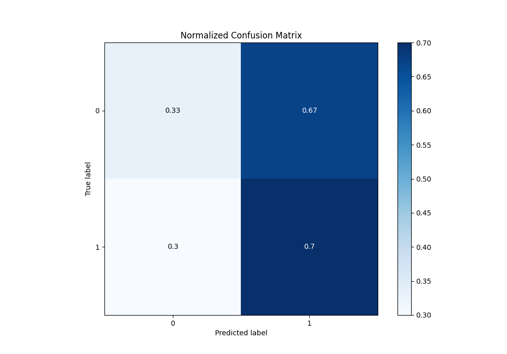

## ROC Curve

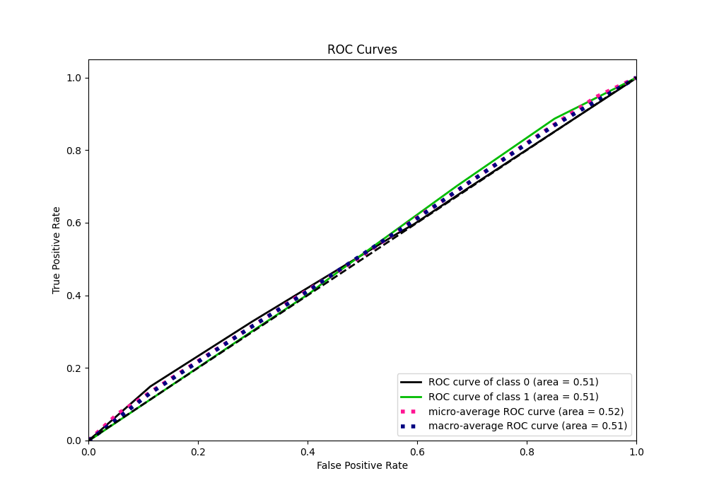

## Kolmogorov-Smirnov Statistic

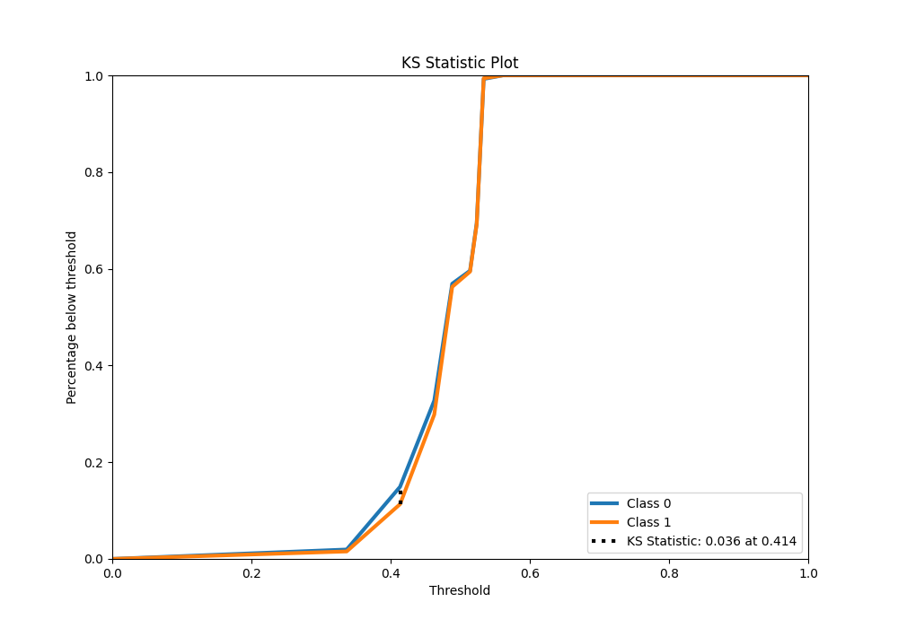

## Precision-Recall Curve

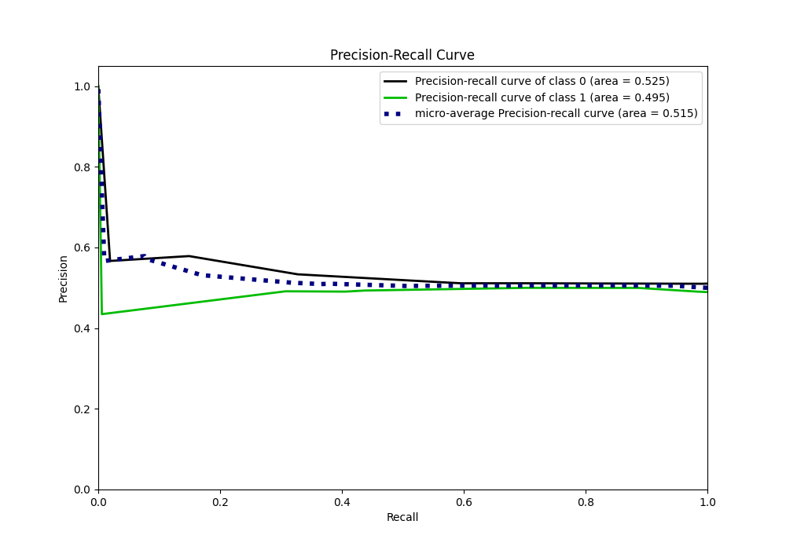

## Calibration Curve

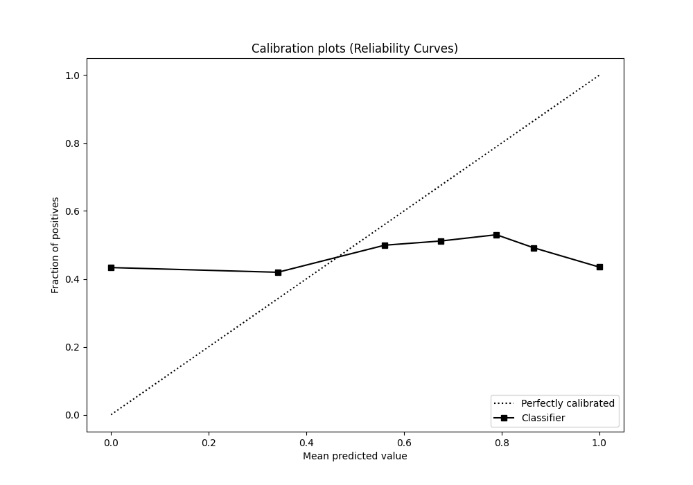

## Cumulative Gains Curve

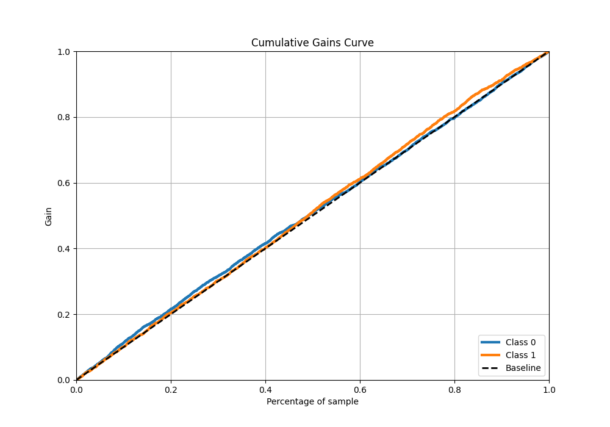

## Lift Curve

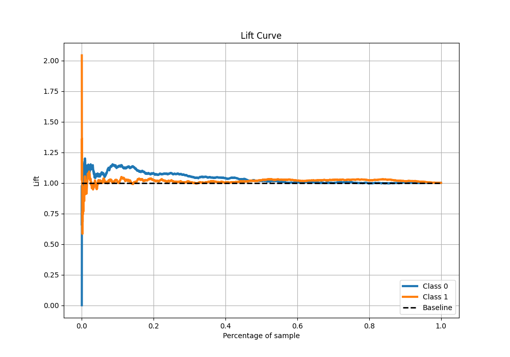

## SHAP Importance

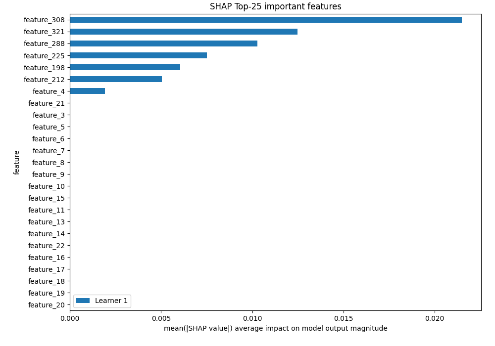

[<< Go back](../README.md)
