# Summary of 3_Default_Xgboost

[<< Go back](../README.md)

## Extreme Gradient Boosting (Xgboost)

- **n_jobs**: -1
- **objective**: binary:logistic
- **eta**: 0.075
- **max_depth**: 6
- **min_child_weight**: 1
- **subsample**: 1.0
- **colsample_bytree**: 1.0
- **eval_metric**: auc
- **explain_level**: 2

## Validation

- **validation_type**: split
- **train_ratio**: 0.75
- **shuffle**: True
- **stratify**: True

## Optimized metric

auc

## Training time

89.5 seconds

## Metric details

|           |     score |   threshold |
|:----------|----------:|------------:|
| logloss   | 0.690183  |  nan        |
| auc       | 0.565622  |  nan        |
| f1        | 0.660554  |    0.318318 |
| accuracy  | 0.547841  |    0.566986 |
| precision | 0.594366  |    0.637013 |
| recall    | 1         |    0.149091 |
| mcc       | 0.0998595 |    0.318318 |

## Metric details with threshold from accuracy metric

|           |    score |   threshold |
|:----------|---------:|------------:|
| logloss   | 0.690183 |  nan        |
| auc       | 0.565622 |  nan        |
| f1        | 0.401544 |    0.566986 |
| accuracy  | 0.547841 |    0.566986 |
| precision | 0.570175 |    0.566986 |
| recall    | 0.309893 |    0.566986 |
| mcc       | 0.097167 |    0.566986 |

## Confusion matrix (at threshold=0.566986)

|              |   Predicted as 0 |   Predicted as 1 |
|:-------------|-----------------:|-----------------:|
| Labeled as 0 |             1358 |              392 |
| Labeled as 1 |             1158 |              520 |

## Learning curves

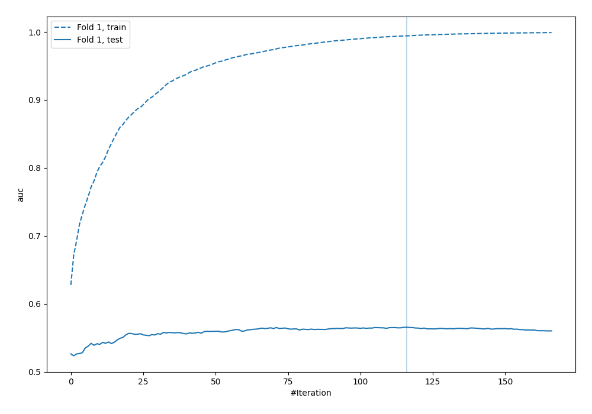

## Permutation-based Importance

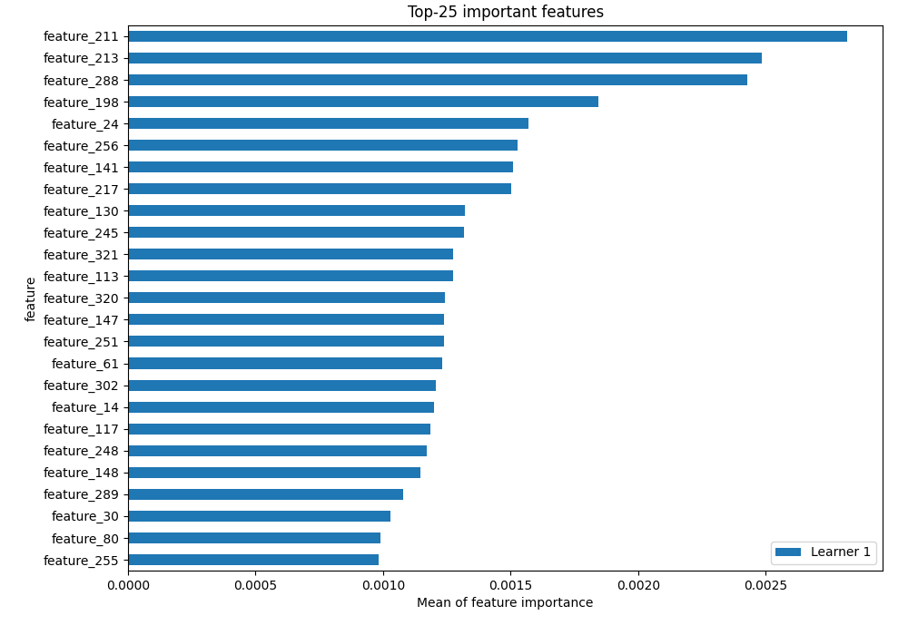

## Confusion Matrix

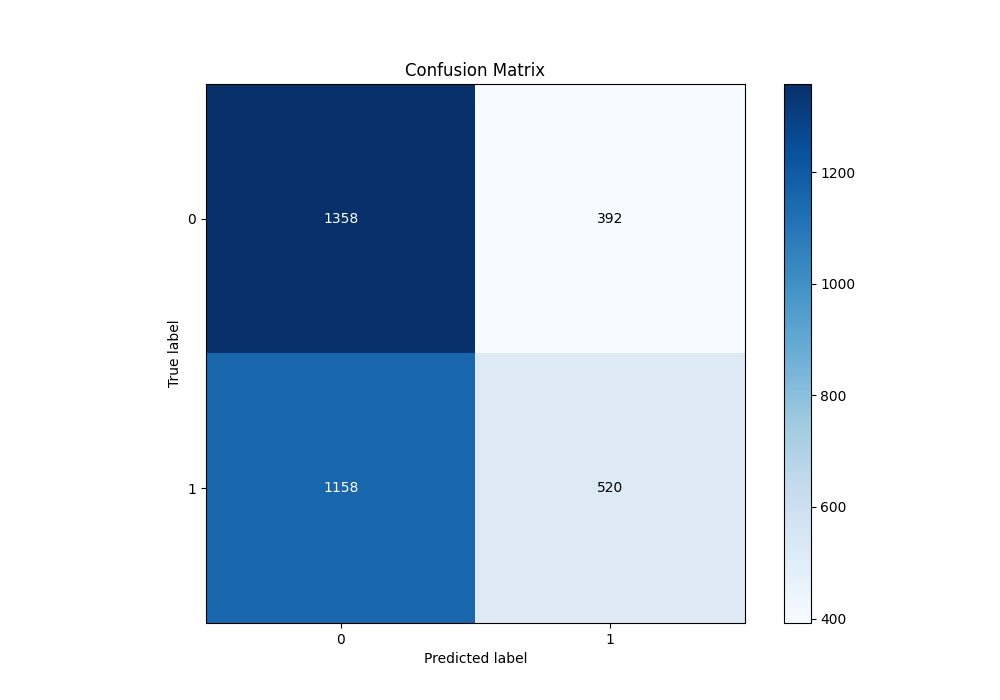

## Normalized Confusion Matrix

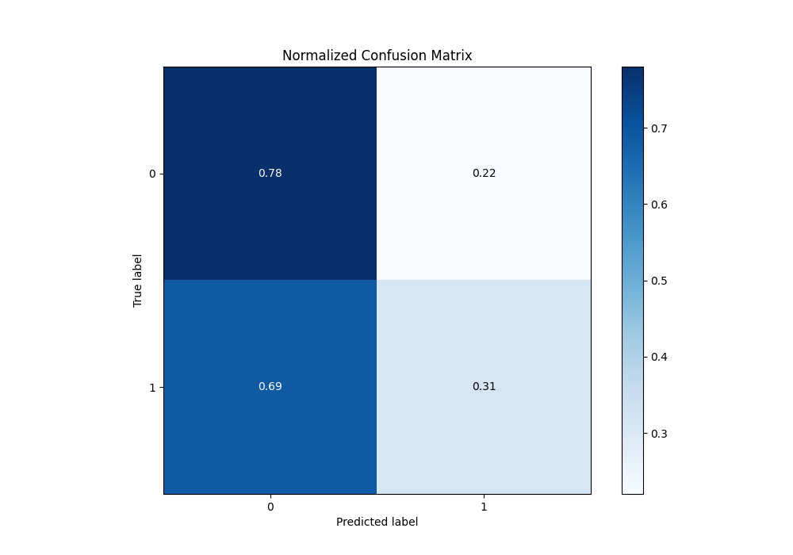

## ROC Curve

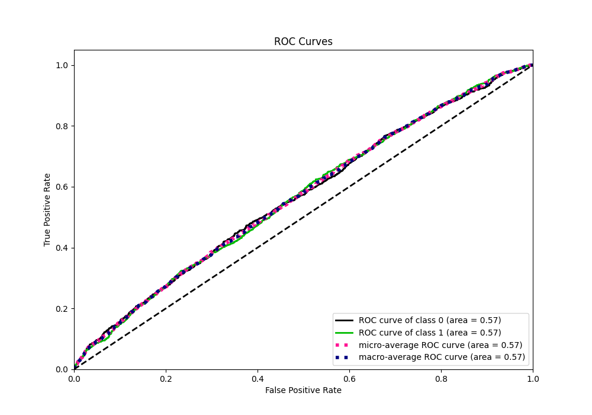

## Kolmogorov-Smirnov Statistic

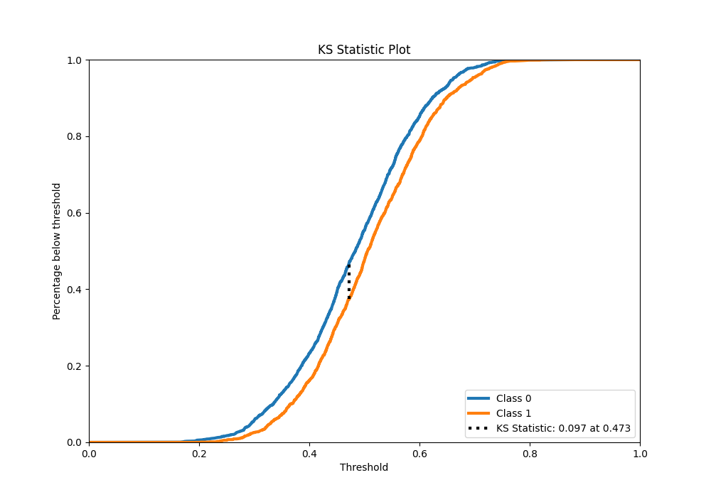

## Precision-Recall Curve

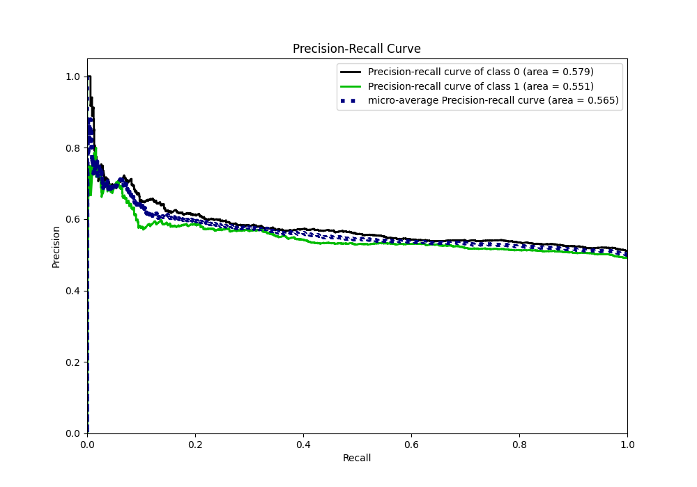

## Calibration Curve

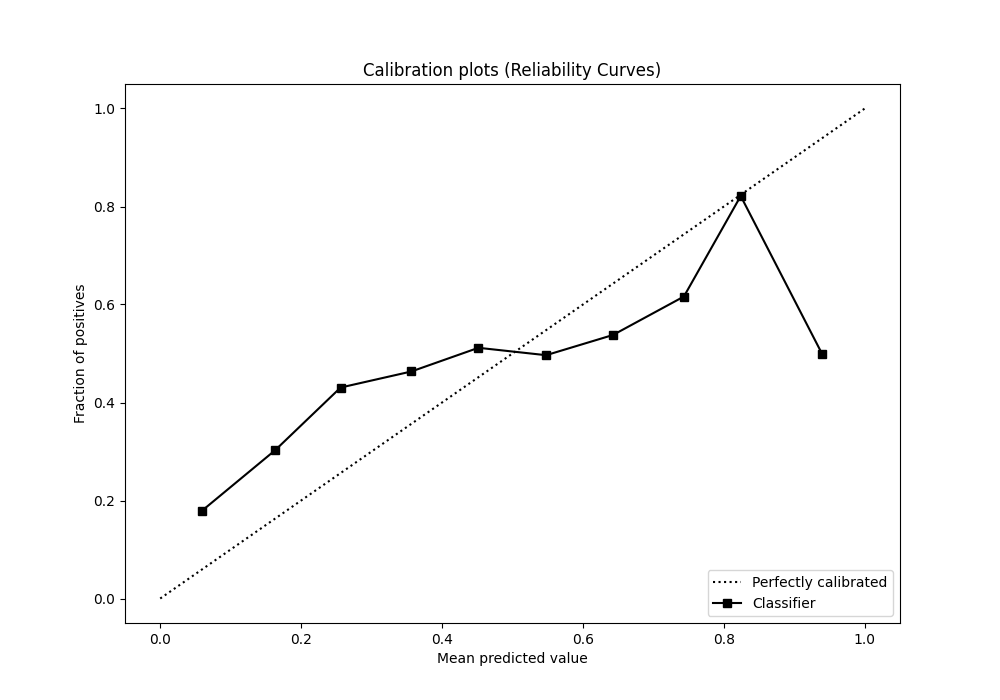

## Cumulative Gains Curve

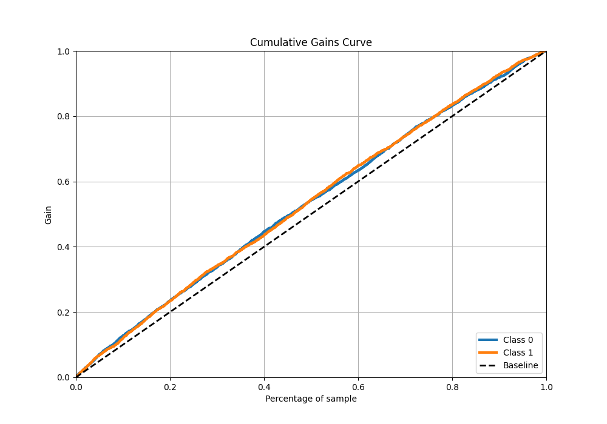

## Lift Curve

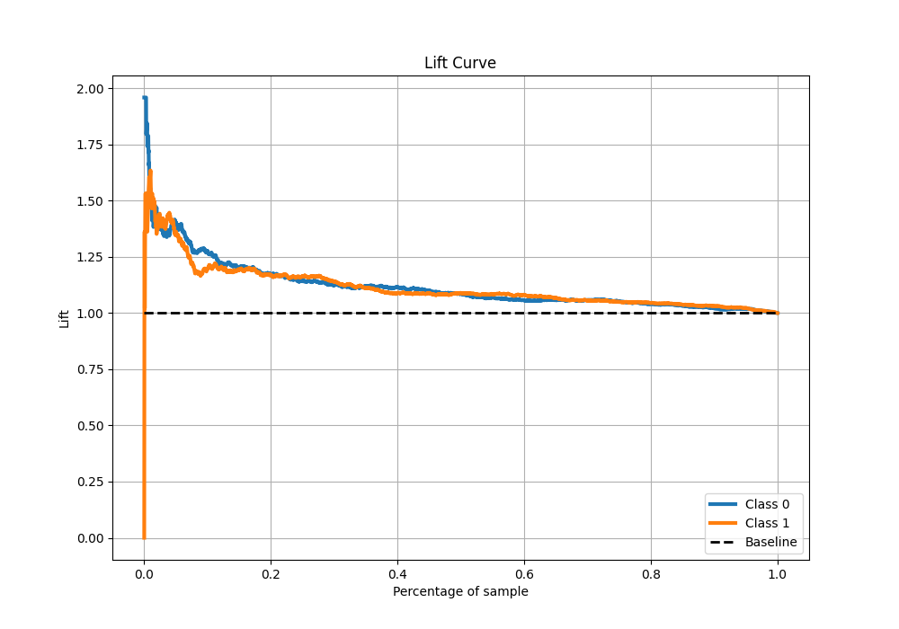

## SHAP Importance

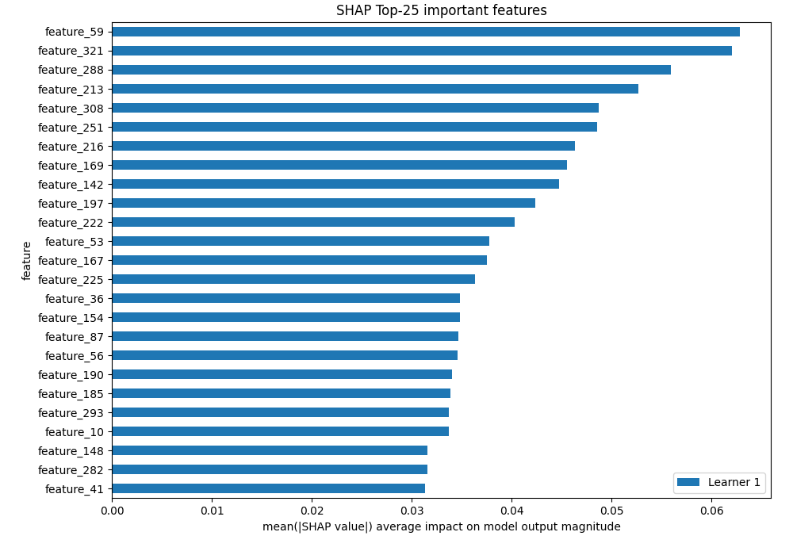

[<< Go back](../README.md)
