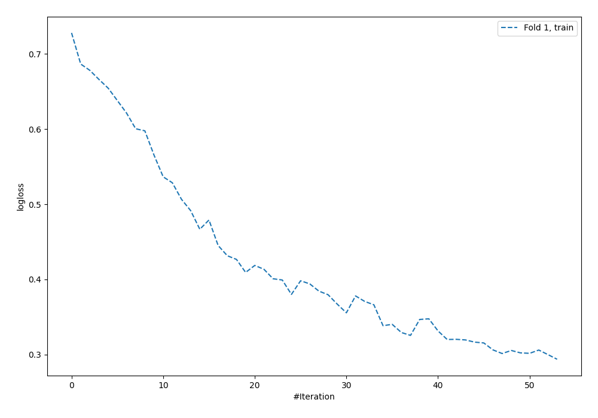
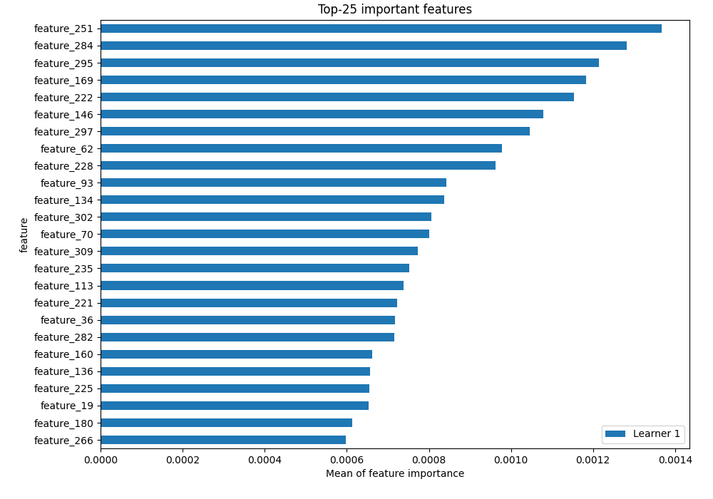
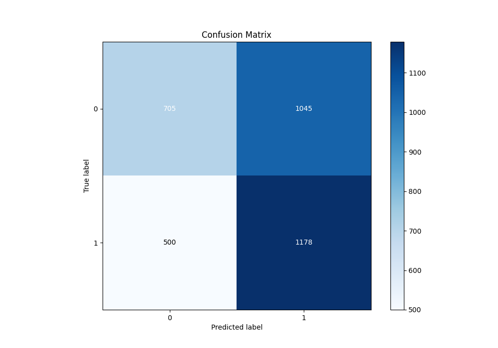
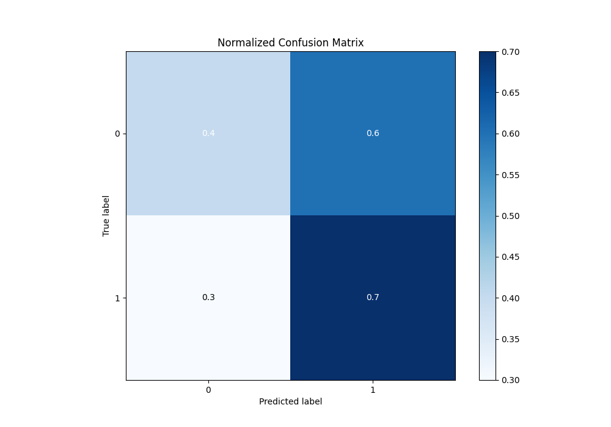
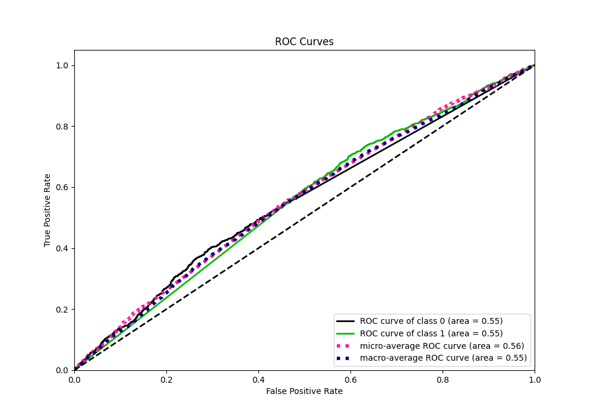
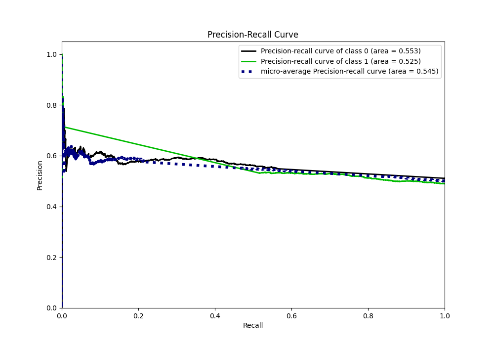
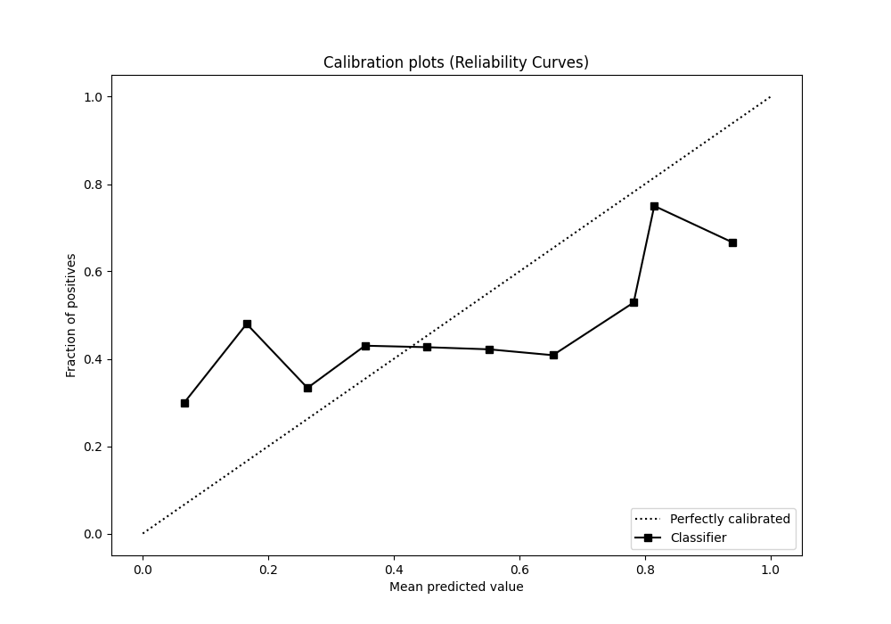
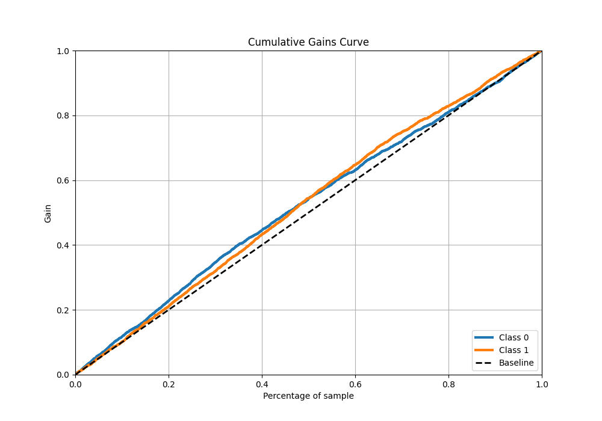
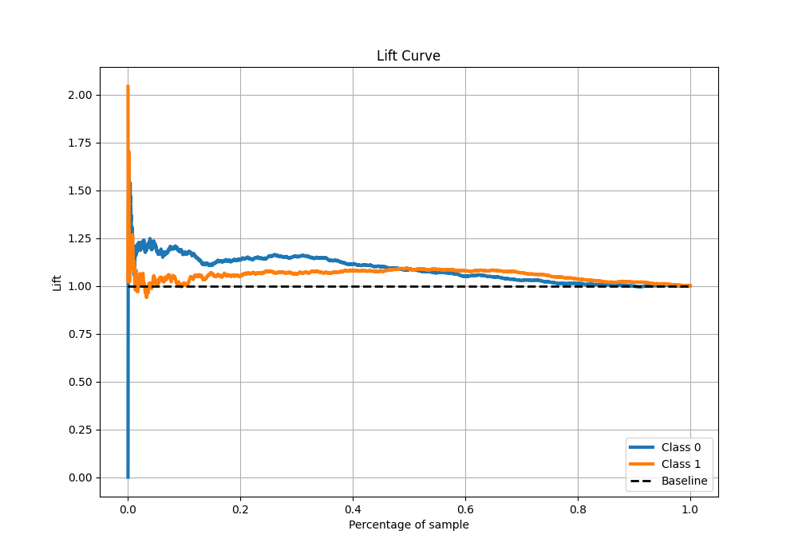

# Summary of 4_Default_NeuralNetwork

[<< Go back](../README.md)

## Neural Network

- **n_jobs**: -1
- **dense_1_size**: 32
- **dense_2_size**: 16
- **learning_rate**: 0.05
- **explain_level**: 2

## Validation

- **validation_type**: split
- **train_ratio**: 0.75
- **shuffle**: True
- **stratify**: True

## Optimized metric

auc

## Training time

6.2 seconds

## Metric details

|           |    score |   threshold |
|:----------|---------:|------------:|
| logloss   | 0.692629 | nan         |
| auc       | 0.554169 | nan         |
| f1        | 0.657266 |   0.0793673 |
| accuracy  | 0.5493   |   0.471237  |
| precision | 0.714286 |   0.520009  |
| recall    | 1        |   0.0793673 |
| mcc       | 0.109814 |   0.471237  |

## Metric details with threshold from accuracy metric

|           |    score |   threshold |
|:----------|---------:|------------:|
| logloss   | 0.692629 |  nan        |
| auc       | 0.554169 |  nan        |
| f1        | 0.603948 |    0.471237 |
| accuracy  | 0.5493   |    0.471237 |
| precision | 0.529915 |    0.471237 |
| recall    | 0.702026 |    0.471237 |
| mcc       | 0.109814 |    0.471237 |

## Confusion matrix (at threshold=0.471237)

|              |   Predicted as 0 |   Predicted as 1 |
|:-------------|-----------------:|-----------------:|
| Labeled as 0 |              705 |             1045 |
| Labeled as 1 |              500 |             1178 |

## Learning curves

## Permutation-based Importance

## Confusion Matrix

## Normalized Confusion Matrix

## ROC Curve

## Kolmogorov-Smirnov Statistic

## Precision-Recall Curve

## Calibration Curve

## Cumulative Gains Curve

## Lift Curve

[<< Go back](../README.md)
