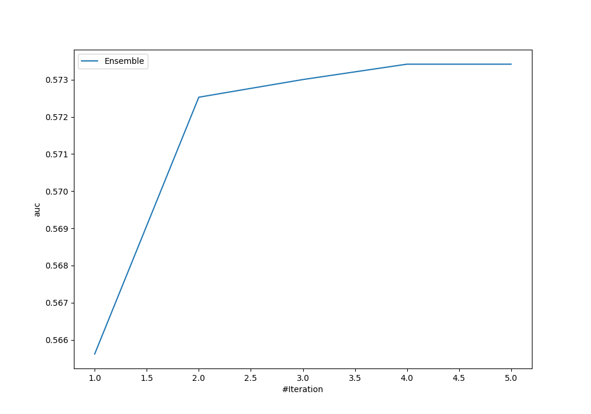
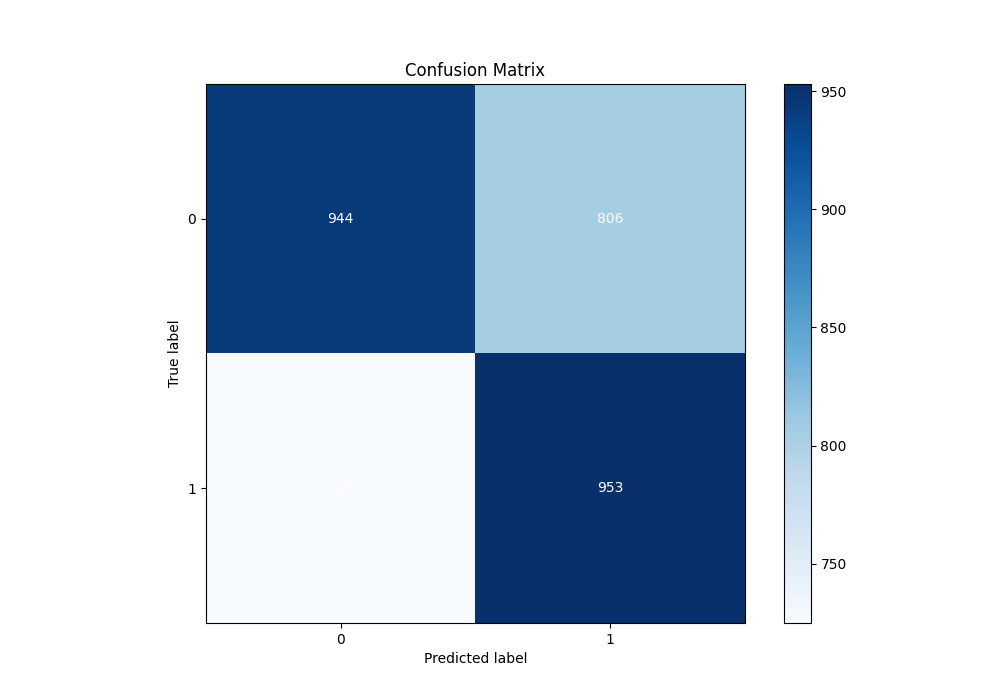
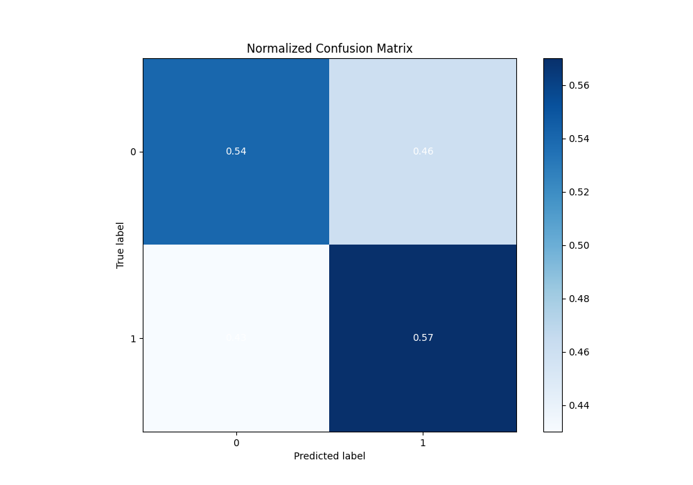
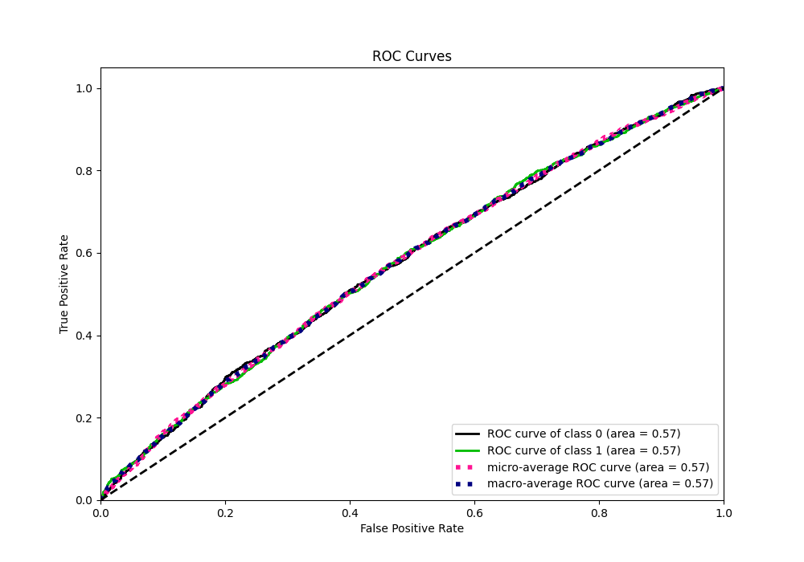
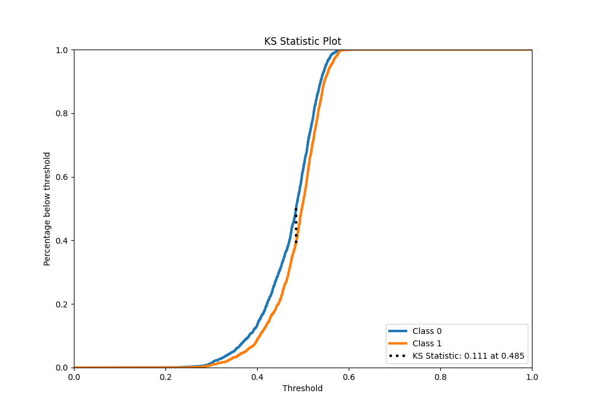
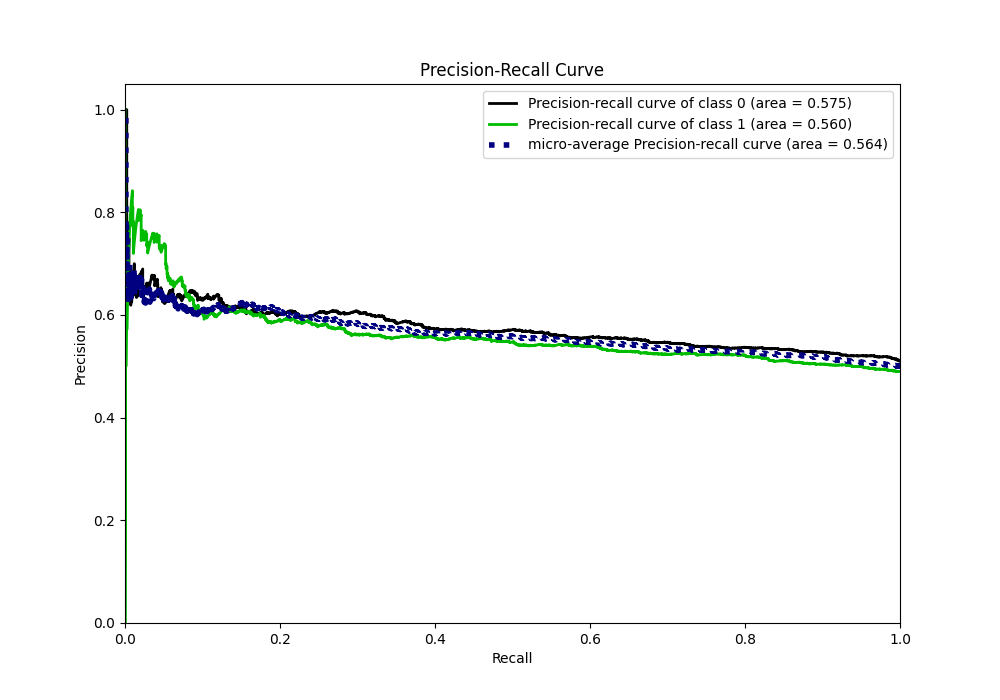
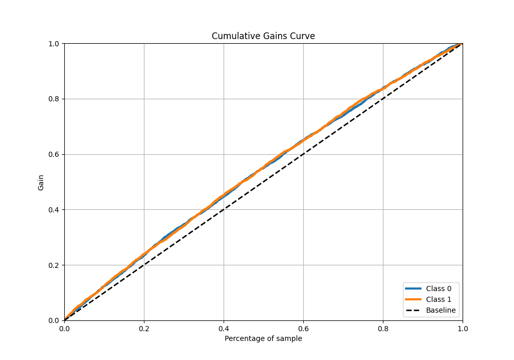
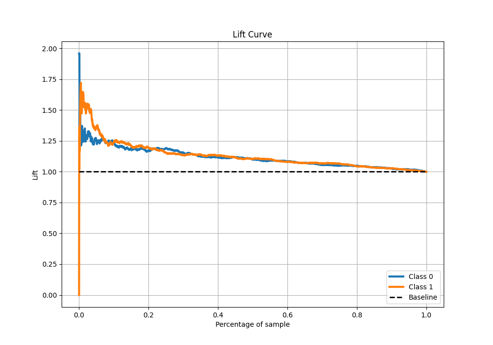

# Summary of Ensemble

[<< Go back](../README.md)

## Ensemble structure

| Model                   |   Weight |
|:------------------------|---------:|
| 3_Default_Xgboost       |        1 |
| 4_Default_NeuralNetwork |        2 |
| 5_Default_RandomForest  |        1 |

## Metric details

|           |    score |   threshold |
|:----------|---------:|------------:|
| logloss   | 0.685014 |  nan        |
| auc       | 0.573416 |  nan        |
| f1        | 0.657266 |    0.201188 |
| accuracy  | 0.553384 |    0.490072 |
| precision | 0.607843 |    0.54043  |
| recall    | 1        |    0.201188 |
| mcc       | 0.112571 |    0.447785 |

## Metric details with threshold from accuracy metric

|           |    score |   threshold |
|:----------|---------:|------------:|
| logloss   | 0.685014 |  nan        |
| auc       | 0.573416 |  nan        |
| f1        | 0.554553 |    0.490072 |
| accuracy  | 0.553384 |    0.490072 |
| precision | 0.541785 |    0.490072 |
| recall    | 0.567938 |    0.490072 |
| mcc       | 0.10738  |    0.490072 |

## Confusion matrix (at threshold=0.490072)

|              |   Predicted as 0 |   Predicted as 1 |
|:-------------|-----------------:|-----------------:|
| Labeled as 0 |              944 |              806 |
| Labeled as 1 |              725 |              953 |

## Learning curves

## Confusion Matrix

## Normalized Confusion Matrix

## ROC Curve

## Kolmogorov-Smirnov Statistic

## Precision-Recall Curve

## Calibration Curve

## Cumulative Gains Curve

## Lift Curve

[<< Go back](../README.md)
