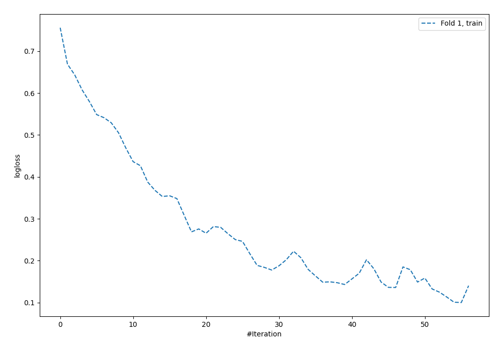
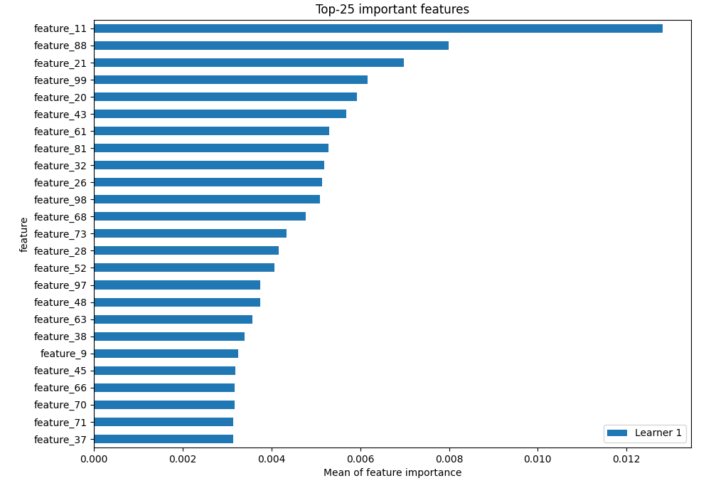
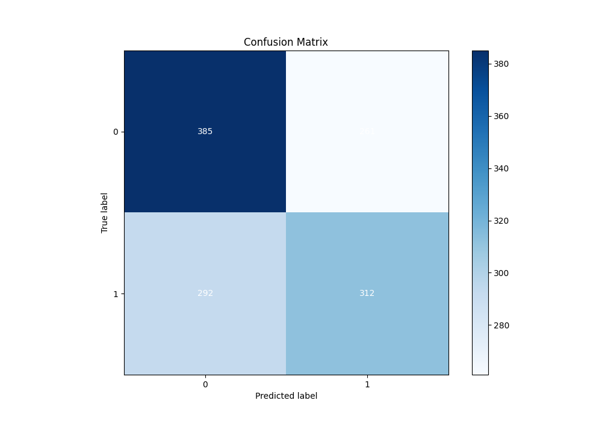
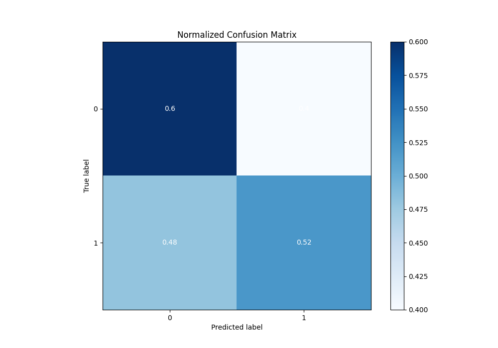
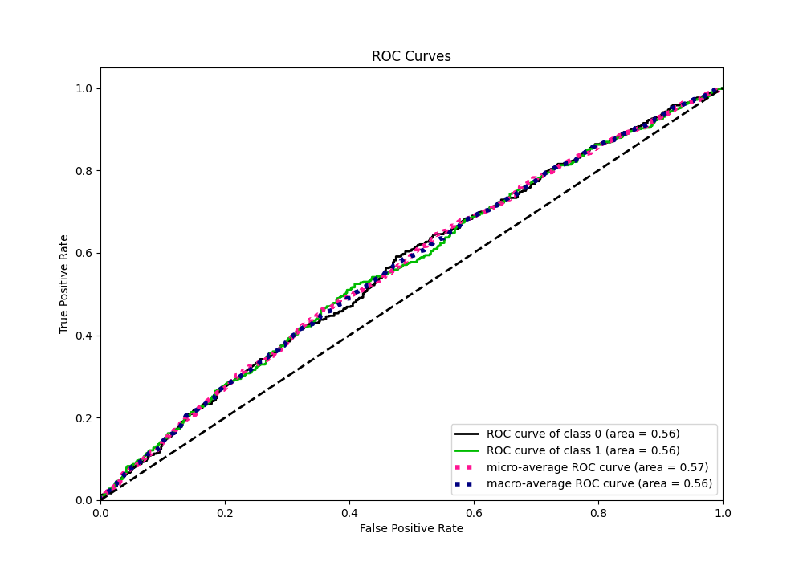
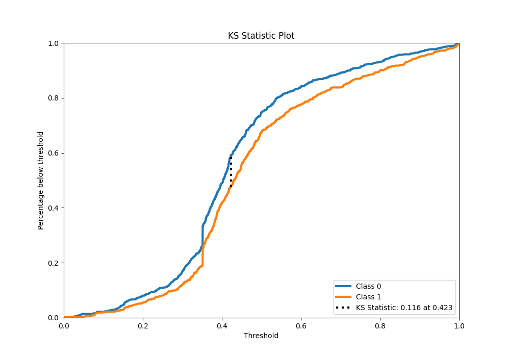
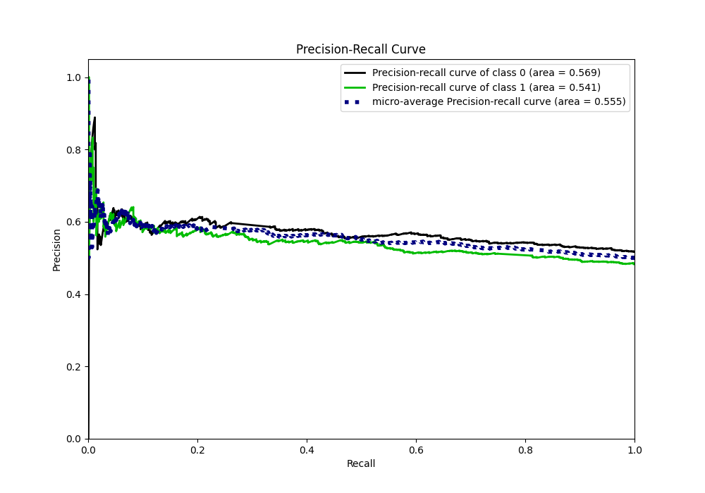
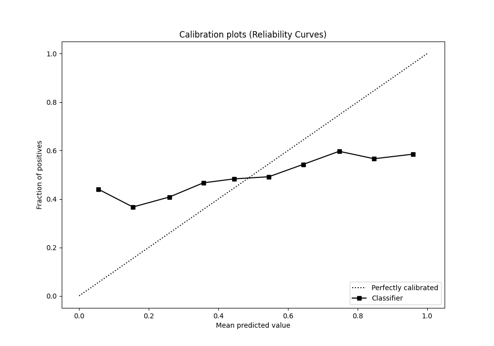
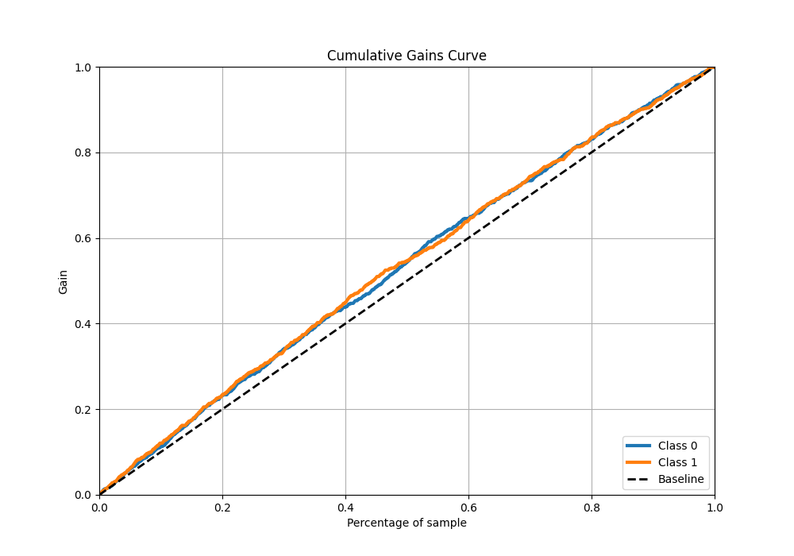
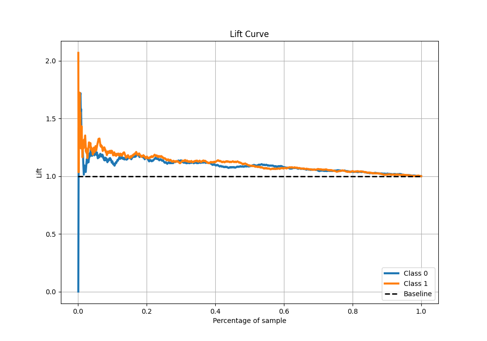

# Summary of 5_Default_NeuralNetwork

[<< Go back](../README.md)

## Neural Network

- **n_jobs**: -1
- **dense_1_size**: 32
- **dense_2_size**: 16
- **learning_rate**: 0.05
- **explain_level**: 2

## Validation

- **validation_type**: split
- **train_ratio**: 0.75
- **shuffle**: True
- **stratify**: True

## Optimized metric

auc

## Training time

1.8 seconds

## Metric details

|           |    score |    threshold |
|:----------|---------:|-------------:|
| logloss   | 0.76868  | nan          |
| auc       | 0.563967 | nan          |
| f1        | 0.651564 |   0.00190441 |
| accuracy  | 0.5576   |   0.426766   |
| precision | 0.59322  |   0.888019   |
| recall    | 1        |   0.00190441 |
| mcc       | 0.112859 |   0.426766   |

## Metric details with threshold from accuracy metric

|           |    score |   threshold |
|:----------|---------:|------------:|
| logloss   | 0.76868  |  nan        |
| auc       | 0.563967 |  nan        |
| f1        | 0.530161 |    0.426766 |
| accuracy  | 0.5576   |    0.426766 |
| precision | 0.544503 |    0.426766 |
| recall    | 0.516556 |    0.426766 |
| mcc       | 0.112859 |    0.426766 |

## Confusion matrix (at threshold=0.426766)

|              |   Predicted as 0 |   Predicted as 1 |
|:-------------|-----------------:|-----------------:|
| Labeled as 0 |              385 |              261 |
| Labeled as 1 |              292 |              312 |

## Learning curves

## Permutation-based Importance

## Confusion Matrix

## Normalized Confusion Matrix

## ROC Curve

## Kolmogorov-Smirnov Statistic

## Precision-Recall Curve

## Calibration Curve

## Cumulative Gains Curve

## Lift Curve

[<< Go back](../README.md)
