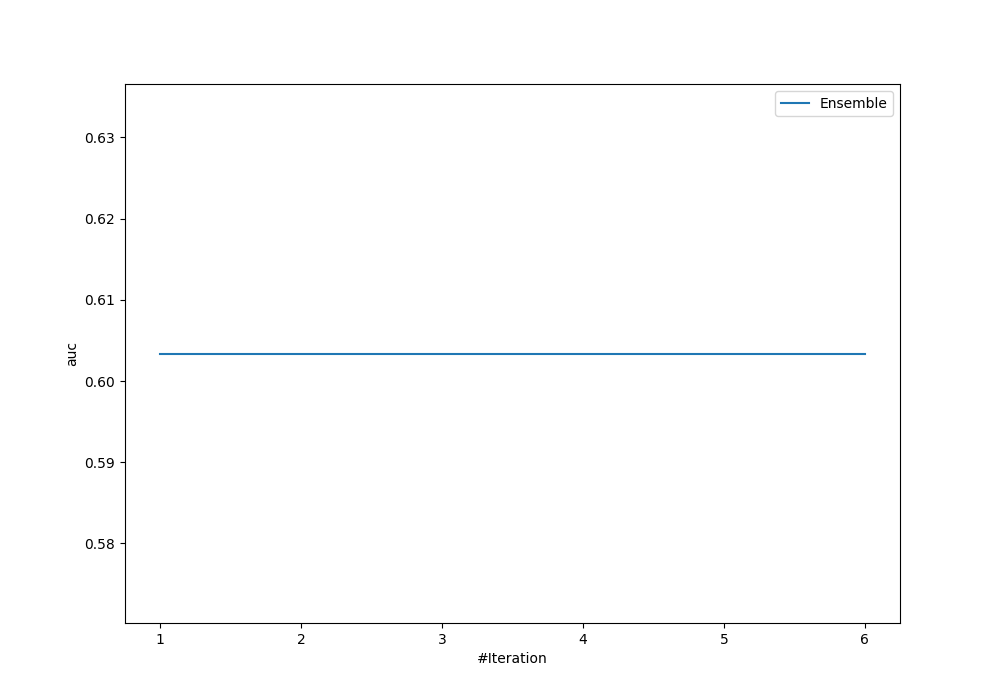
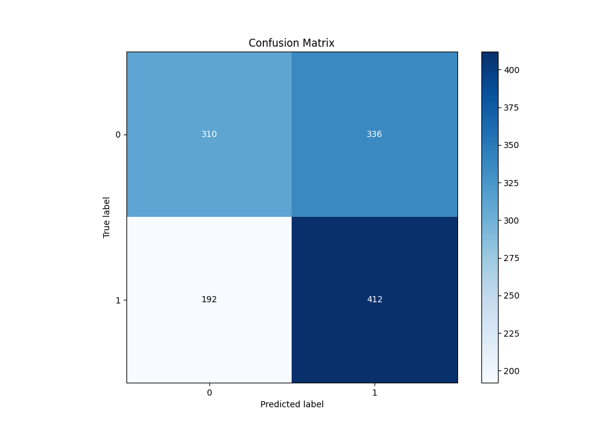
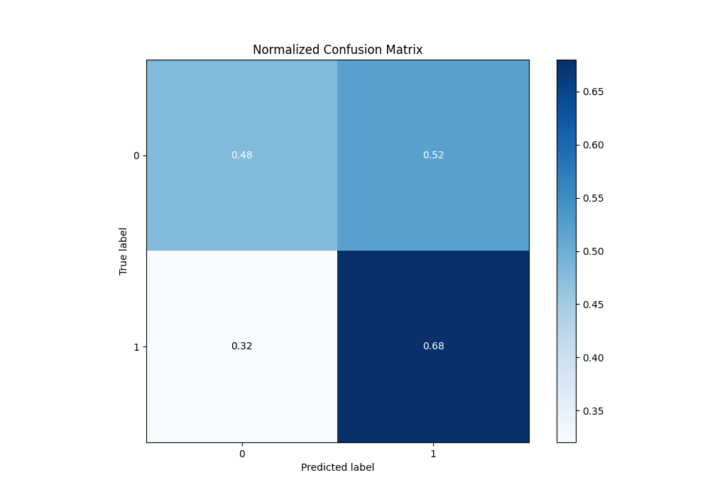
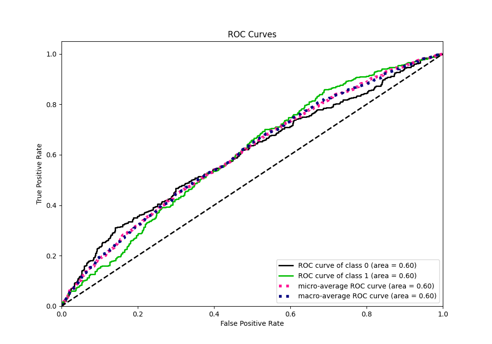
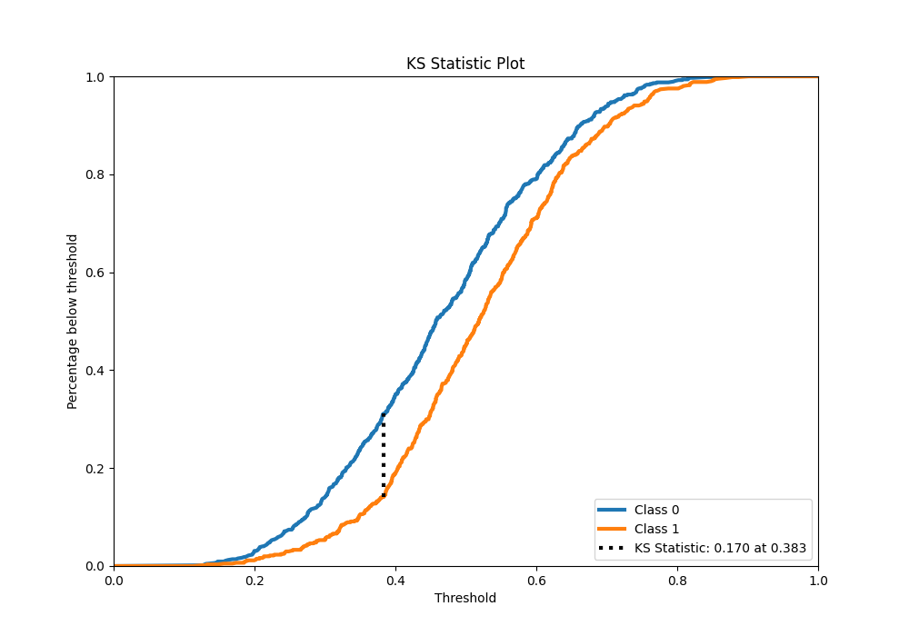
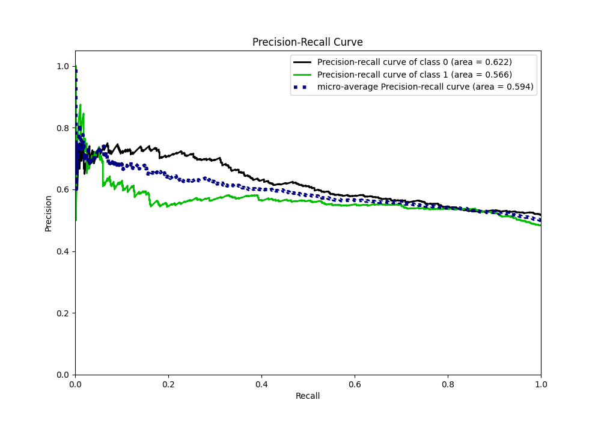
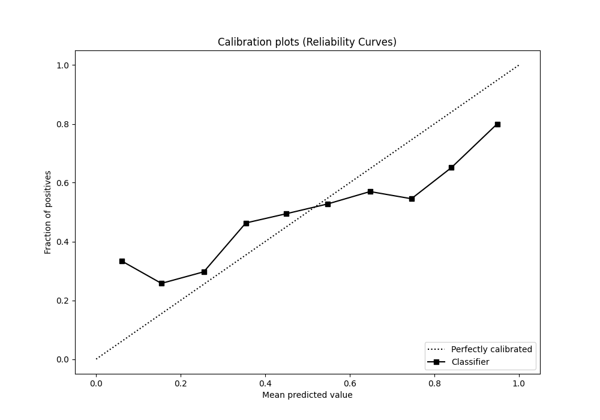
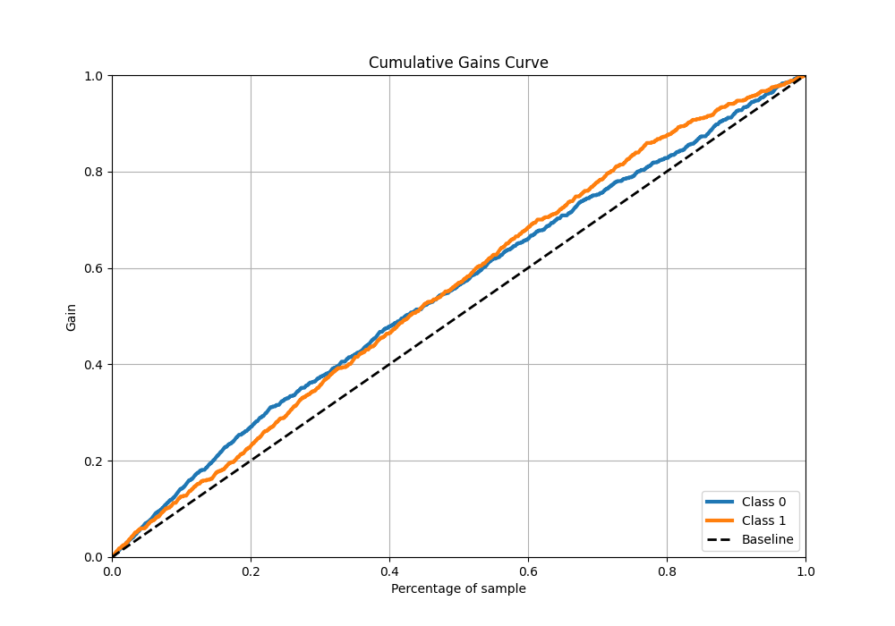
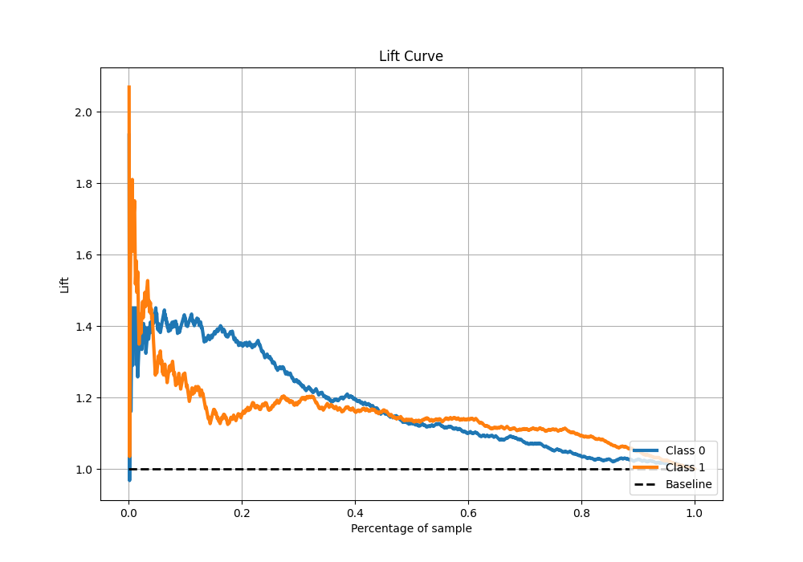

# Summary of Ensemble

[<< Go back](../README.md)

## Ensemble structure

| Model    |   Weight |
|:---------|---------:|
| 3_Linear |        1 |

## Metric details

|           |    score |   threshold |
|:----------|---------:|------------:|
| logloss   | 0.682999 |  nan        |
| auc       | 0.603392 |  nan        |
| f1        | 0.661972 |    0.316161 |
| accuracy  | 0.5776   |    0.451899 |
| precision | 0.613333 |    0.721944 |
| recall    | 1        |    0.101465 |
| mcc       | 0.194736 |    0.381235 |

## Metric details with threshold from accuracy metric

|           |    score |   threshold |
|:----------|---------:|------------:|
| logloss   | 0.682999 |  nan        |
| auc       | 0.603392 |  nan        |
| f1        | 0.609467 |    0.451899 |
| accuracy  | 0.5776   |    0.451899 |
| precision | 0.550802 |    0.451899 |
| recall    | 0.682119 |    0.451899 |
| mcc       | 0.165133 |    0.451899 |

## Confusion matrix (at threshold=0.451899)

|              |   Predicted as 0 |   Predicted as 1 |
|:-------------|-----------------:|-----------------:|
| Labeled as 0 |              310 |              336 |
| Labeled as 1 |              192 |              412 |

## Learning curves

## Confusion Matrix

## Normalized Confusion Matrix

## ROC Curve

## Kolmogorov-Smirnov Statistic

## Precision-Recall Curve

## Calibration Curve

## Cumulative Gains Curve

## Lift Curve

[<< Go back](../README.md)
