# Summary of 2_DecisionTree

[<< Go back](../README.md)

## Decision Tree

- **n_jobs**: -1
- **criterion**: gini
- **max_depth**: 3
- **explain_level**: 2

## Validation

- **validation_type**: split
- **train_ratio**: 0.75
- **shuffle**: True
- **stratify**: True

## Optimized metric

auc

## Training time

11.0 seconds

## Metric details

|           |    score |   threshold |
|:----------|---------:|------------:|
| logloss   | 0.889368 |  nan        |
| auc       | 0.519481 |  nan        |
| f1        | 0.663717 |    0        |
| accuracy  | 0.542484 |    0.385421 |
| precision | 0.571429 |    0.627753 |
| recall    | 0.974026 |    0        |
| mcc       | 0.114445 |    0.385421 |

## Metric details with threshold from accuracy metric

|           |    score |   threshold |
|:----------|---------:|------------:|
| logloss   | 0.889368 |  nan        |
| auc       | 0.519481 |  nan        |
| f1        | 0.663462 |    0.385421 |
| accuracy  | 0.542484 |    0.385421 |
| precision | 0.526718 |    0.385421 |
| recall    | 0.896104 |    0.385421 |
| mcc       | 0.114445 |    0.385421 |

## Confusion matrix (at threshold=0.385421)

|              |   Predicted as C |   Predicted as N |
|:-------------|-----------------:|-----------------:|
| Labeled as C |               14 |               62 |
| Labeled as N |                8 |               69 |

## Learning curves

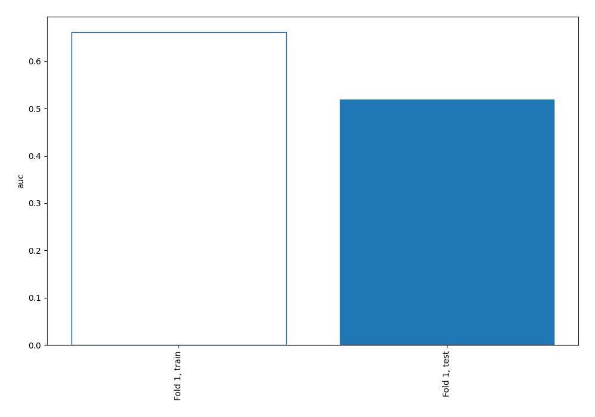

## Permutation-based Importance

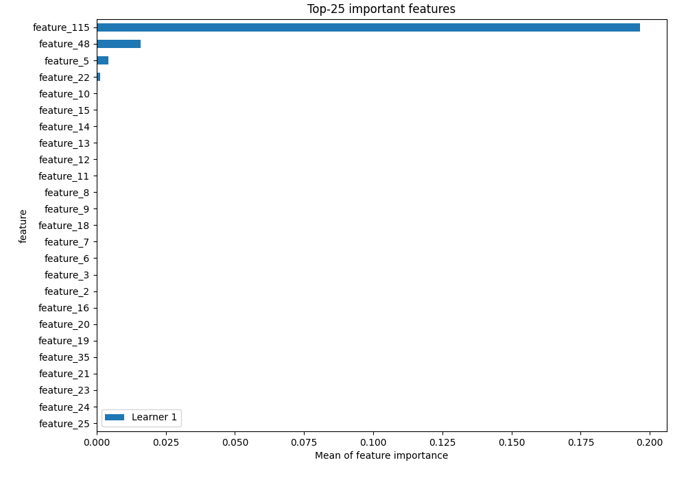

## Confusion Matrix

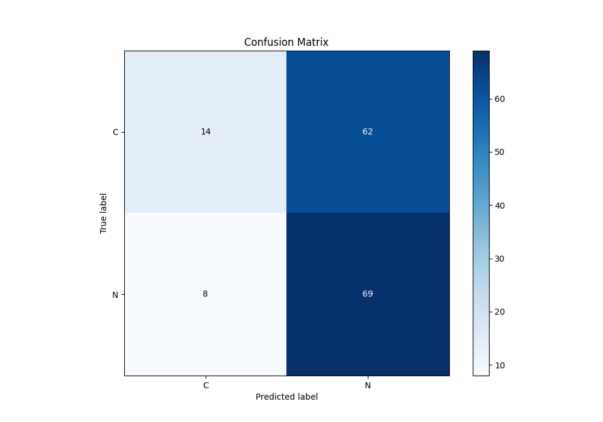

## Normalized Confusion Matrix

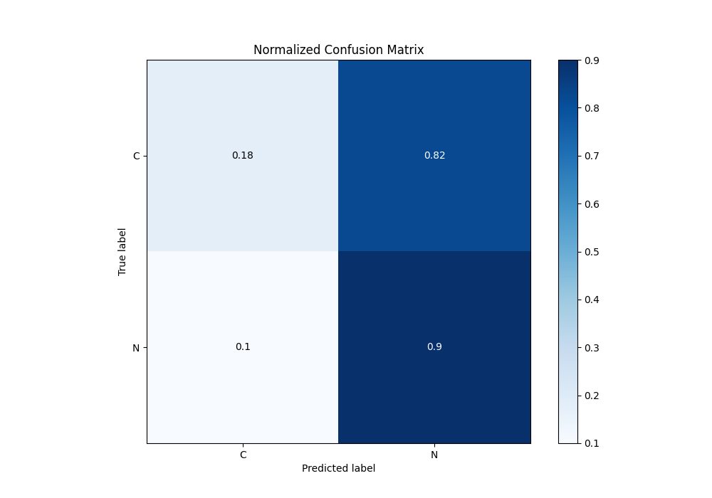

## ROC Curve

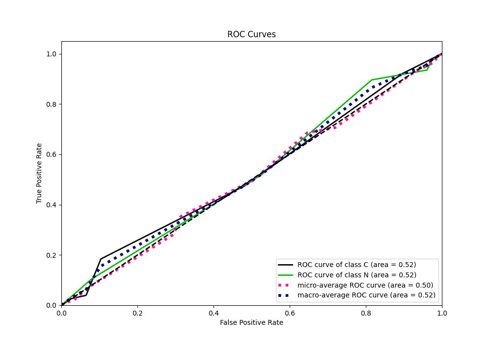

## Kolmogorov-Smirnov Statistic

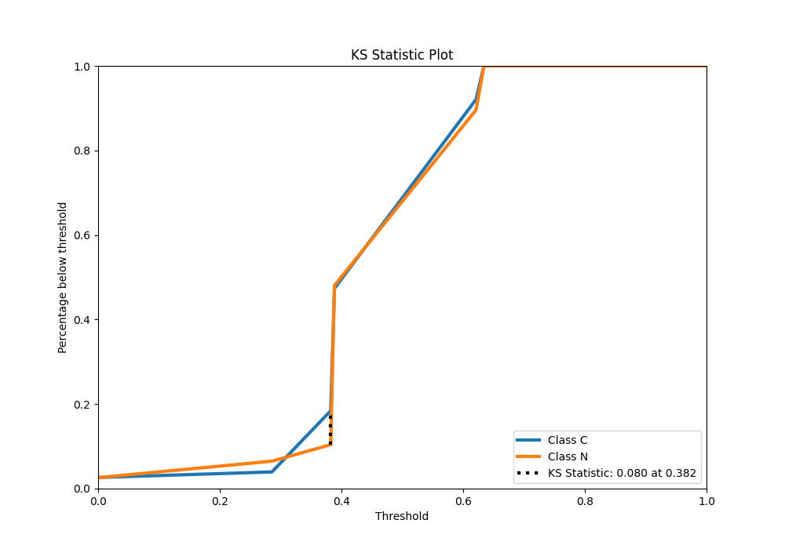

## Precision-Recall Curve

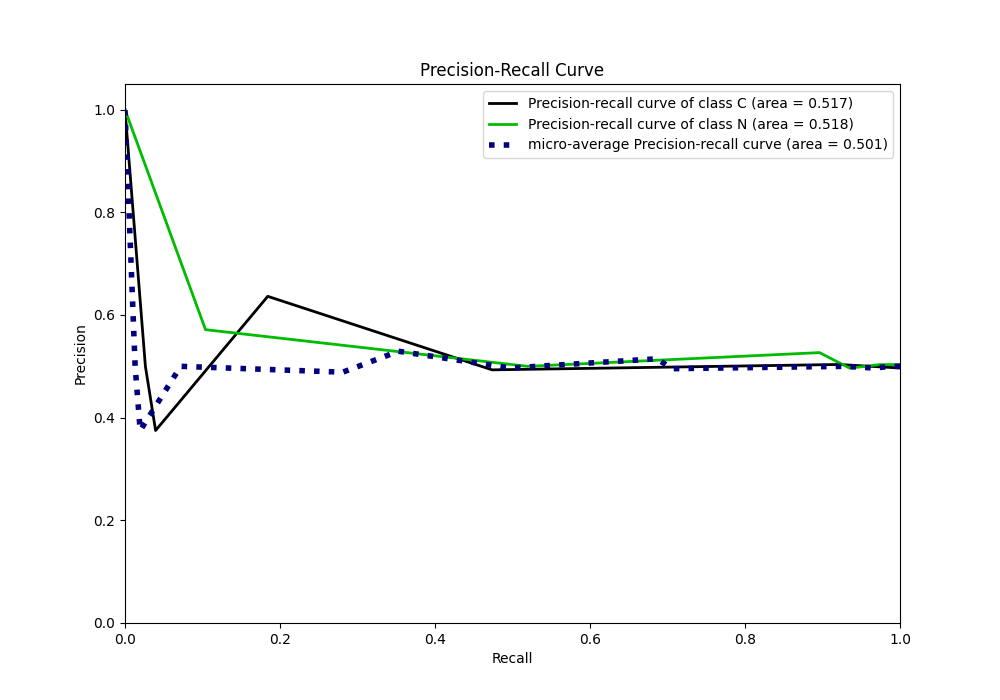

## Calibration Curve

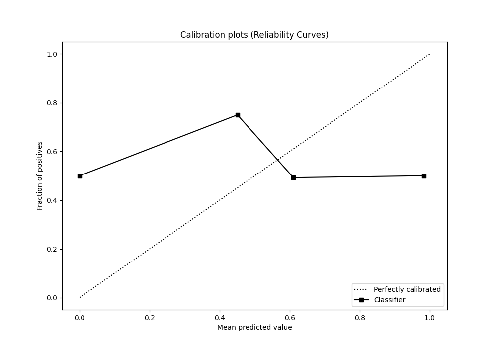

## Cumulative Gains Curve

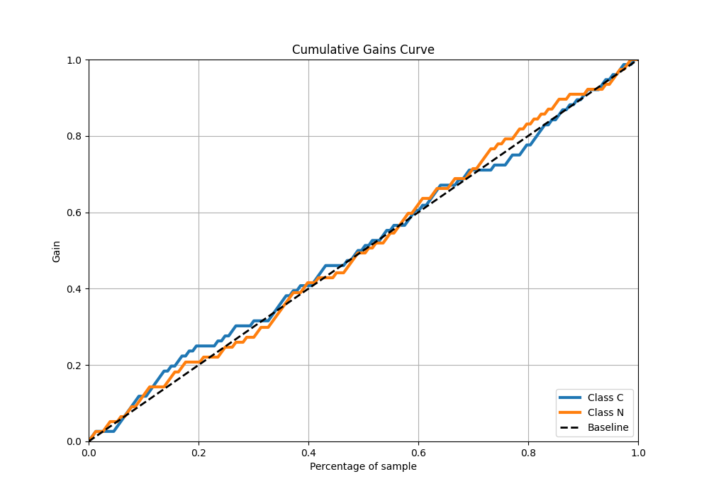

## Lift Curve

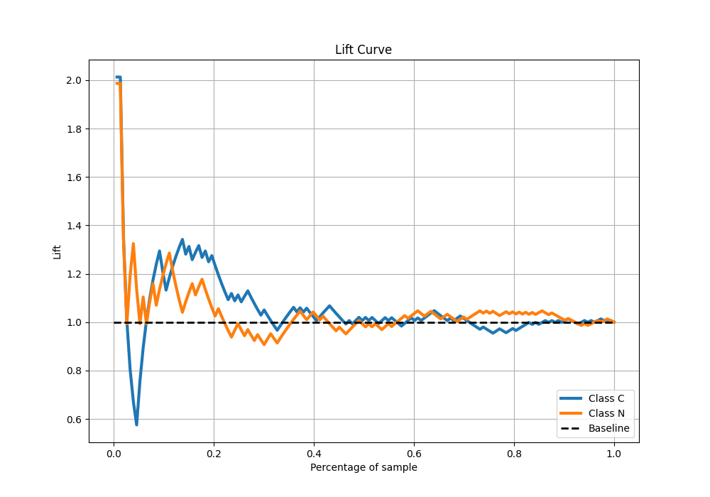

## SHAP Importance

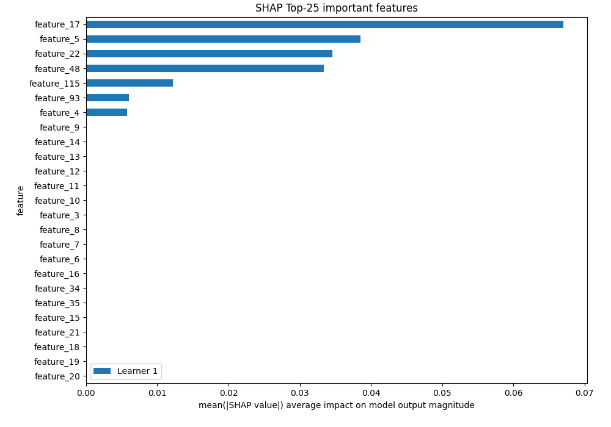

[<< Go back](../README.md)
