# Summary of 3_Linear

[<< Go back](../README.md)

## Logistic Regression (Linear)

- **n_jobs**: -1
- **explain_level**: 2

## Validation

- **validation_type**: split
- **train_ratio**: 0.75
- **shuffle**: True
- **stratify**: True

## Optimized metric

auc

## Training time

5.8 seconds

## Metric details

|           |    score |   threshold |
|:----------|---------:|------------:|
| logloss   | 0.834594 |  nan        |
| auc       | 0.559809 |  nan        |
| f1        | 0.669565 |    0.022978 |
| accuracy  | 0.581699 |    0.467724 |
| precision | 0.666667 |    0.88009  |
| recall    | 1        |    0.022978 |
| mcc       | 0.163438 |    0.467724 |

## Metric details with threshold from accuracy metric

|           |    score |   threshold |
|:----------|---------:|------------:|
| logloss   | 0.834594 |  nan        |
| auc       | 0.559809 |  nan        |
| f1        | 0.6      |    0.467724 |
| accuracy  | 0.581699 |    0.467724 |
| precision | 0.578313 |    0.467724 |
| recall    | 0.623377 |    0.467724 |
| mcc       | 0.163438 |    0.467724 |

## Confusion matrix (at threshold=0.467724)

|              |   Predicted as C |   Predicted as N |
|:-------------|-----------------:|-----------------:|
| Labeled as C |               41 |               35 |
| Labeled as N |               29 |               48 |

## Learning curves

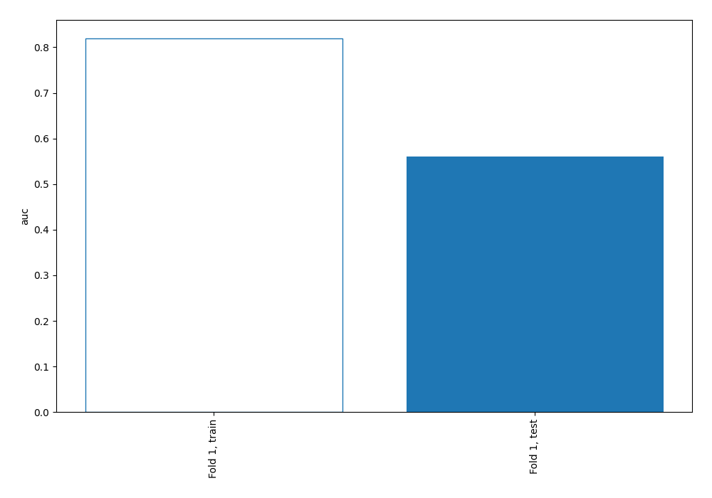

## Permutation-based Importance

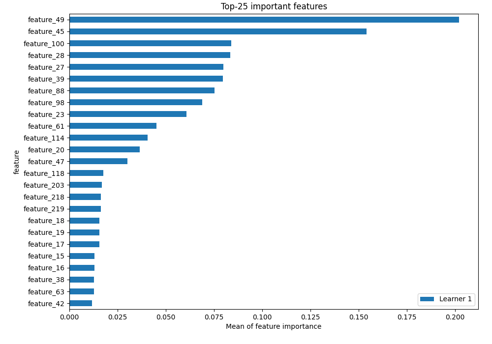

## Confusion Matrix

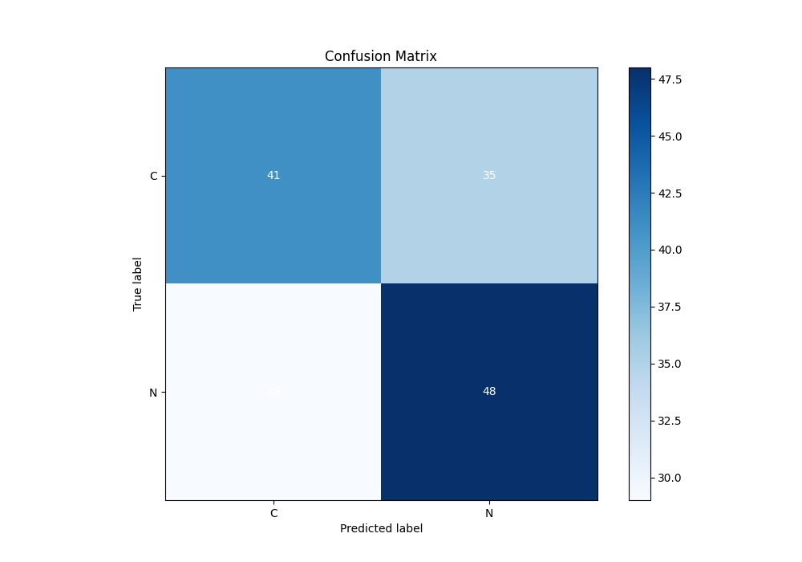

## Normalized Confusion Matrix

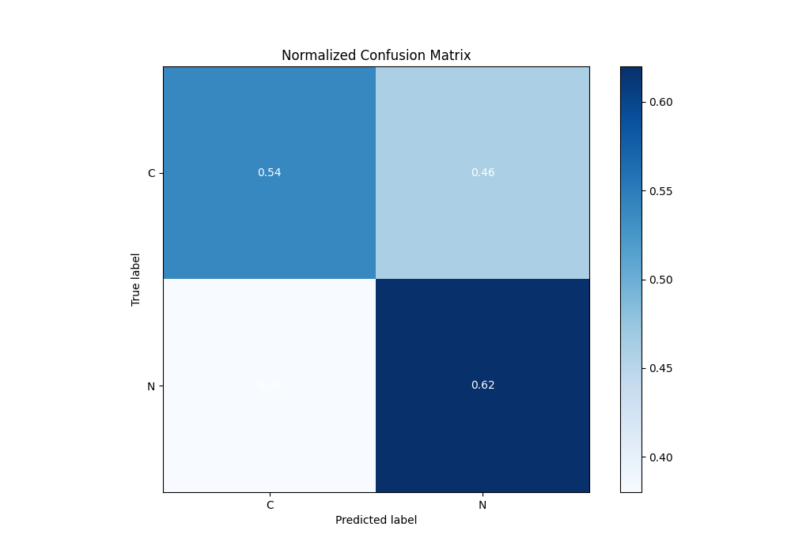

## ROC Curve

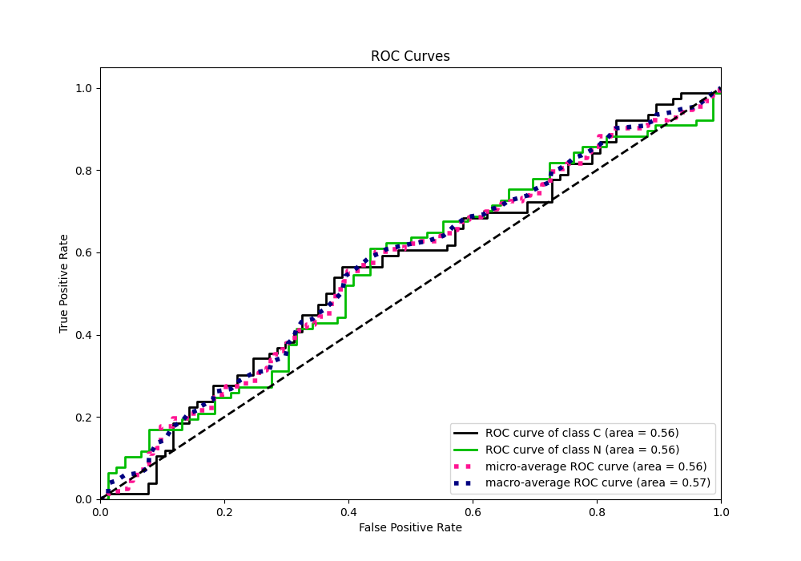

## Kolmogorov-Smirnov Statistic

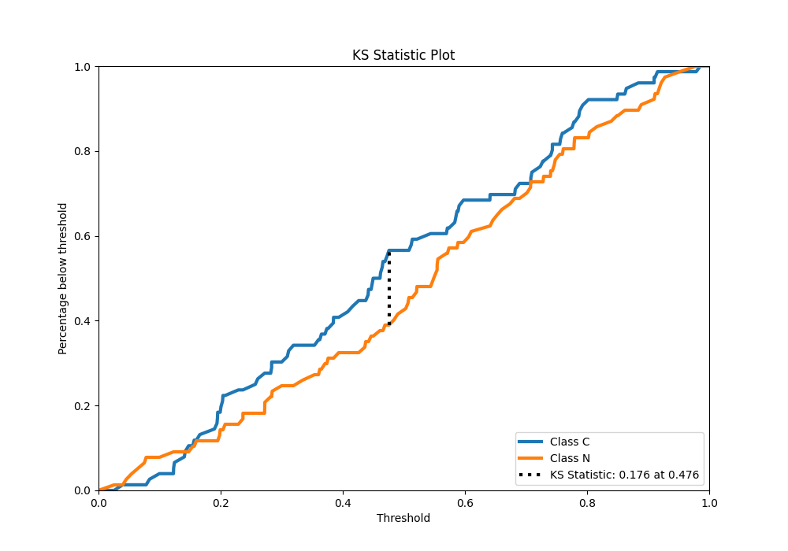

## Precision-Recall Curve

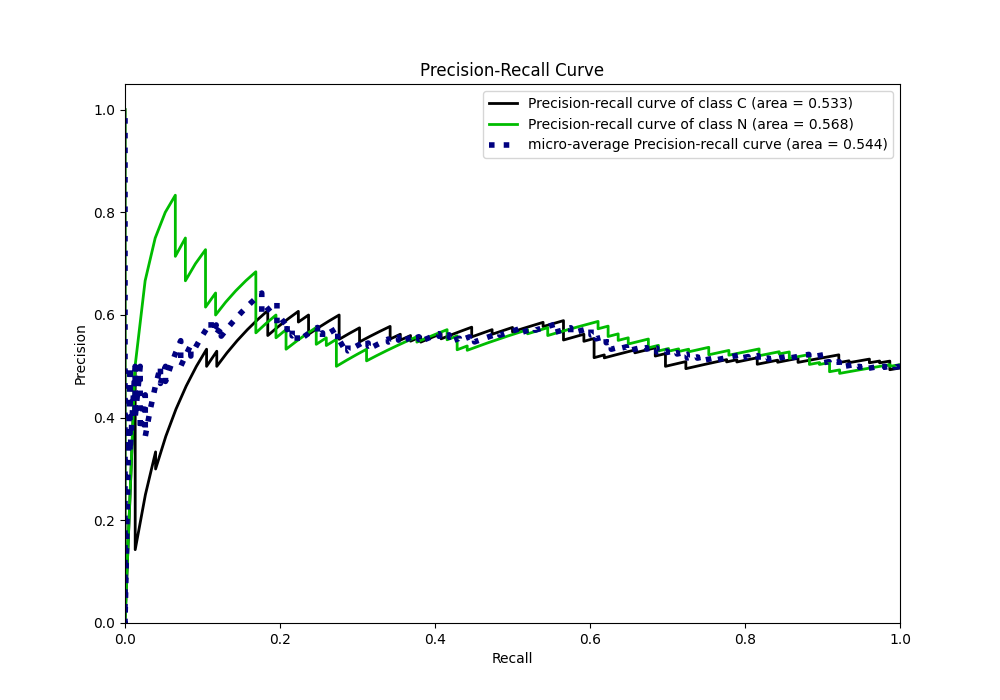

## Calibration Curve

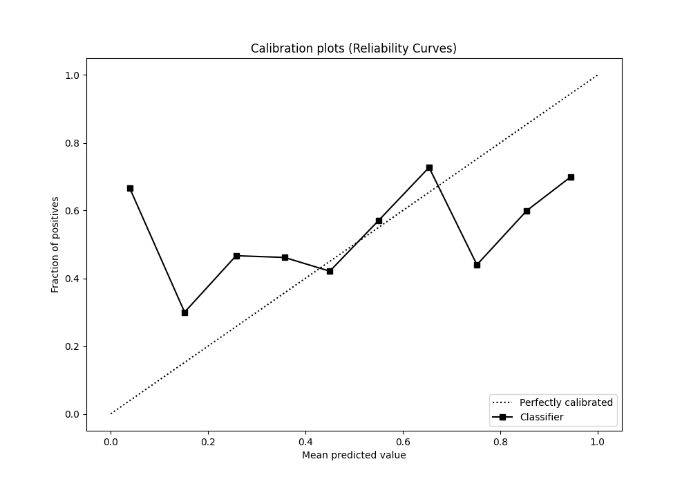

## Cumulative Gains Curve

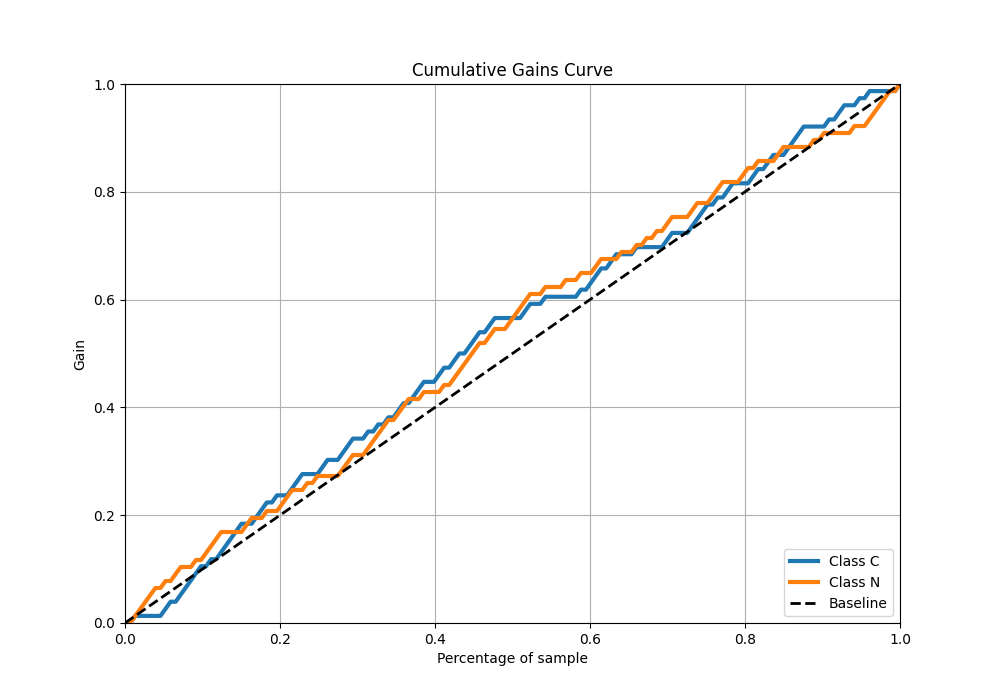

## Lift Curve

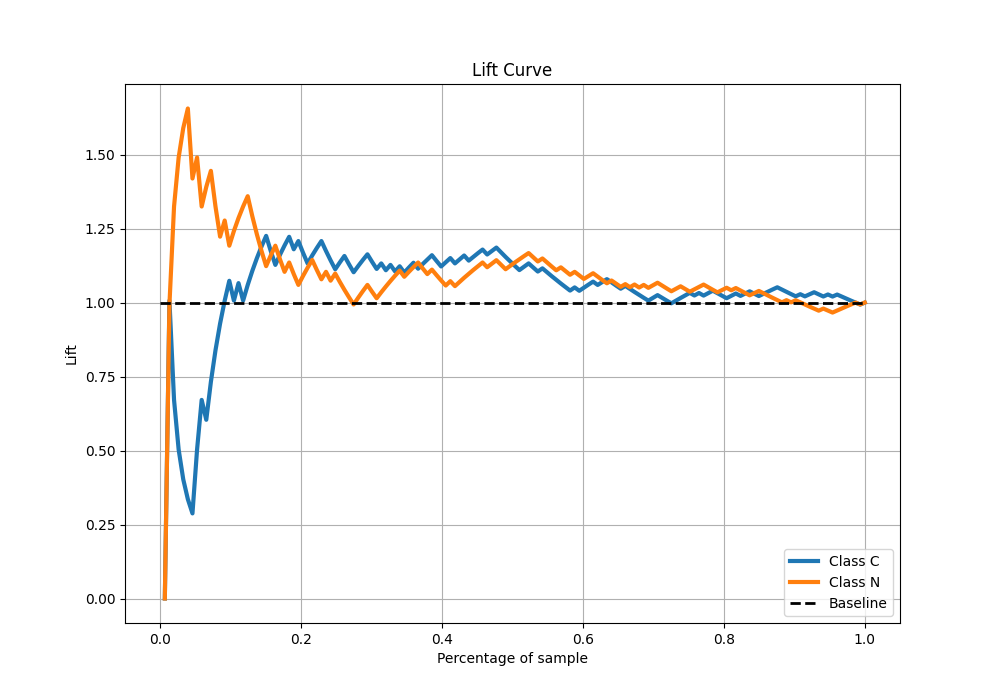

## SHAP Importance

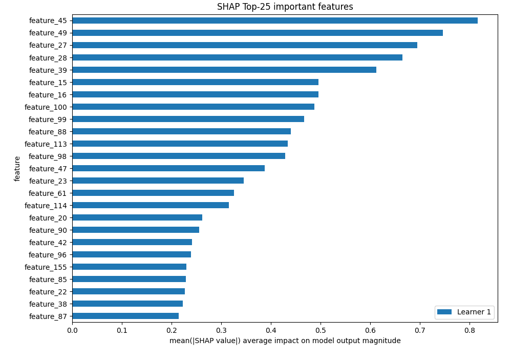

[<< Go back](../README.md)
