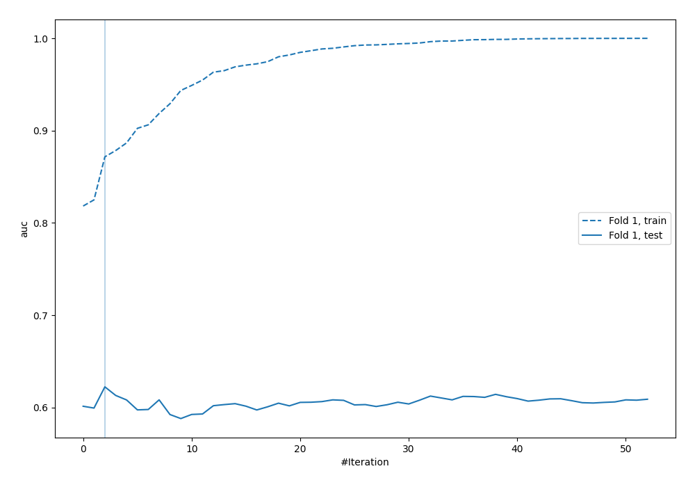
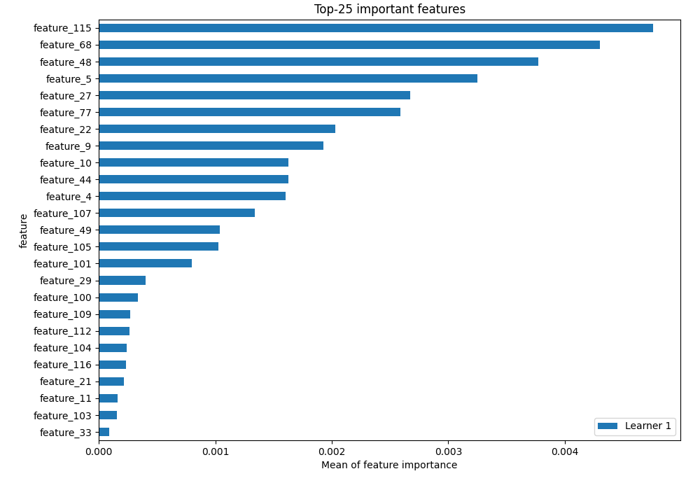
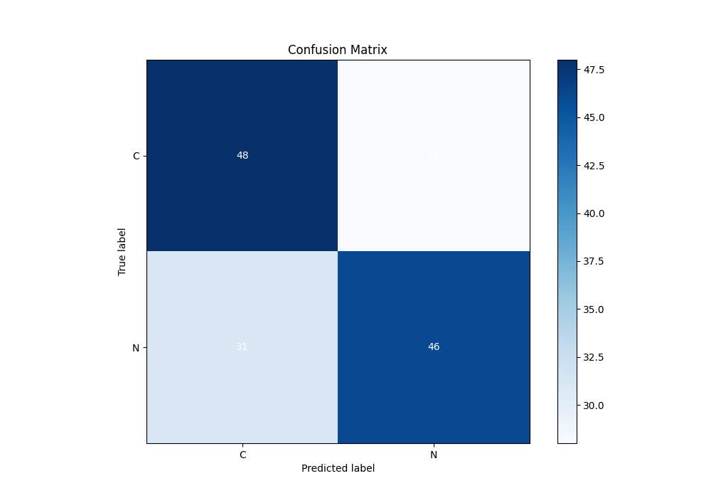
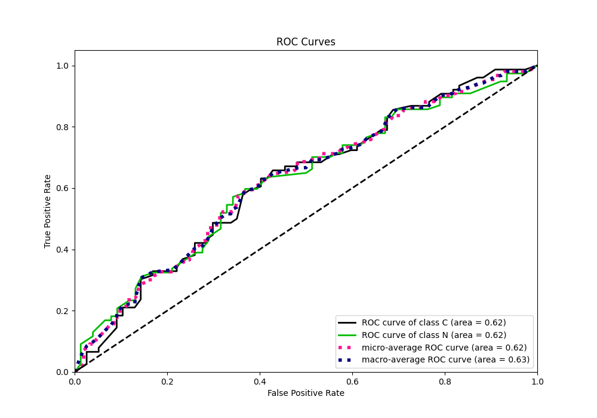
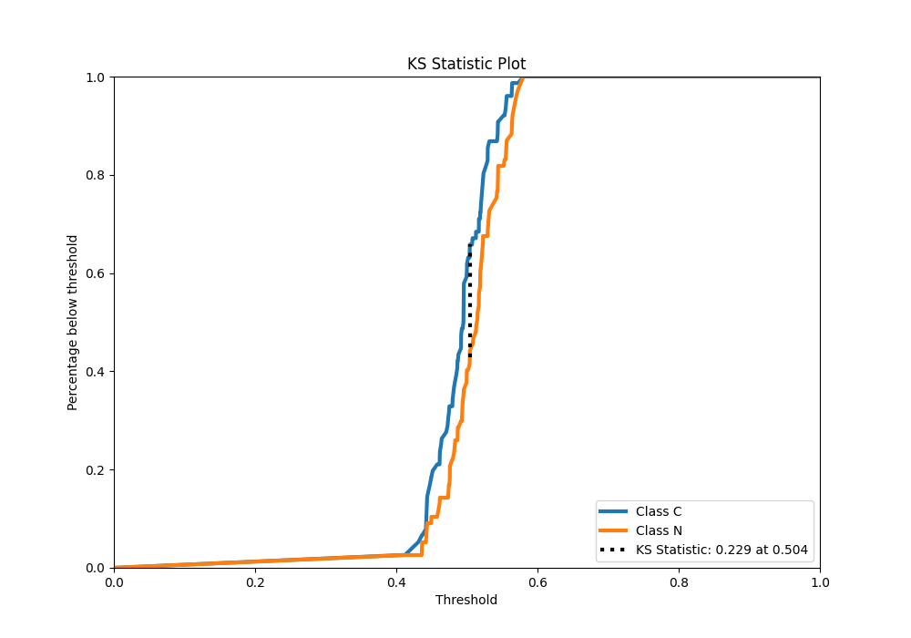
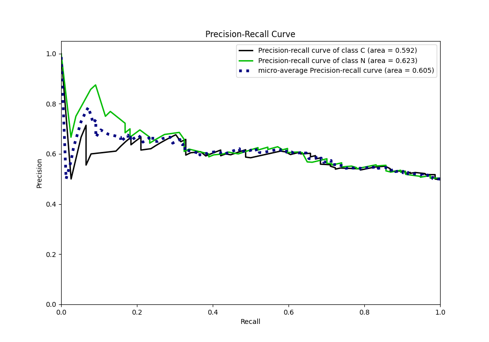
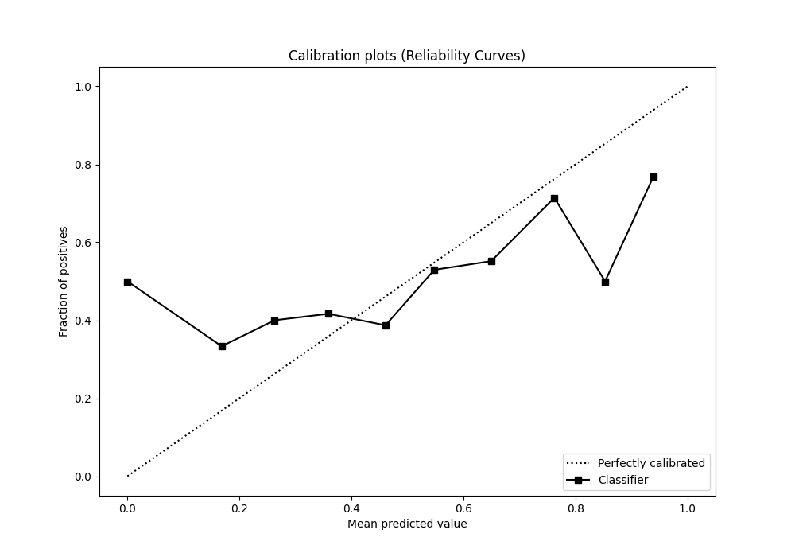
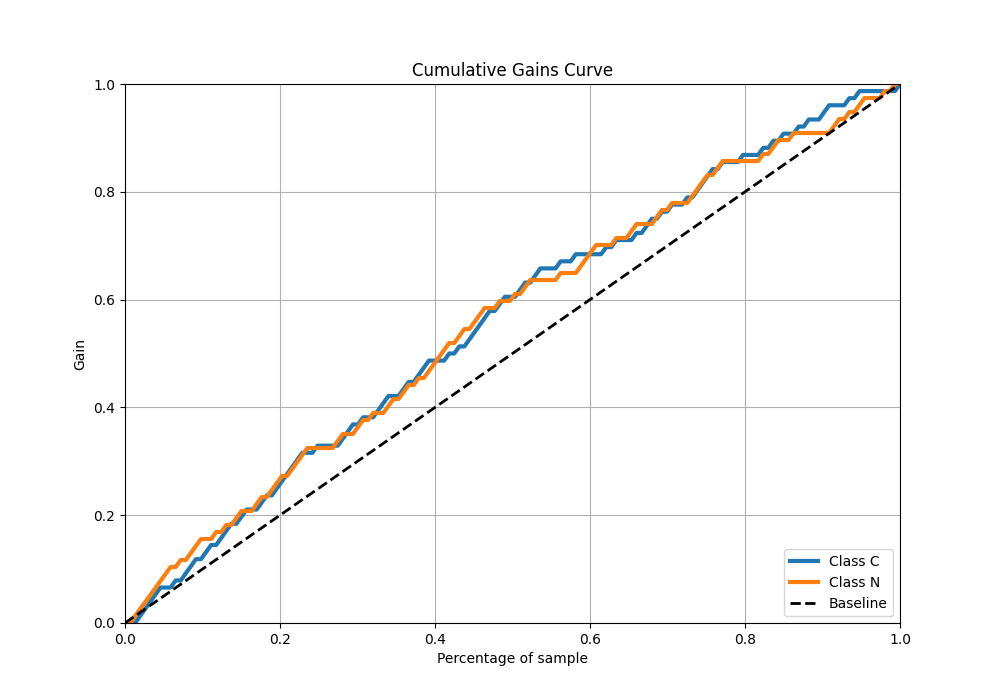
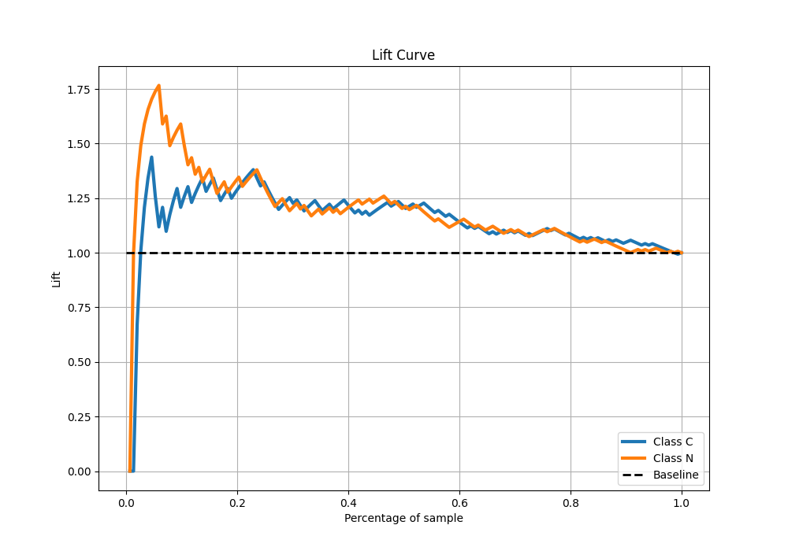
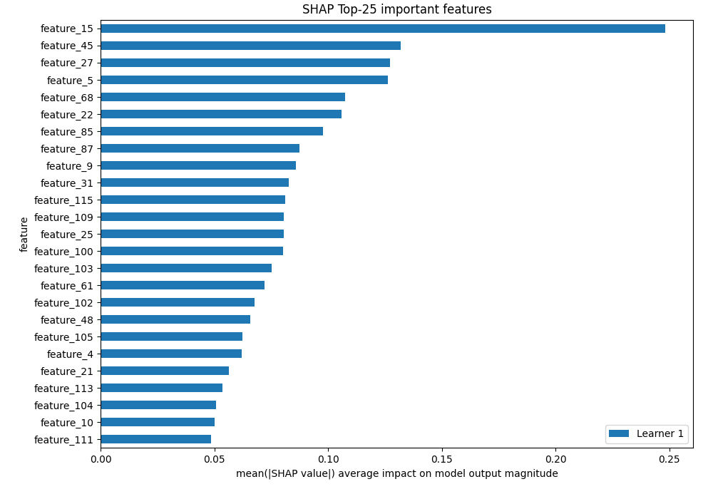

# Summary of 4_Default_Xgboost

[<< Go back](../README.md)

## Extreme Gradient Boosting (Xgboost)

- **n_jobs**: -1
- **objective**: binary:logistic
- **eta**: 0.075
- **max_depth**: 6
- **min_child_weight**: 1
- **subsample**: 1.0
- **colsample_bytree**: 1.0
- **eval_metric**: auc
- **explain_level**: 2

## Validation

- **validation_type**: split
- **train_ratio**: 0.75
- **shuffle**: True
- **stratify**: True

## Optimized metric

auc

## Training time

57.0 seconds

## Metric details

|           |    score |   threshold |
|:----------|---------:|------------:|
| logloss   | 0.679375 |  nan        |
| auc       | 0.622437 |  nan        |
| f1        | 0.673469 |    0.474164 |
| accuracy  | 0.614379 |    0.503049 |
| precision | 0.857143 |    0.568181 |
| recall    | 1        |    0.371206 |
| mcc       | 0.230151 |    0.50418  |

## Metric details with threshold from accuracy metric

|           |    score |   threshold |
|:----------|---------:|------------:|
| logloss   | 0.679375 |  nan        |
| auc       | 0.622437 |  nan        |
| f1        | 0.609272 |    0.503049 |
| accuracy  | 0.614379 |    0.503049 |
| precision | 0.621622 |    0.503049 |
| recall    | 0.597403 |    0.503049 |
| mcc       | 0.229099 |    0.503049 |

## Confusion matrix (at threshold=0.503049)

|              |   Predicted as C |   Predicted as N |
|:-------------|-----------------:|-----------------:|
| Labeled as C |               48 |               28 |
| Labeled as N |               31 |               46 |

## Learning curves

## Permutation-based Importance

## Confusion Matrix

## Normalized Confusion Matrix

## ROC Curve

## Kolmogorov-Smirnov Statistic

## Precision-Recall Curve

## Calibration Curve

## Cumulative Gains Curve

## Lift Curve

## SHAP Importance

[<< Go back](../README.md)
