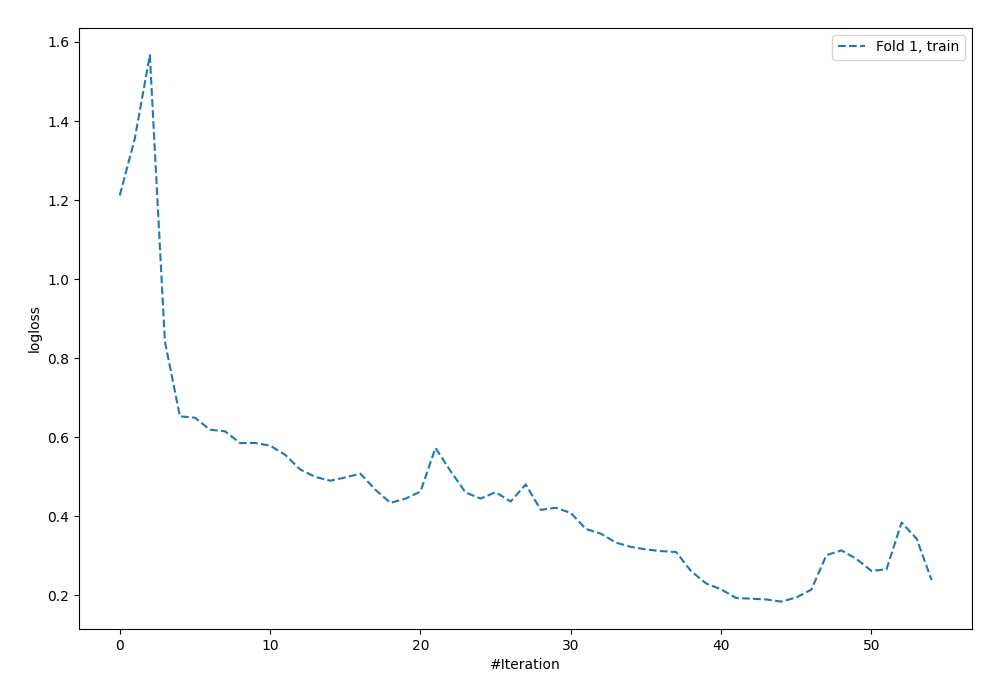
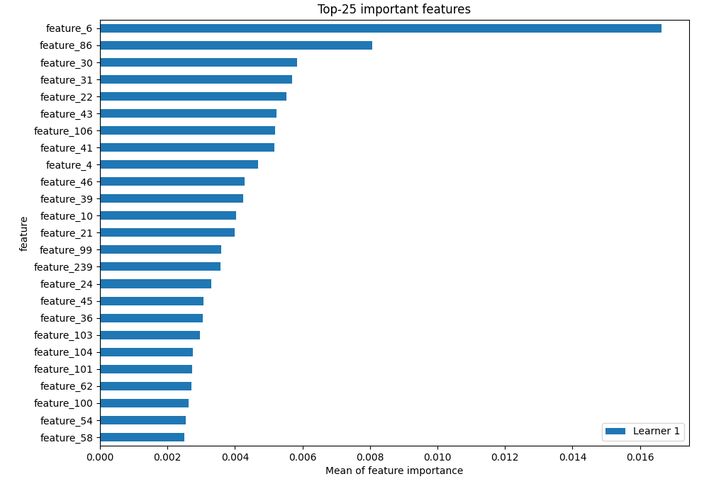
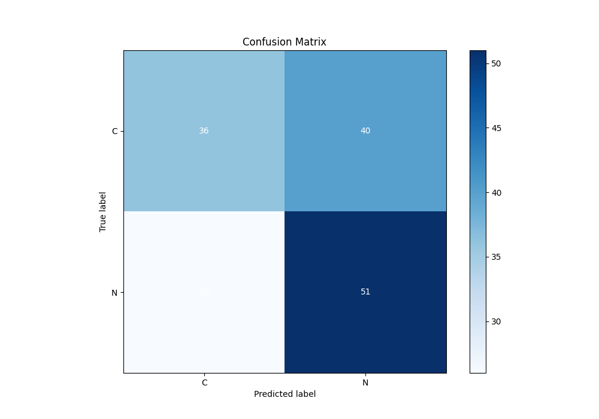
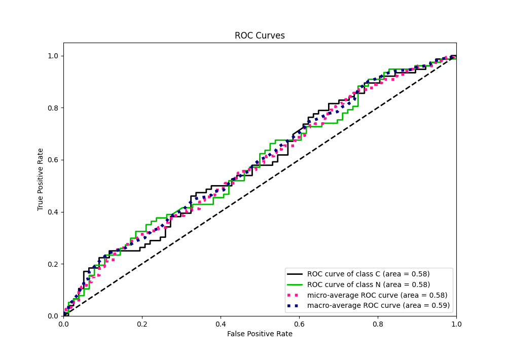
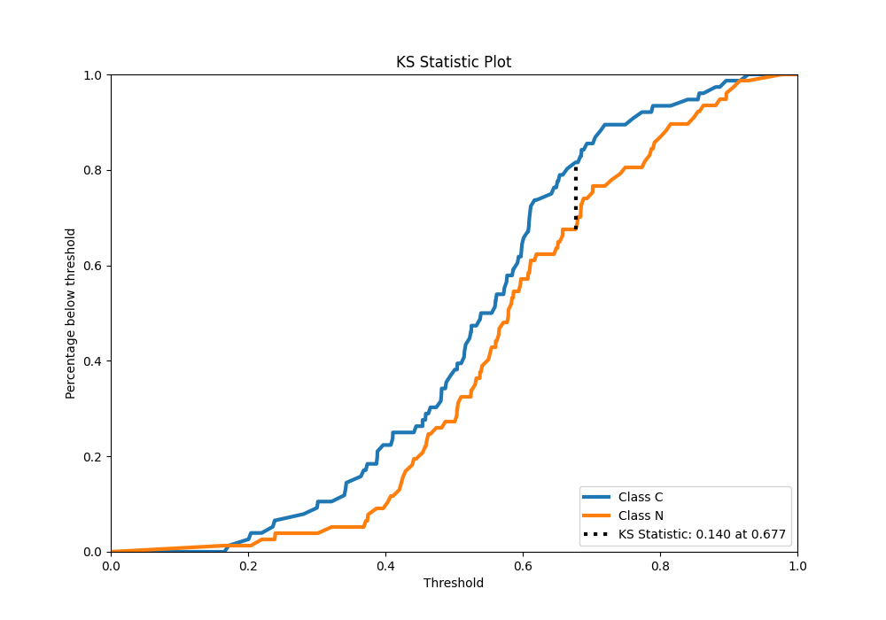
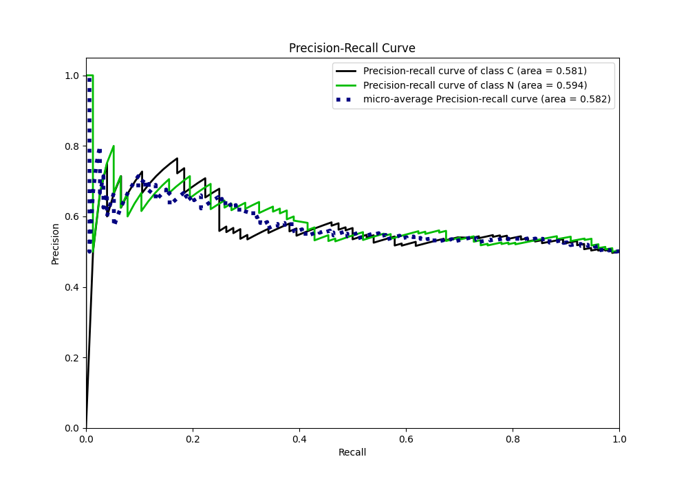
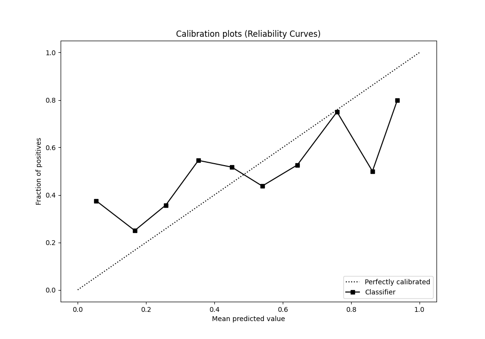
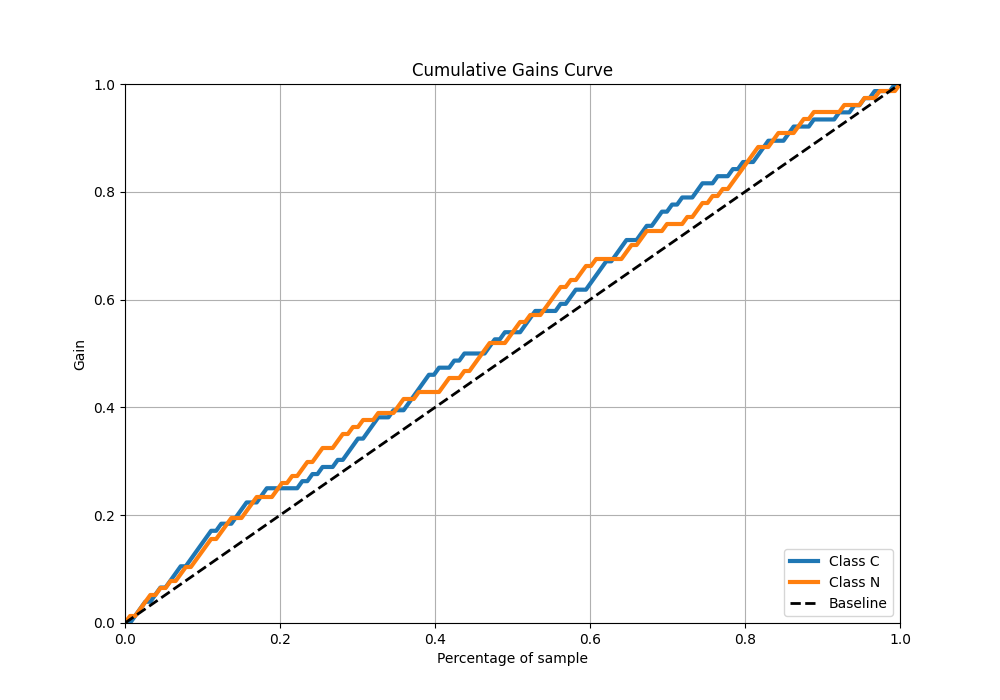
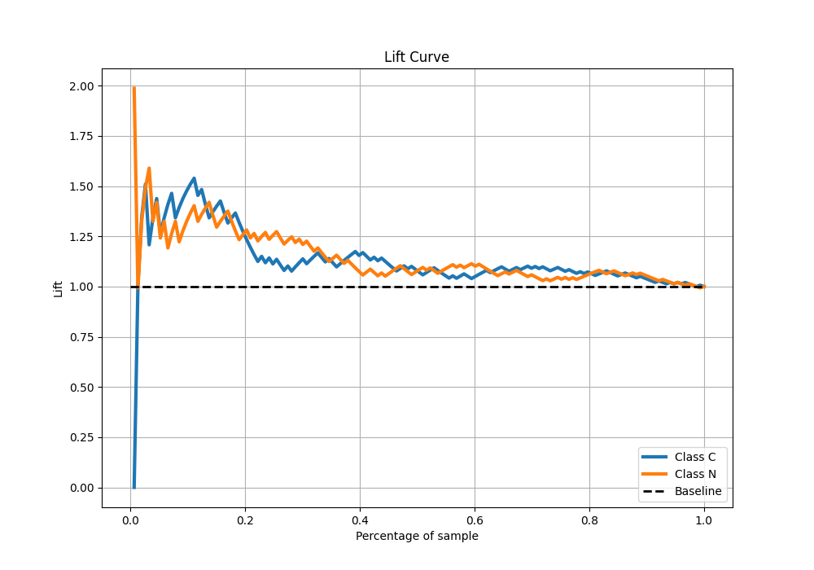

# Summary of 5_Default_NeuralNetwork

[<< Go back](../README.md)

## Neural Network

- **n_jobs**: -1
- **dense_1_size**: 32
- **dense_2_size**: 16
- **learning_rate**: 0.05
- **explain_level**: 2

## Validation

- **validation_type**: split
- **train_ratio**: 0.75
- **shuffle**: True
- **stratify**: True

## Optimized metric

auc

## Training time

2.9 seconds

## Metric details

|           |    score |   threshold |
|:----------|---------:|------------:|
| logloss   | 0.713423 |  nan        |
| auc       | 0.583903 |  nan        |
| f1        | 0.682464 |    0.374215 |
| accuracy  | 0.568627 |    0.52678  |
| precision | 0.7      |    0.778995 |
| recall    | 1        |    0.148961 |
| mcc       | 0.180831 |    0.374215 |

## Metric details with threshold from accuracy metric

|           |    score |   threshold |
|:----------|---------:|------------:|
| logloss   | 0.713423 |   nan       |
| auc       | 0.583903 |   nan       |
| f1        | 0.607143 |     0.52678 |
| accuracy  | 0.568627 |     0.52678 |
| precision | 0.56044  |     0.52678 |
| recall    | 0.662338 |     0.52678 |
| mcc       | 0.13853  |     0.52678 |

## Confusion matrix (at threshold=0.52678)

|              |   Predicted as C |   Predicted as N |
|:-------------|-----------------:|-----------------:|
| Labeled as C |               36 |               40 |
| Labeled as N |               26 |               51 |

## Learning curves

## Permutation-based Importance

## Confusion Matrix

## Normalized Confusion Matrix

## ROC Curve

## Kolmogorov-Smirnov Statistic

## Precision-Recall Curve

## Calibration Curve

## Cumulative Gains Curve

## Lift Curve

[<< Go back](../README.md)
