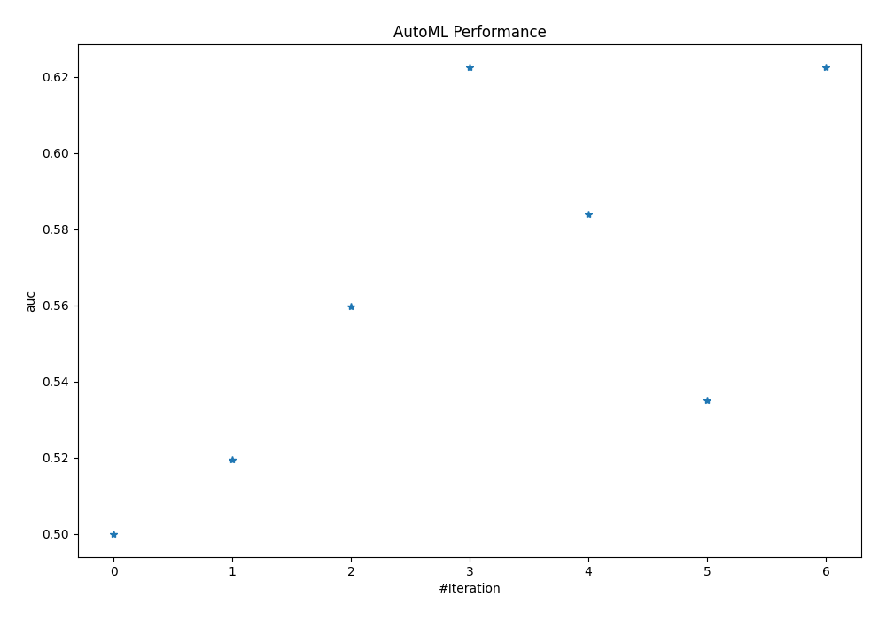
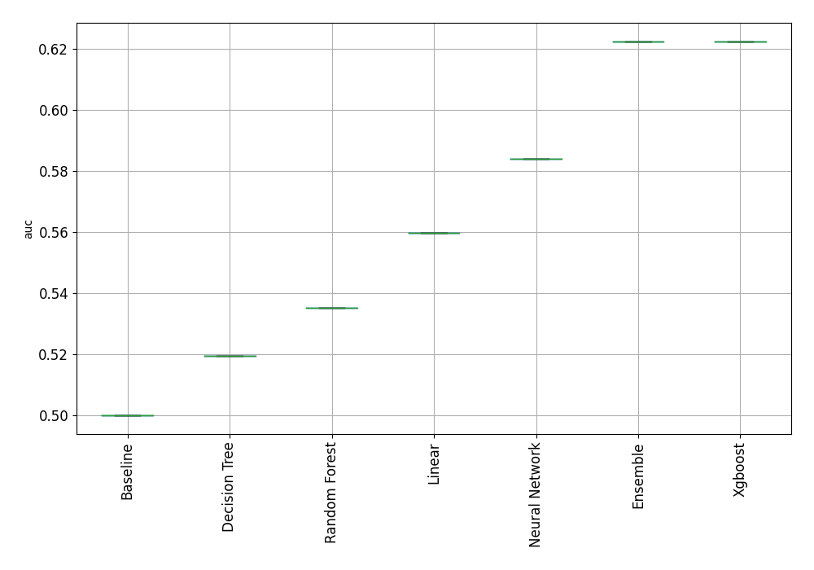
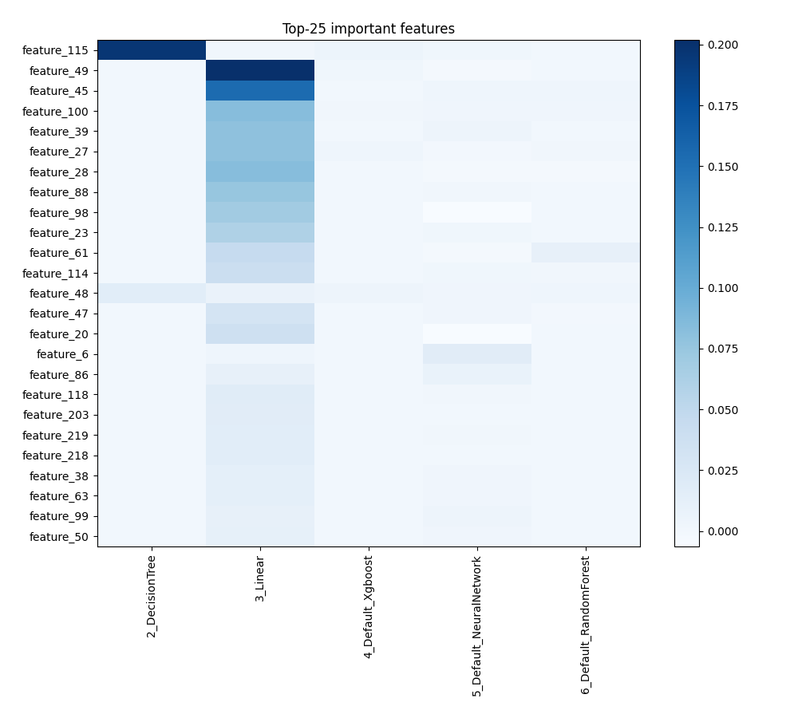
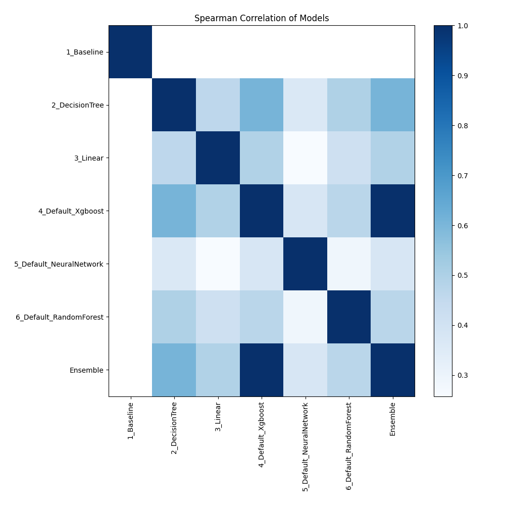

# AutoML Leaderboard

| Best model   | name                                                         | model_type     | metric_type   |   metric_value |   train_time |
|:-------------|:-------------------------------------------------------------|:---------------|:--------------|---------------:|-------------:|
|              | [1_Baseline](1_Baseline/README.md)                           | Baseline       | auc           |       0.5      |         1.36 |
|              | [2_DecisionTree](2_DecisionTree/README.md)                   | Decision Tree  | auc           |       0.519481 |        12.35 |
|              | [3_Linear](3_Linear/README.md)                               | Linear         | auc           |       0.559809 |         7.16 |
| **the
best** | [4_Default_Xgboost](4_Default_Xgboost/README.md)             | Xgboost        | auc           |       0.622437 |        58.33 |
|              | [5_Default_NeuralNetwork](5_Default_NeuralNetwork/README.md) | Neural Network | auc           |       0.583903 |         4.09 |
|              | [6_Default_RandomForest](6_Default_RandomForest/README.md)   | Random Forest  | auc           |       0.535031 |        14.64 |
|              | [Ensemble](Ensemble/README.md)                               | Ensemble       | auc           |       0.622437 |         0.78 |

### AutoML Performance

### AutoML Performance Boxplot

### Features Importance

### Spearman Correlation of Models

