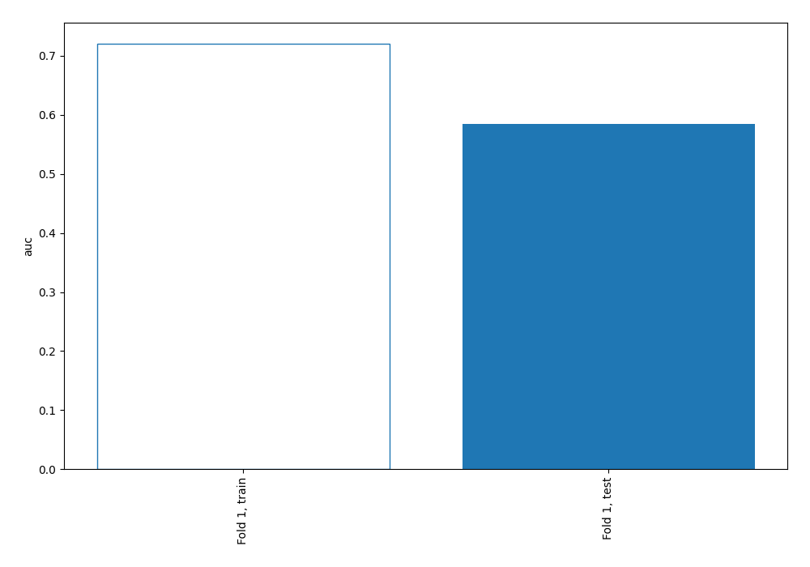
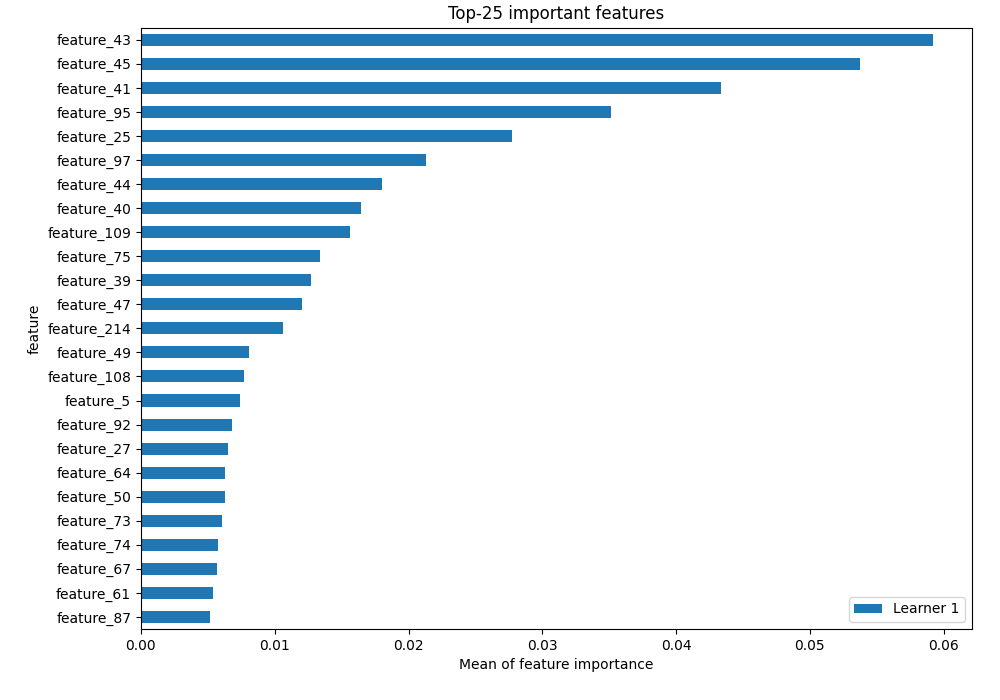
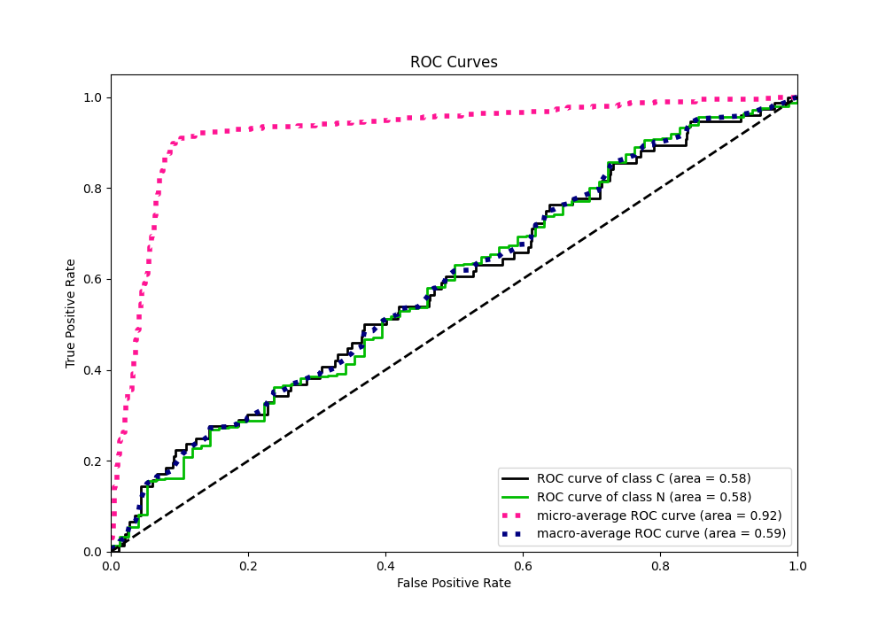
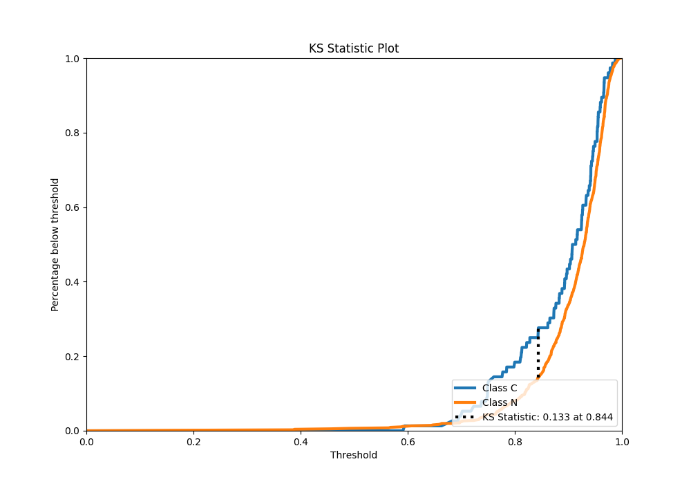
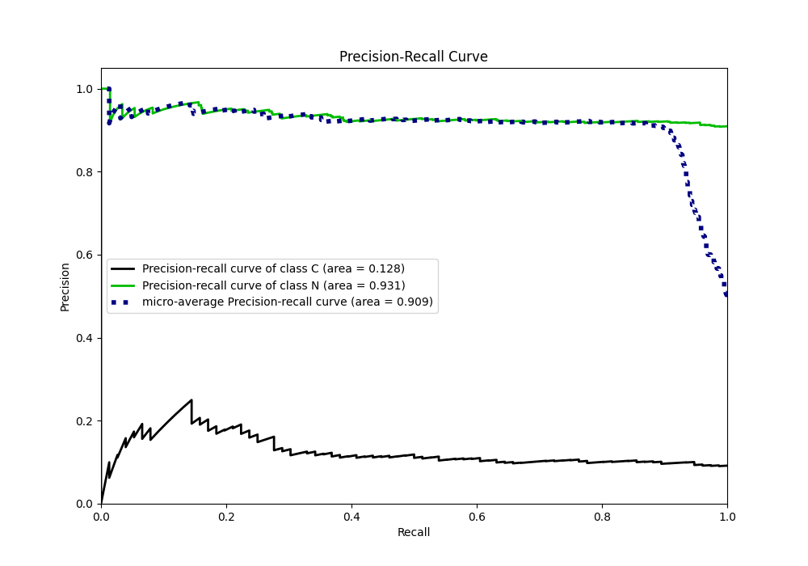
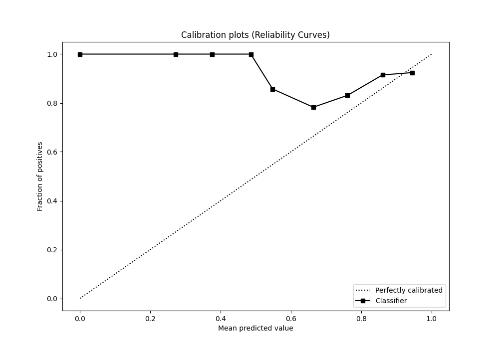
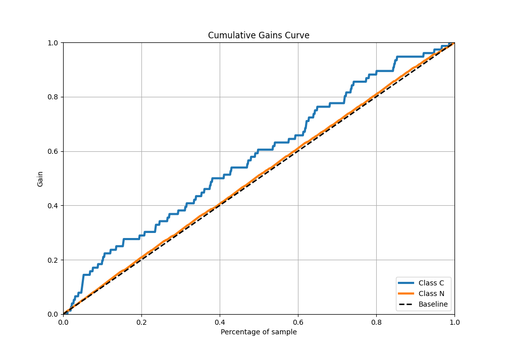
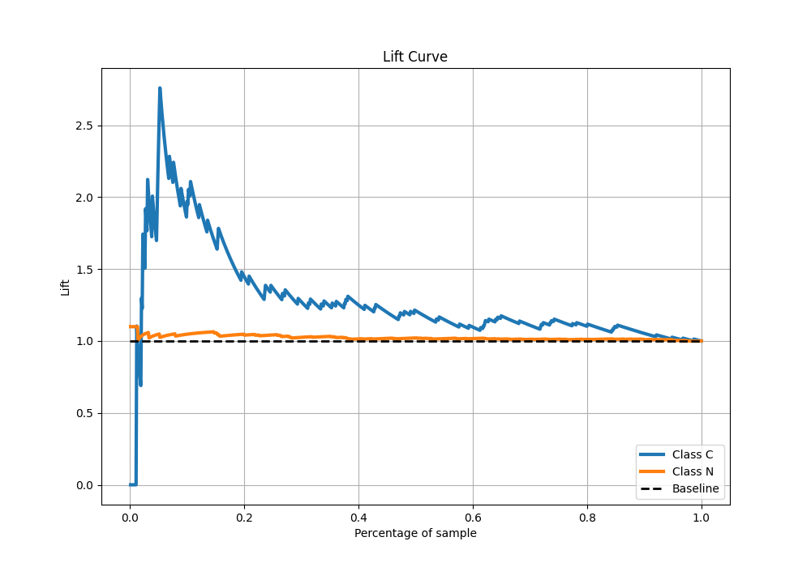
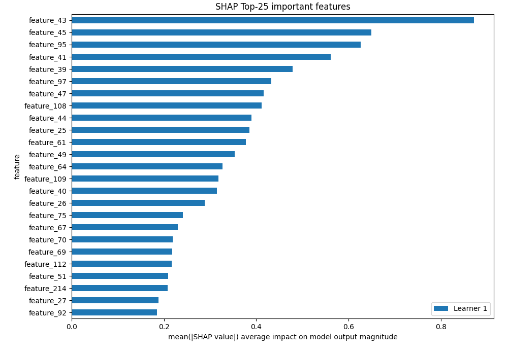

# Summary of 3_Linear

[<< Go back](../README.md)

## Logistic Regression (Linear)

- **n_jobs**: -1
- **explain_level**: 2

## Validation

- **validation_type**: split
- **train_ratio**: 0.75
- **shuffle**: True
- **stratify**: True

## Optimized metric

auc

## Training time

4.8 seconds

## Metric details

|           |    score |   threshold |
|:----------|---------:|------------:|
| logloss   | 0.313337 |  nan        |
| auc       | 0.584224 |  nan        |
| f1        | 0.952559 |    0.14372  |
| accuracy  | 0.909416 |    0.14372  |
| precision | 0.965812 |    0.967649 |
| recall    | 1        |    0.14372  |
| mcc       | 0.120534 |    0.813619 |

## Metric details with threshold from accuracy metric

|           |    score |   threshold |
|:----------|---------:|------------:|
| logloss   | 0.313337 |   nan       |
| auc       | 0.584224 |   nan       |
| f1        | 0.952559 |     0.14372 |
| accuracy  | 0.909416 |     0.14372 |
| precision | 0.909416 |     0.14372 |
| recall    | 1        |     0.14372 |
| mcc       | 0        |     0.14372 |

## Confusion matrix (at threshold=0.14372)

|              |   Predicted as C |   Predicted as N |
|:-------------|-----------------:|-----------------:|
| Labeled as C |                0 |               76 |
| Labeled as N |                0 |              763 |

## Learning curves

## Permutation-based Importance

## Confusion Matrix

## Normalized Confusion Matrix

## ROC Curve

## Kolmogorov-Smirnov Statistic

## Precision-Recall Curve

## Calibration Curve

## Cumulative Gains Curve

## Lift Curve

## SHAP Importance

[<< Go back](../README.md)
