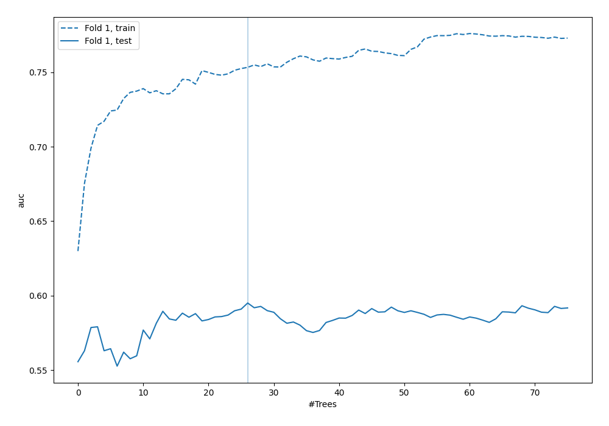
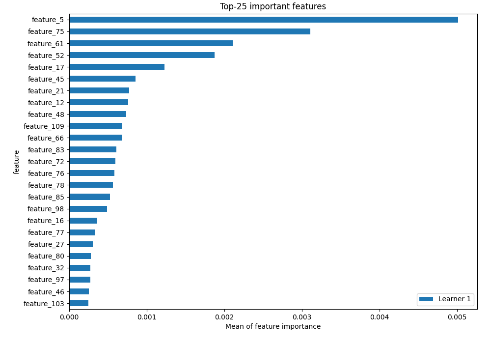
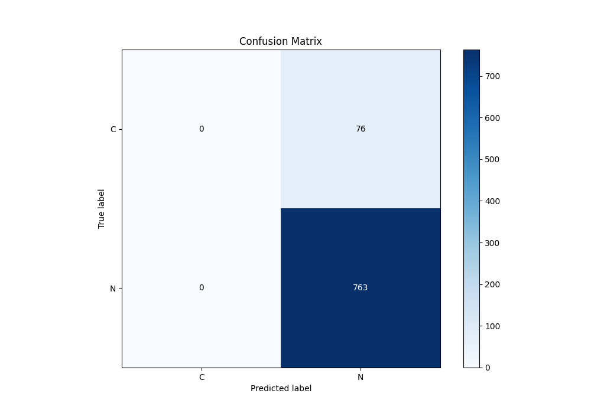
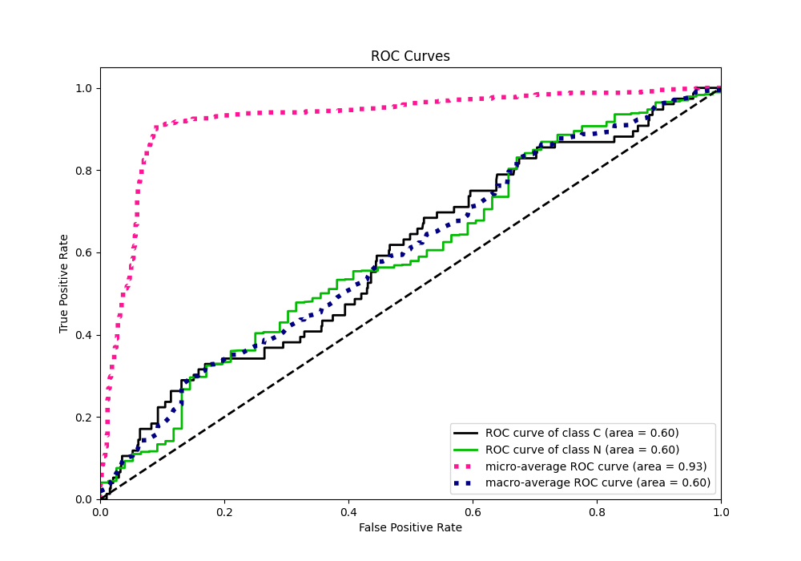
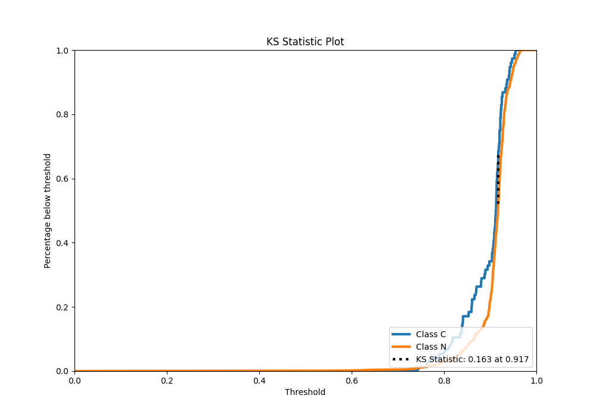
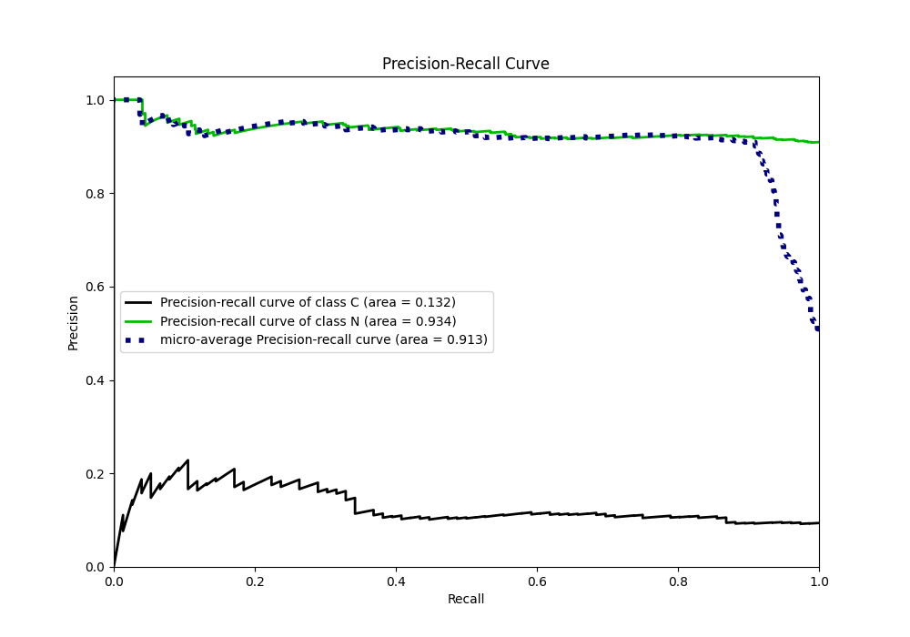
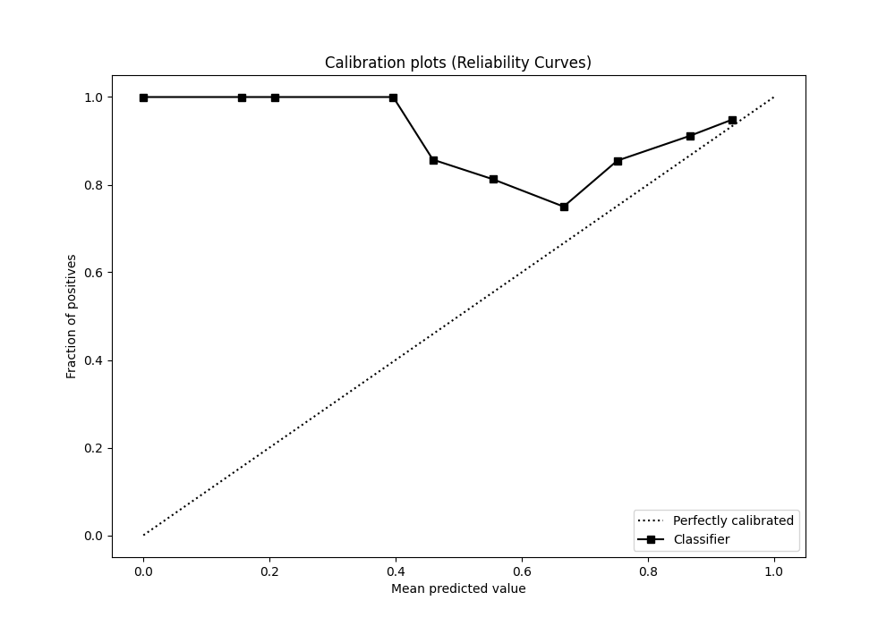
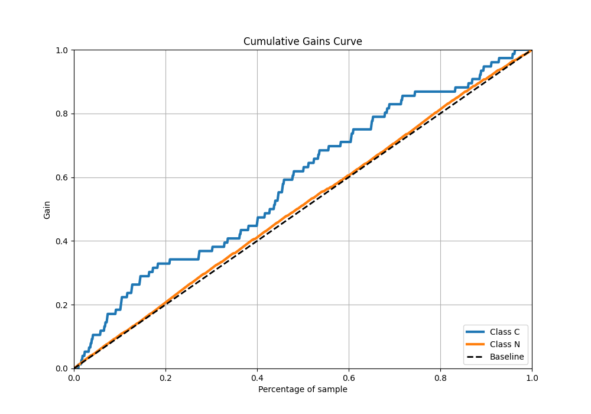
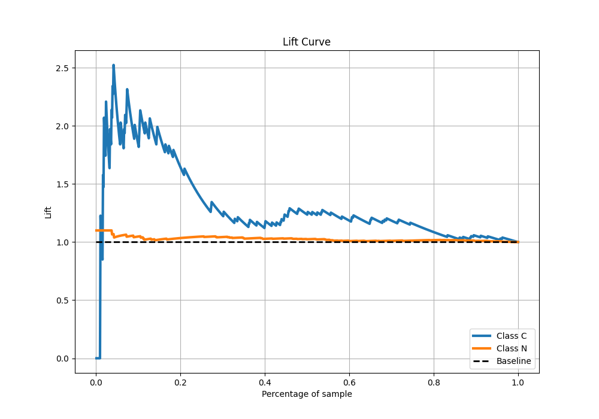
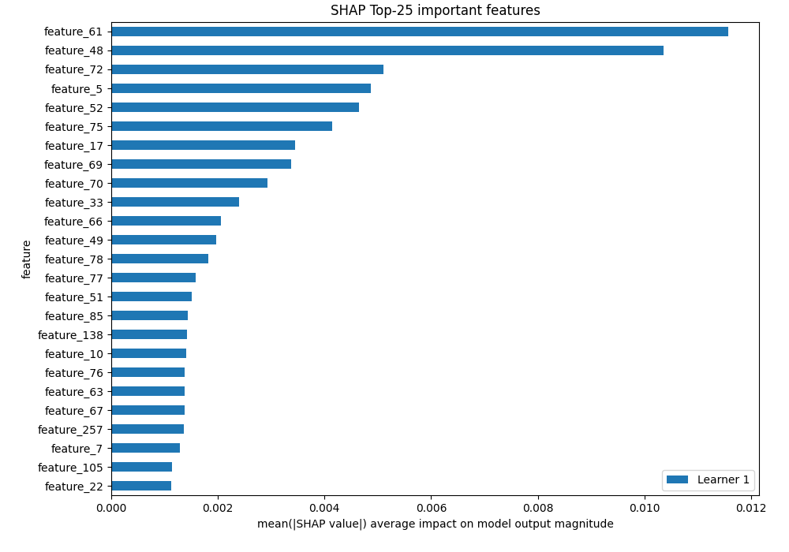

# Summary of 6_Default_RandomForest

[<< Go back](../README.md)

## Random Forest

- **n_jobs**: -1
- **criterion**: gini
- **max_features**: 0.9
- **min_samples_split**: 30
- **max_depth**: 4
- **eval_metric_name**: auc
- **explain_level**: 2

## Validation

- **validation_type**: split
- **train_ratio**: 0.75
- **shuffle**: True
- **stratify**: True

## Optimized metric

auc

## Training time

11.8 seconds

## Metric details

|           |    score |   threshold |
|:----------|---------:|------------:|
| logloss   | 0.298998 |  nan        |
| auc       | 0.595046 |  nan        |
| f1        | 0.952559 |    0.500223 |
| accuracy  | 0.909416 |    0.500223 |
| precision | 0.958333 |    0.949446 |
| recall    | 1        |    0.500223 |
| mcc       | 0.12452  |    0.883034 |

## Metric details with threshold from accuracy metric

|           |    score |   threshold |
|:----------|---------:|------------:|
| logloss   | 0.298998 |  nan        |
| auc       | 0.595046 |  nan        |
| f1        | 0.952559 |    0.500223 |
| accuracy  | 0.909416 |    0.500223 |
| precision | 0.909416 |    0.500223 |
| recall    | 1        |    0.500223 |
| mcc       | 0        |    0.500223 |

## Confusion matrix (at threshold=0.500223)

|              |   Predicted as C |   Predicted as N |
|:-------------|-----------------:|-----------------:|
| Labeled as C |                0 |               76 |
| Labeled as N |                0 |              763 |

## Learning curves

## Permutation-based Importance

## Confusion Matrix

## Normalized Confusion Matrix

## ROC Curve

## Kolmogorov-Smirnov Statistic

## Precision-Recall Curve

## Calibration Curve

## Cumulative Gains Curve

## Lift Curve

## SHAP Importance

[<< Go back](../README.md)
