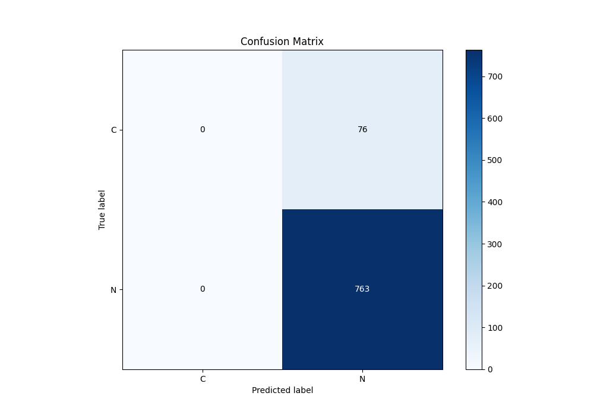

# Summary of Ensemble

[<< Go back](../README.md)

## Ensemble structure

| Model             |   Weight |
|:------------------|---------:|
| 4_Default_Xgboost |        1 |

## Metric details

|           |    score |   threshold |
|:----------|---------:|------------:|
| logloss   | 0.485151 |  nan        |
| auc       | 0.647255 |  nan        |
| f1        | 0.952559 |    0.405666 |
| accuracy  | 0.909416 |    0.405666 |
| precision | 0.951705 |    0.654602 |
| recall    | 1        |    0.405666 |
| mcc       | 0.182698 |    0.652818 |

## Metric details with threshold from accuracy metric

|           |    score |   threshold |
|:----------|---------:|------------:|
| logloss   | 0.485151 |  nan        |
| auc       | 0.647255 |  nan        |
| f1        | 0.952559 |    0.405666 |
| accuracy  | 0.909416 |    0.405666 |
| precision | 0.909416 |    0.405666 |
| recall    | 1        |    0.405666 |
| mcc       | 0        |    0.405666 |

## Confusion matrix (at threshold=0.405666)

|              |   Predicted as C |   Predicted as N |
|:-------------|-----------------:|-----------------:|
| Labeled as C |                0 |               76 |
| Labeled as N |                0 |              763 |

## Learning curves

## Confusion Matrix

## Normalized Confusion Matrix

## ROC Curve

## Kolmogorov-Smirnov Statistic

## Precision-Recall Curve

## Calibration Curve

## Cumulative Gains Curve

## Lift Curve

[<< Go back](../README.md)
