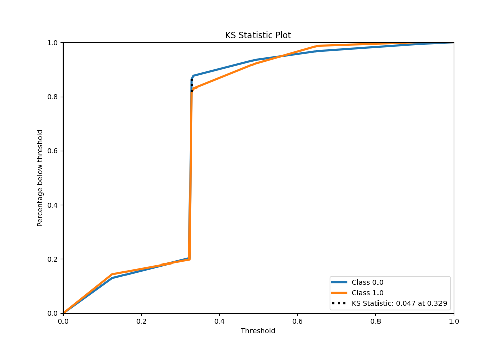

# Summary of 2_DecisionTree

[<< Go back](../README.md)

## Decision Tree

- **n_jobs**: -1
- **criterion**: gini
- **max_depth**: 3
- **explain_level**: 2

## Validation

- **validation_type**: split
- **train_ratio**: 0.75
- **shuffle**: True
- **stratify**: True

## Optimized metric

auc

## Training time

5.9 seconds

## Metric details

|           |     score |   threshold |
|:----------|----------:|------------:|
| logloss   | 0.745524  |  nan        |
| auc       | 0.517931  |  nan        |
| f1        | 0.498361  |    0.113445 |
| accuracy  | 0.650655  |    0.517571 |
| precision | 0.40625   |    0.41044  |
| recall    | 1         |    0.113445 |
| mcc       | 0.0636555 |    0.41044  |

## Metric details with threshold from accuracy metric

|           |     score |   threshold |
|:----------|----------:|------------:|
| logloss   | 0.745524  |  nan        |
| auc       | 0.517931  |  nan        |
| f1        | 0.130435  |    0.517571 |
| accuracy  | 0.650655  |    0.517571 |
| precision | 0.375     |    0.517571 |
| recall    | 0.0789474 |    0.517571 |
| mcc       | 0.0250989 |    0.517571 |

## Confusion matrix (at threshold=0.517571)

|              |   Predicted as 0 |   Predicted as 1 |
|:-------------|-----------------:|-----------------:|
| Labeled as 0 |              143 |               10 |
| Labeled as 1 |               70 |                6 |

## Learning curves

## Permutation-based Importance

## Confusion Matrix

## Normalized Confusion Matrix

## ROC Curve

## Kolmogorov-Smirnov Statistic

## Precision-Recall Curve

## Calibration Curve

## Cumulative Gains Curve

## Lift Curve

## SHAP Importance

[<< Go back](../README.md)
