# Summary of 3_Linear

[<< Go back](../README.md)

## Logistic Regression (Linear)

- **n_jobs**: -1
- **explain_level**: 2

## Validation

- **validation_type**: split
- **train_ratio**: 0.75
- **shuffle**: True
- **stratify**: True

## Optimized metric

auc

## Training time

3.0 seconds

## Metric details

|           |    score |   threshold |
|:----------|---------:|------------:|
| logloss   | 0.686749 | nan         |
| auc       | 0.549794 | nan         |
| f1        | 0.508834 |   0.0960719 |
| accuracy  | 0.676856 |   0.519582  |
| precision | 0.538462 |   0.690156  |
| recall    | 1        |   0.0162395 |
| mcc       | 0.188675 |   0.519582  |

## Metric details with threshold from accuracy metric

|           |    score |   threshold |
|:----------|---------:|------------:|
| logloss   | 0.686749 |  nan        |
| auc       | 0.549794 |  nan        |
| f1        | 0.362069 |    0.519582 |
| accuracy  | 0.676856 |    0.519582 |
| precision | 0.525    |    0.519582 |
| recall    | 0.276316 |    0.519582 |
| mcc       | 0.188675 |    0.519582 |

## Confusion matrix (at threshold=0.519582)

|              |   Predicted as 0 |   Predicted as 1 |
|:-------------|-----------------:|-----------------:|
| Labeled as 0 |              134 |               19 |
| Labeled as 1 |               55 |               21 |

## Learning curves

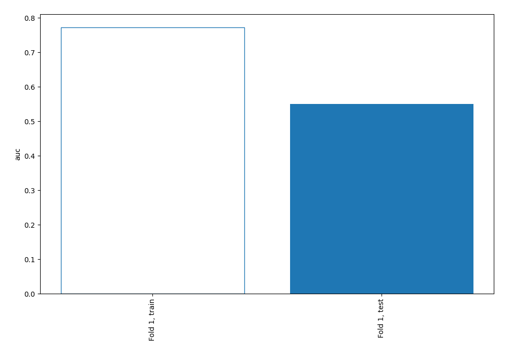

## Permutation-based Importance

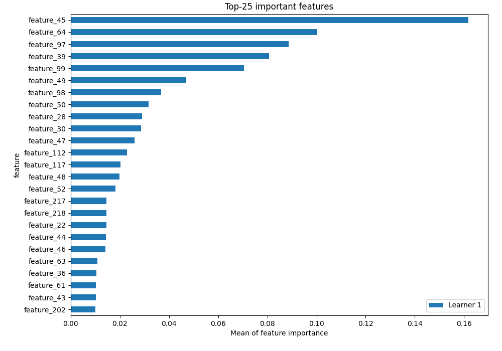

## Confusion Matrix

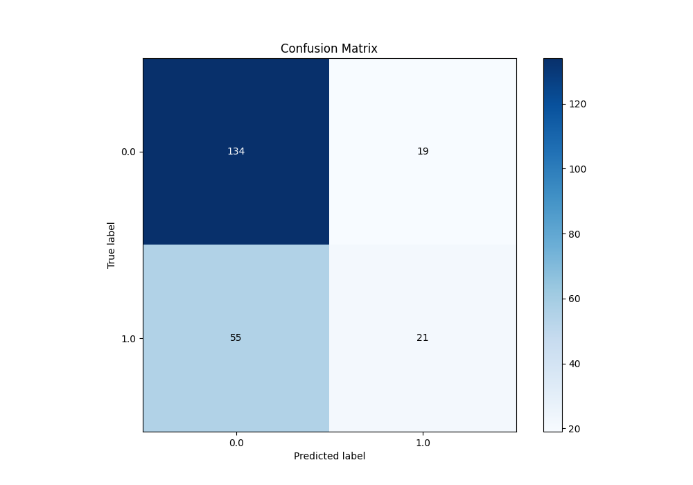

## Normalized Confusion Matrix

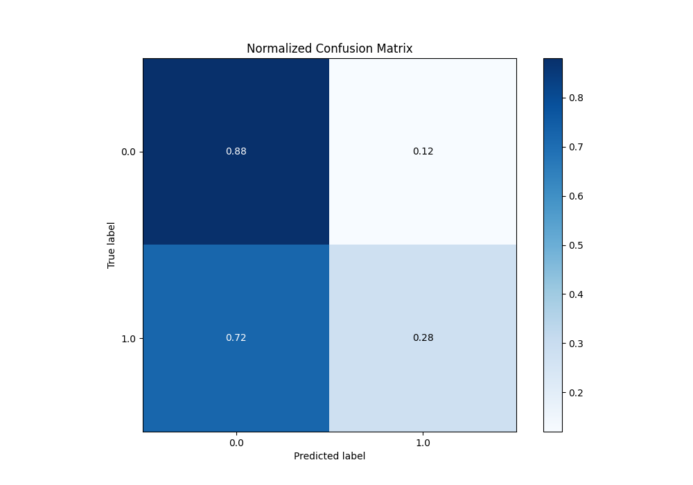

## ROC Curve

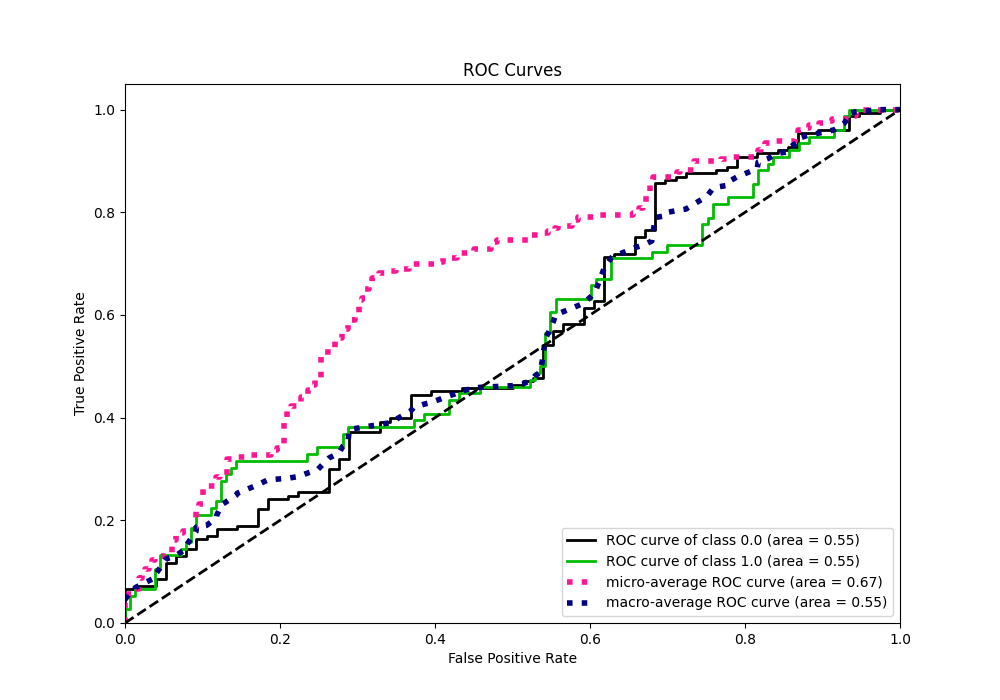

## Kolmogorov-Smirnov Statistic

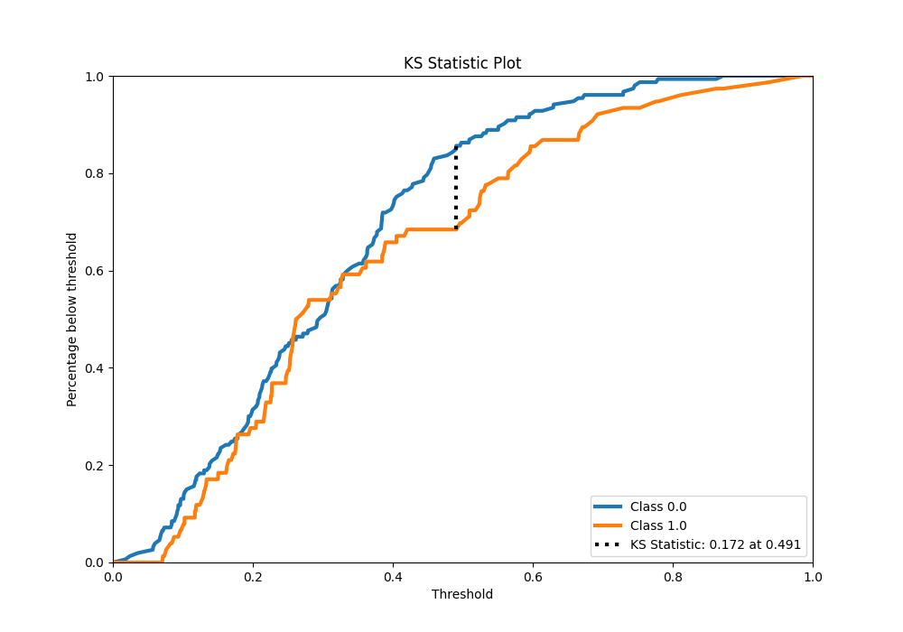

## Precision-Recall Curve

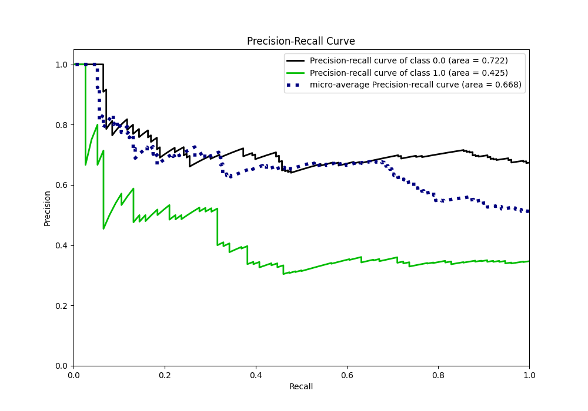

## Calibration Curve

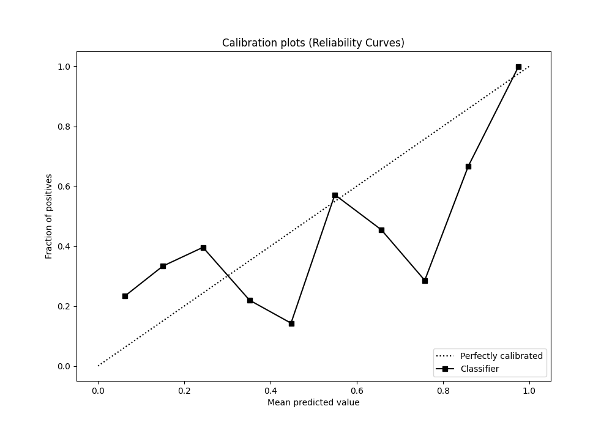

## Cumulative Gains Curve

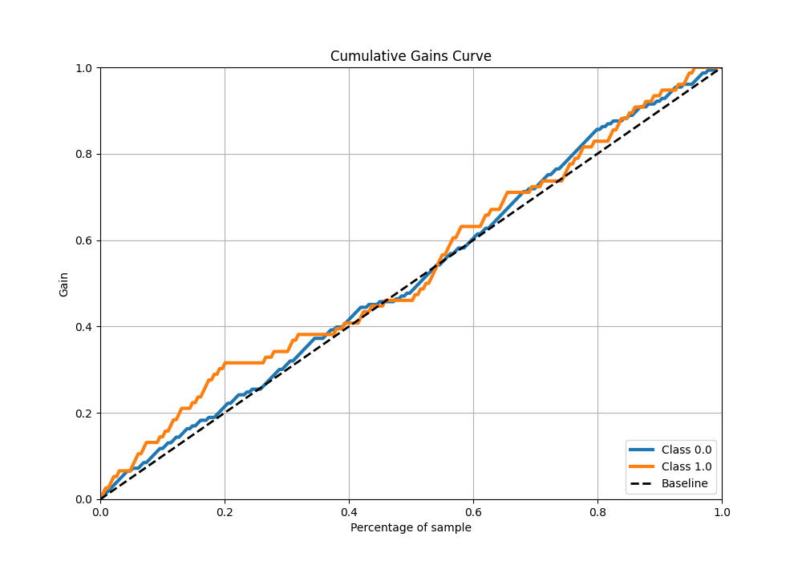

## Lift Curve

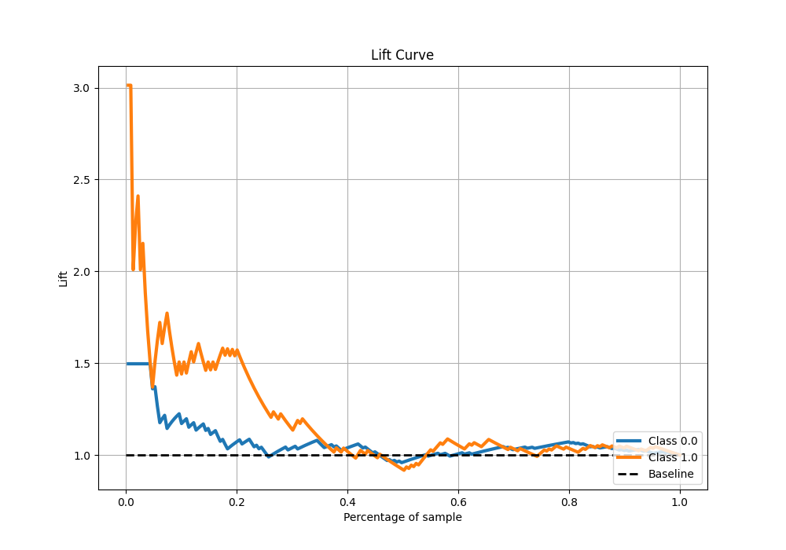

## SHAP Importance

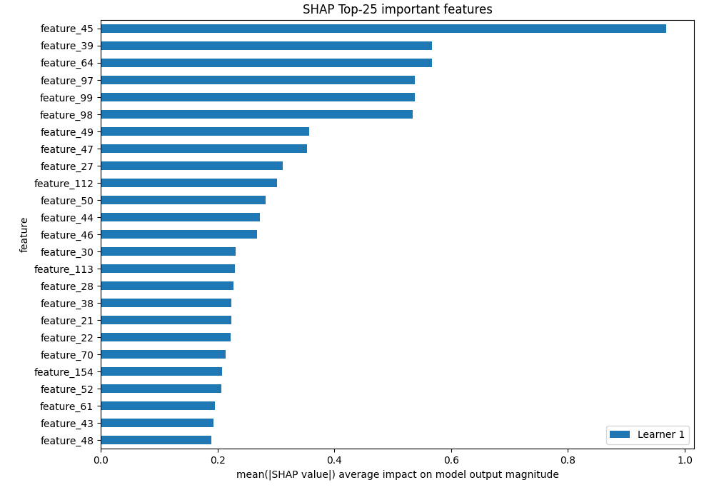

[<< Go back](../README.md)
