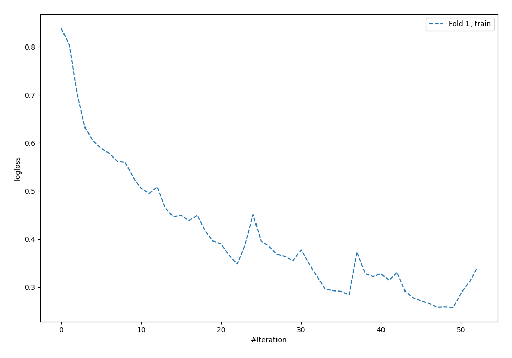
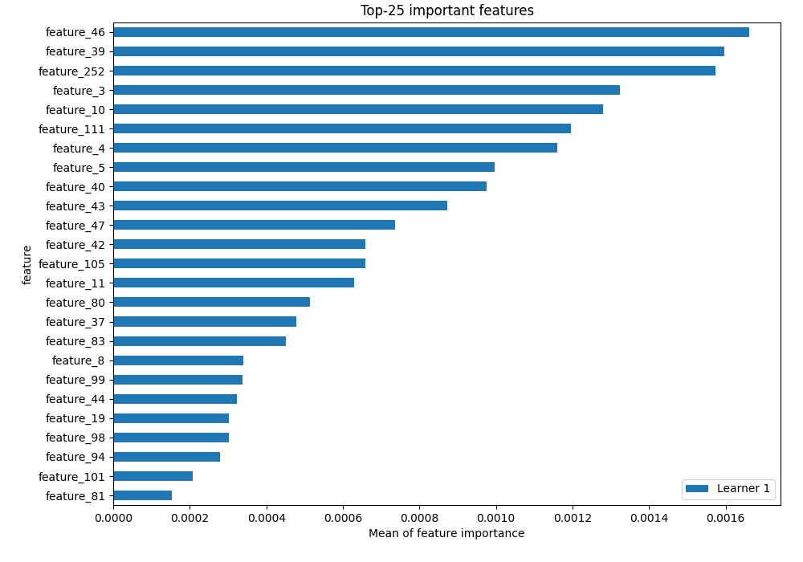
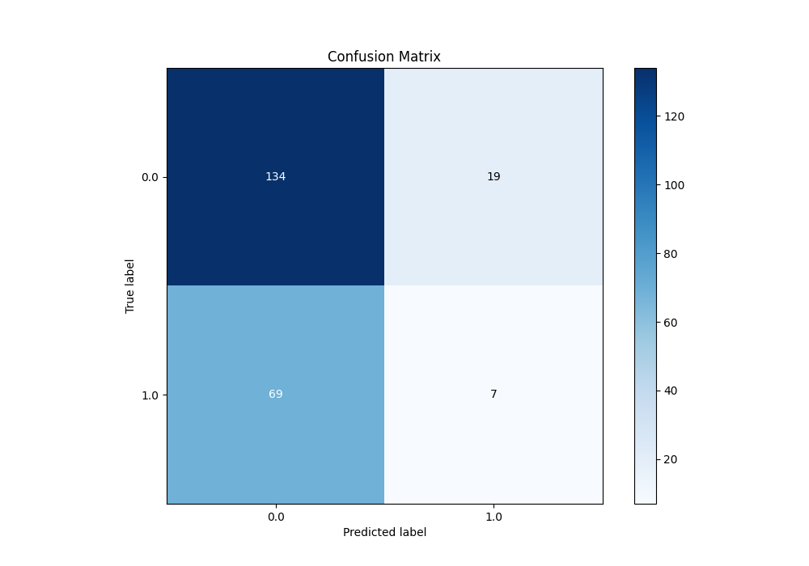
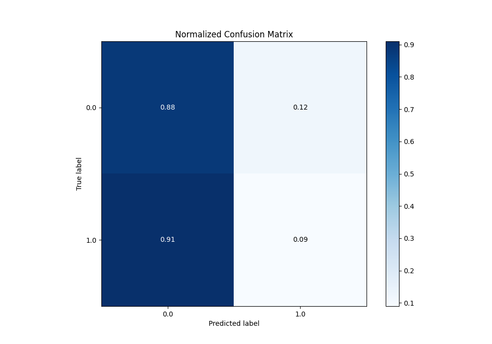
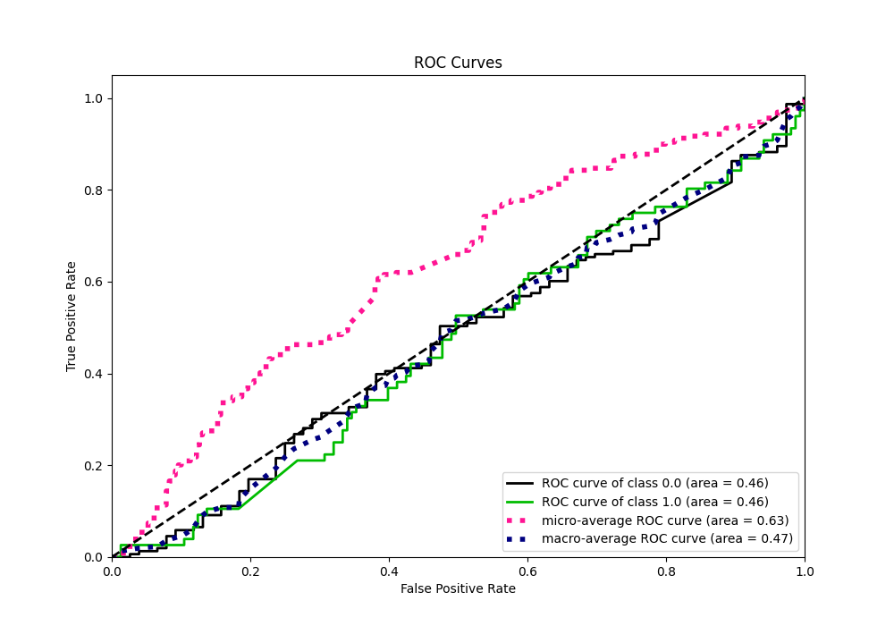
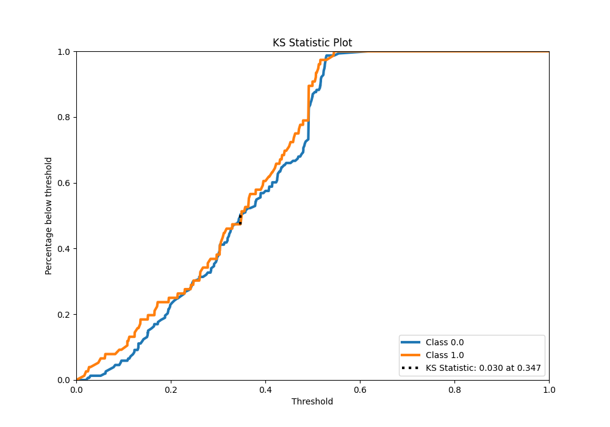
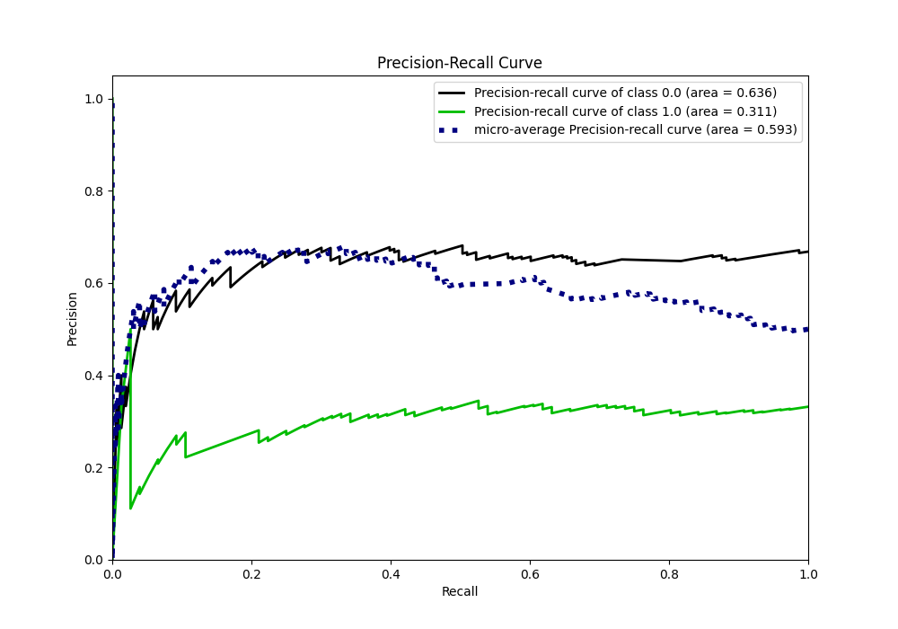
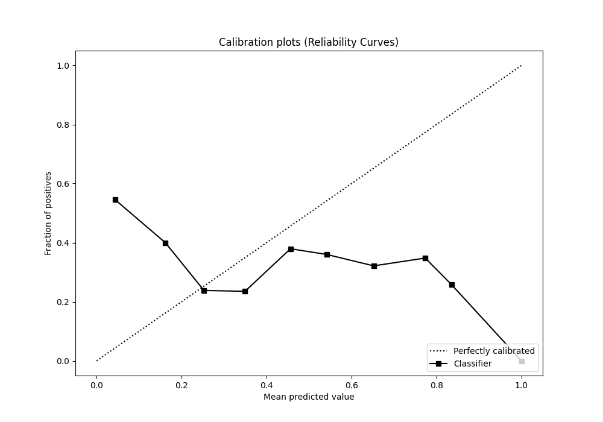
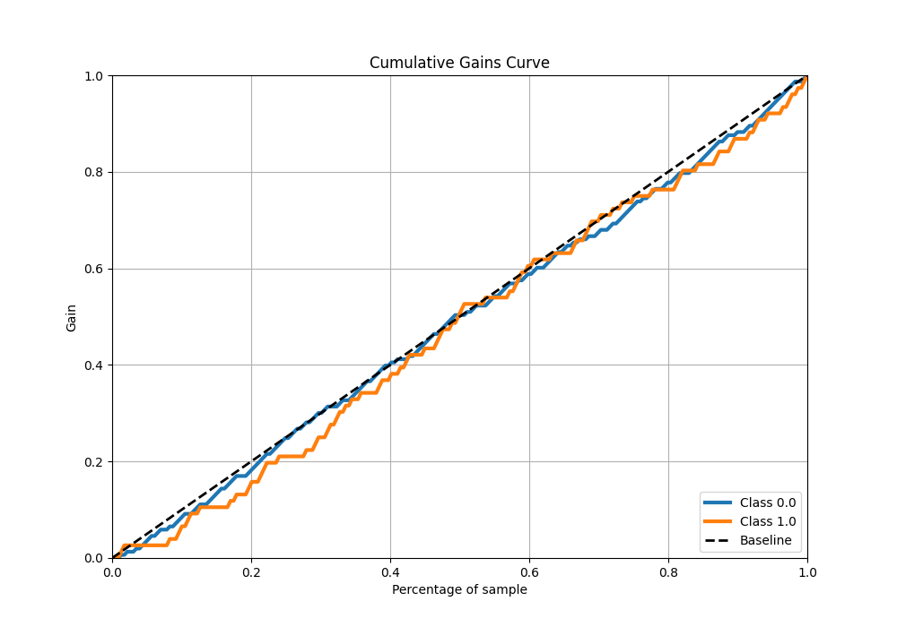
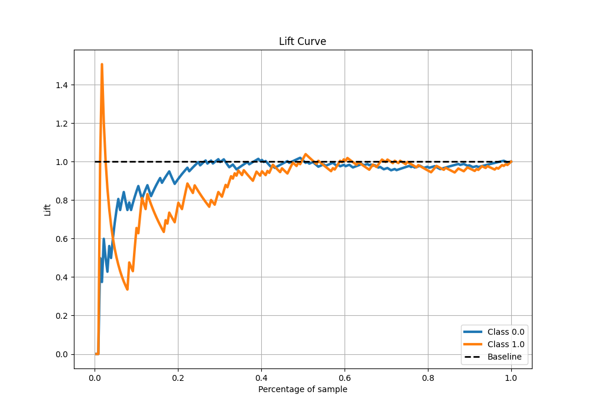

# Summary of 5_Default_NeuralNetwork

[<< Go back](../README.md)

## Neural Network

- **n_jobs**: -1
- **dense_1_size**: 32
- **dense_2_size**: 16
- **learning_rate**: 0.05
- **explain_level**: 2

## Validation

- **validation_type**: split
- **train_ratio**: 0.75
- **shuffle**: True
- **stratify**: True

## Optimized metric

auc

## Training time

1.5 seconds

## Metric details

|           |     score |   threshold |
|:----------|----------:|------------:|
| logloss   | 0.73664   | nan         |
| auc       | 0.46388   | nan         |
| f1        | 0.498361  |   0.0152774 |
| accuracy  | 0.615721  |   0.505195  |
| precision | 0.344828  |   0.347606  |
| recall    | 1         |   0.0152774 |
| mcc       | 0.0278636 |   0.347606  |

## Metric details with threshold from accuracy metric

|           |      score |   threshold |
|:----------|-----------:|------------:|
| logloss   |  0.73664   |  nan        |
| auc       |  0.46388   |  nan        |
| f1        |  0.137255  |    0.505195 |
| accuracy  |  0.615721  |    0.505195 |
| precision |  0.269231  |    0.505195 |
| recall    |  0.0921053 |    0.505195 |
| mcc       | -0.0476126 |    0.505195 |

## Confusion matrix (at threshold=0.505195)

|              |   Predicted as 0 |   Predicted as 1 |
|:-------------|-----------------:|-----------------:|
| Labeled as 0 |              134 |               19 |
| Labeled as 1 |               69 |                7 |

## Learning curves

## Permutation-based Importance

## Confusion Matrix

## Normalized Confusion Matrix

## ROC Curve

## Kolmogorov-Smirnov Statistic

## Precision-Recall Curve

## Calibration Curve

## Cumulative Gains Curve

## Lift Curve

[<< Go back](../README.md)
