# Summary of 2_DecisionTree

[<< Go back](../README.md)

## Decision Tree

- **n_jobs**: -1
- **criterion**: gini
- **max_depth**: 3
- **explain_level**: 2

## Validation

- **validation_type**: split
- **train_ratio**: 0.75
- **shuffle**: True
- **stratify**: True

## Optimized metric

auc

## Training time

6.4 seconds

## Metric details

|           |    score |   threshold |
|:----------|---------:|------------:|
| logloss   | 0.688865 |  nan        |
| auc       | 0.555807 |  nan        |
| f1        | 0.665116 |    0.396543 |
| accuracy  | 0.540257 |    0.477274 |
| precision | 0.525224 |    0.49973  |
| recall    | 1        |    0.240399 |
| mcc       | 0.148016 |    0.477274 |

## Metric details with threshold from accuracy metric

|           |    score |   threshold |
|:----------|---------:|------------:|
| logloss   | 0.688865 |  nan        |
| auc       | 0.555807 |  nan        |
| f1        | 0.664109 |    0.477274 |
| accuracy  | 0.540257 |    0.477274 |
| precision | 0.516921 |    0.477274 |
| recall    | 0.928486 |    0.477274 |
| mcc       | 0.148016 |    0.477274 |

## Confusion matrix (at threshold=0.477274)

|              |   Predicted as 0 |   Predicted as 1 |
|:-------------|-----------------:|-----------------:|
| Labeled as 0 |              294 |             1456 |
| Labeled as 1 |              120 |             1558 |

## Learning curves

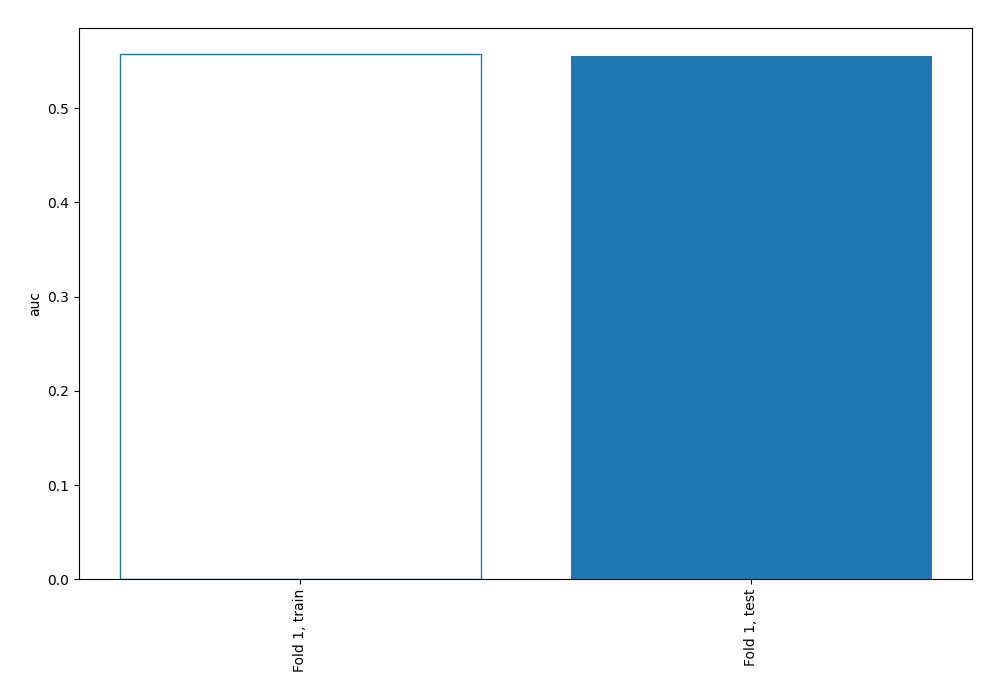

## Permutation-based Importance

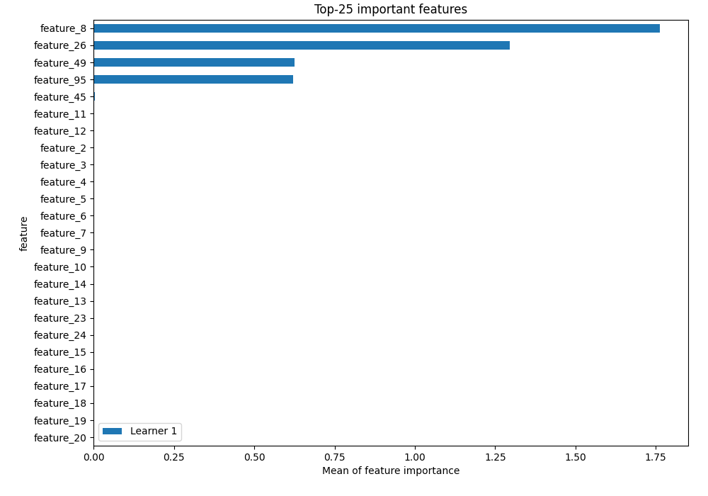

## Confusion Matrix

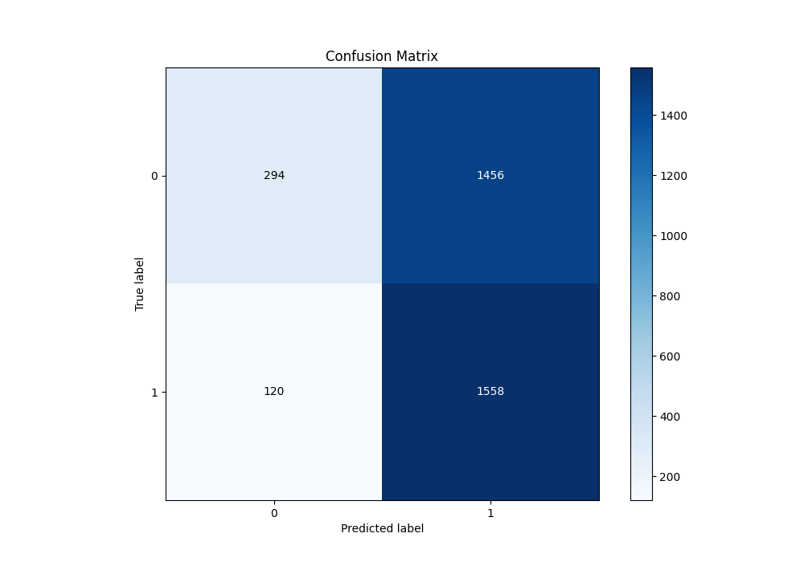

## Normalized Confusion Matrix

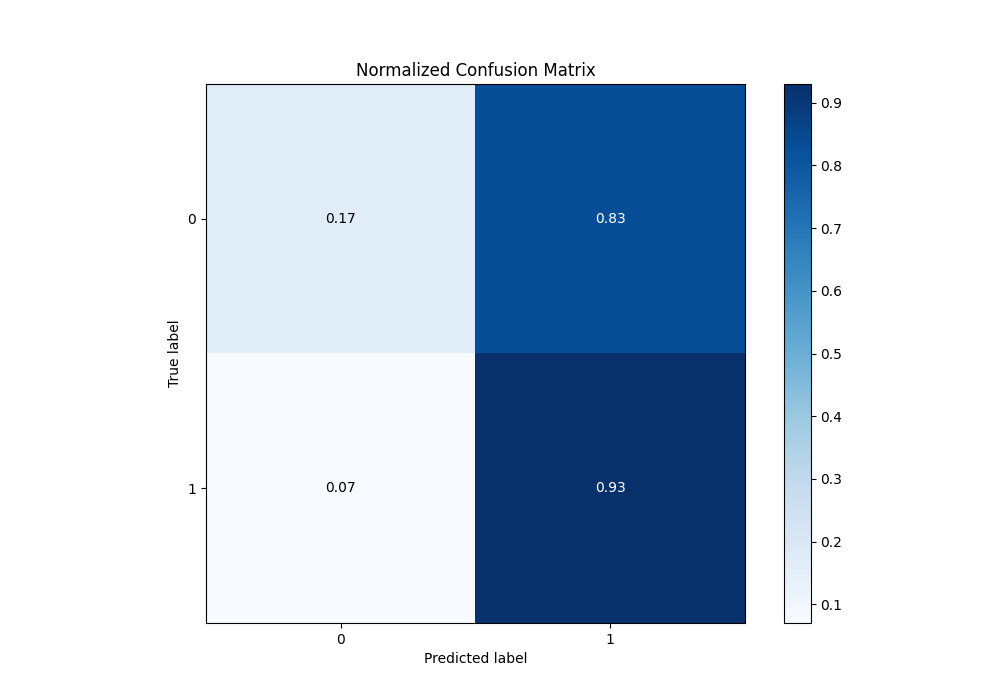

## ROC Curve

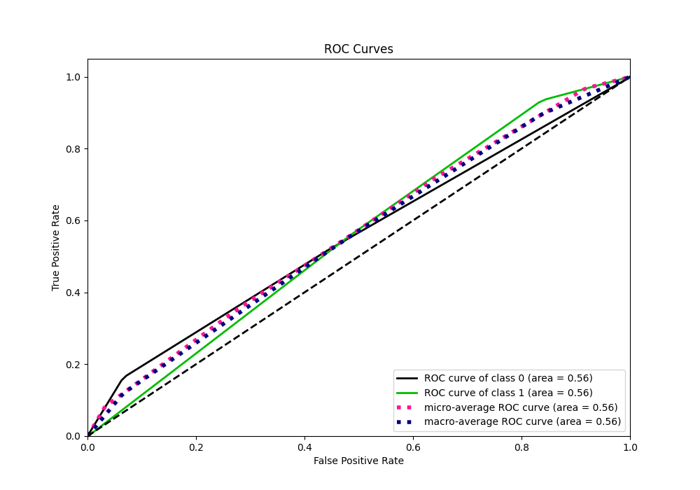

## Kolmogorov-Smirnov Statistic

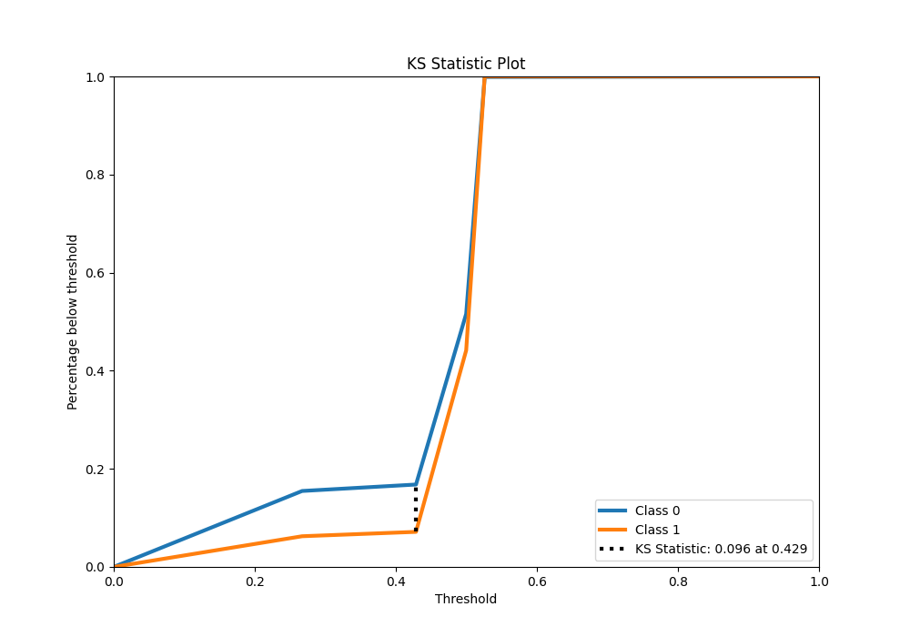

## Precision-Recall Curve

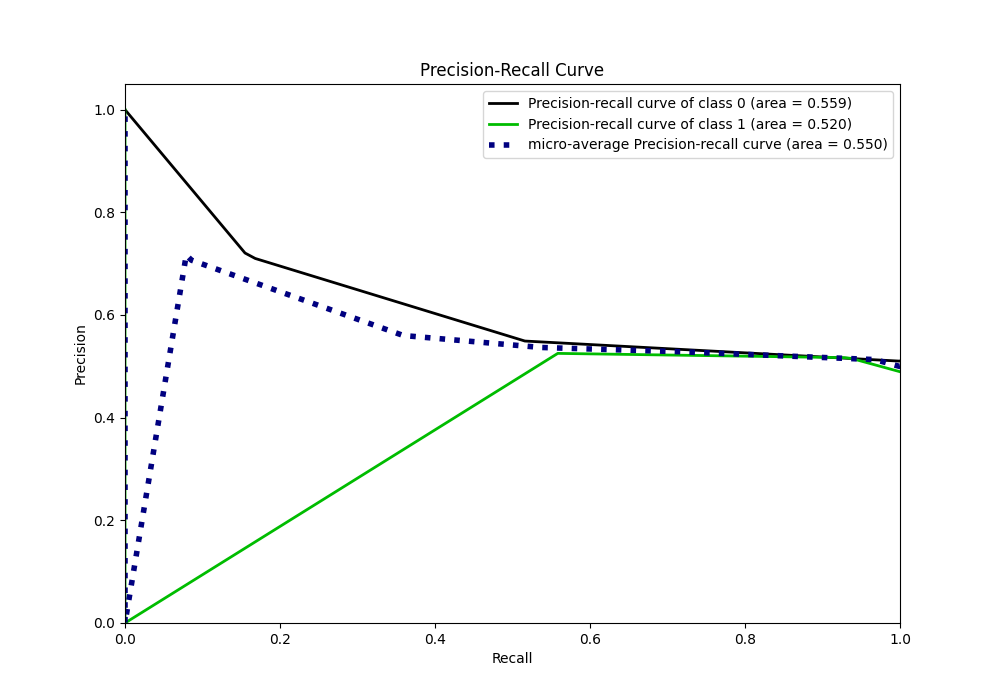

## Calibration Curve

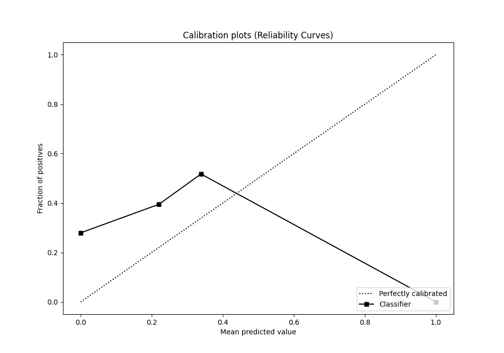

## Cumulative Gains Curve

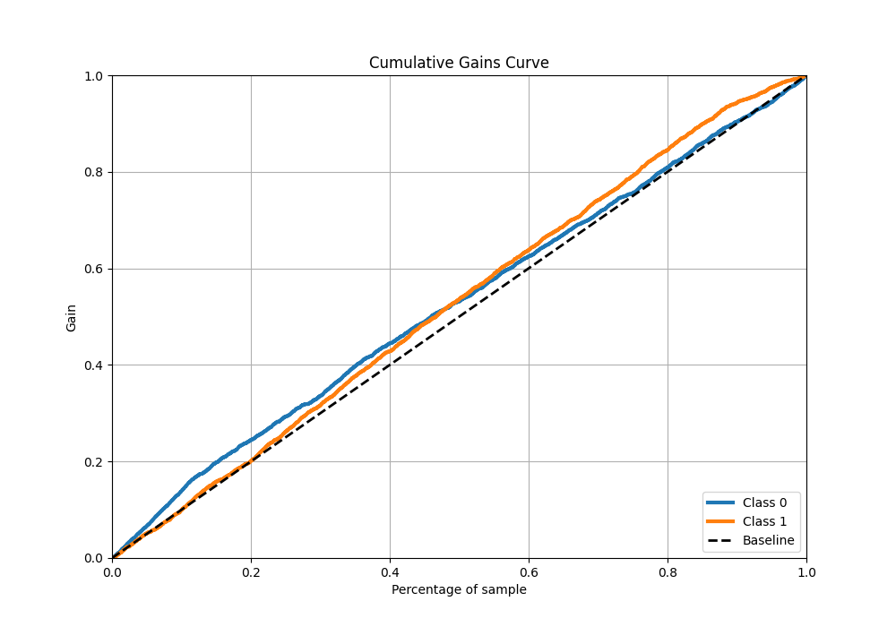

## Lift Curve

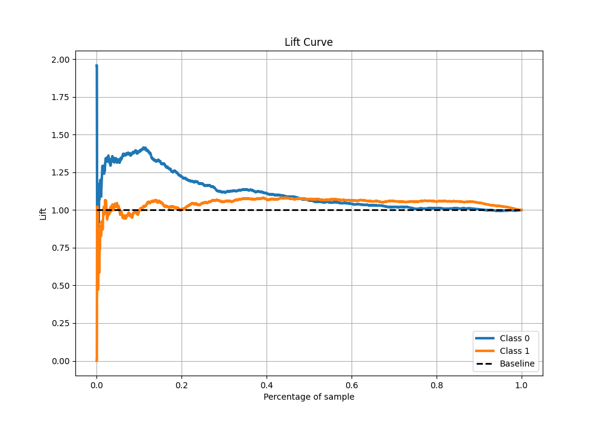

## SHAP Importance

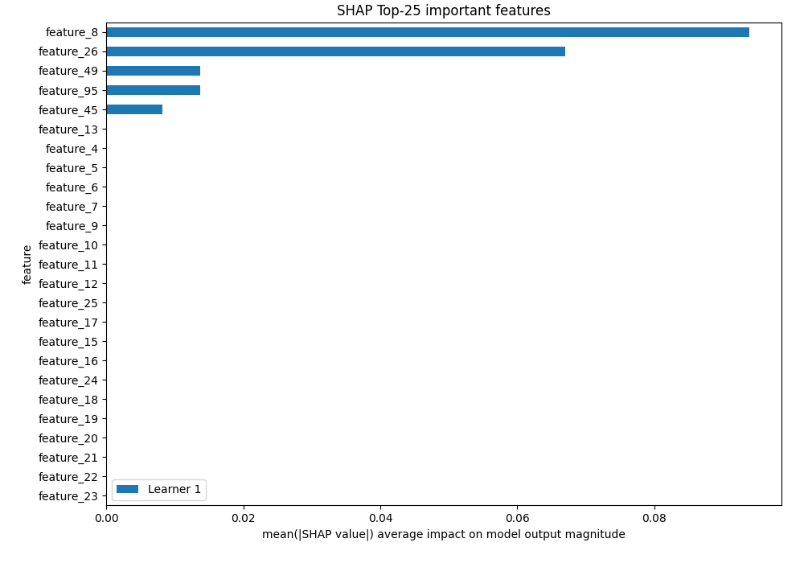

[<< Go back](../README.md)
