# Summary of 5_Default_RandomForest

[<< Go back](../README.md)

## Random Forest

- **n_jobs**: -1
- **criterion**: gini
- **max_features**: 0.9
- **min_samples_split**: 30
- **max_depth**: 4
- **eval_metric_name**: auc
- **explain_level**: 2

## Validation

- **validation_type**: split
- **train_ratio**: 0.75
- **shuffle**: True
- **stratify**: True

## Optimized metric

auc

## Training time

5.8 seconds

## Metric details

|           |    score |   threshold |
|:----------|---------:|------------:|
| logloss   | 0.682061 |  nan        |
| auc       | 0.558273 |  nan        |
| f1        | 0.66526  |    0.252594 |
| accuracy  | 0.542299 |    0.482935 |
| precision | 0.526936 |    0.493984 |
| recall    | 1        |    0.061526 |
| mcc       | 0.148699 |    0.482935 |

## Metric details with threshold from accuracy metric

|           |    score |   threshold |
|:----------|---------:|------------:|
| logloss   | 0.682061 |  nan        |
| auc       | 0.558273 |  nan        |
| f1        | 0.663232 |    0.482935 |
| accuracy  | 0.542299 |    0.482935 |
| precision | 0.518282 |    0.482935 |
| recall    | 0.920739 |    0.482935 |
| mcc       | 0.148699 |    0.482935 |

## Confusion matrix (at threshold=0.482935)

|              |   Predicted as 0 |   Predicted as 1 |
|:-------------|-----------------:|-----------------:|
| Labeled as 0 |              314 |             1436 |
| Labeled as 1 |              133 |             1545 |

## Learning curves

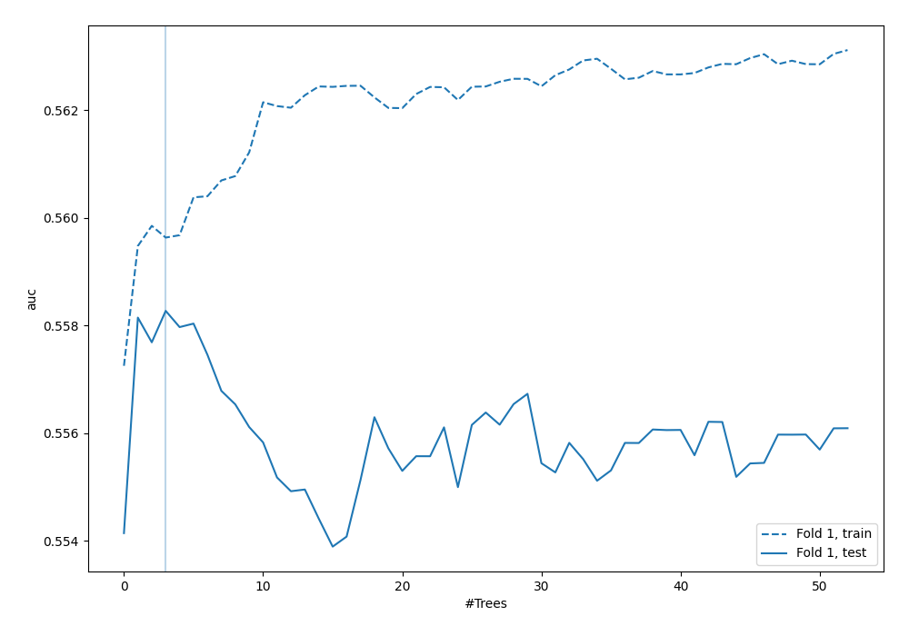

## Permutation-based Importance

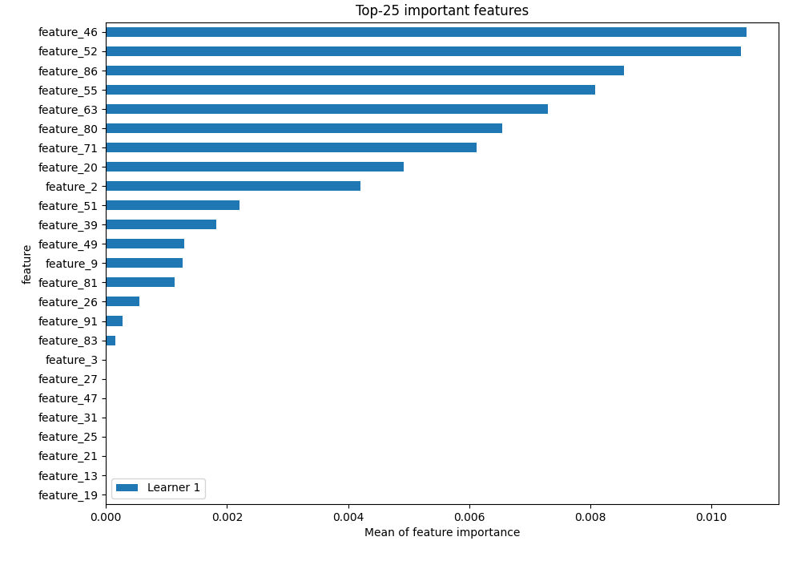

## Confusion Matrix

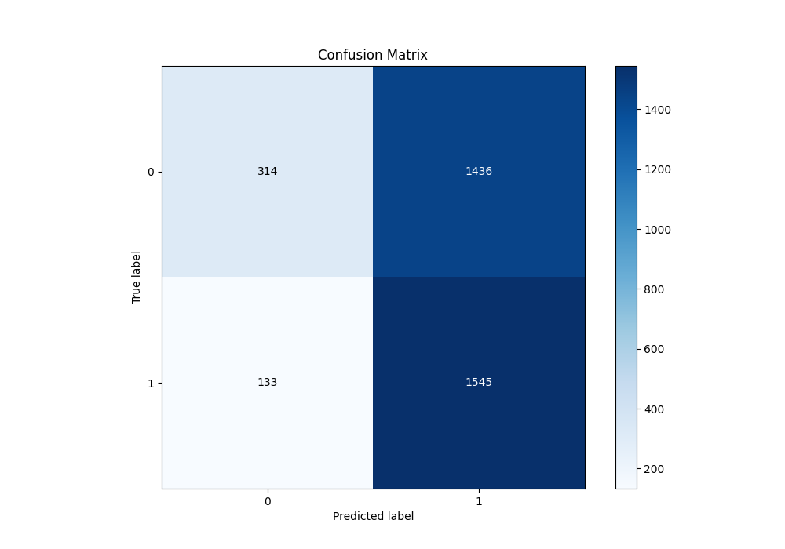

## Normalized Confusion Matrix

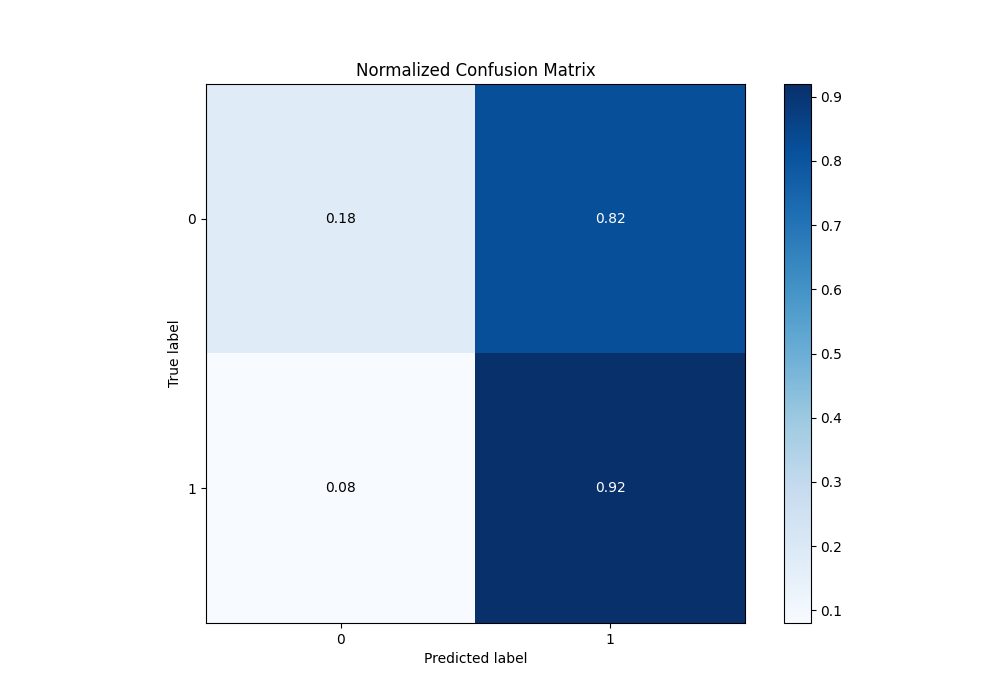

## ROC Curve

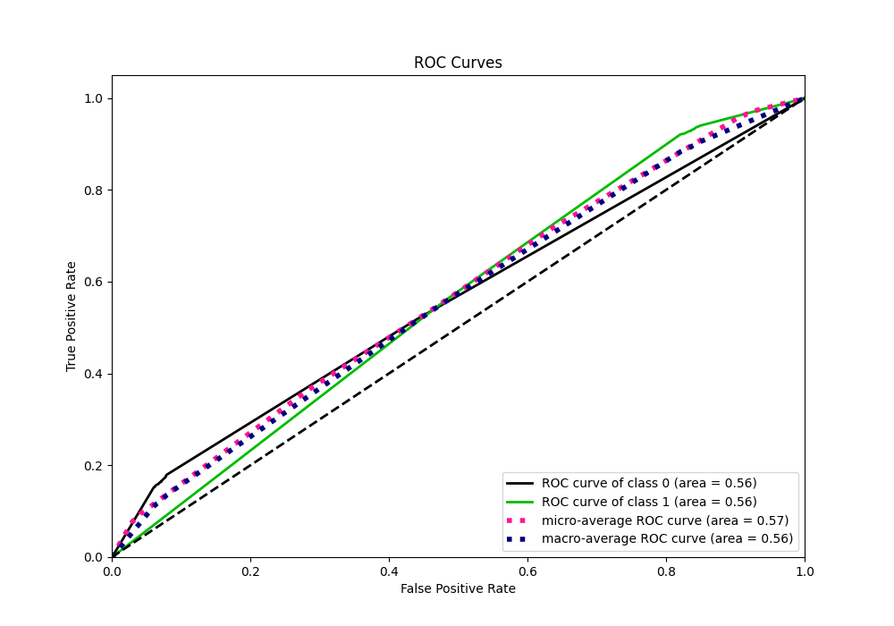

## Kolmogorov-Smirnov Statistic

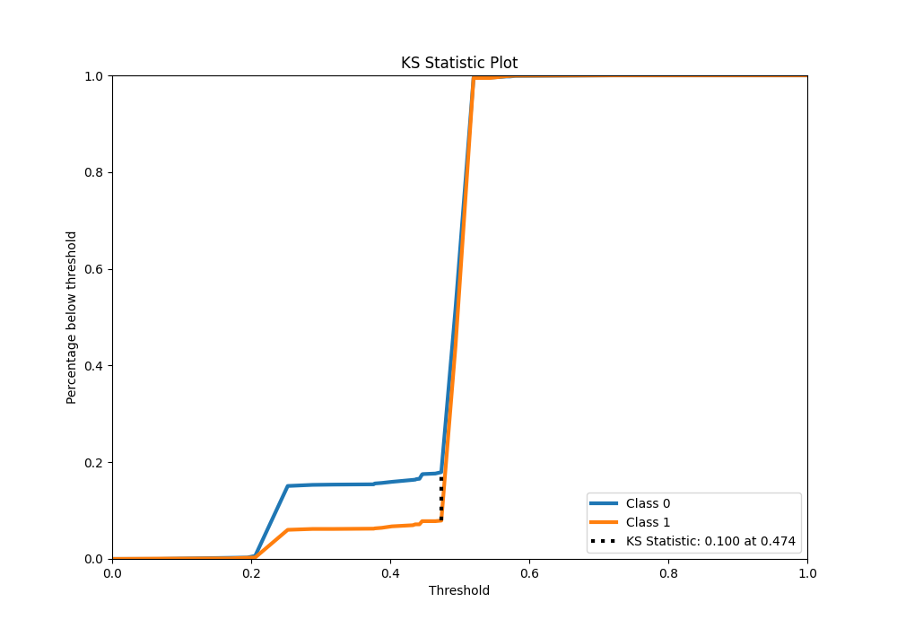

## Precision-Recall Curve

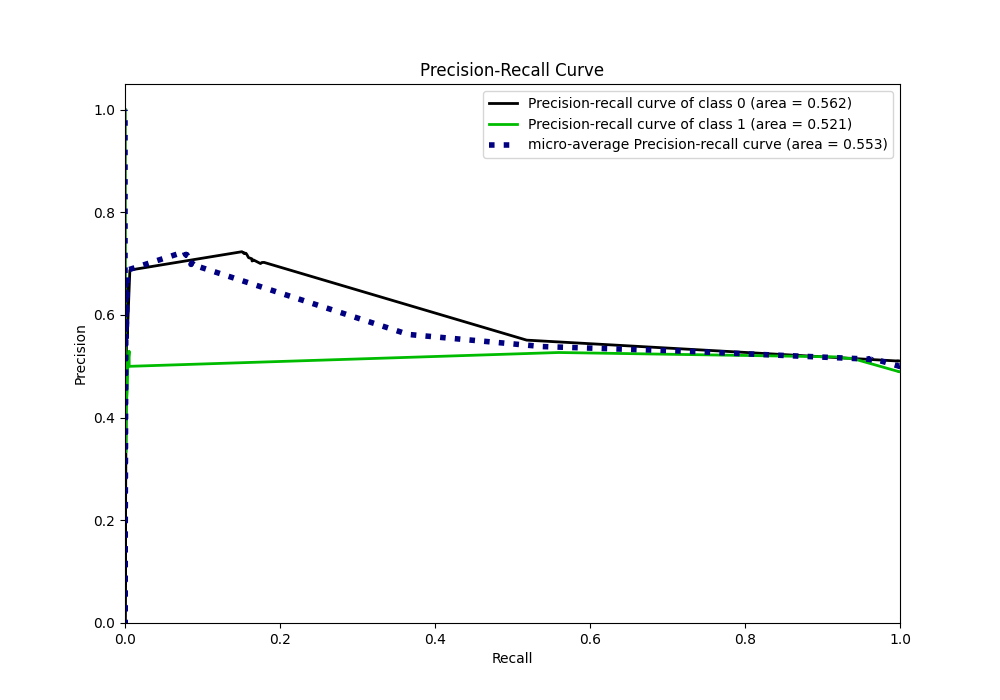

## Calibration Curve

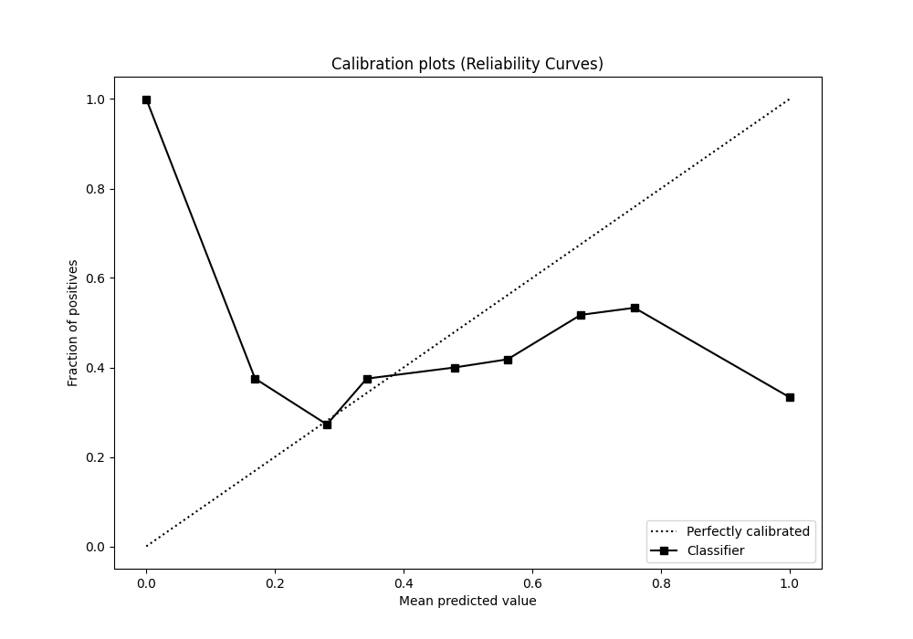

## Cumulative Gains Curve

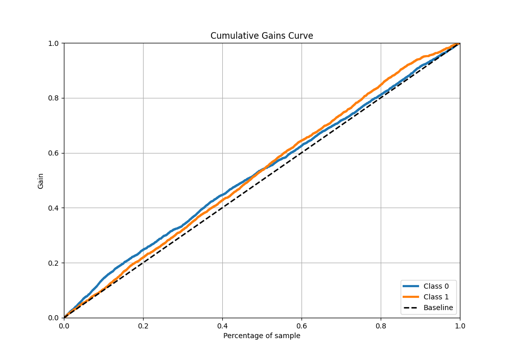

## Lift Curve

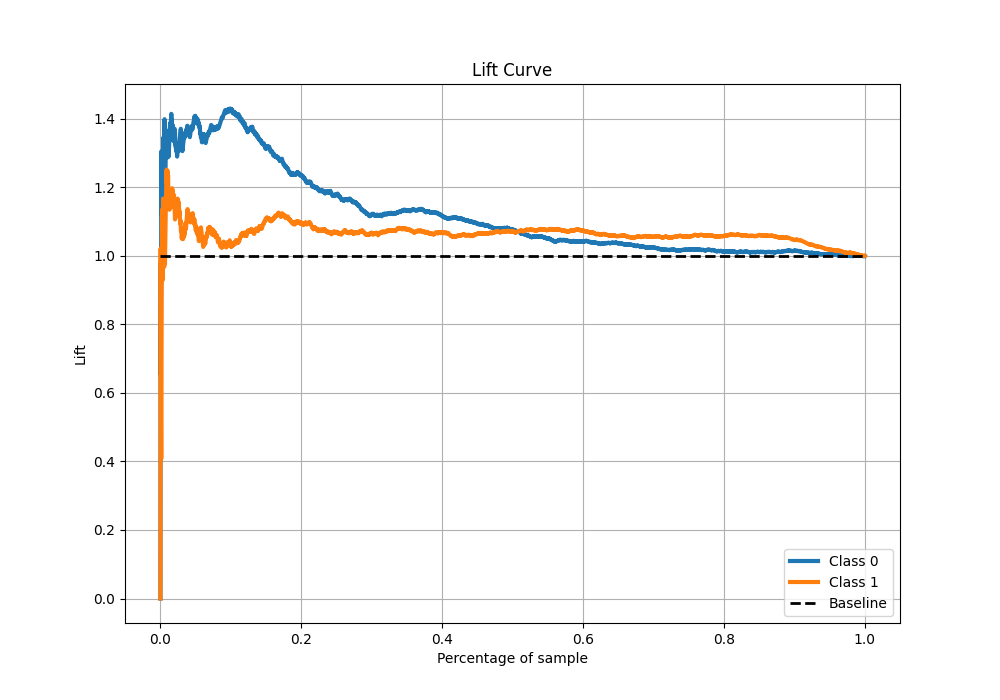

## SHAP Importance

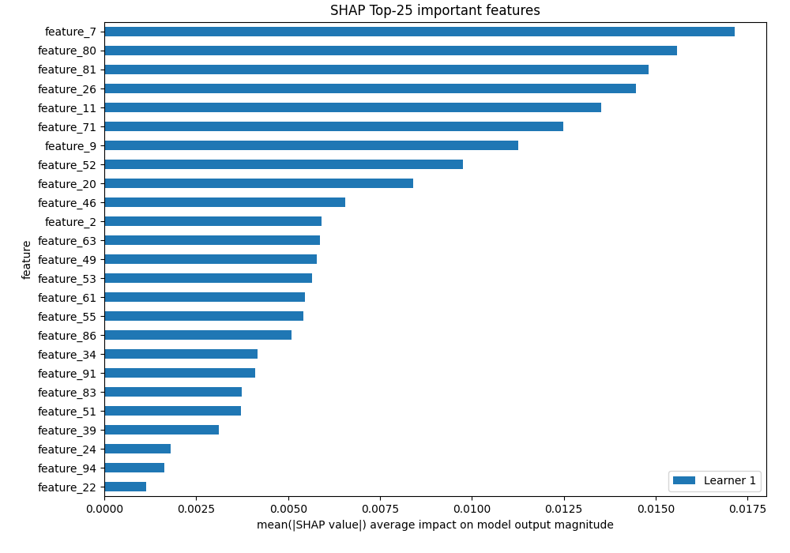

[<< Go back](../README.md)
