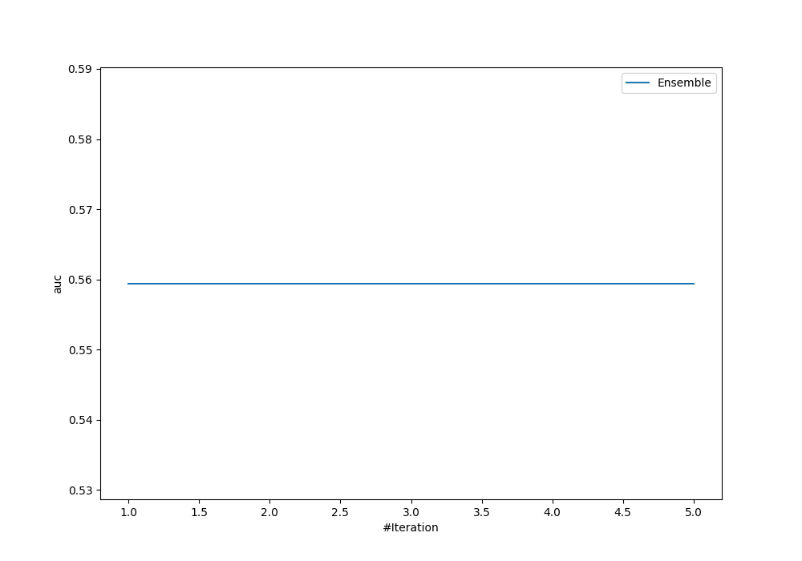
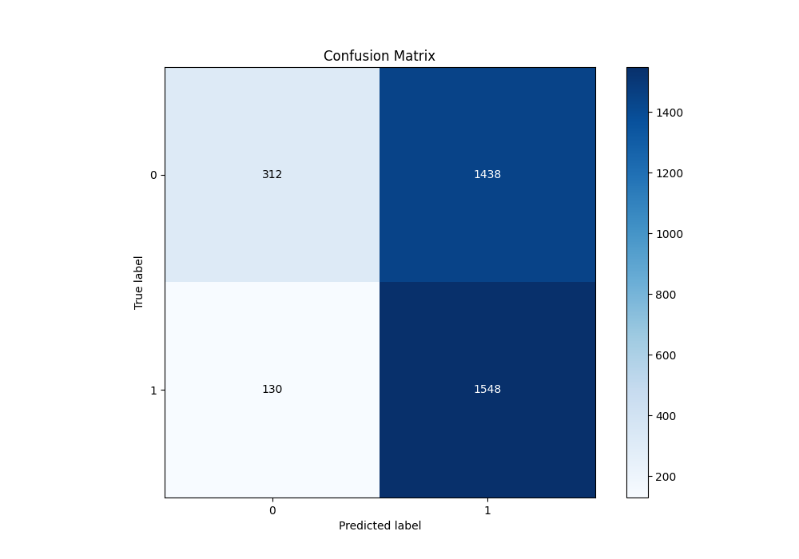
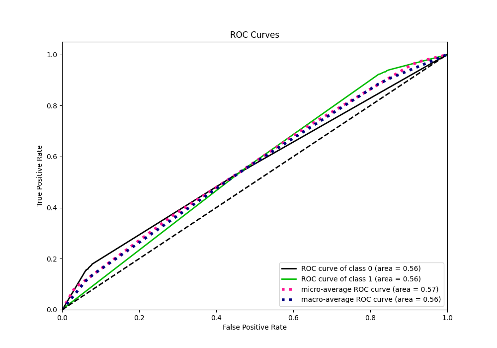
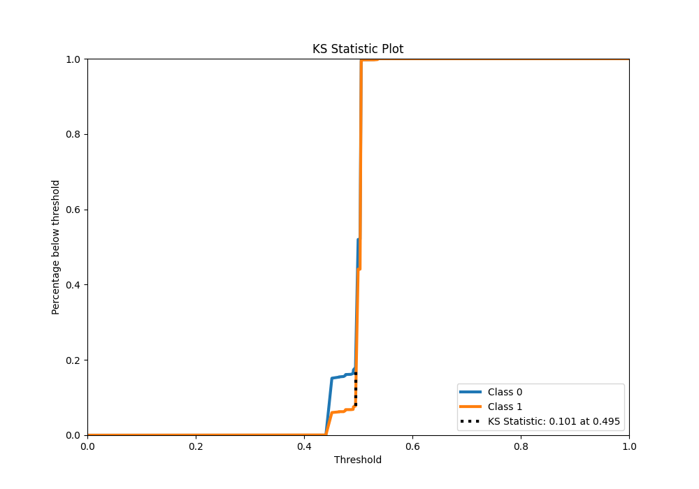
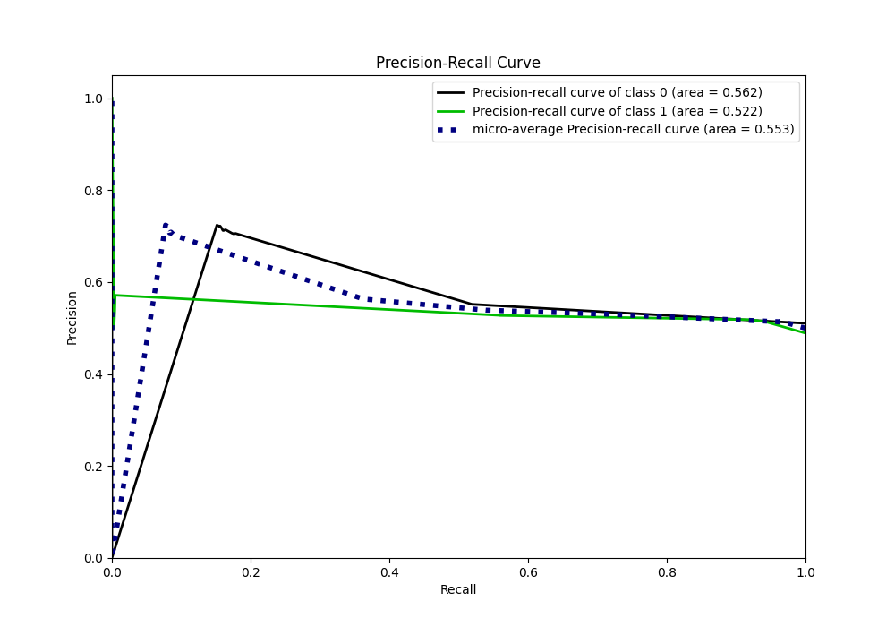
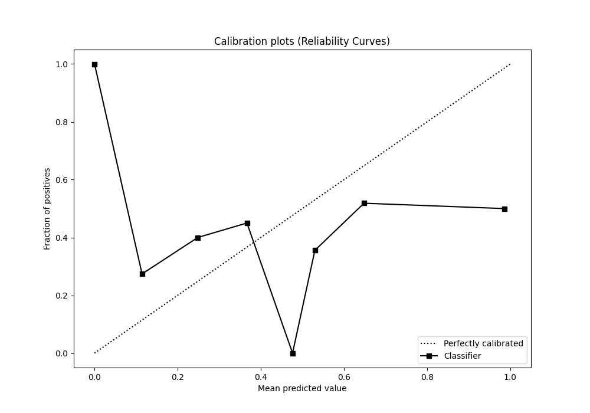
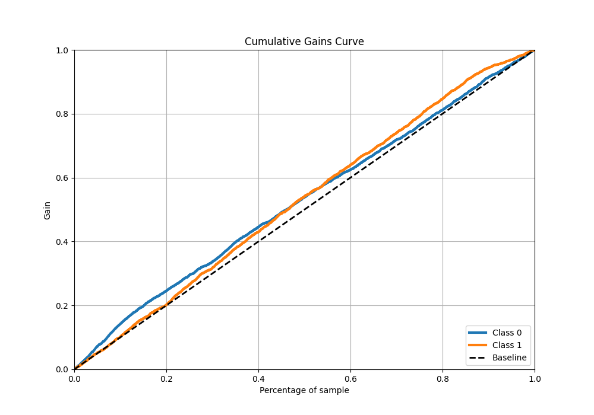
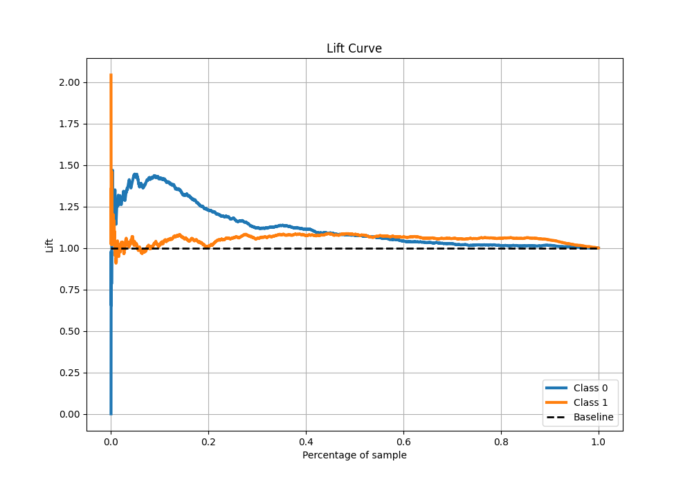

# Summary of Ensemble

[<< Go back](../README.md)

## Ensemble structure

| Model             |   Weight |
|:------------------|---------:|
| 3_Default_Xgboost |        1 |

## Metric details

|           |    score |   threshold |
|:----------|---------:|------------:|
| logloss   | 0.688584 |  nan        |
| auc       | 0.559454 |  nan        |
| f1        | 0.665401 |    0.451357 |
| accuracy  | 0.54259  |    0.498309 |
| precision | 0.571429 |    0.505506 |
| recall    | 1        |    0.396235 |
| mcc       | 0.150374 |    0.498309 |

## Metric details with threshold from accuracy metric

|           |    score |   threshold |
|:----------|---------:|------------:|
| logloss   | 0.688584 |  nan        |
| auc       | 0.559454 |  nan        |
| f1        | 0.663808 |    0.498309 |
| accuracy  | 0.54259  |    0.498309 |
| precision | 0.518419 |    0.498309 |
| recall    | 0.922527 |    0.498309 |
| mcc       | 0.150374 |    0.498309 |

## Confusion matrix (at threshold=0.498309)

|              |   Predicted as 0 |   Predicted as 1 |
|:-------------|-----------------:|-----------------:|
| Labeled as 0 |              312 |             1438 |
| Labeled as 1 |              130 |             1548 |

## Learning curves

## Confusion Matrix

## Normalized Confusion Matrix

## ROC Curve

## Kolmogorov-Smirnov Statistic

## Precision-Recall Curve

## Calibration Curve

## Cumulative Gains Curve

## Lift Curve

[<< Go back](../README.md)
