# Summary of 3_Default_LightGBM

[<< Go back](../README.md)

## LightGBM

- **n_jobs**: -1
- **objective**: binary
- **num_leaves**: 63
- **learning_rate**: 0.05
- **feature_fraction**: 0.9
- **bagging_fraction**: 0.9
- **min_data_in_leaf**: 10
- **metric**: auc
- **custom_eval_metric_name**: None
- **explain_level**: 2

## Validation

- **validation_type**: split
- **train_ratio**: 0.75
- **shuffle**: True
- **stratify**: True

## Optimized metric

auc

## Training time

5.3 seconds

## Metric details

|           |    score |   threshold |
|:----------|---------:|------------:|
| logloss   | 0.607881 | nan         |
| auc       | 0.72954  | nan         |
| f1        | 0.697651 |   0.395582  |
| accuracy  | 0.674154 |   0.489103  |
| precision | 0.841584 |   0.804517  |
| recall    | 1        |   0.0624953 |
| mcc       | 0.348474 |   0.487772  |

## Metric details with threshold from accuracy metric

|           |    score |   threshold |
|:----------|---------:|------------:|
| logloss   | 0.607881 |  nan        |
| auc       | 0.72954  |  nan        |
| f1        | 0.67021  |    0.489103 |
| accuracy  | 0.674154 |    0.489103 |
| precision | 0.664131 |    0.489103 |
| recall    | 0.6764   |    0.489103 |
| mcc       | 0.348325 |    0.489103 |

## Confusion matrix (at threshold=0.489103)

|              |   Predicted as 0 |   Predicted as 1 |
|:-------------|-----------------:|-----------------:|
| Labeled as 0 |             1176 |              574 |
| Labeled as 1 |              543 |             1135 |

## Learning curves

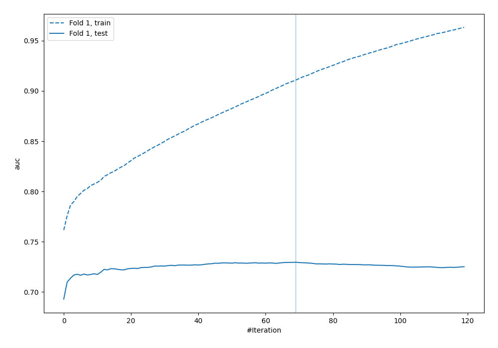

## Permutation-based Importance

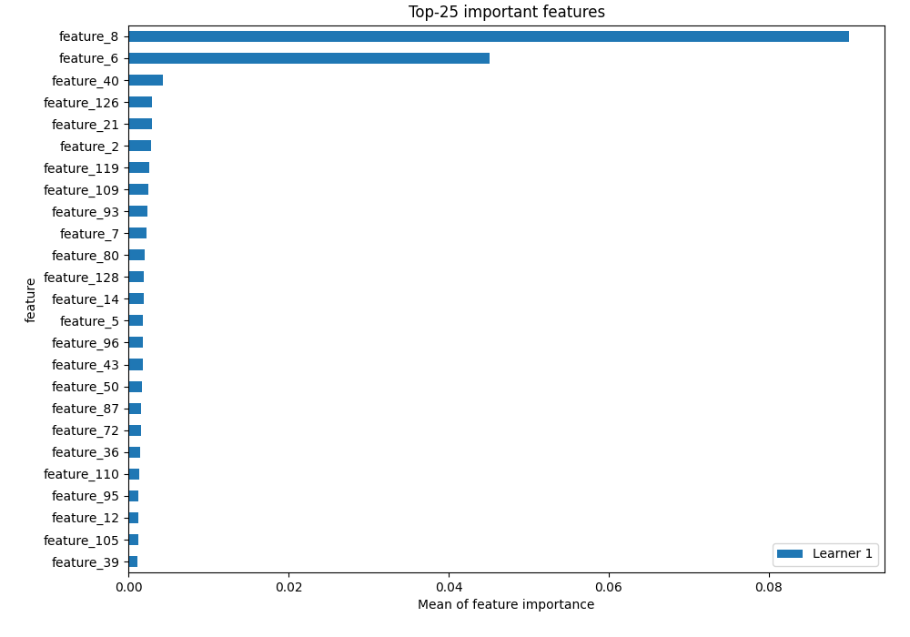

## Confusion Matrix

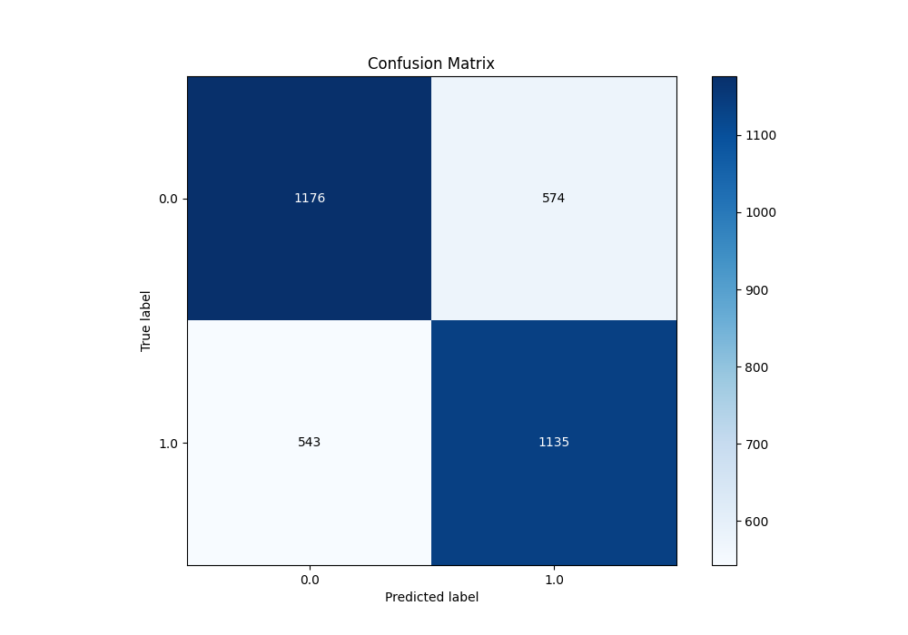

## Normalized Confusion Matrix

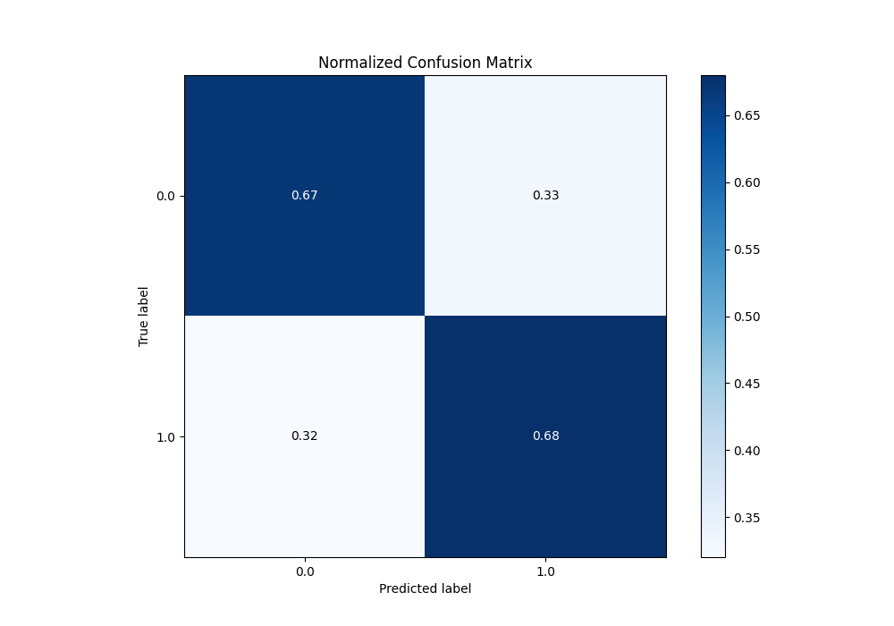

## ROC Curve

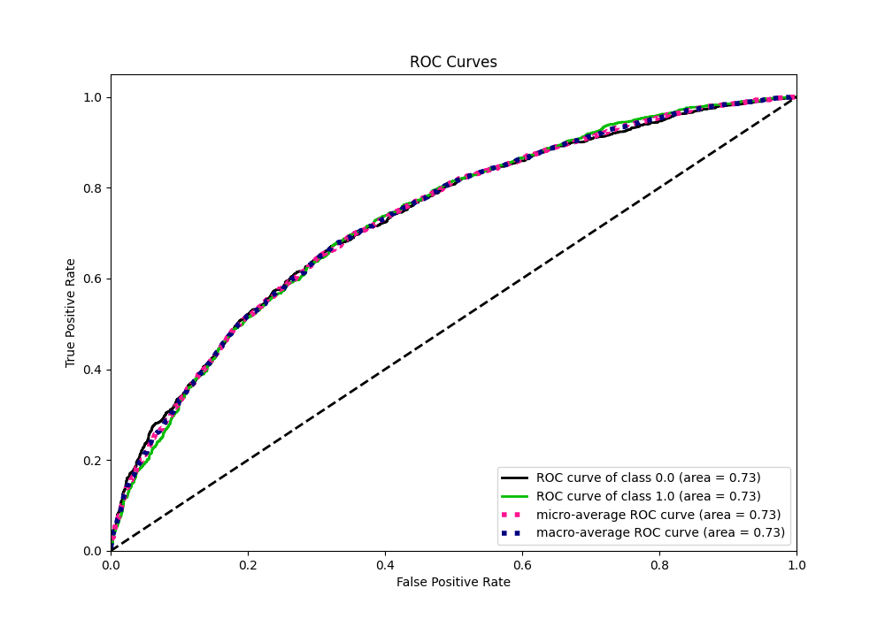

## Kolmogorov-Smirnov Statistic

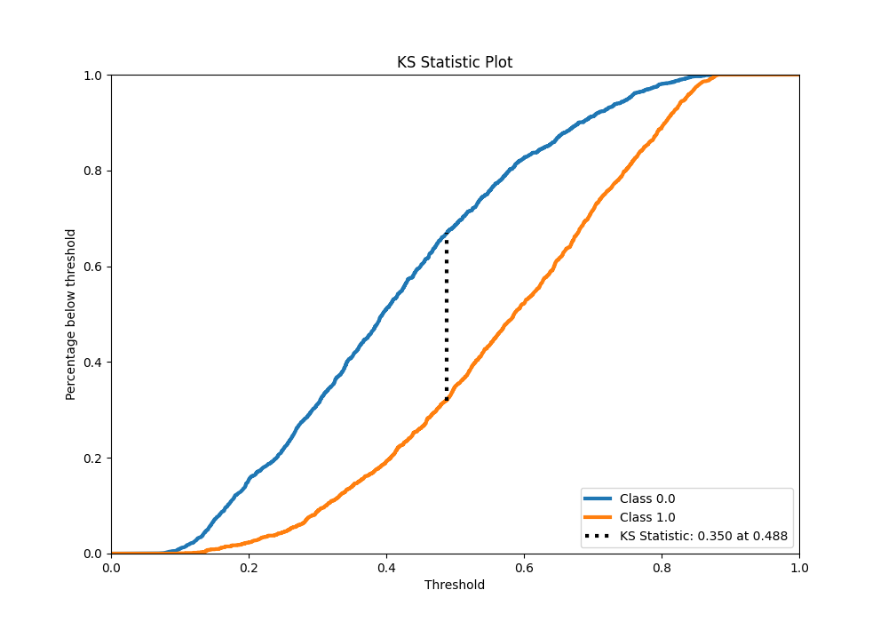

## Precision-Recall Curve

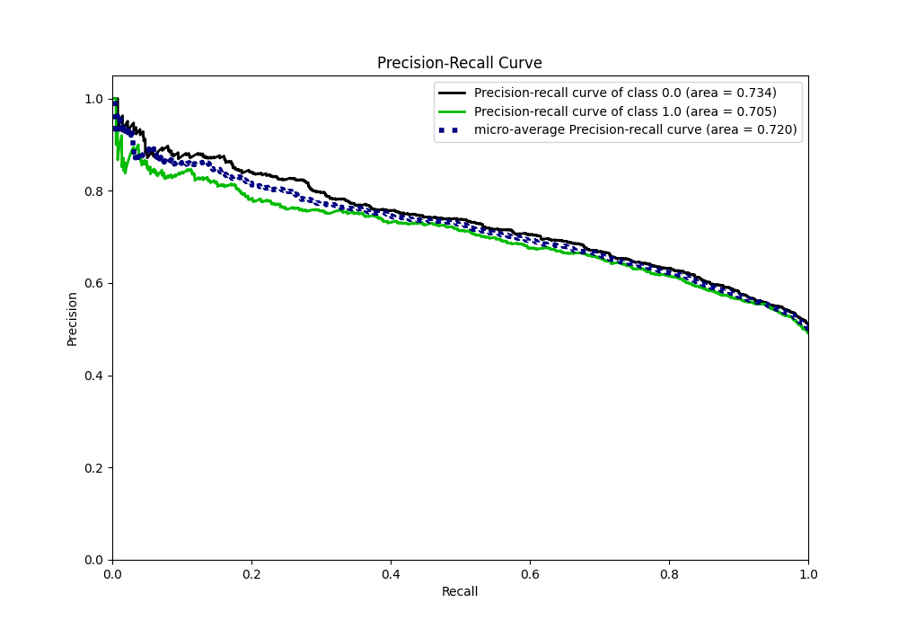

## Calibration Curve

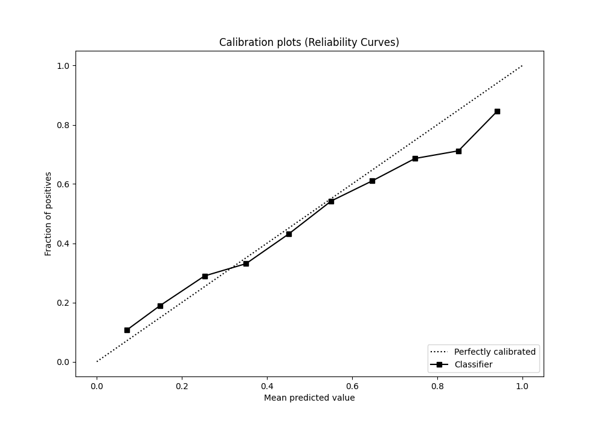

## Cumulative Gains Curve

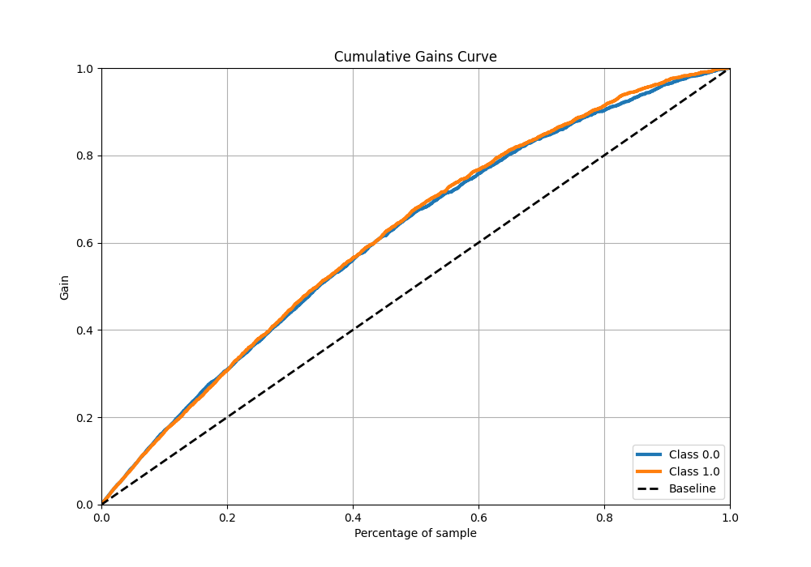

## Lift Curve

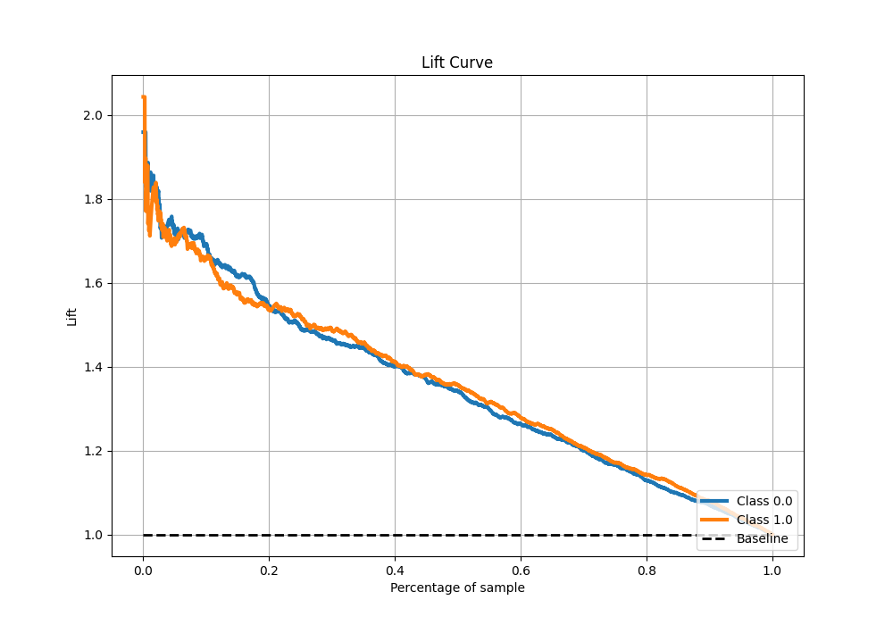

## SHAP Importance

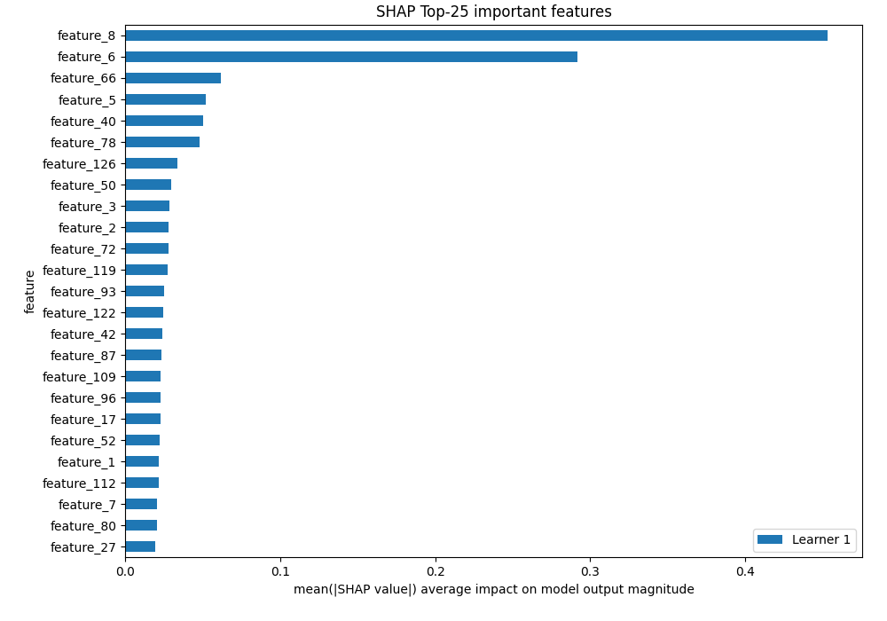

## SHAP Dependence plots

### Dependence (Fold 1)

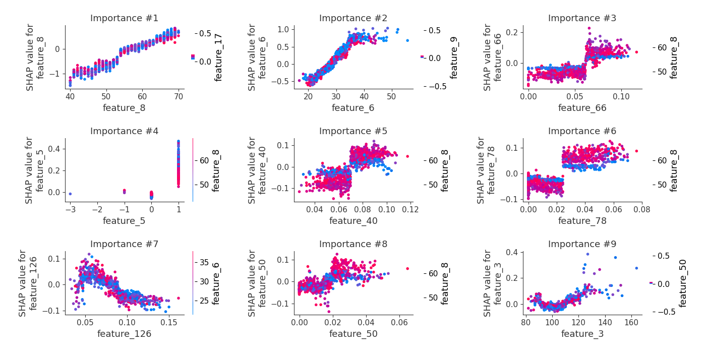

## SHAP Decision plots

[<< Go back](../README.md)
