# Summary of 4_Default_Xgboost

[<< Go back](../README.md)

## Extreme Gradient Boosting (Xgboost)

- **n_jobs**: -1
- **objective**: binary:logistic
- **eta**: 0.075
- **max_depth**: 6
- **min_child_weight**: 1
- **subsample**: 1.0
- **colsample_bytree**: 1.0
- **eval_metric**: auc
- **explain_level**: 2

## Validation

- **validation_type**: split
- **train_ratio**: 0.75
- **shuffle**: True
- **stratify**: True

## Optimized metric

auc

## Training time

29.4 seconds

## Metric details

|           |    score |   threshold |
|:----------|---------:|------------:|
| logloss   | 0.60775  |  nan        |
| auc       | 0.729286 |  nan        |
| f1        | 0.698967 |    0.376195 |
| accuracy  | 0.672404 |    0.488988 |
| precision | 0.835443 |    0.837847 |
| recall    | 1        |    0.047195 |
| mcc       | 0.344713 |    0.488988 |

## Metric details with threshold from accuracy metric

|           |    score |   threshold |
|:----------|---------:|------------:|
| logloss   | 0.60775  |  nan        |
| auc       | 0.729286 |  nan        |
| f1        | 0.667456 |    0.488988 |
| accuracy  | 0.672404 |    0.488988 |
| precision | 0.663331 |    0.488988 |
| recall    | 0.671633 |    0.488988 |
| mcc       | 0.344713 |    0.488988 |

## Confusion matrix (at threshold=0.488988)

|              |   Predicted as 0 |   Predicted as 1 |
|:-------------|-----------------:|-----------------:|
| Labeled as 0 |             1178 |              572 |
| Labeled as 1 |              551 |             1127 |

## Learning curves

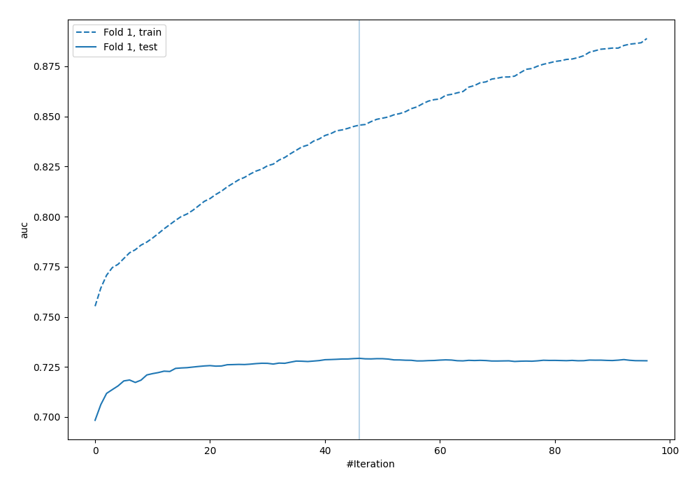

## Permutation-based Importance

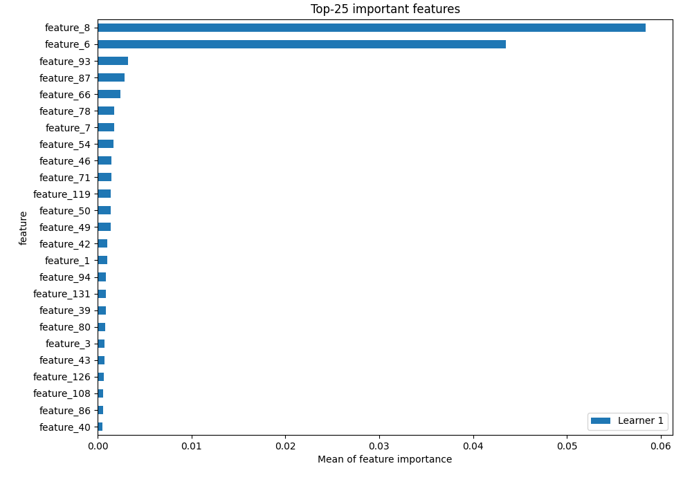

## Confusion Matrix

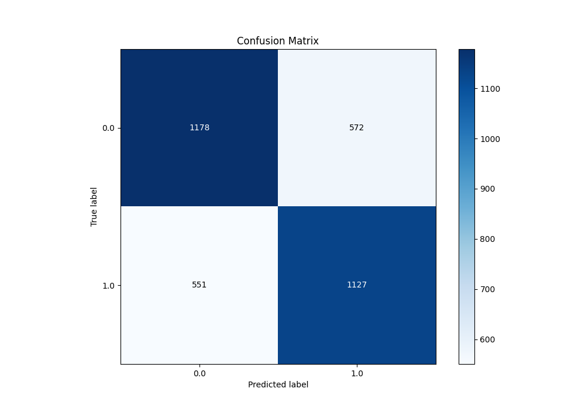

## Normalized Confusion Matrix

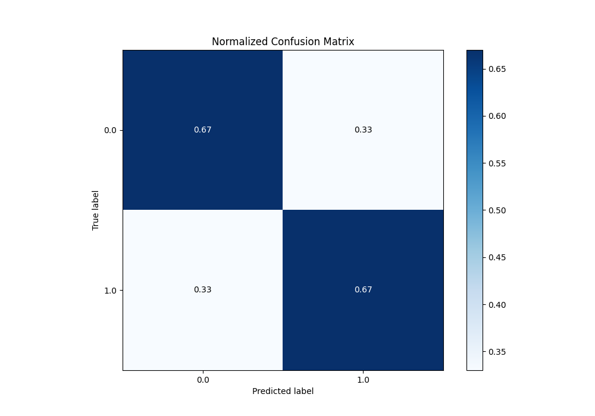

## ROC Curve

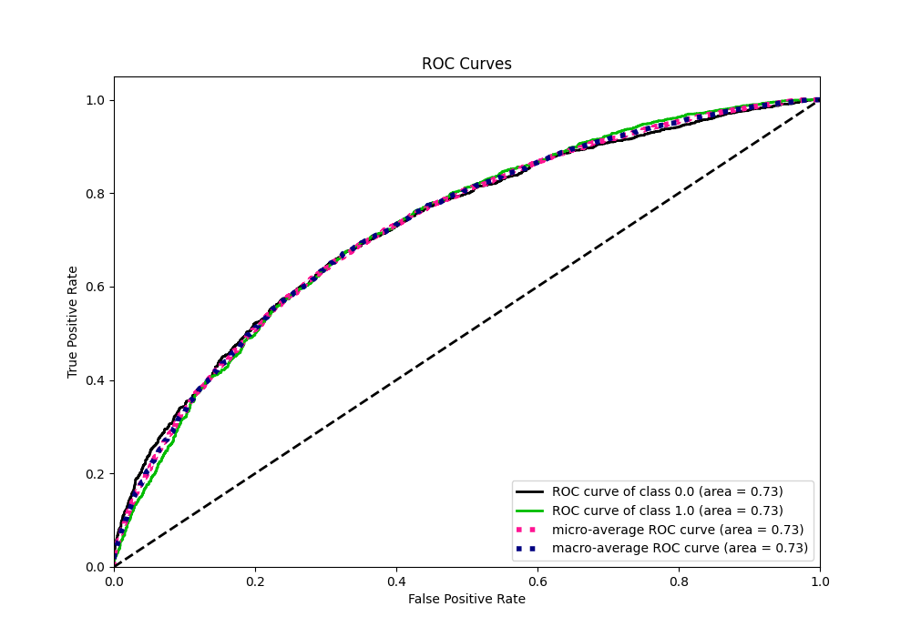

## Kolmogorov-Smirnov Statistic

## Precision-Recall Curve

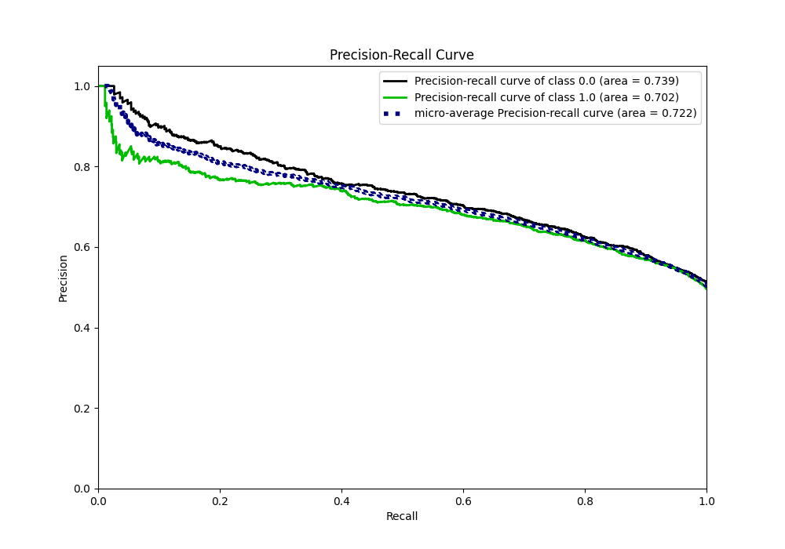

## Calibration Curve

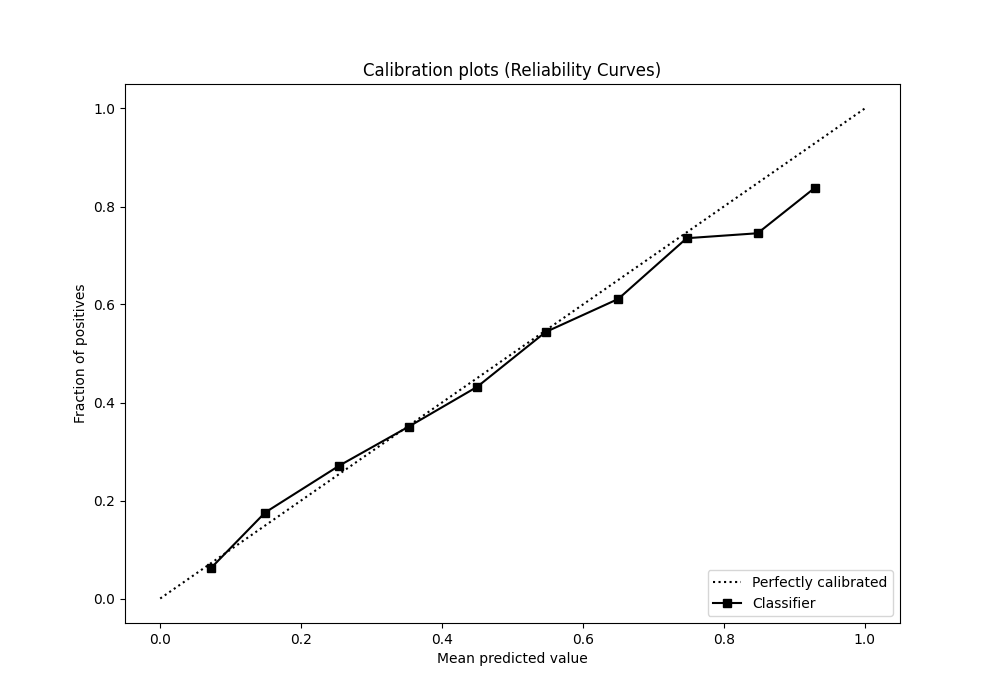

## Cumulative Gains Curve

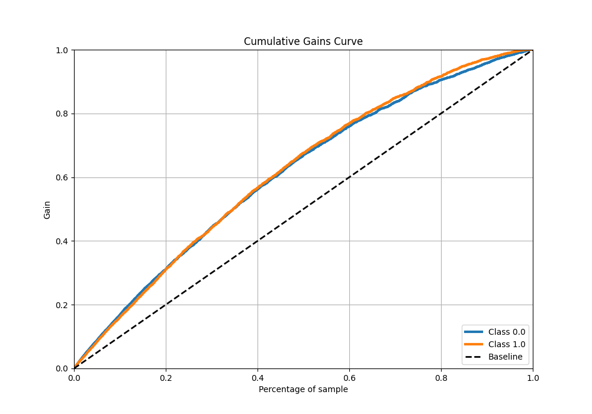

## Lift Curve

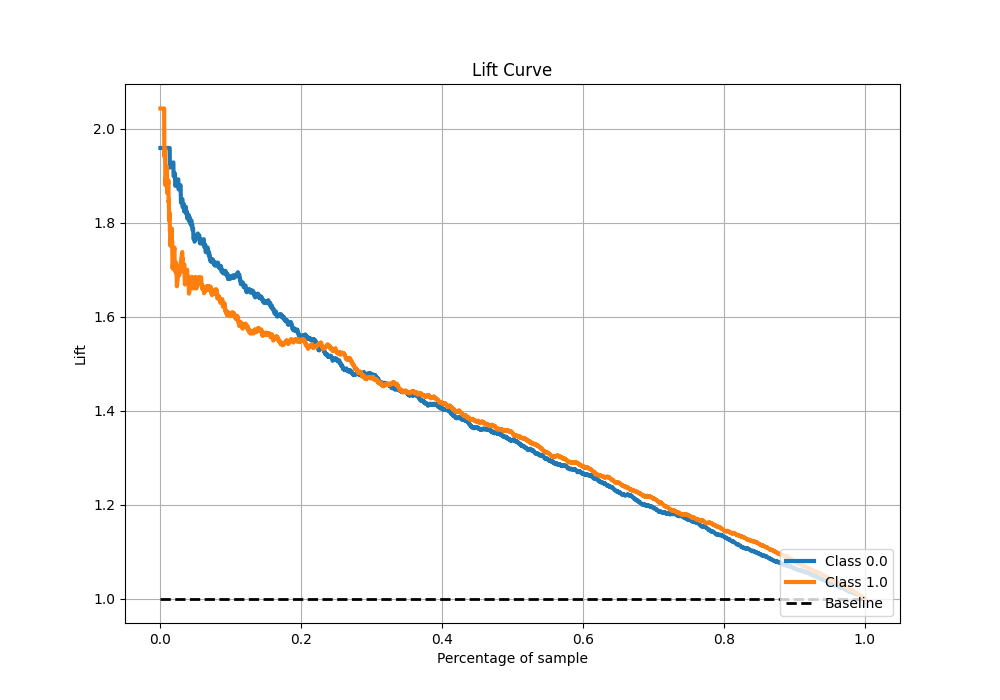

## SHAP Importance

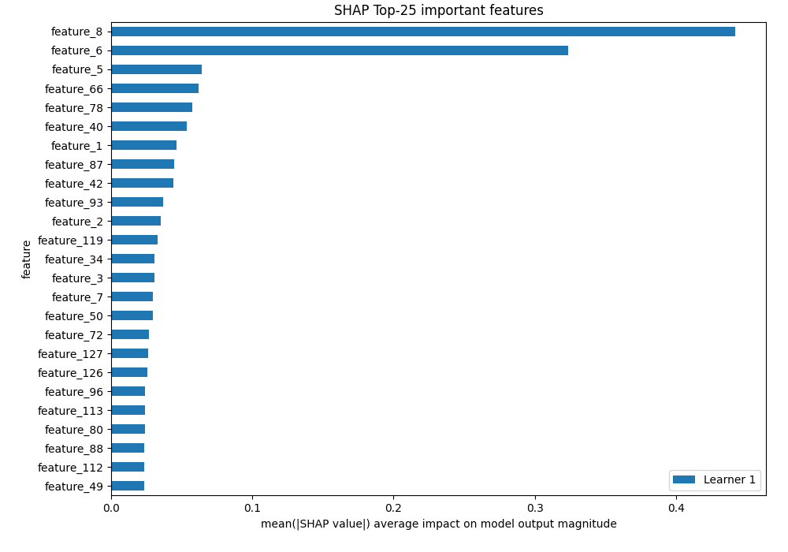

## SHAP Dependence plots

### Dependence (Fold 1)

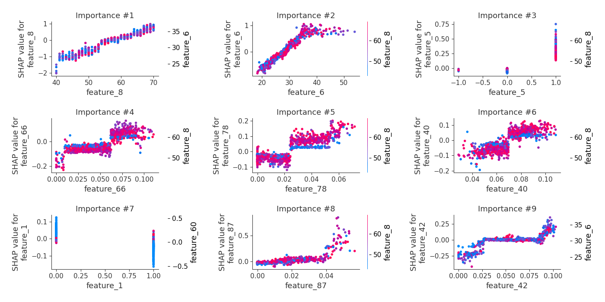

## SHAP Decision plots

[<< Go back](../README.md)
