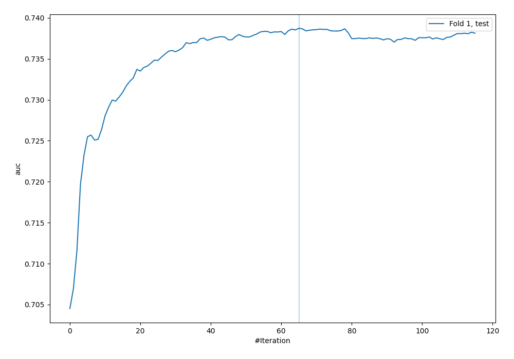
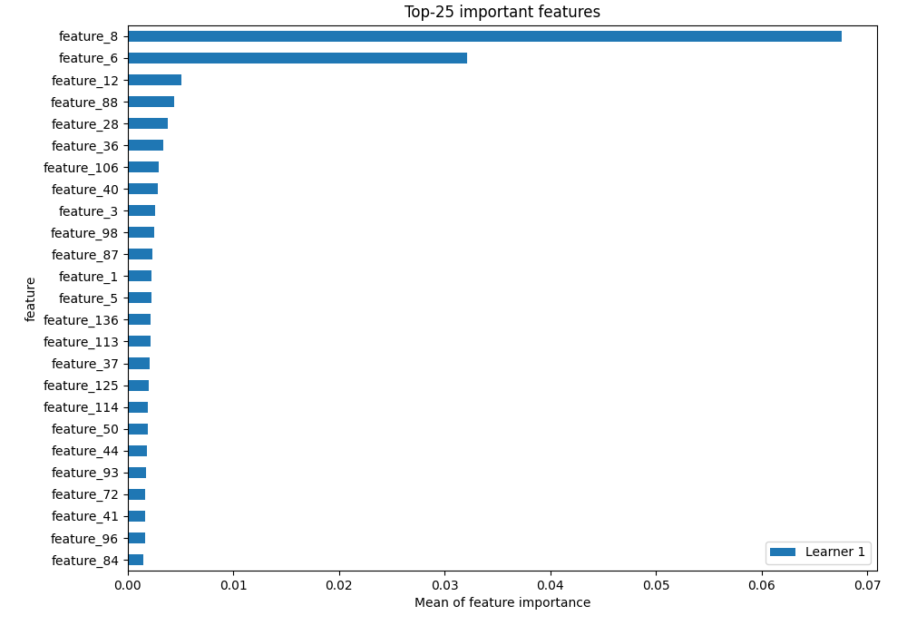
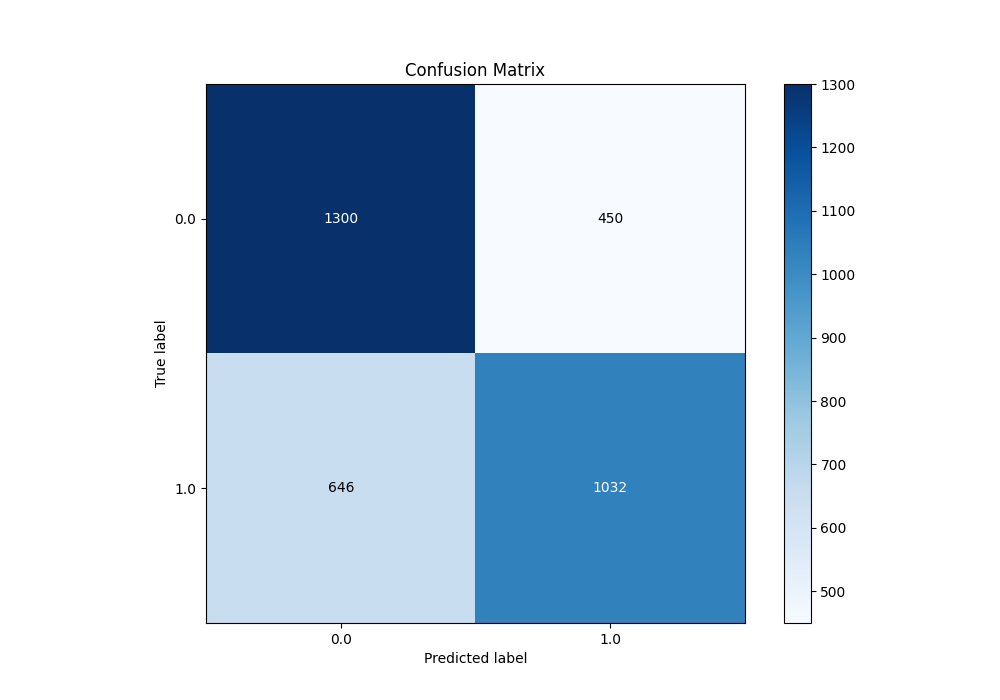
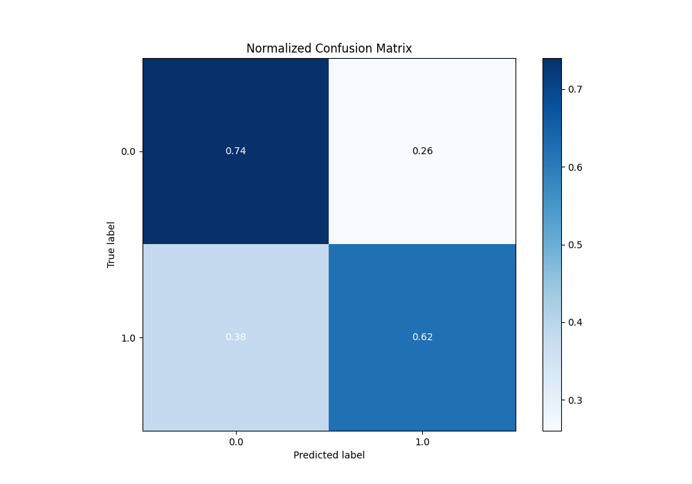
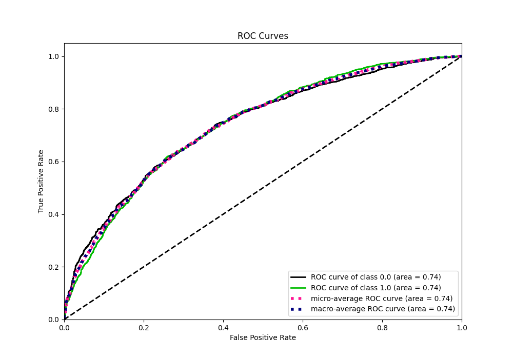
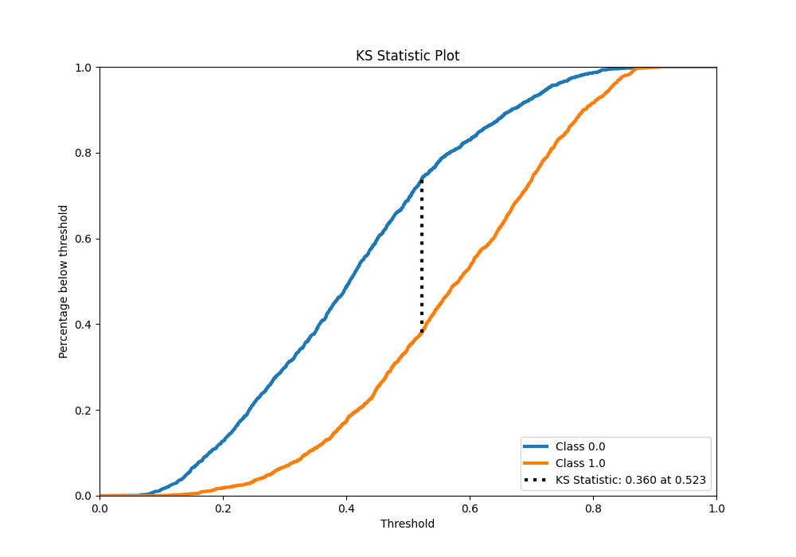
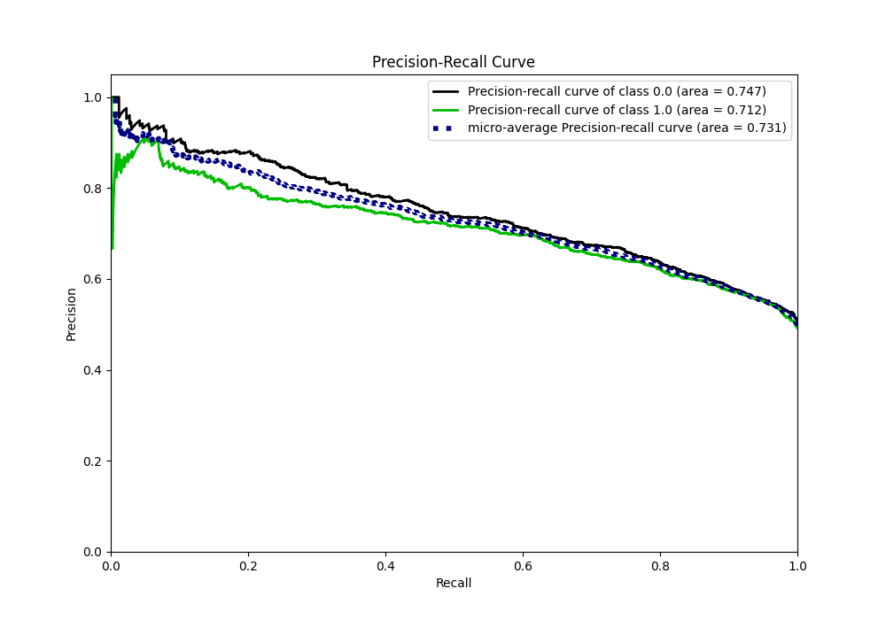
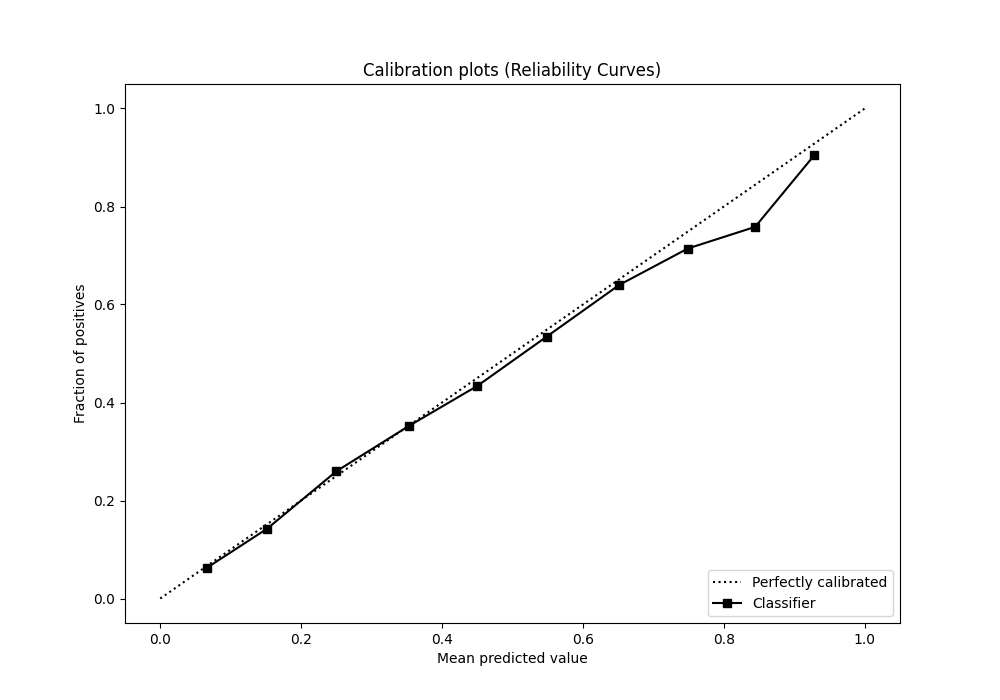
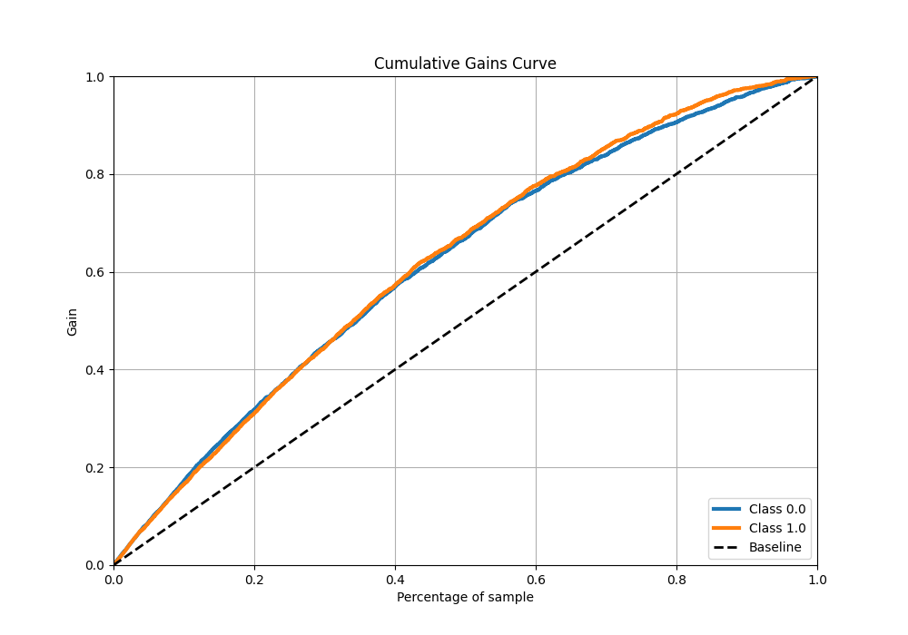
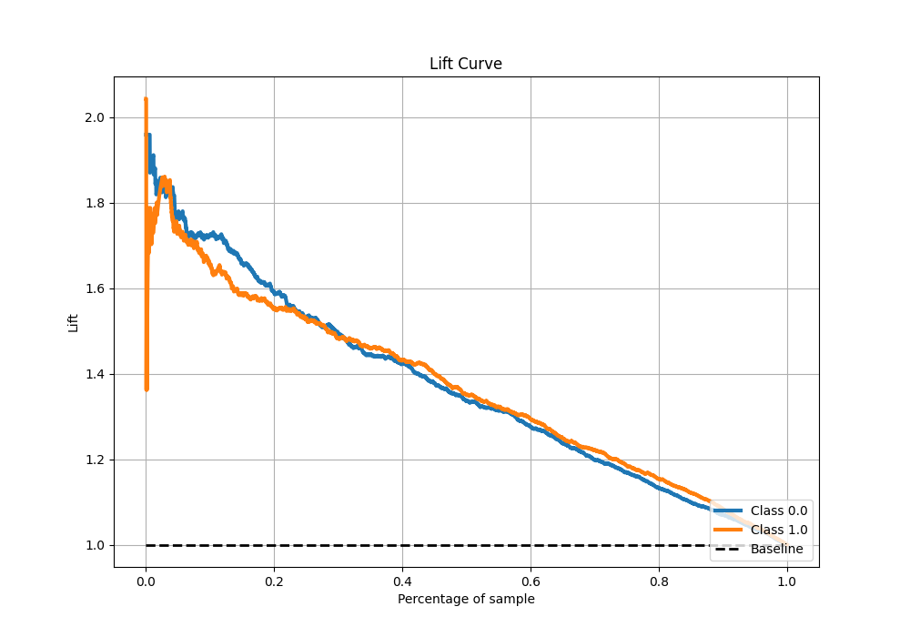

# Summary of 5_Default_CatBoost

[<< Go back](../README.md)

## CatBoost

- **n_jobs**: -1
- **learning_rate**: 0.1
- **depth**: 6
- **rsm**: 1
- **loss_function**: Logloss
- **eval_metric**: AUC
- **explain_level**: 2

## Validation

- **validation_type**: split
- **train_ratio**: 0.75
- **shuffle**: True
- **stratify**: True

## Optimized metric

auc

## Training time

3.0 seconds

## Metric details

|           |    score |   threshold |
|:----------|---------:|------------:|
| logloss   | 0.600703 | nan         |
| auc       | 0.738735 | nan         |
| f1        | 0.705256 |   0.372437  |
| accuracy  | 0.68028  |   0.524116  |
| precision | 0.898734 |   0.833308  |
| recall    | 1        |   0.0525236 |
| mcc       | 0.361119 |   0.524116  |

## Metric details with threshold from accuracy metric

|           |    score |   threshold |
|:----------|---------:|------------:|
| logloss   | 0.600703 |  nan        |
| auc       | 0.738735 |  nan        |
| f1        | 0.653165 |    0.524116 |
| accuracy  | 0.68028  |    0.524116 |
| precision | 0.696356 |    0.524116 |
| recall    | 0.615018 |    0.524116 |
| mcc       | 0.361119 |    0.524116 |

## Confusion matrix (at threshold=0.524116)

|              |   Predicted as 0 |   Predicted as 1 |
|:-------------|-----------------:|-----------------:|
| Labeled as 0 |             1300 |              450 |
| Labeled as 1 |              646 |             1032 |

## Learning curves

## Permutation-based Importance

## Confusion Matrix

## Normalized Confusion Matrix

## ROC Curve

## Kolmogorov-Smirnov Statistic

## Precision-Recall Curve

## Calibration Curve

## Cumulative Gains Curve

## Lift Curve

[<< Go back](../README.md)
