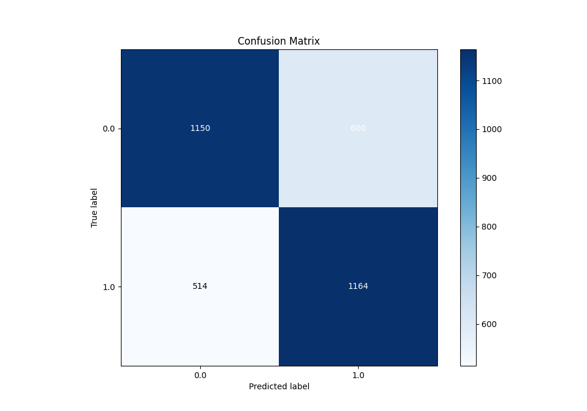
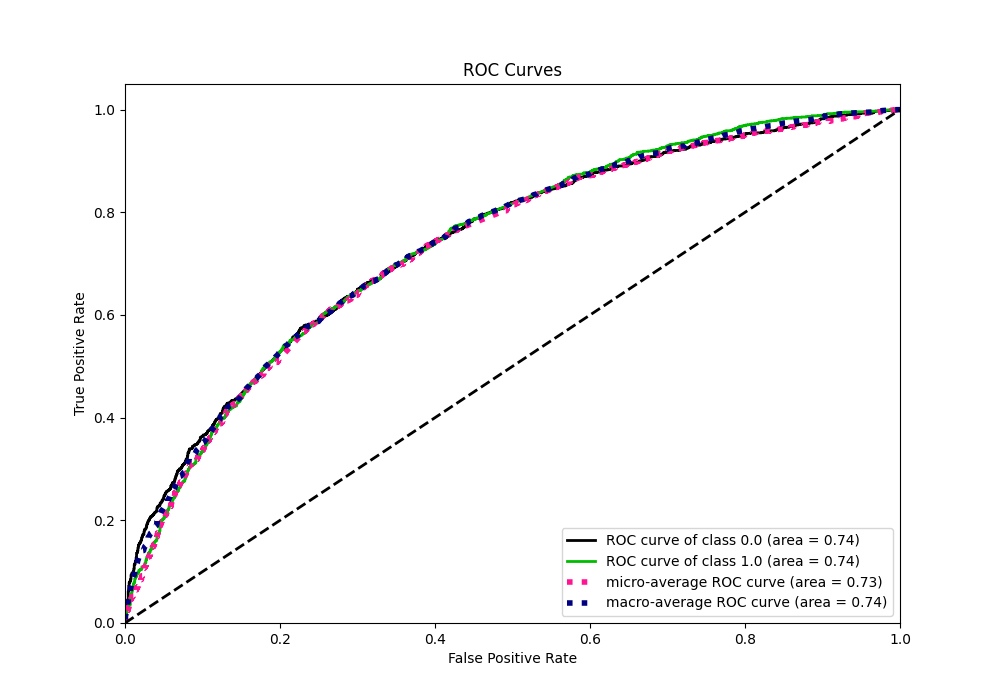

# Summary of 6_Default_NeuralNetwork

[<< Go back](../README.md)

## Neural Network

- **n_jobs**: -1
- **dense_1_size**: 32
- **dense_2_size**: 16
- **learning_rate**: 0.05
- **explain_level**: 2

## Validation

- **validation_type**: split
- **train_ratio**: 0.75
- **shuffle**: True
- **stratify**: True

## Optimized metric

auc

## Training time

3.7 seconds

## Metric details

|           |    score |   threshold |
|:----------|---------:|------------:|
| logloss   | 0.61231  | nan         |
| auc       | 0.738246 | nan         |
| f1        | 0.703954 |   0.395631  |
| accuracy  | 0.675029 |   0.510942  |
| precision | 0.849741 |   0.892842  |
| recall    | 1        |   0.0758362 |
| mcc       | 0.354338 |   0.440811  |

## Metric details with threshold from accuracy metric

|           |    score |   threshold |
|:----------|---------:|------------:|
| logloss   | 0.61231  |  nan        |
| auc       | 0.738246 |  nan        |
| f1        | 0.676351 |    0.510942 |
| accuracy  | 0.675029 |    0.510942 |
| precision | 0.659864 |    0.510942 |
| recall    | 0.693683 |    0.510942 |
| mcc       | 0.350898 |    0.510942 |

## Confusion matrix (at threshold=0.510942)

|              |   Predicted as 0 |   Predicted as 1 |
|:-------------|-----------------:|-----------------:|
| Labeled as 0 |             1150 |              600 |
| Labeled as 1 |              514 |             1164 |

## Learning curves

## Permutation-based Importance

## Confusion Matrix

## Normalized Confusion Matrix

## ROC Curve

## Kolmogorov-Smirnov Statistic

## Precision-Recall Curve

## Calibration Curve

## Cumulative Gains Curve

## Lift Curve

[<< Go back](../README.md)
