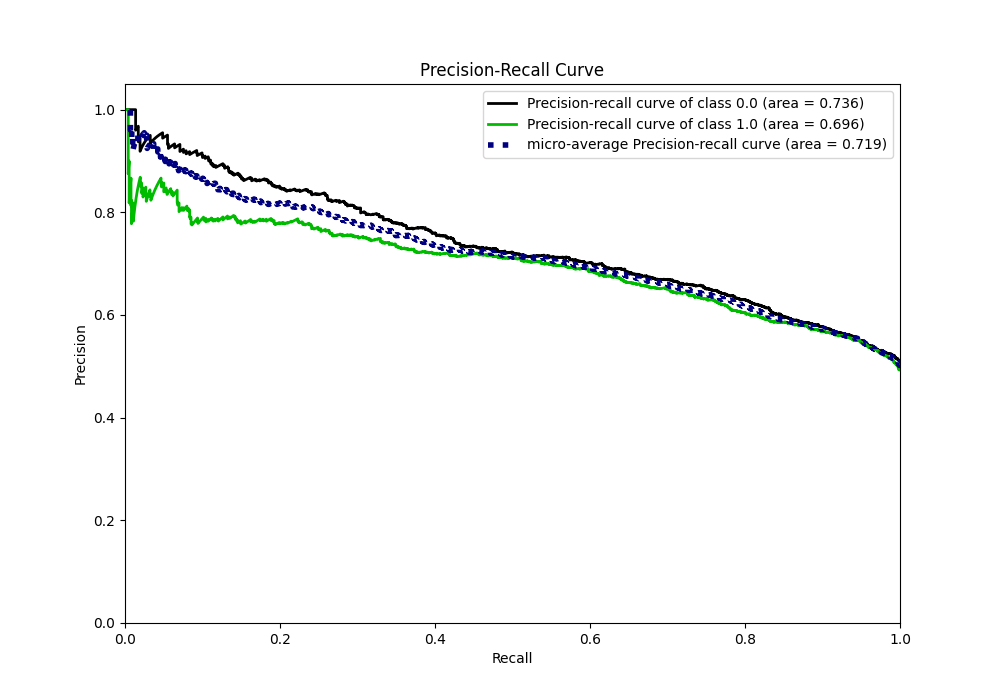

# Summary of 8_Default_ExtraTrees

[<< Go back](../README.md)

## Extra Trees Classifier (Extra Trees)

- **n_jobs**: -1
- **criterion**: gini
- **max_features**: 0.9
- **min_samples_split**: 30
- **max_depth**: 4
- **eval_metric_name**: auc
- **explain_level**: 2

## Validation

- **validation_type**: split
- **train_ratio**: 0.75
- **shuffle**: True
- **stratify**: True

## Optimized metric

auc

## Training time

9.9 seconds

## Metric details

|           |    score |   threshold |
|:----------|---------:|------------:|
| logloss   | 0.615822 |  nan        |
| auc       | 0.726322 |  nan        |
| f1        | 0.698202 |    0.380001 |
| accuracy  | 0.670362 |    0.49277  |
| precision | 0.84     |    0.74073  |
| recall    | 1        |    0.13811  |
| mcc       | 0.340157 |    0.49277  |

## Metric details with threshold from accuracy metric

|           |    score |   threshold |
|:----------|---------:|------------:|
| logloss   | 0.615822 |   nan       |
| auc       | 0.726322 |   nan       |
| f1        | 0.655067 |     0.49277 |
| accuracy  | 0.670362 |     0.49277 |
| precision | 0.671464 |     0.49277 |
| recall    | 0.639452 |     0.49277 |
| mcc       | 0.340157 |     0.49277 |

## Confusion matrix (at threshold=0.49277)

|              |   Predicted as 0 |   Predicted as 1 |
|:-------------|-----------------:|-----------------:|
| Labeled as 0 |             1225 |              525 |
| Labeled as 1 |              605 |             1073 |

## Learning curves

## Permutation-based Importance

## Confusion Matrix

## Normalized Confusion Matrix

## ROC Curve

## Kolmogorov-Smirnov Statistic

## Precision-Recall Curve

## Calibration Curve

## Cumulative Gains Curve

## Lift Curve

## SHAP Importance

## SHAP Dependence plots

### Dependence (Fold 1)

## SHAP Decision plots

[<< Go back](../README.md)
