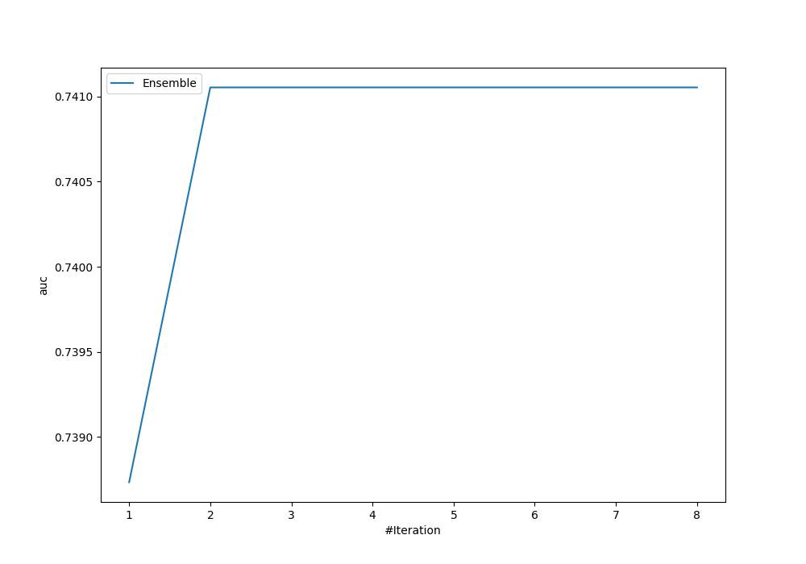
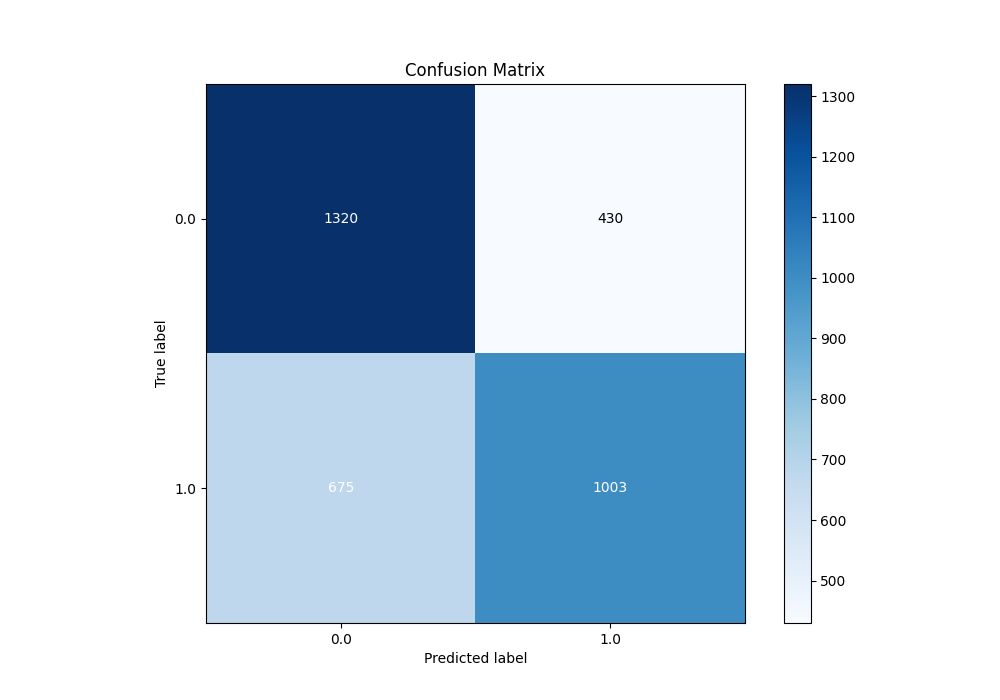
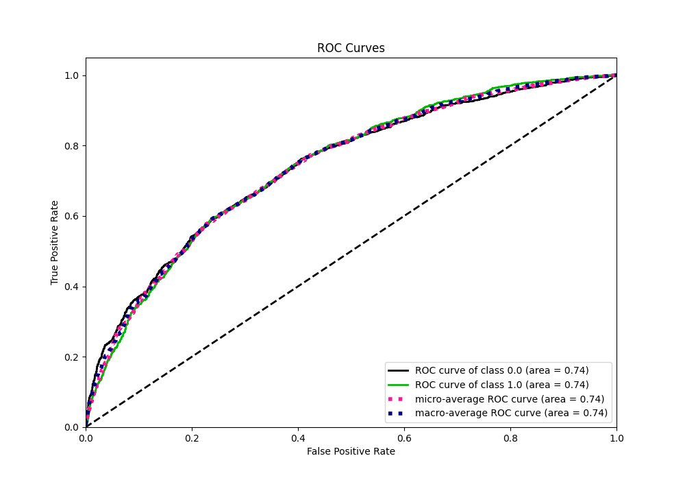
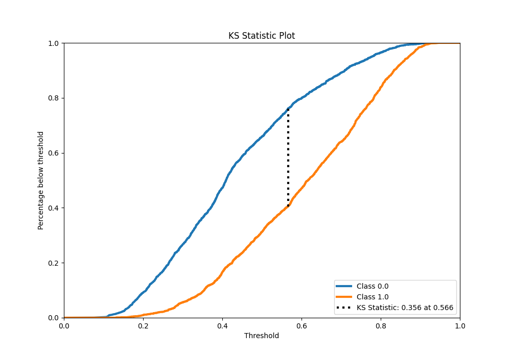
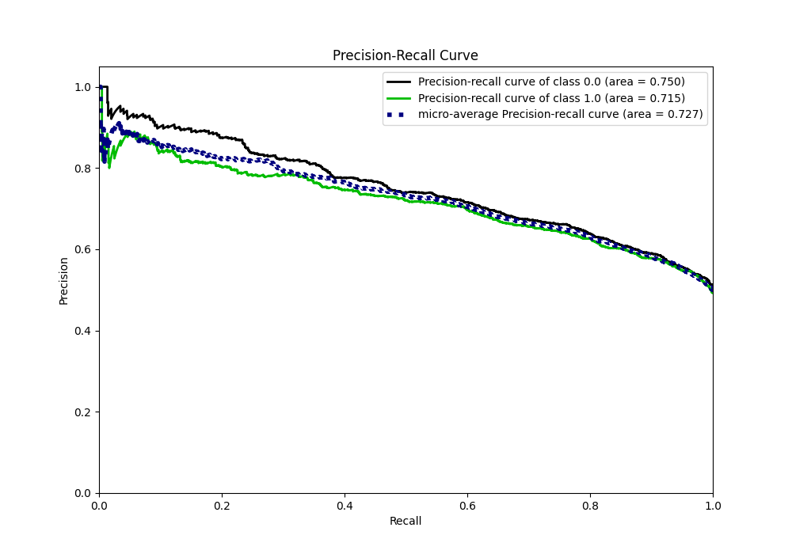
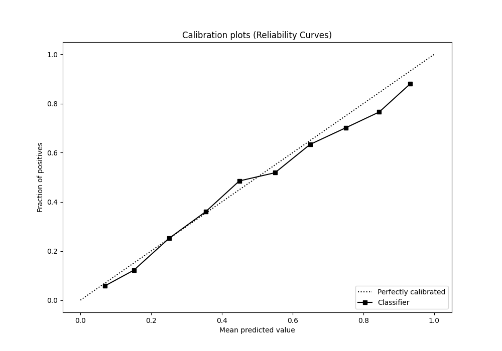
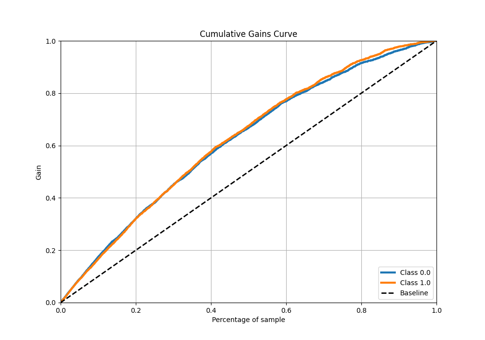
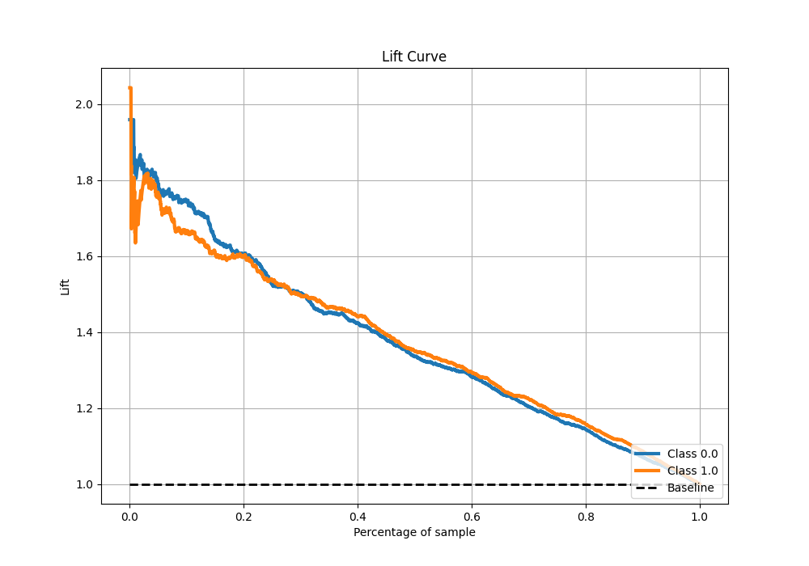

# Summary of Ensemble

[<< Go back](../README.md)

## Ensemble structure

| Model                   |   Weight |
|:------------------------|---------:|
| 5_Default_CatBoost      |        1 |
| 6_Default_NeuralNetwork |        1 |

## Metric details

|           |    score |   threshold |
|:----------|---------:|------------:|
| logloss   | 0.601162 | nan         |
| auc       | 0.741053 | nan         |
| f1        | 0.705693 |   0.344842  |
| accuracy  | 0.677655 |   0.563138  |
| precision | 0.881818 |   0.863075  |
| recall    | 1        |   0.0684266 |
| mcc       | 0.356771 |   0.563138  |

## Metric details with threshold from accuracy metric

|           |    score |   threshold |
|:----------|---------:|------------:|
| logloss   | 0.601162 |  nan        |
| auc       | 0.741053 |  nan        |
| f1        | 0.644809 |    0.563138 |
| accuracy  | 0.677655 |    0.563138 |
| precision | 0.69993  |    0.563138 |
| recall    | 0.597735 |    0.563138 |
| mcc       | 0.356771 |    0.563138 |

## Confusion matrix (at threshold=0.563138)

|              |   Predicted as 0 |   Predicted as 1 |
|:-------------|-----------------:|-----------------:|
| Labeled as 0 |             1320 |              430 |
| Labeled as 1 |              675 |             1003 |

## Learning curves

## Confusion Matrix

## Normalized Confusion Matrix

## ROC Curve

## Kolmogorov-Smirnov Statistic

## Precision-Recall Curve

## Calibration Curve

## Cumulative Gains Curve

## Lift Curve

[<< Go back](../README.md)
