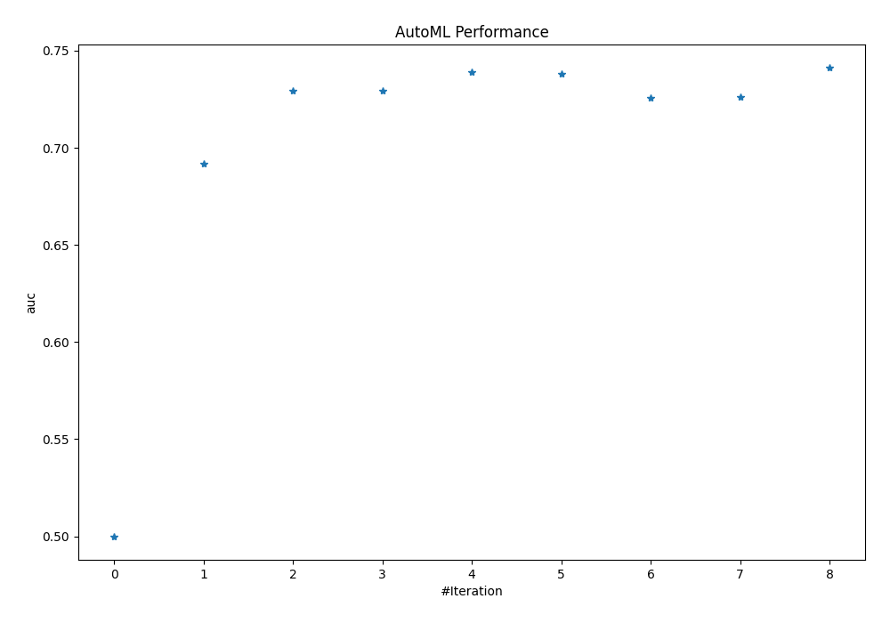
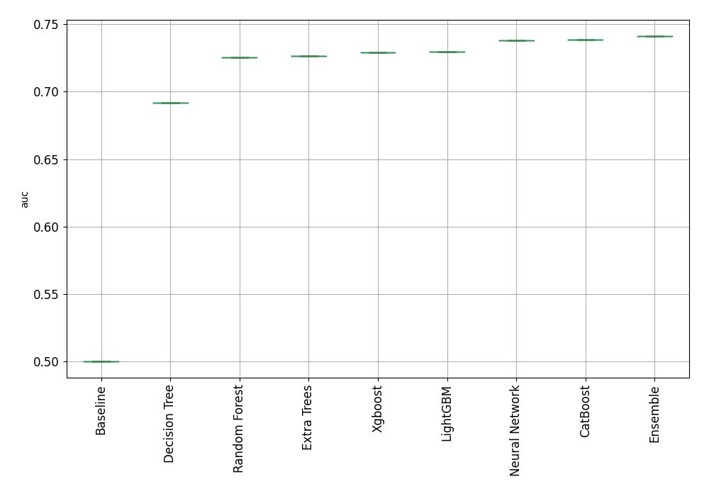
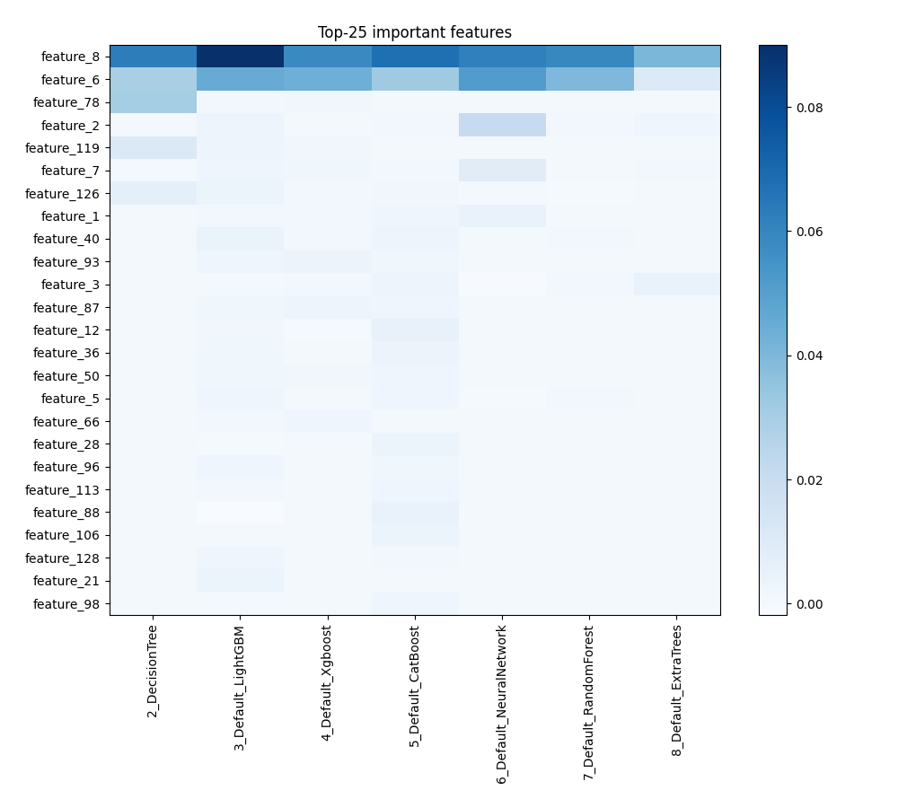
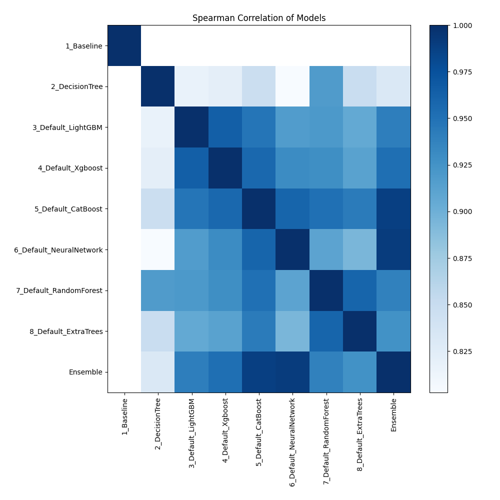

# AutoML Leaderboard

| Best model   | name                                                         | model_type     | metric_type   |   metric_value |   train_time |
|:-------------|:-------------------------------------------------------------|:---------------|:--------------|---------------:|-------------:|
|              | [1_Baseline](1_Baseline/README.md)                           | Baseline       | auc           |       0.5      |         0.95 |
|              | [2_DecisionTree](2_DecisionTree/README.md)                   | Decision Tree  | auc           |       0.691806 |         7.97 |
|              | [3_Default_LightGBM](3_Default_LightGBM/README.md)           | LightGBM       | auc           |       0.72954  |         6.21 |
|              | [4_Default_Xgboost](4_Default_Xgboost/README.md)             | Xgboost        | auc           |       0.729286 |        30.41 |
|              | [5_Default_CatBoost](5_Default_CatBoost/README.md)           | CatBoost       | auc           |       0.738735 |         3.82 |
|              | [6_Default_NeuralNetwork](6_Default_NeuralNetwork/README.md) | Neural Network | auc           |       0.738246 |         4.55 |
|              | [7_Default_RandomForest](7_Default_RandomForest/README.md)   | Random Forest  | auc           |       0.725593 |        14.92 |
|              | [8_Default_ExtraTrees](8_Default_ExtraTrees/README.md)       | Extra Trees    | auc           |       0.726322 |        10.85 |
| **the
best** | [Ensemble](Ensemble/README.md)                               | Ensemble       | auc           |       0.741053 |         0.83 |

### AutoML Performance

### AutoML Performance Boxplot

### Features Importance

### Spearman Correlation of Models

