# Summary of 3_Default_LightGBM

[<< Go back](../README.md)

## LightGBM

- **n_jobs**: -1
- **objective**: binary
- **num_leaves**: 63
- **learning_rate**: 0.05
- **feature_fraction**: 0.9
- **bagging_fraction**: 0.9
- **min_data_in_leaf**: 10
- **metric**: auc
- **custom_eval_metric_name**: None
- **explain_level**: 2

## Validation

- **validation_type**: split
- **train_ratio**: 0.75
- **shuffle**: True
- **stratify**: True

## Optimized metric

auc

## Training time

3.0 seconds

## Metric details

|           |    score |   threshold |
|:----------|---------:|------------:|
| logloss   | 0.56427  |  nan        |
| auc       | 0.793399 |  nan        |
| f1        | 0.734248 |    0.360764 |
| accuracy  | 0.72112  |    0.493773 |
| precision | 0.916667 |    0.798934 |
| recall    | 1        |    0.162908 |
| mcc       | 0.443142 |    0.493773 |

## Metric details with threshold from accuracy metric

|           |    score |   threshold |
|:----------|---------:|------------:|
| logloss   | 0.56427  |  nan        |
| auc       | 0.793399 |  nan        |
| f1        | 0.699371 |    0.493773 |
| accuracy  | 0.72112  |    0.493773 |
| precision | 0.740346 |    0.493773 |
| recall    | 0.662694 |    0.493773 |
| mcc       | 0.443142 |    0.493773 |

## Confusion matrix (at threshold=0.493773)

|              |   Predicted as 0 |   Predicted as 1 |
|:-------------|-----------------:|-----------------:|
| Labeled as 0 |             1360 |              390 |
| Labeled as 1 |              566 |             1112 |

## Learning curves

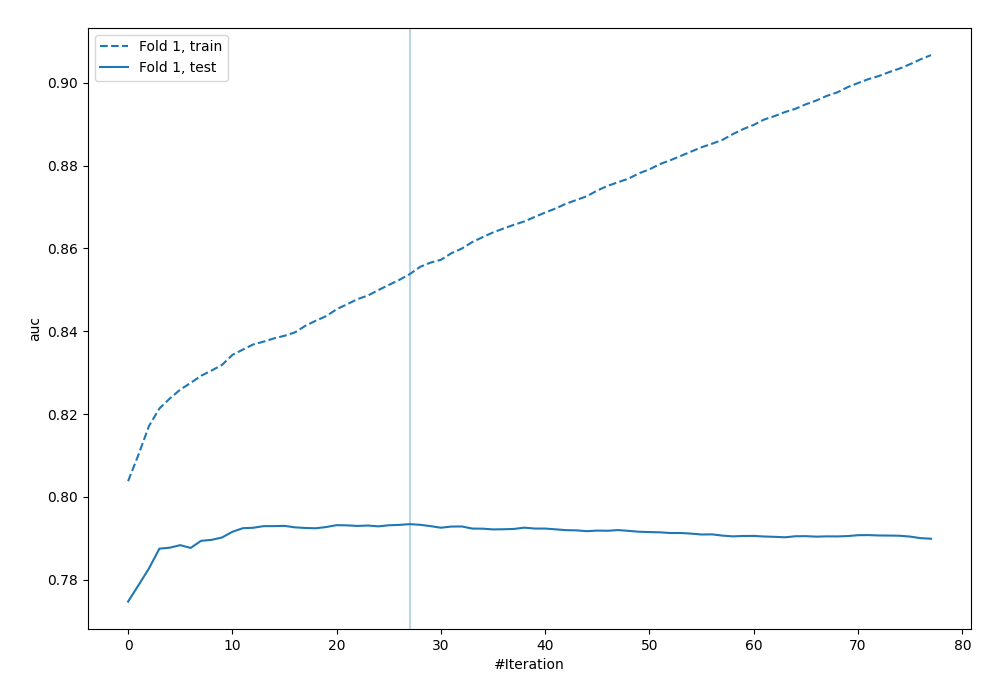

## Permutation-based Importance

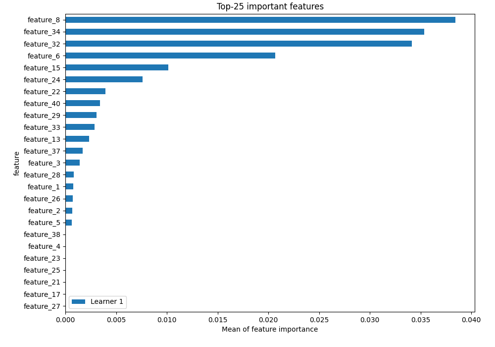

## Confusion Matrix

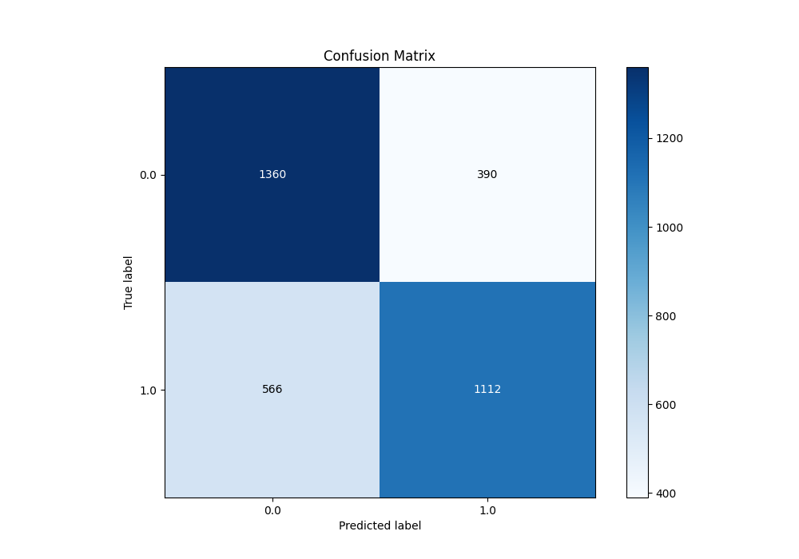

## Normalized Confusion Matrix

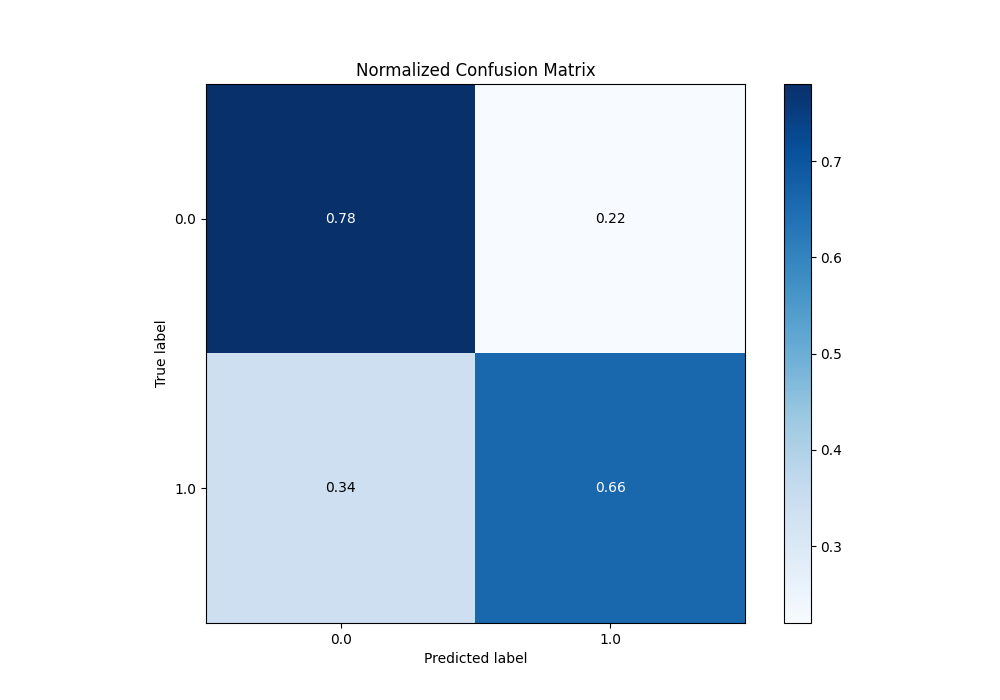

## ROC Curve

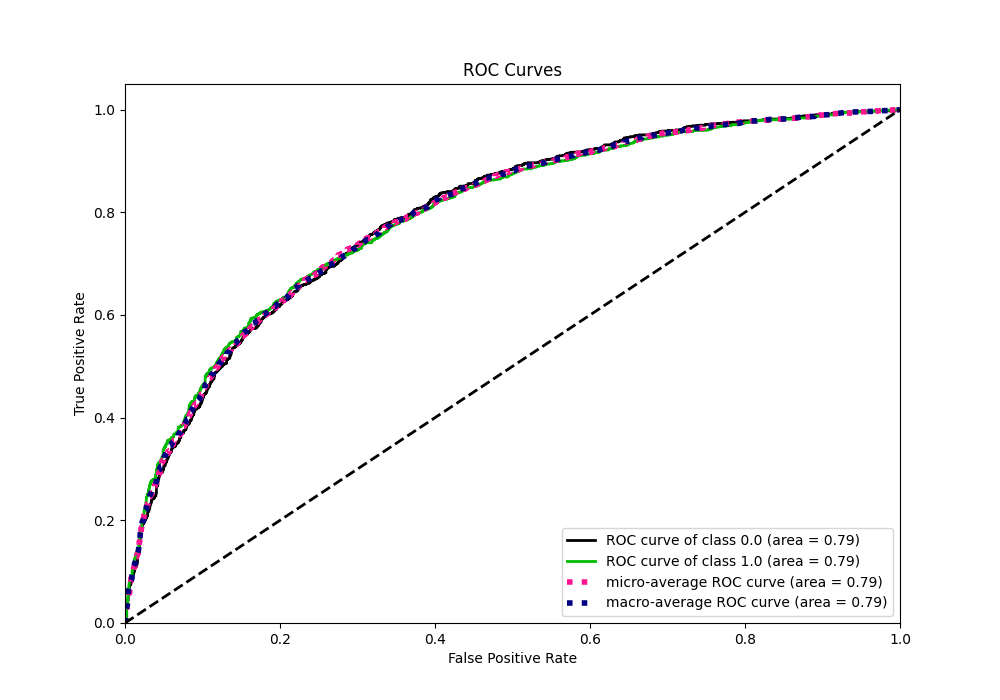

## Kolmogorov-Smirnov Statistic

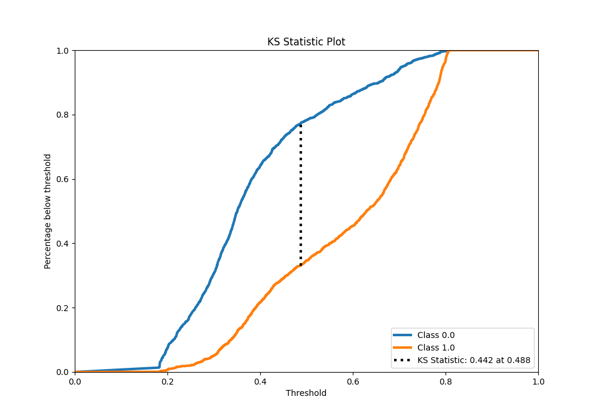

## Precision-Recall Curve

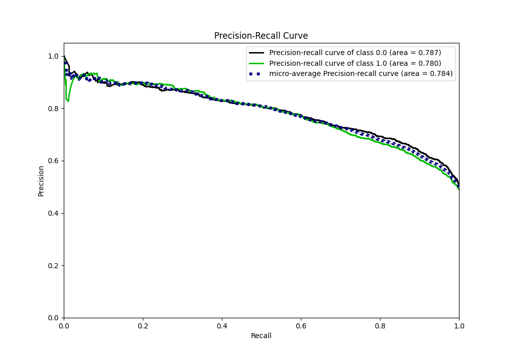

## Calibration Curve

## Cumulative Gains Curve

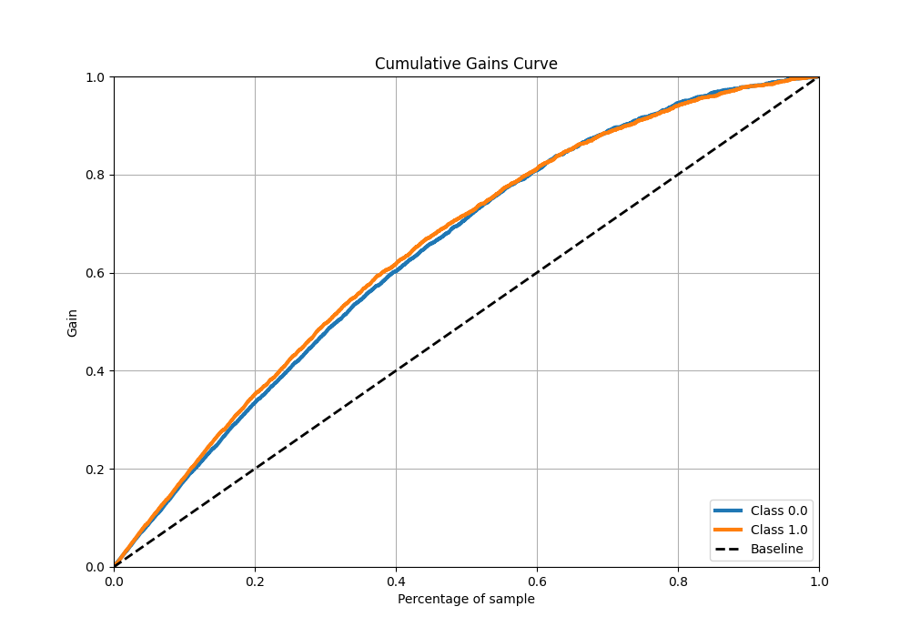

## Lift Curve

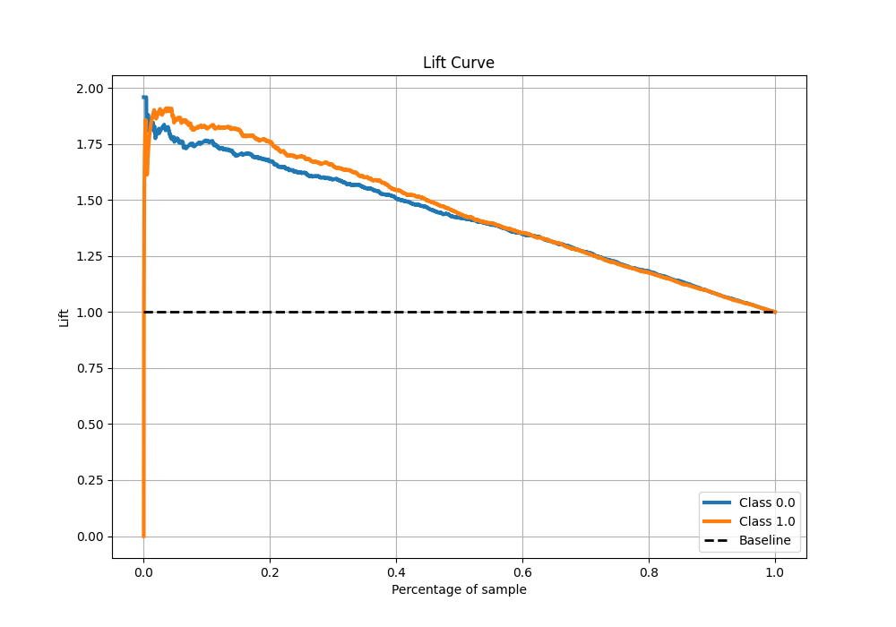

## SHAP Importance

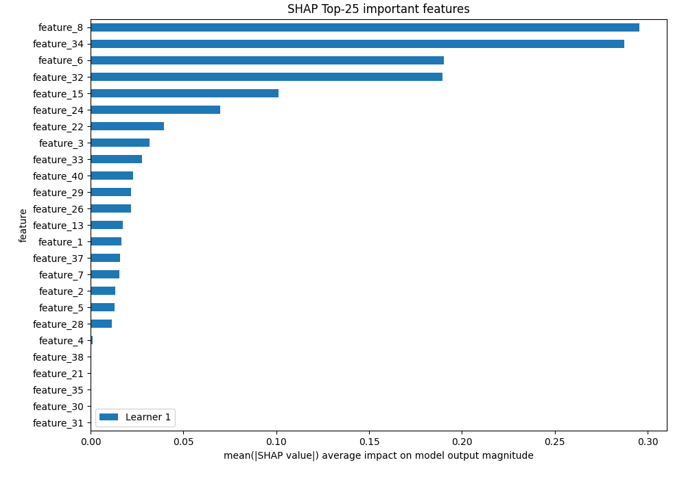

## SHAP Dependence plots

### Dependence (Fold 1)

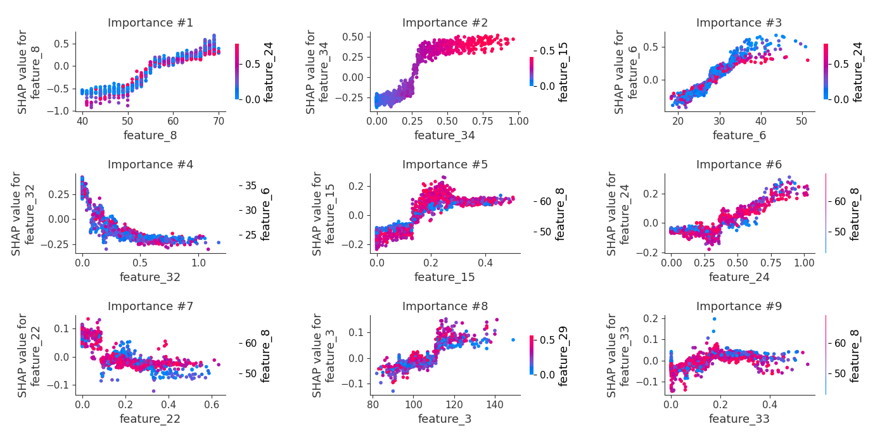

## SHAP Decision plots

[<< Go back](../README.md)
