# Summary of 4_Default_Xgboost

[<< Go back](../README.md)

## Extreme Gradient Boosting (Xgboost)

- **n_jobs**: -1
- **objective**: binary:logistic
- **eta**: 0.075
- **max_depth**: 6
- **min_child_weight**: 1
- **subsample**: 1.0
- **colsample_bytree**: 1.0
- **eval_metric**: auc
- **explain_level**: 2

## Validation

- **validation_type**: split
- **train_ratio**: 0.75
- **shuffle**: True
- **stratify**: True

## Optimized metric

auc

## Training time

9.9 seconds

## Metric details

|           |    score |   threshold |
|:----------|---------:|------------:|
| logloss   | 0.551109 | nan         |
| auc       | 0.79327  | nan         |
| f1        | 0.734109 |   0.36918   |
| accuracy  | 0.721412 |   0.419541  |
| precision | 0.916256 |   0.877082  |
| recall    | 1        |   0.0539589 |
| mcc       | 0.444362 |   0.415532  |

## Metric details with threshold from accuracy metric

|           |    score |   threshold |
|:----------|---------:|------------:|
| logloss   | 0.551109 |  nan        |
| auc       | 0.79327  |  nan        |
| f1        | 0.723749 |    0.419541 |
| accuracy  | 0.721412 |    0.419541 |
| precision | 0.703204 |    0.419541 |
| recall    | 0.74553  |    0.419541 |
| mcc       | 0.444038 |    0.419541 |

## Confusion matrix (at threshold=0.419541)

|              |   Predicted as 0 |   Predicted as 1 |
|:-------------|-----------------:|-----------------:|
| Labeled as 0 |             1222 |              528 |
| Labeled as 1 |              427 |             1251 |

## Learning curves

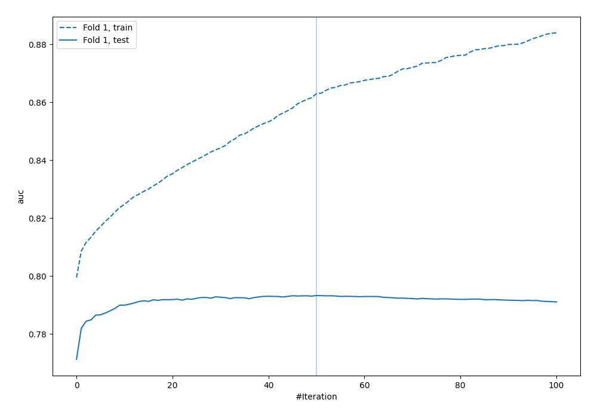

## Permutation-based Importance

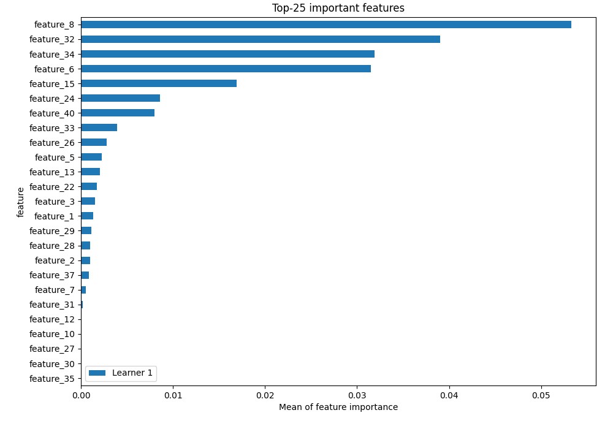

## Confusion Matrix

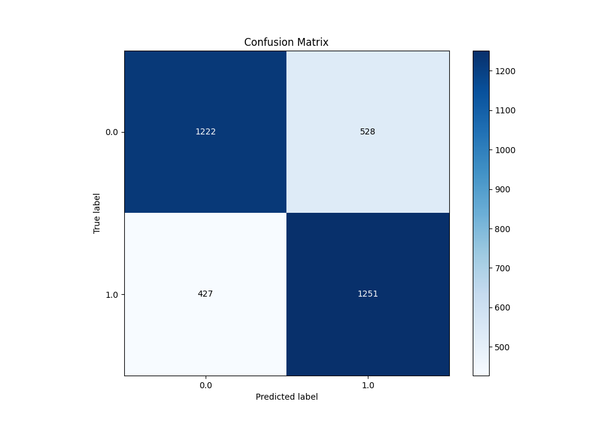

## Normalized Confusion Matrix

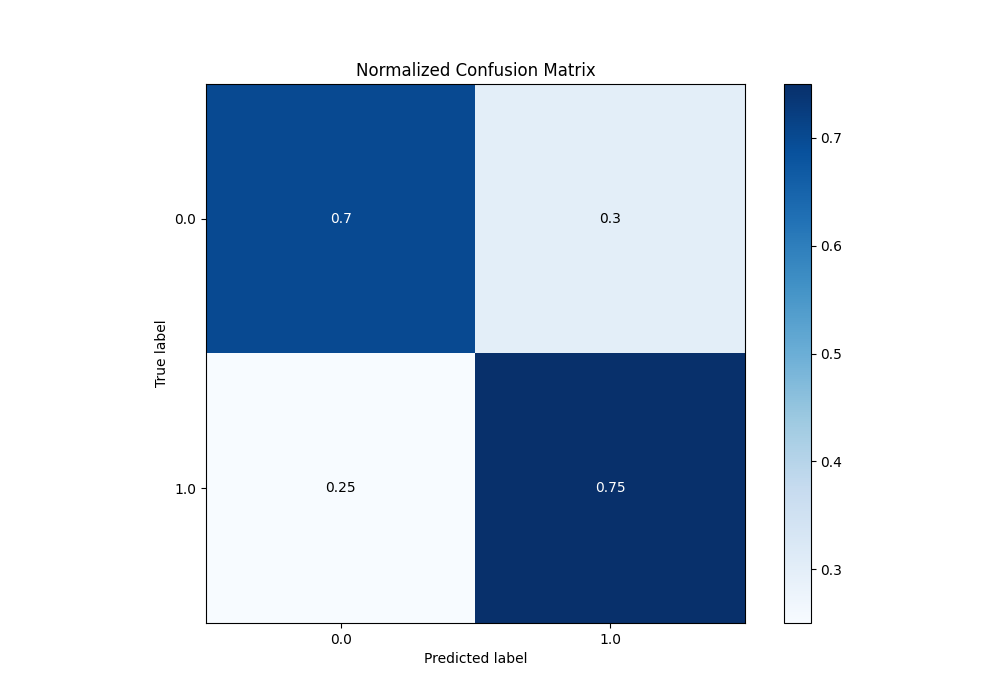

## ROC Curve

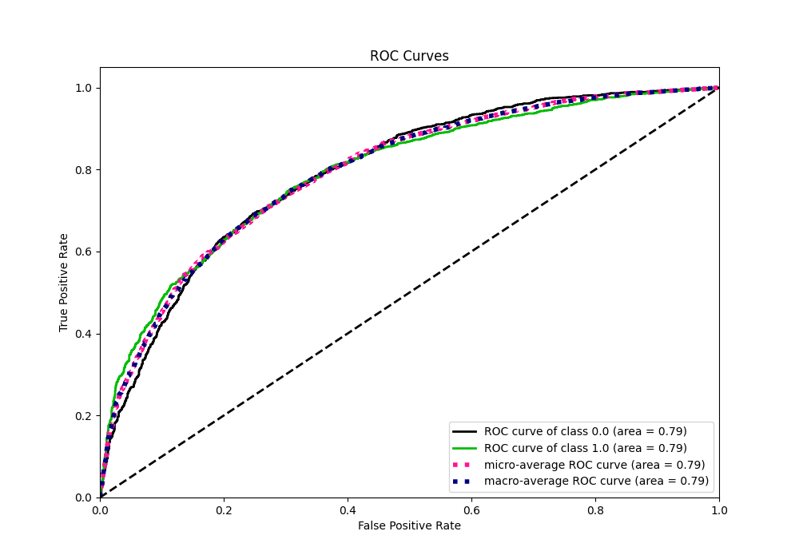

## Kolmogorov-Smirnov Statistic

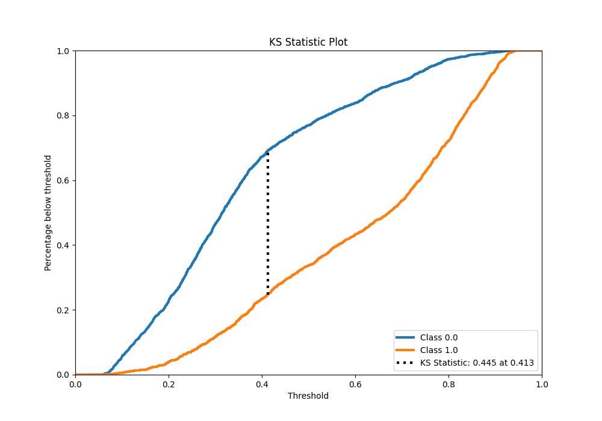

## Precision-Recall Curve

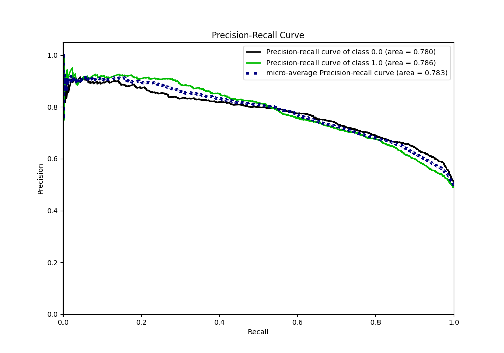

## Calibration Curve

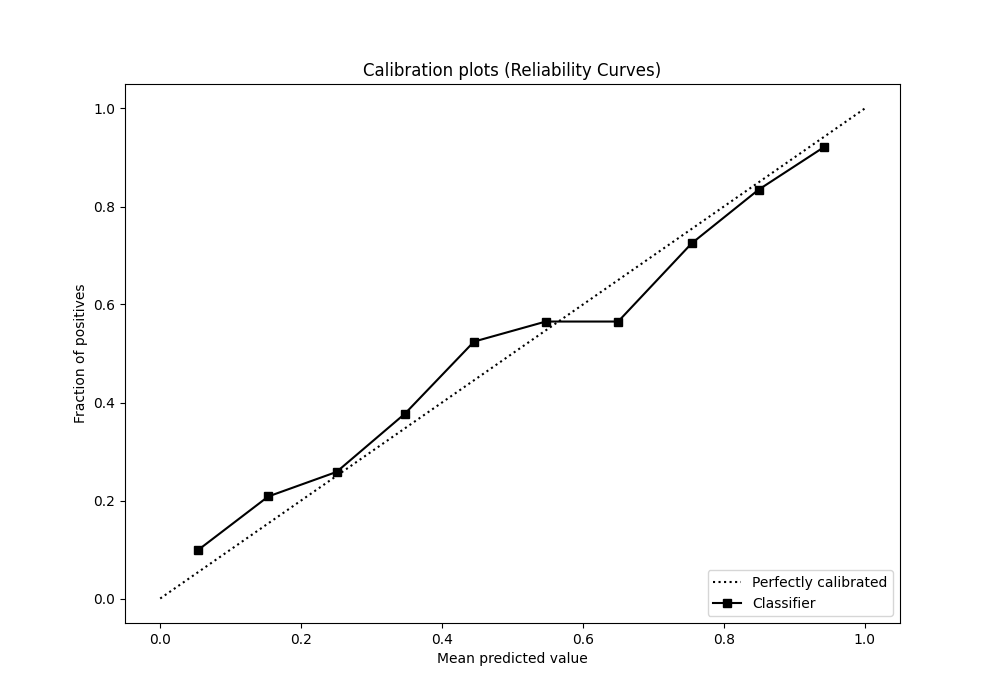

## Cumulative Gains Curve

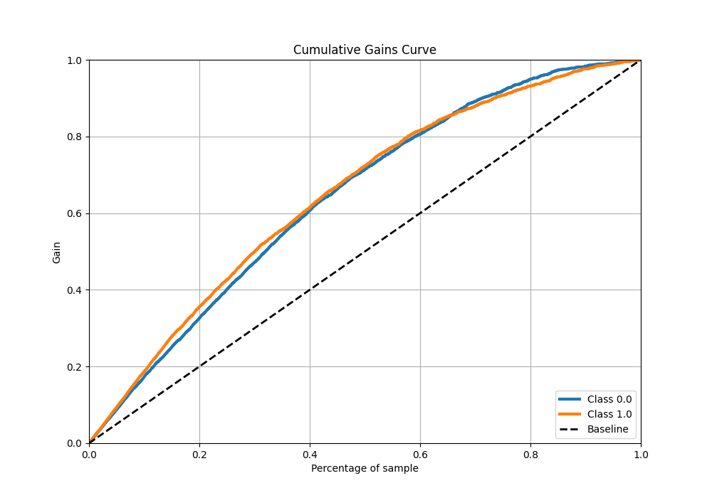

## Lift Curve

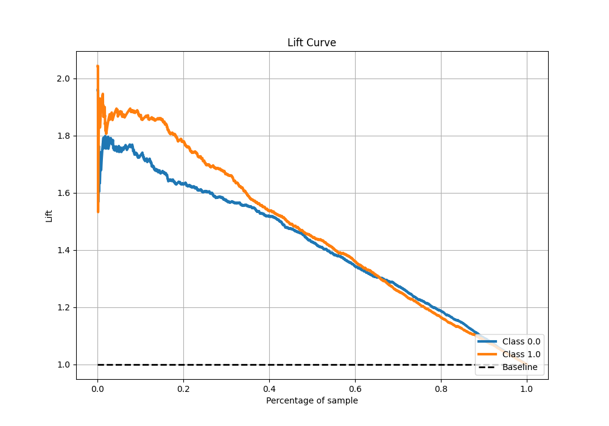

## SHAP Importance

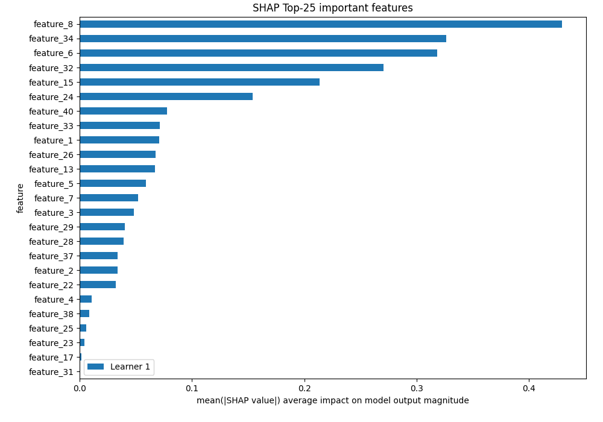

## SHAP Dependence plots

### Dependence (Fold 1)

## SHAP Decision plots

[<< Go back](../README.md)
