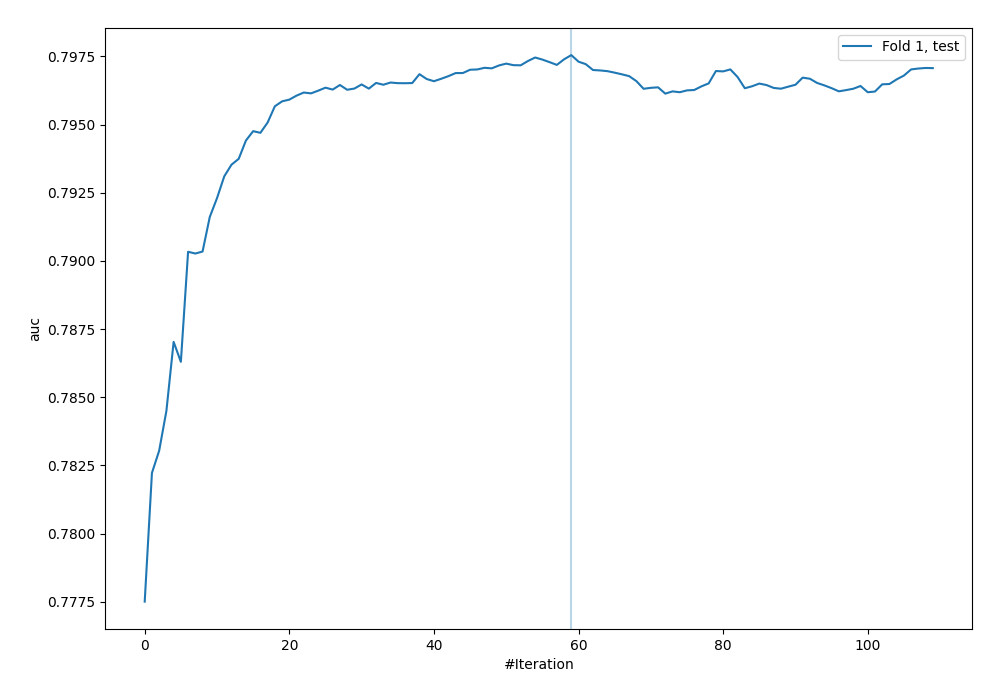
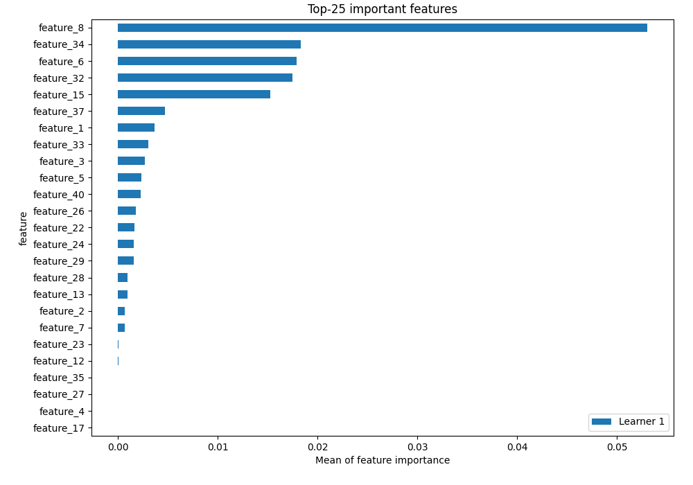
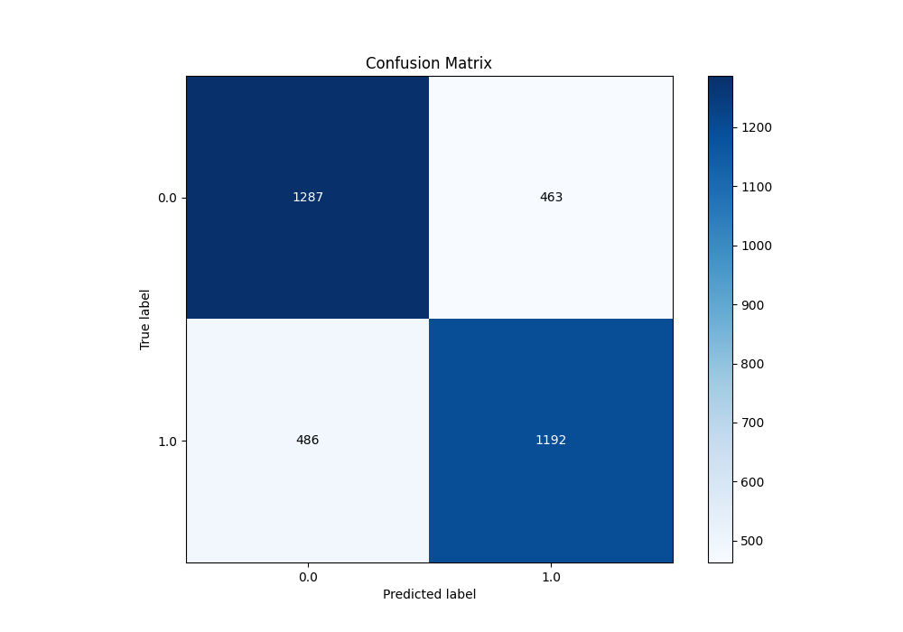
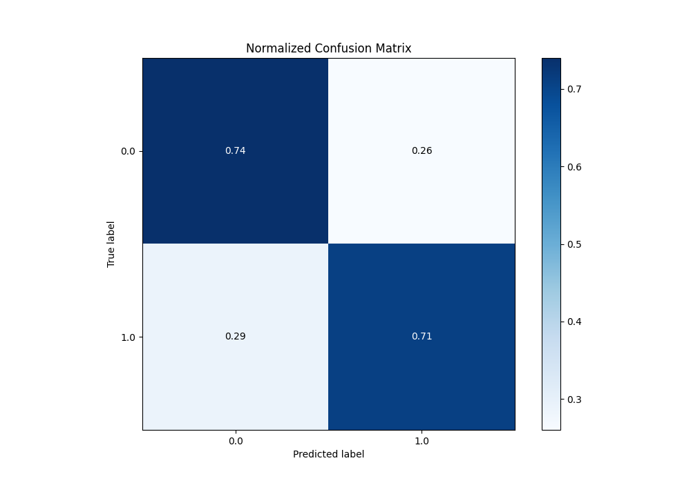
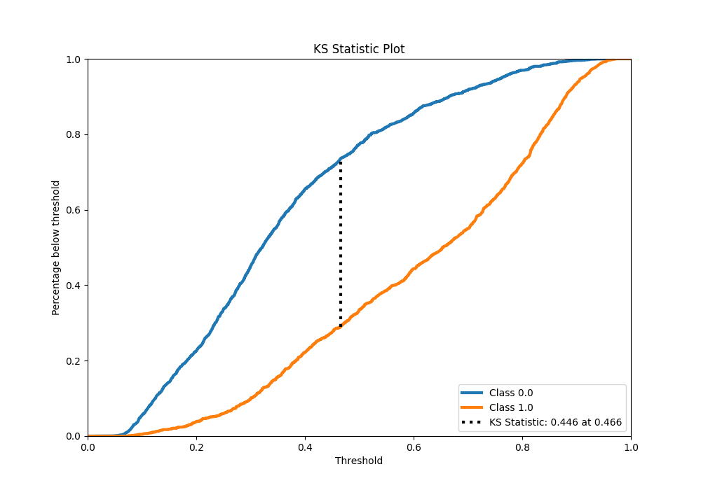
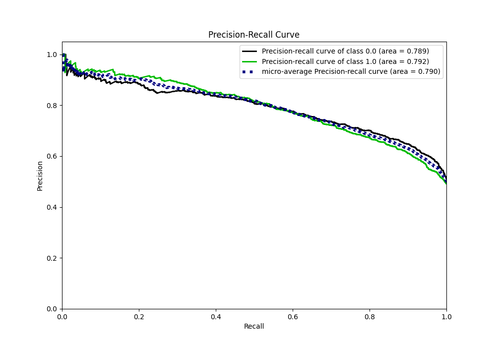
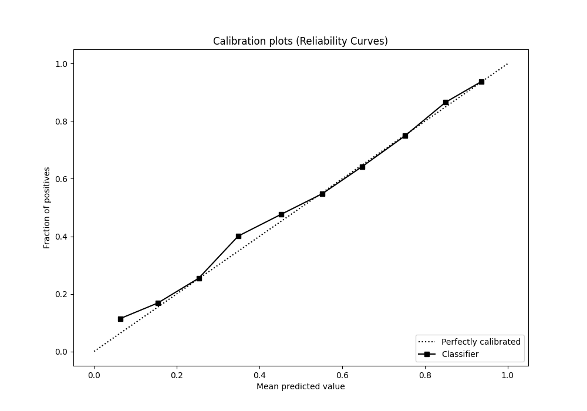
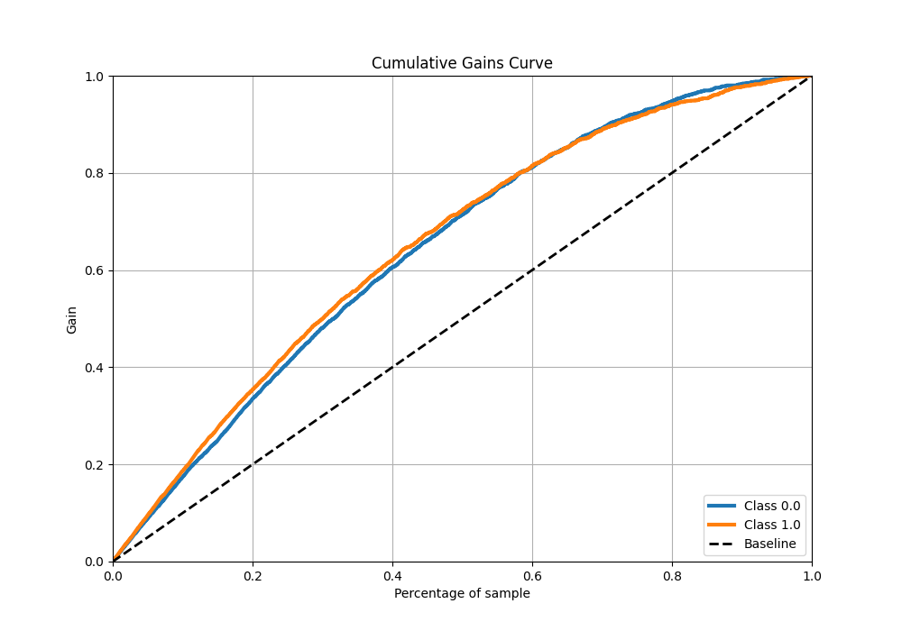
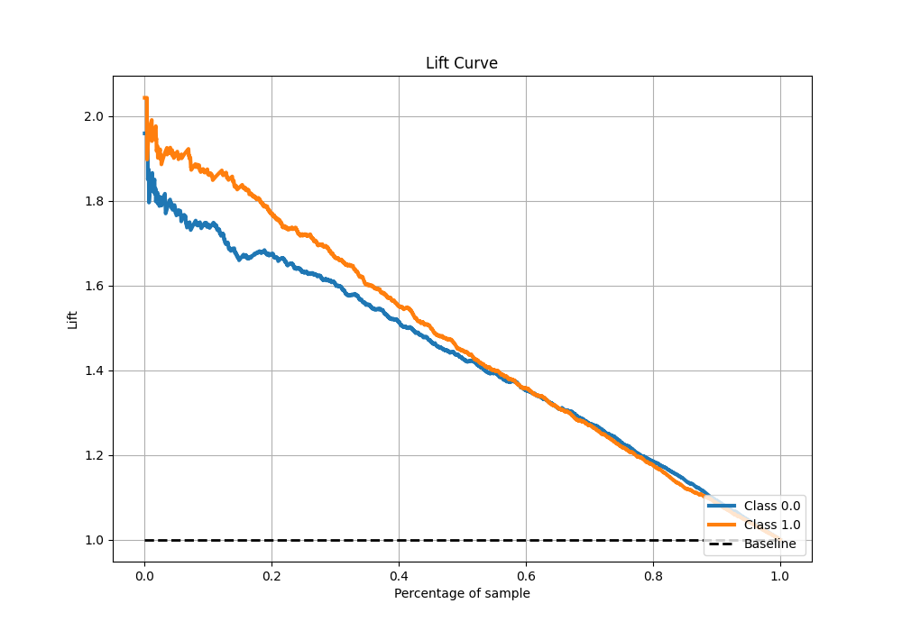

# Summary of 5_Default_CatBoost

[<< Go back](../README.md)

## CatBoost

- **n_jobs**: -1
- **learning_rate**: 0.1
- **depth**: 6
- **rsm**: 1
- **loss_function**: Logloss
- **eval_metric**: AUC
- **explain_level**: 2

## Validation

- **validation_type**: split
- **train_ratio**: 0.75
- **shuffle**: True
- **stratify**: True

## Optimized metric

auc

## Training time

1.3 seconds

## Metric details

|           |    score |   threshold |
|:----------|---------:|------------:|
| logloss   | 0.546035 | nan         |
| auc       | 0.797545 | nan         |
| f1        | 0.734375 |   0.353485  |
| accuracy  | 0.723162 |   0.465768  |
| precision | 0.93985  |   0.89438   |
| recall    | 1        |   0.0419721 |
| mcc       | 0.445964 |   0.465768  |

## Metric details with threshold from accuracy metric

|           |    score |   threshold |
|:----------|---------:|------------:|
| logloss   | 0.546035 |  nan        |
| auc       | 0.797545 |  nan        |
| f1        | 0.715272 |    0.465768 |
| accuracy  | 0.723162 |    0.465768 |
| precision | 0.720242 |    0.465768 |
| recall    | 0.710369 |    0.465768 |
| mcc       | 0.445964 |    0.465768 |

## Confusion matrix (at threshold=0.465768)

|              |   Predicted as 0 |   Predicted as 1 |
|:-------------|-----------------:|-----------------:|
| Labeled as 0 |             1287 |              463 |
| Labeled as 1 |              486 |             1192 |

## Learning curves

## Permutation-based Importance

## Confusion Matrix

## Normalized Confusion Matrix

## ROC Curve

## Kolmogorov-Smirnov Statistic

## Precision-Recall Curve

## Calibration Curve

## Cumulative Gains Curve

## Lift Curve

[<< Go back](../README.md)
