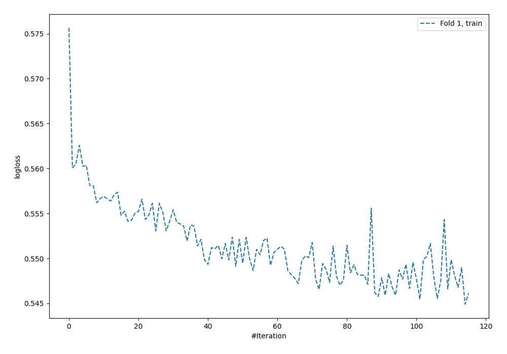
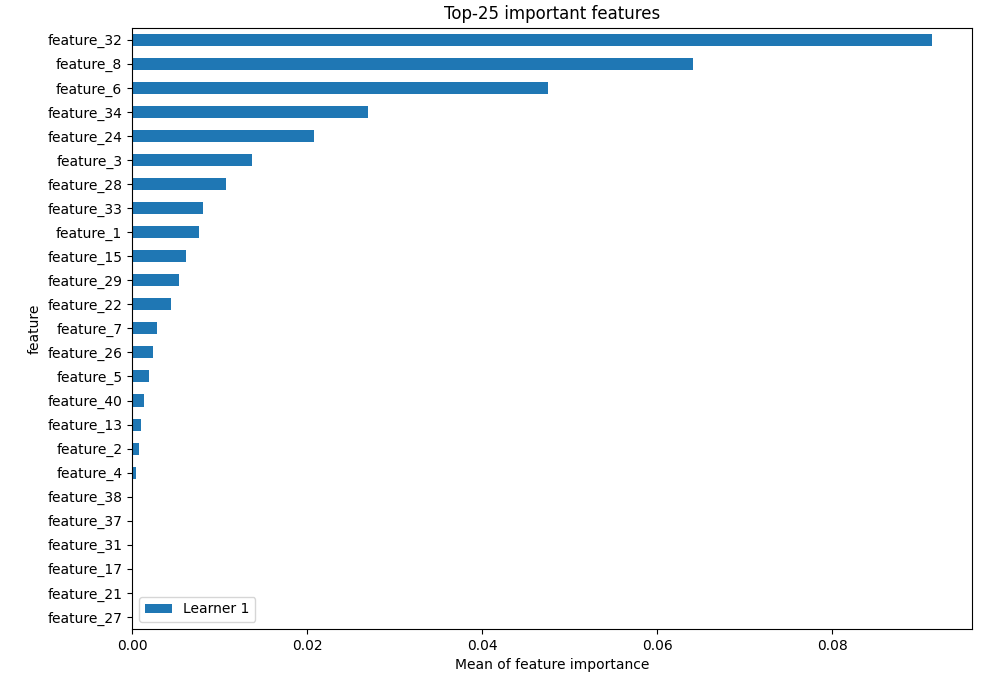
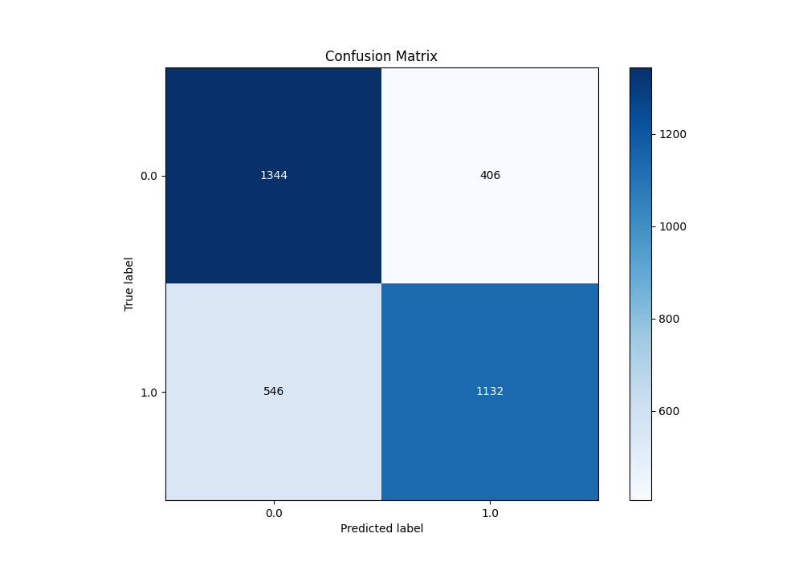
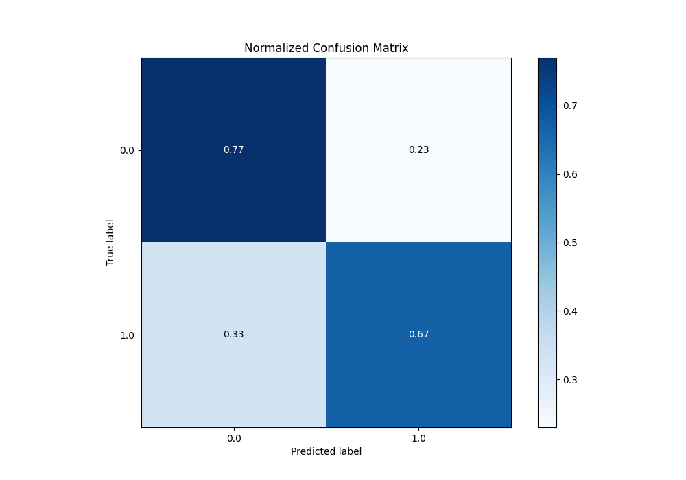
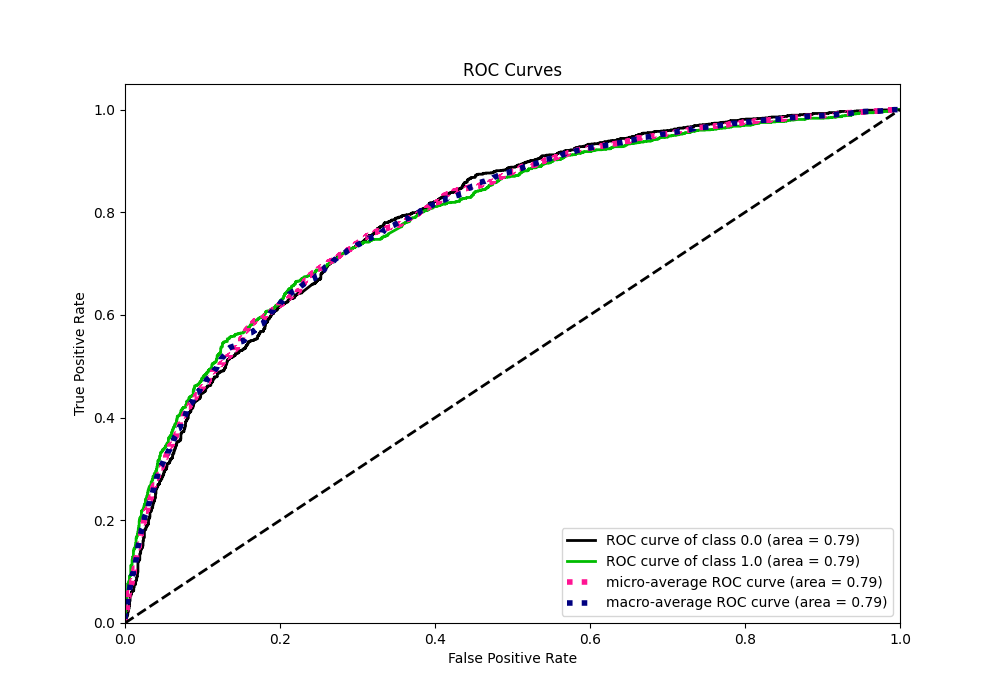
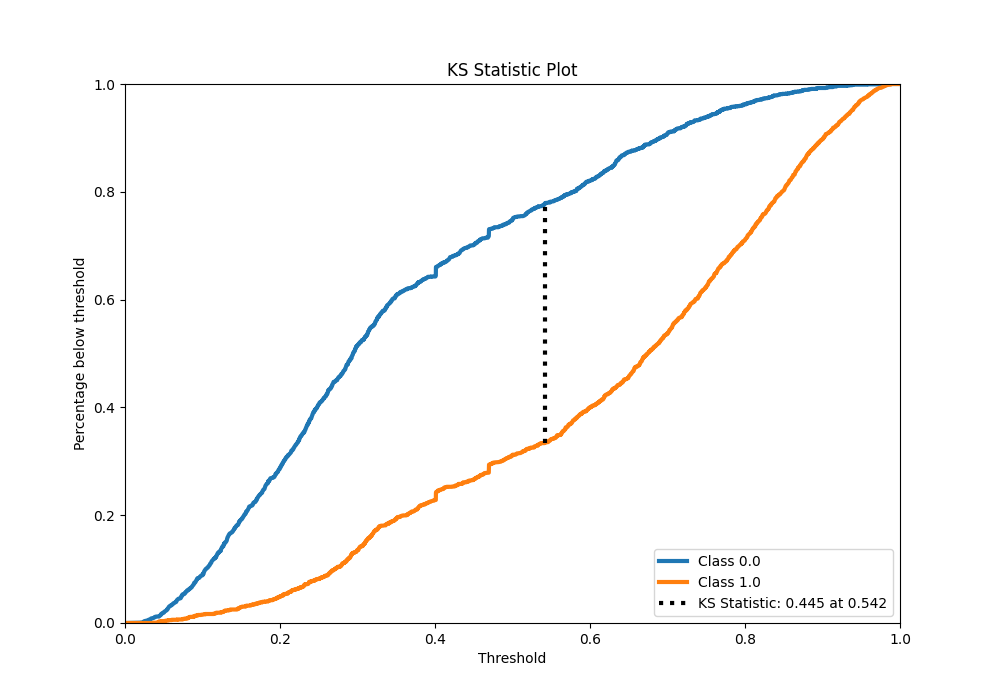
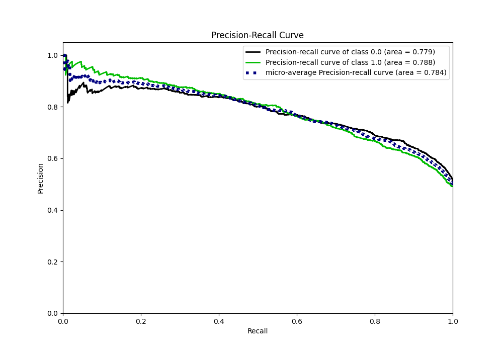
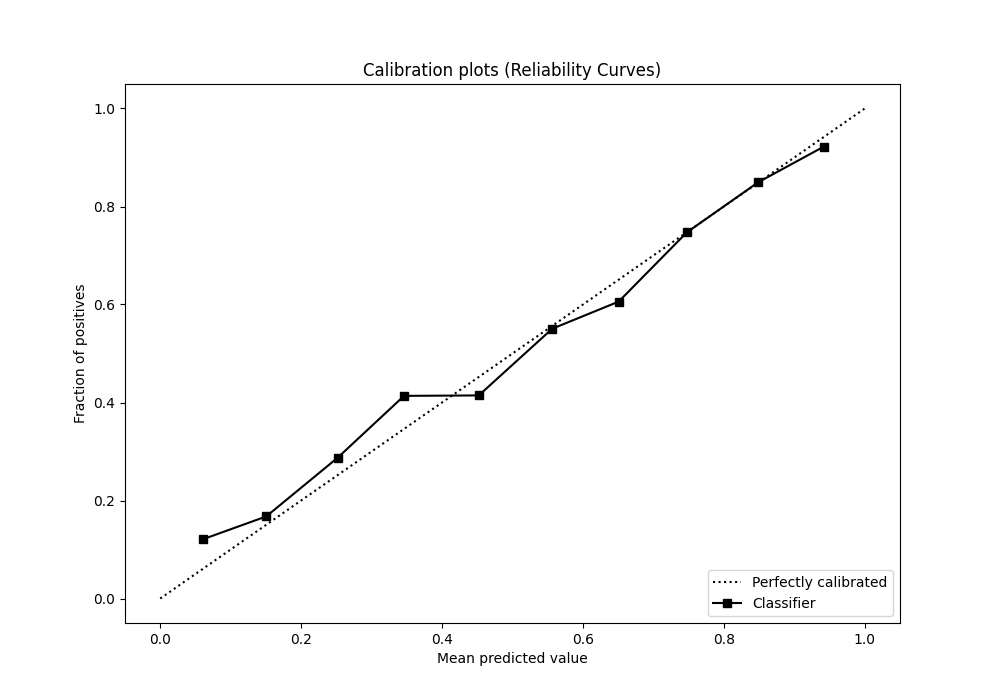
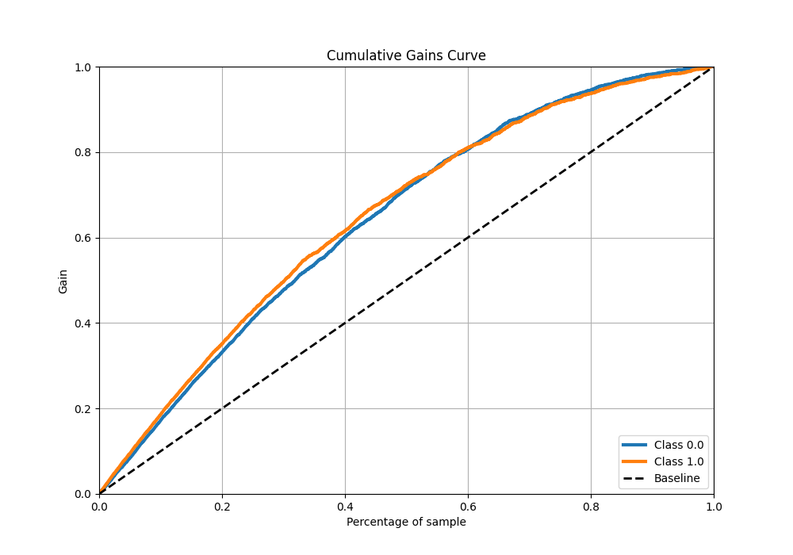
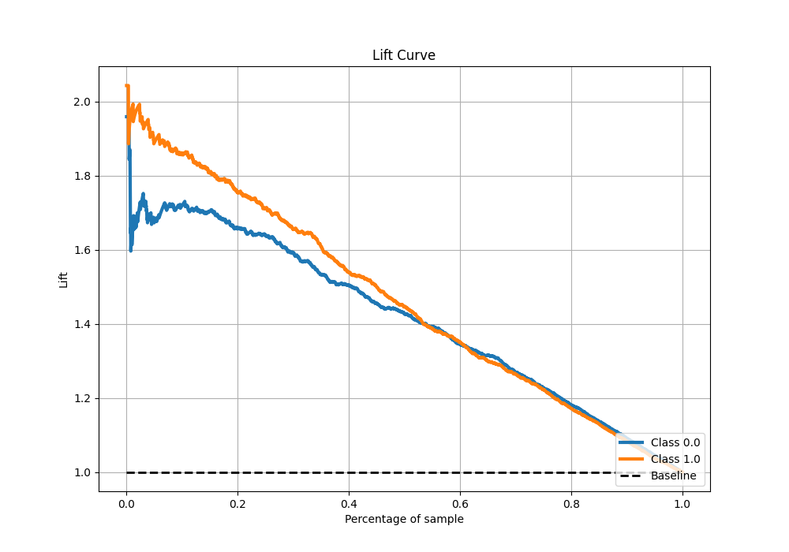

# Summary of 6_Default_NeuralNetwork

[<< Go back](../README.md)

## Neural Network

- **n_jobs**: -1
- **dense_1_size**: 32
- **dense_2_size**: 16
- **learning_rate**: 0.05
- **explain_level**: 2

## Validation

- **validation_type**: split
- **train_ratio**: 0.75
- **shuffle**: True
- **stratify**: True

## Optimized metric

auc

## Training time

4.1 seconds

## Metric details

|           |    score |   threshold |
|:----------|---------:|------------:|
| logloss   | 0.552003 | nan         |
| auc       | 0.793175 | nan         |
| f1        | 0.730374 |   0.298259  |
| accuracy  | 0.722287 |   0.526779  |
| precision | 0.951923 |   0.931535  |
| recall    | 1        |   0.0168114 |
| mcc       | 0.444867 |   0.526779  |

## Metric details with threshold from accuracy metric

|           |    score |   threshold |
|:----------|---------:|------------:|
| logloss   | 0.552003 |  nan        |
| auc       | 0.793175 |  nan        |
| f1        | 0.70398  |    0.526779 |
| accuracy  | 0.722287 |    0.526779 |
| precision | 0.736021 |    0.526779 |
| recall    | 0.674613 |    0.526779 |
| mcc       | 0.444867 |    0.526779 |

## Confusion matrix (at threshold=0.526779)

|              |   Predicted as 0 |   Predicted as 1 |
|:-------------|-----------------:|-----------------:|
| Labeled as 0 |             1344 |              406 |
| Labeled as 1 |              546 |             1132 |

## Learning curves

## Permutation-based Importance

## Confusion Matrix

## Normalized Confusion Matrix

## ROC Curve

## Kolmogorov-Smirnov Statistic

## Precision-Recall Curve

## Calibration Curve

## Cumulative Gains Curve

## Lift Curve

[<< Go back](../README.md)
