# Summary of 7_Default_RandomForest

[<< Go back](../README.md)

## Random Forest

- **n_jobs**: -1
- **criterion**: gini
- **max_features**: 0.9
- **min_samples_split**: 30
- **max_depth**: 4
- **eval_metric_name**: auc
- **explain_level**: 2

## Validation

- **validation_type**: split
- **train_ratio**: 0.75
- **shuffle**: True
- **stratify**: True

## Optimized metric

auc

## Training time

7.5 seconds

## Metric details

|           |    score |   threshold |
|:----------|---------:|------------:|
| logloss   | 0.556767 |  nan        |
| auc       | 0.790046 |  nan        |
| f1        | 0.733082 |    0.326399 |
| accuracy  | 0.721704 |    0.462388 |
| precision | 0.941176 |    0.872696 |
| recall    | 1        |    0.098249 |
| mcc       | 0.443013 |    0.462388 |

## Metric details with threshold from accuracy metric

|           |    score |   threshold |
|:----------|---------:|------------:|
| logloss   | 0.556767 |  nan        |
| auc       | 0.790046 |  nan        |
| f1        | 0.711084 |    0.462388 |
| accuracy  | 0.721704 |    0.462388 |
| precision | 0.722906 |    0.462388 |
| recall    | 0.699642 |    0.462388 |
| mcc       | 0.443013 |    0.462388 |

## Confusion matrix (at threshold=0.462388)

|              |   Predicted as 0 |   Predicted as 1 |
|:-------------|-----------------:|-----------------:|
| Labeled as 0 |             1300 |              450 |
| Labeled as 1 |              504 |             1174 |

## Learning curves

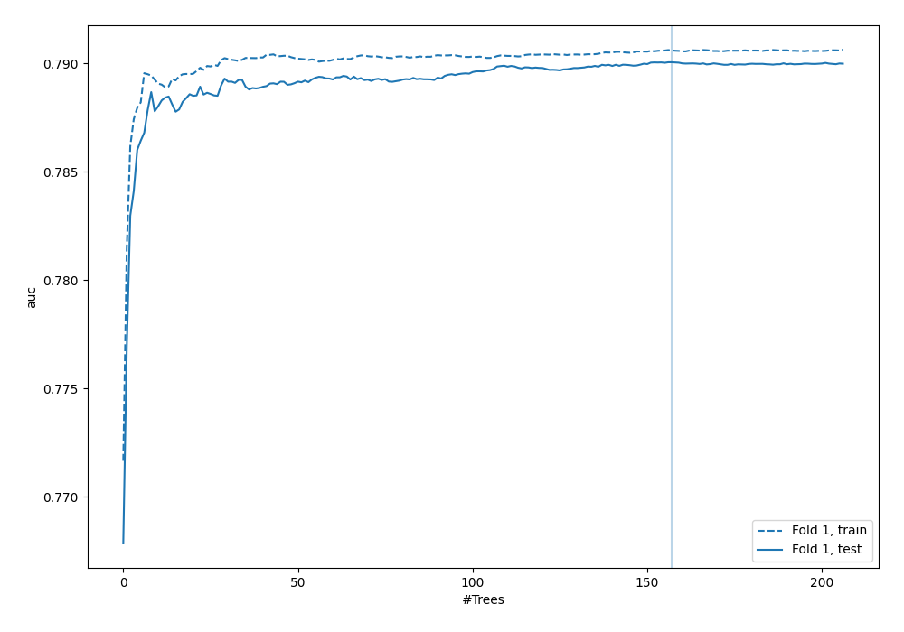

## Permutation-based Importance

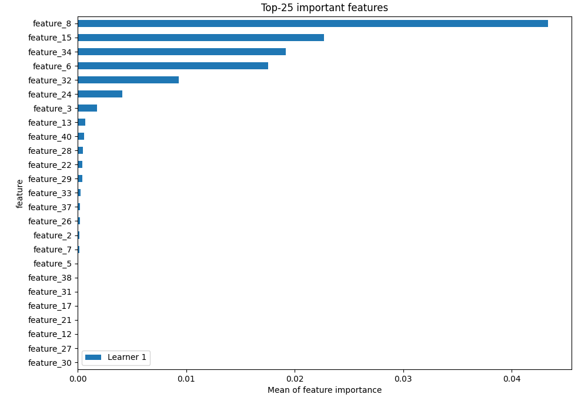

## Confusion Matrix

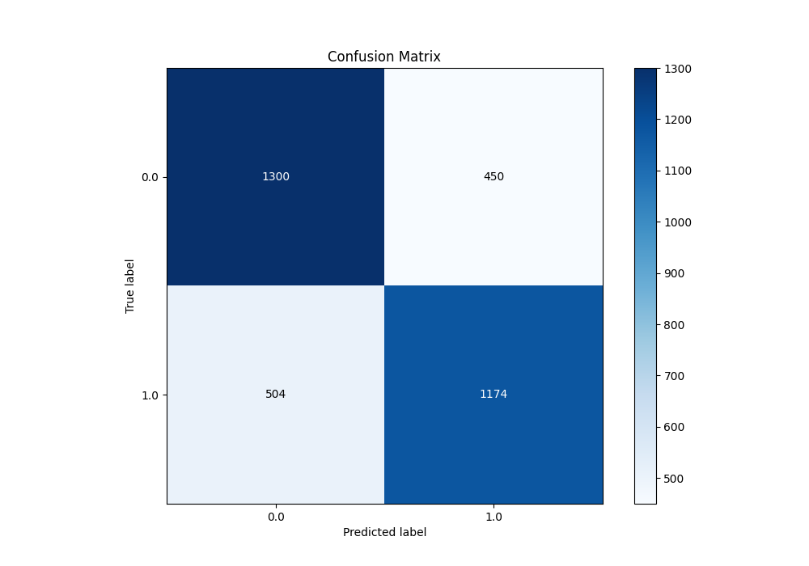

## Normalized Confusion Matrix

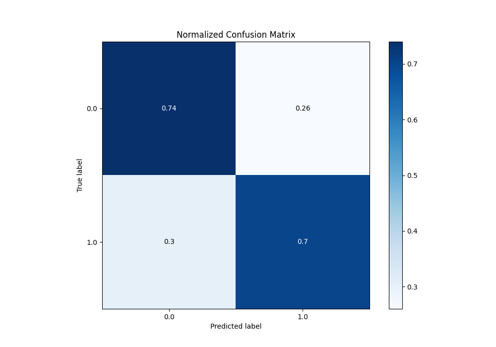

## ROC Curve

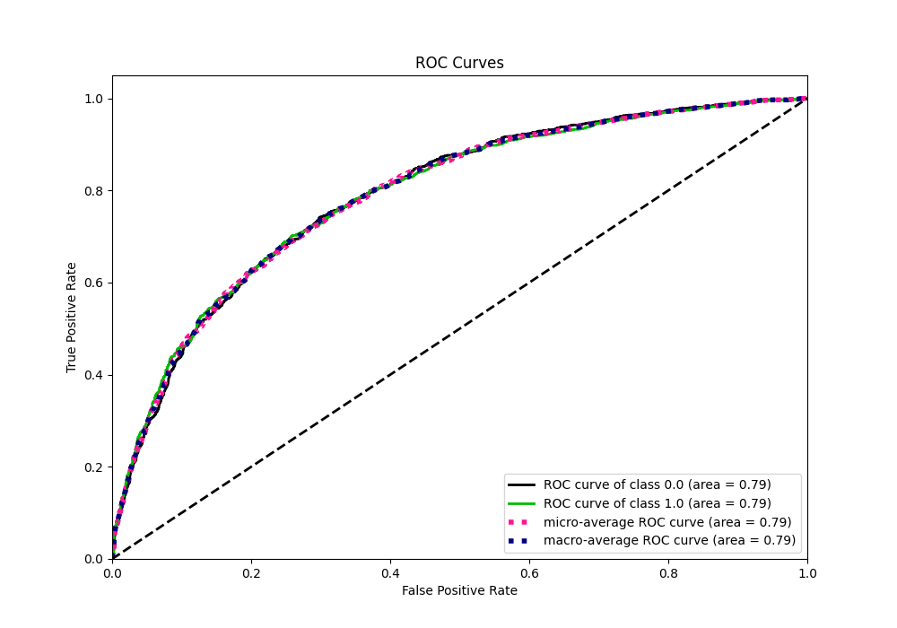

## Kolmogorov-Smirnov Statistic

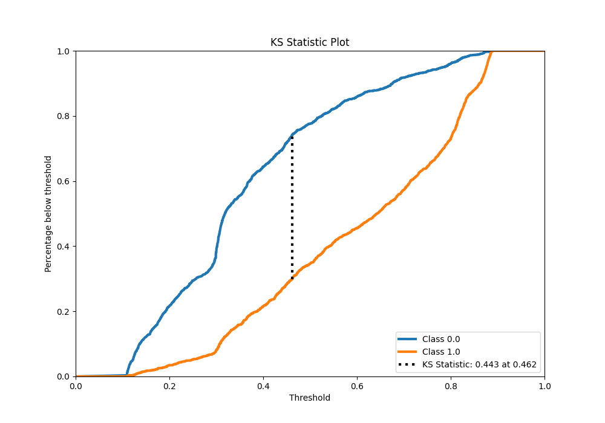

## Precision-Recall Curve

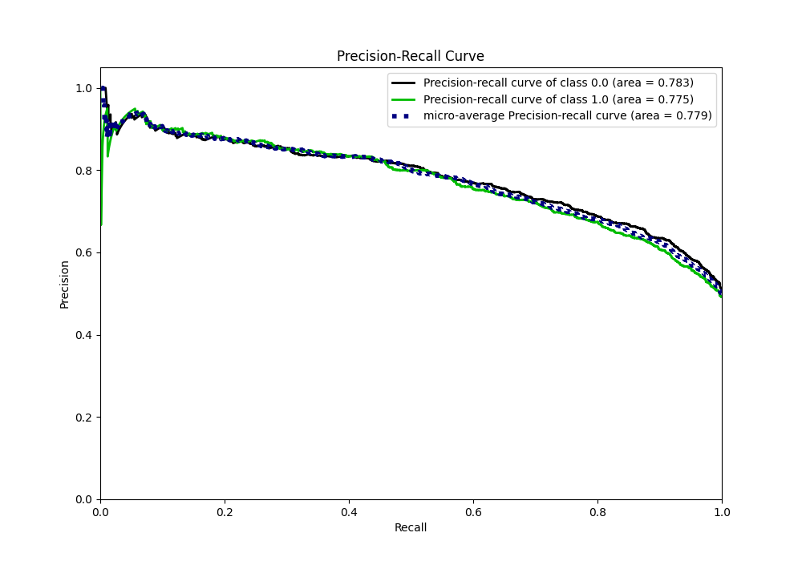

## Calibration Curve

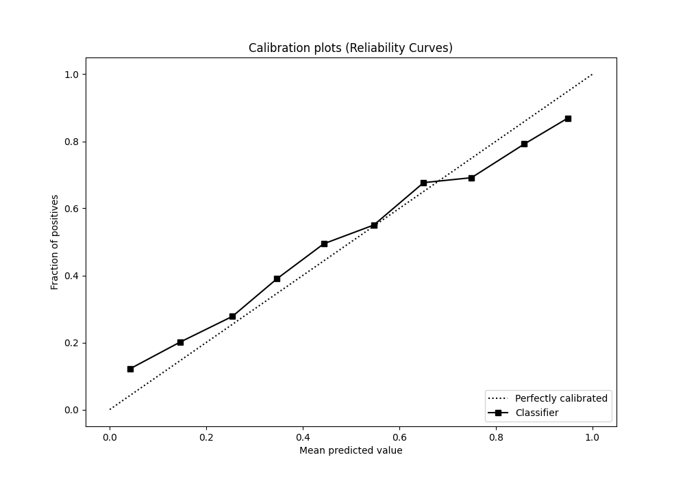

## Cumulative Gains Curve

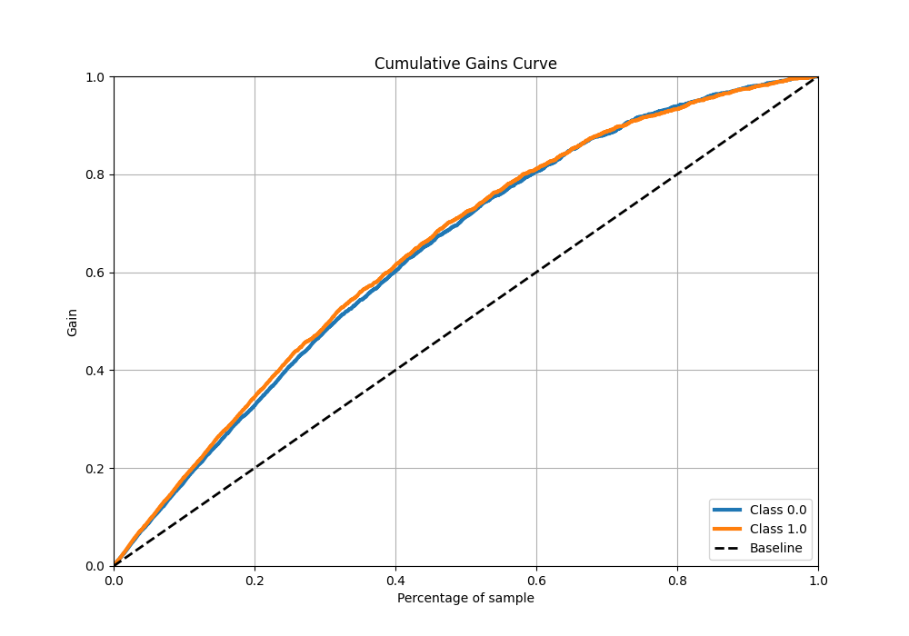

## Lift Curve

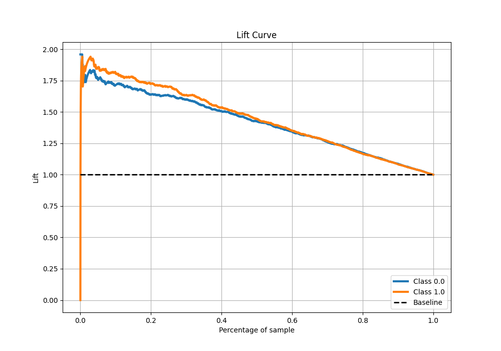

## SHAP Importance

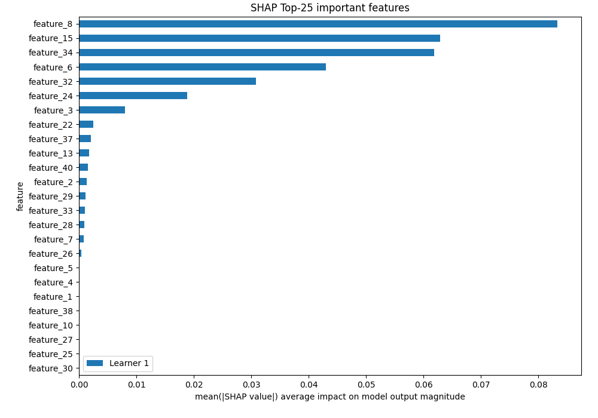

## SHAP Dependence plots

### Dependence (Fold 1)

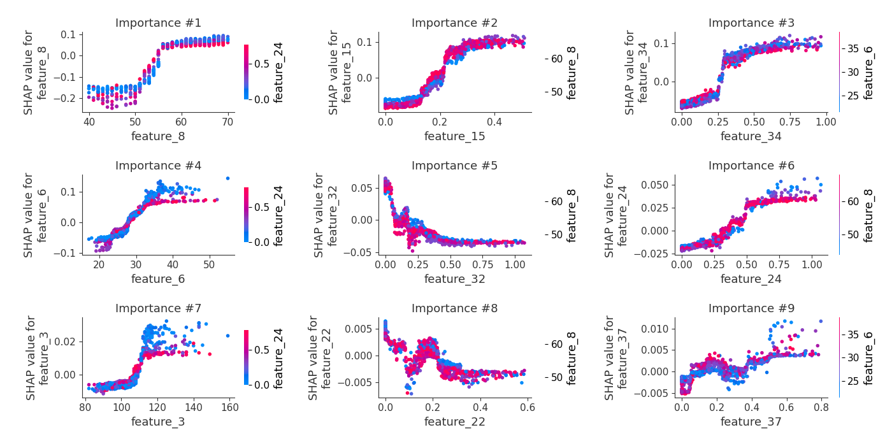

## SHAP Decision plots

[<< Go back](../README.md)
