# Summary of 8_Default_ExtraTrees

[<< Go back](../README.md)

## Extra Trees Classifier (Extra Trees)

- **n_jobs**: -1
- **criterion**: gini
- **max_features**: 0.9
- **min_samples_split**: 30
- **max_depth**: 4
- **eval_metric_name**: auc
- **explain_level**: 2

## Validation

- **validation_type**: split
- **train_ratio**: 0.75
- **shuffle**: True
- **stratify**: True

## Optimized metric

auc

## Training time

5.7 seconds

## Metric details

|           |    score |   threshold |
|:----------|---------:|------------:|
| logloss   | 0.565962 |  nan        |
| auc       | 0.78596  |  nan        |
| f1        | 0.730135 |    0.34611  |
| accuracy  | 0.712369 |    0.470682 |
| precision | 0.95     |    0.849865 |
| recall    | 1        |    0.134886 |
| mcc       | 0.424842 |    0.470682 |

## Metric details with threshold from accuracy metric

|           |    score |   threshold |
|:----------|---------:|------------:|
| logloss   | 0.565962 |  nan        |
| auc       | 0.78596  |  nan        |
| f1        | 0.693979 |    0.470682 |
| accuracy  | 0.712369 |    0.470682 |
| precision | 0.724093 |    0.470682 |
| recall    | 0.666269 |    0.470682 |
| mcc       | 0.424842 |    0.470682 |

## Confusion matrix (at threshold=0.470682)

|              |   Predicted as 0 |   Predicted as 1 |
|:-------------|-----------------:|-----------------:|
| Labeled as 0 |             1324 |              426 |
| Labeled as 1 |              560 |             1118 |

## Learning curves

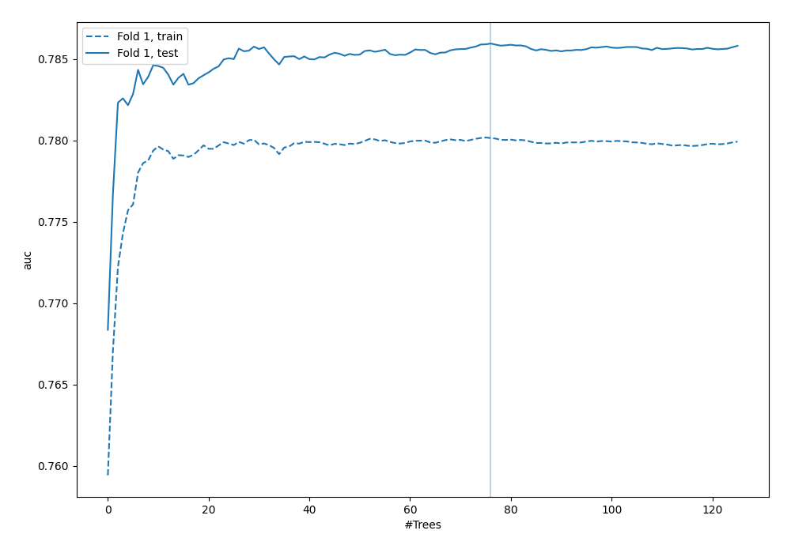

## Permutation-based Importance

## Confusion Matrix

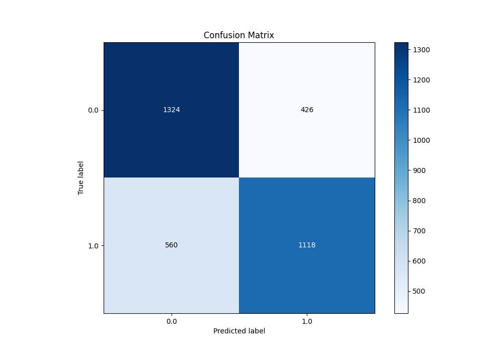

## Normalized Confusion Matrix

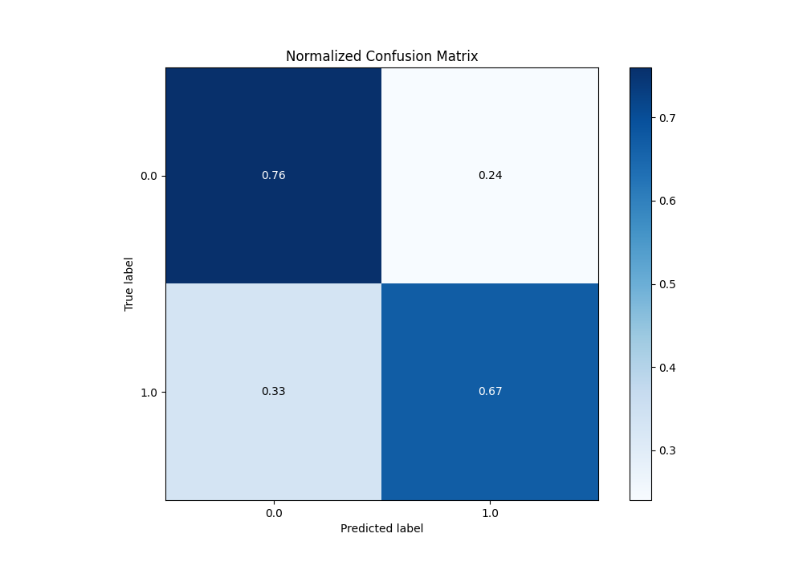

## ROC Curve

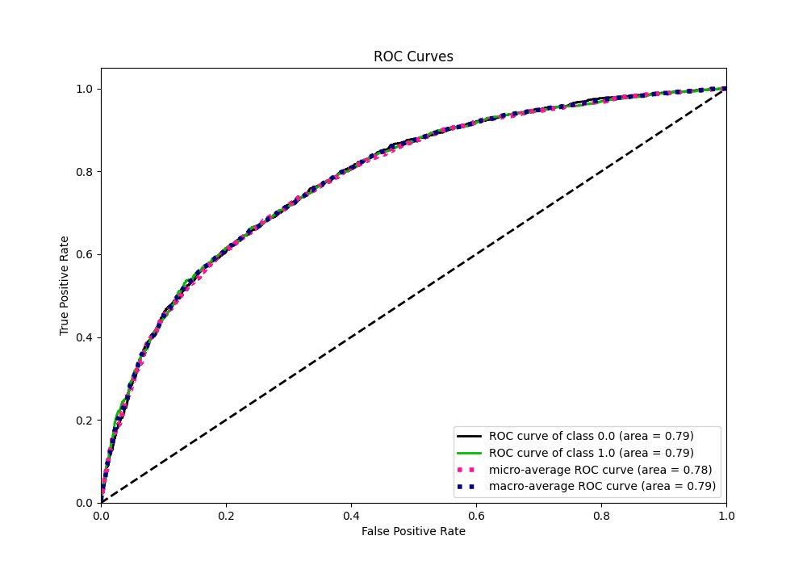

## Kolmogorov-Smirnov Statistic

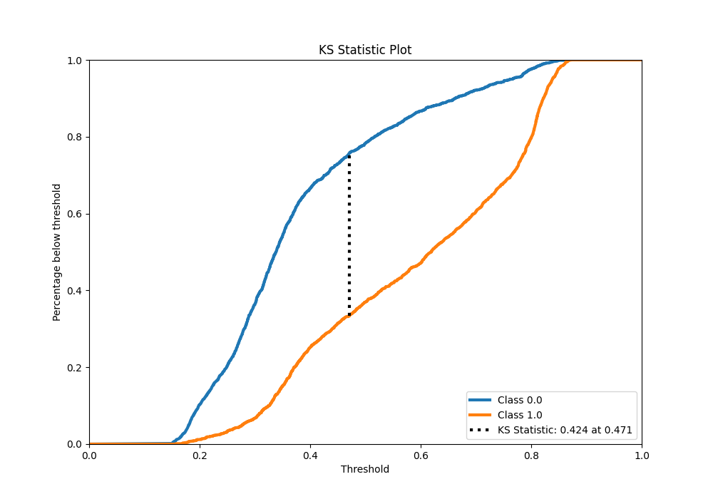

## Precision-Recall Curve

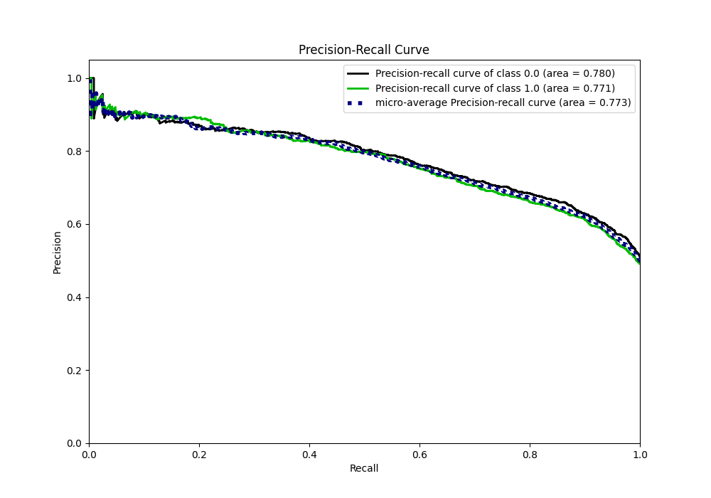

## Calibration Curve

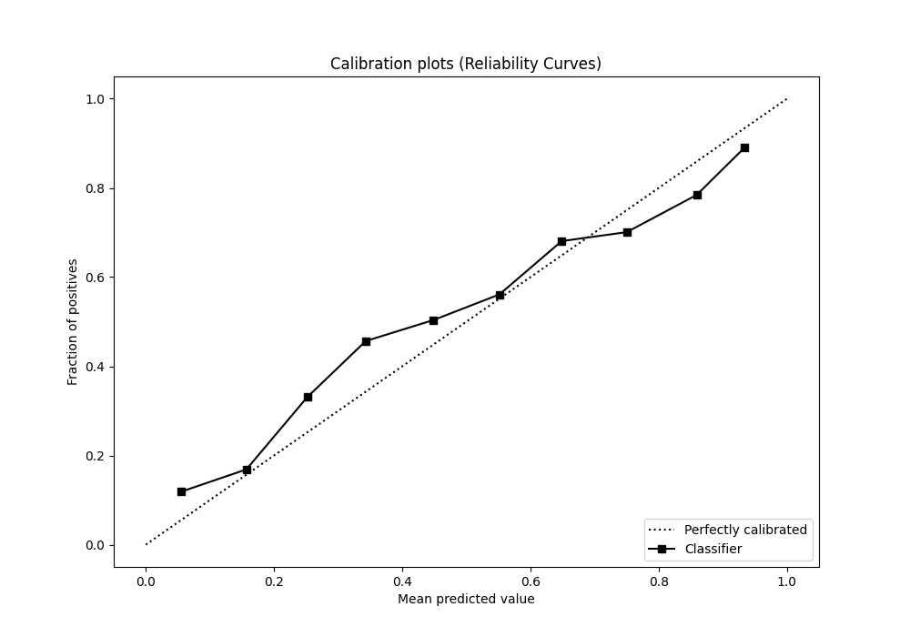

## Cumulative Gains Curve

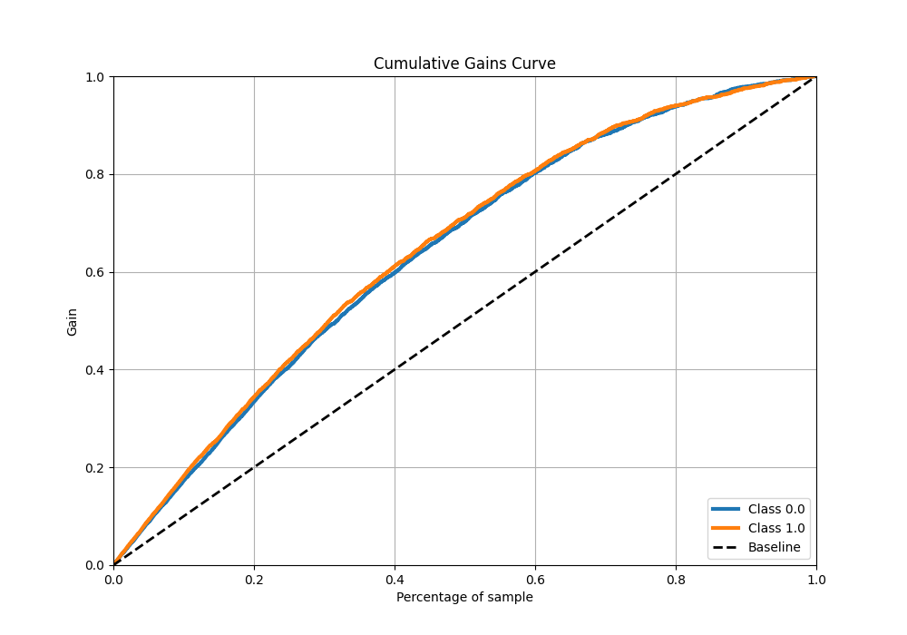

## Lift Curve

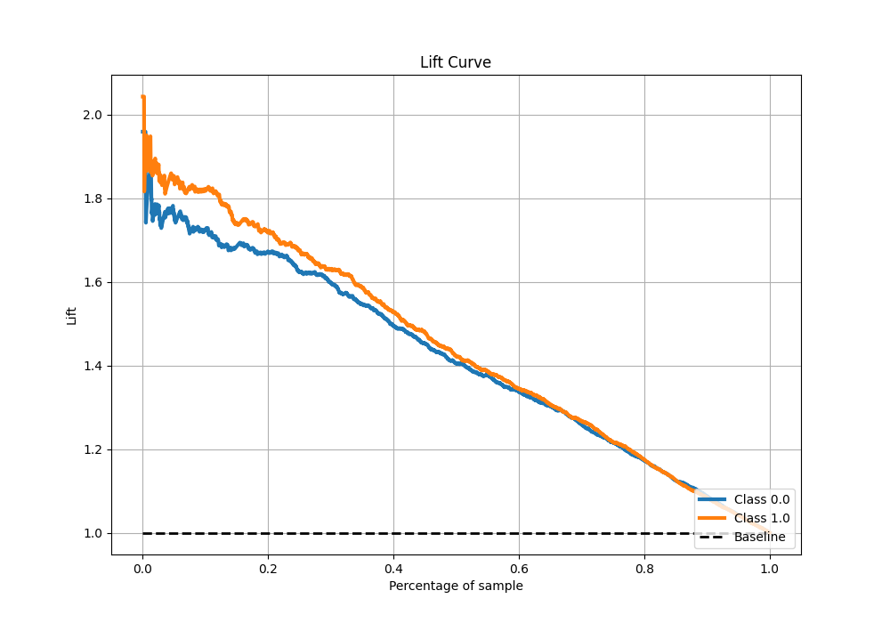

## SHAP Importance

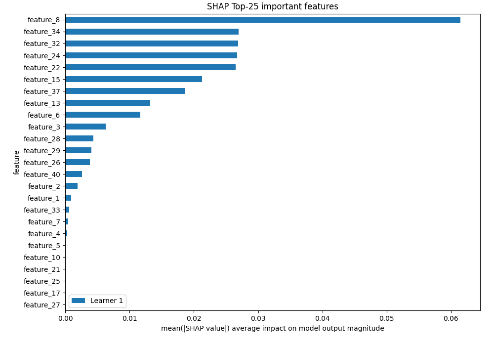

## SHAP Dependence plots

### Dependence (Fold 1)

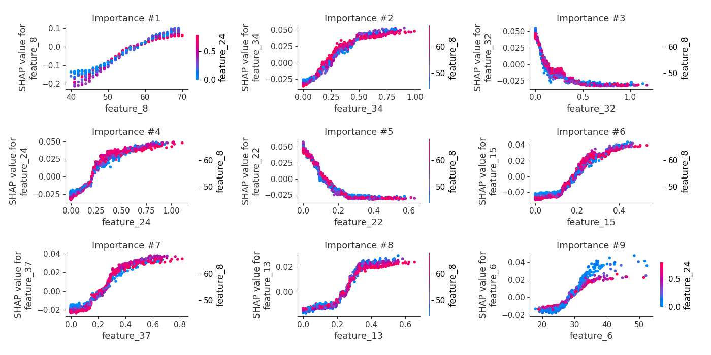

## SHAP Decision plots

[<< Go back](../README.md)
