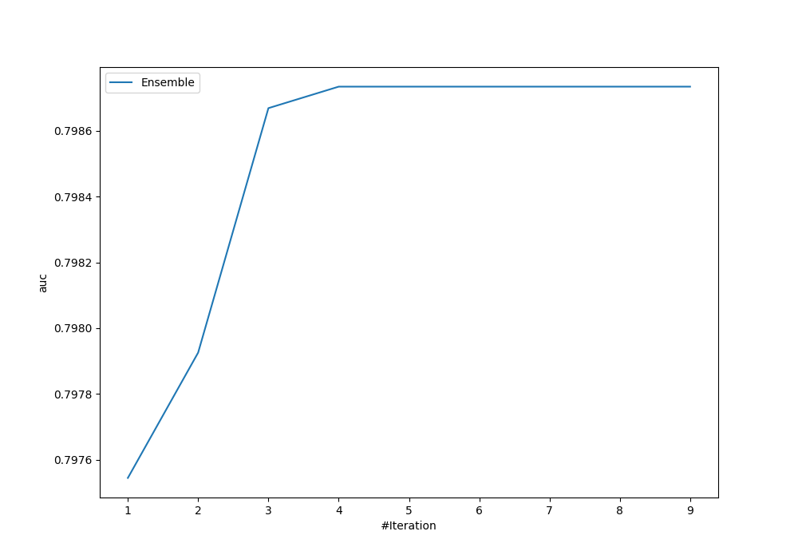
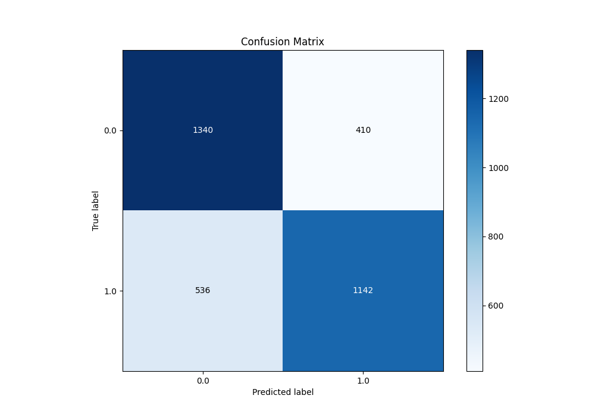
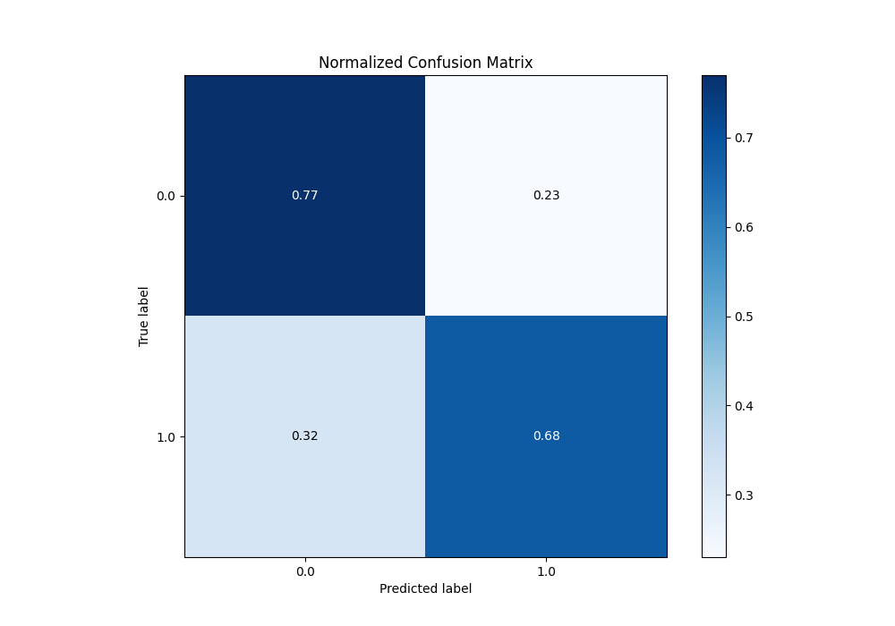
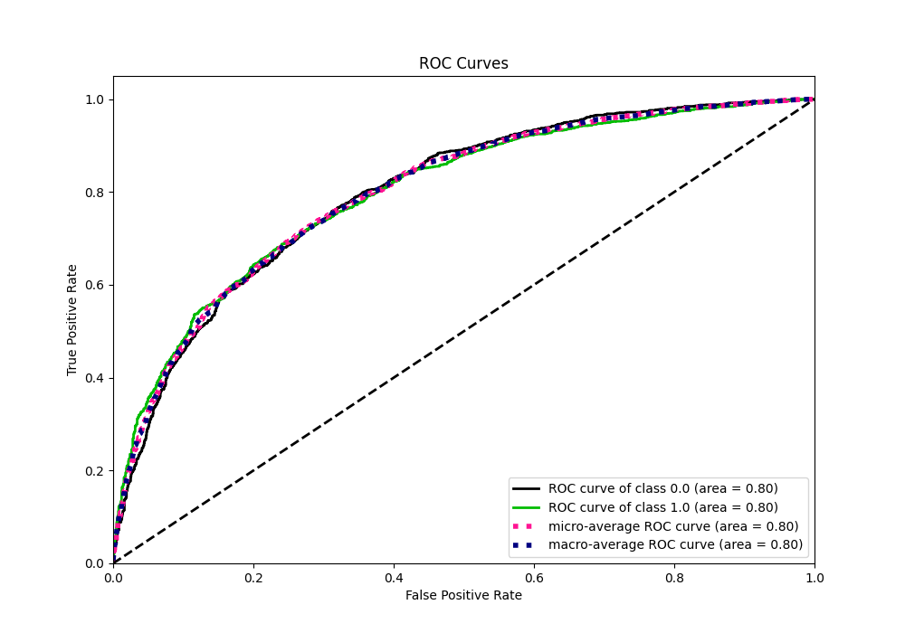
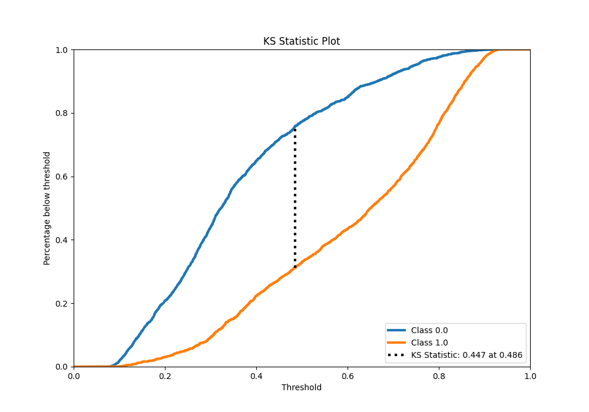
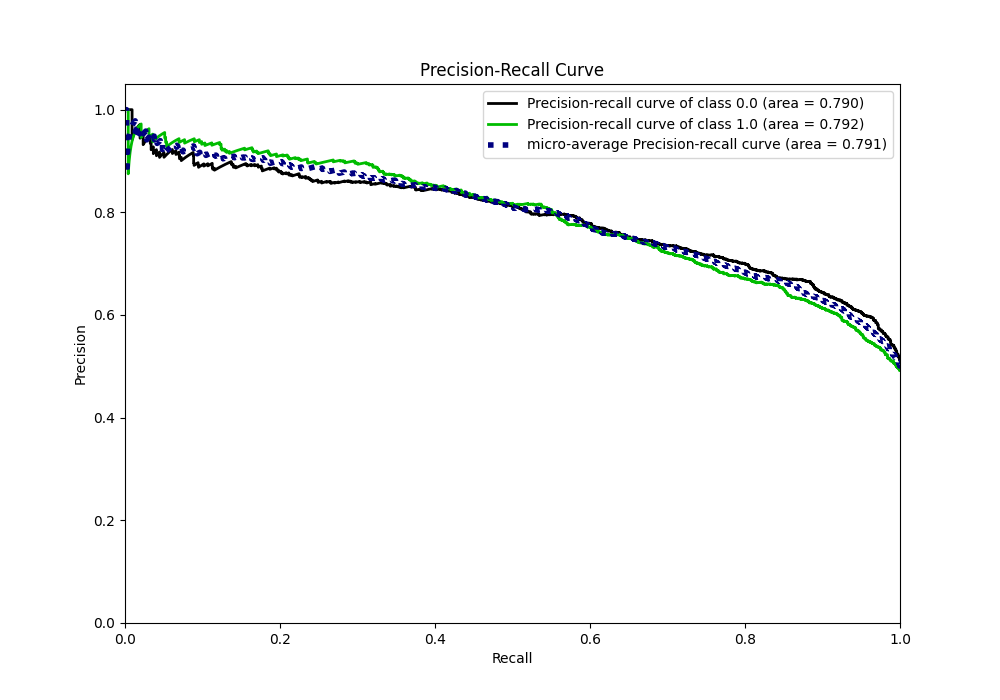
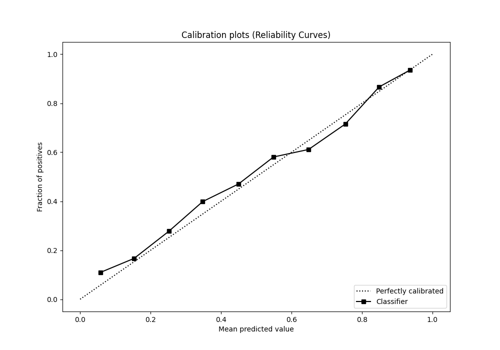
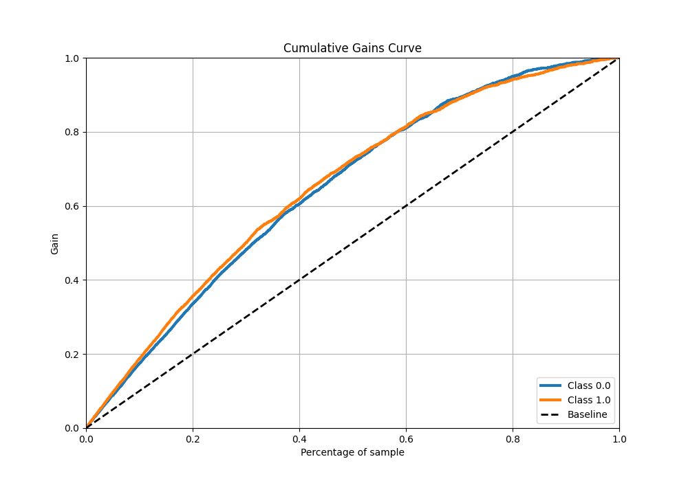
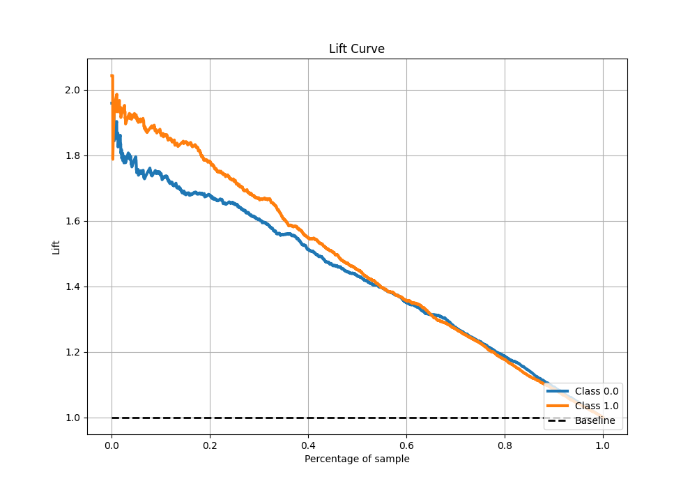

# Summary of Ensemble

[<< Go back](../README.md)

## Ensemble structure

| Model                   |   Weight |
|:------------------------|---------:|
| 3_Default_LightGBM      |        1 |
| 5_Default_CatBoost      |        2 |
| 6_Default_NeuralNetwork |        1 |

## Metric details

|           |    score |   threshold |
|:----------|---------:|------------:|
| logloss   | 0.546927 | nan         |
| auc       | 0.798735 | nan         |
| f1        | 0.737143 |   0.352068  |
| accuracy  | 0.724037 |   0.492058  |
| precision | 0.933962 |   0.879807  |
| recall    | 1        |   0.0710512 |
| mcc       | 0.448467 |   0.534466  |

## Metric details with threshold from accuracy metric

|           |    score |   threshold |
|:----------|---------:|------------:|
| logloss   | 0.546927 |  nan        |
| auc       | 0.798735 |  nan        |
| f1        | 0.707121 |    0.492058 |
| accuracy  | 0.724037 |    0.492058 |
| precision | 0.735825 |    0.492058 |
| recall    | 0.680572 |    0.492058 |
| mcc       | 0.448194 |    0.492058 |

## Confusion matrix (at threshold=0.492058)

|              |   Predicted as 0 |   Predicted as 1 |
|:-------------|-----------------:|-----------------:|
| Labeled as 0 |             1340 |              410 |
| Labeled as 1 |              536 |             1142 |

## Learning curves

## Confusion Matrix

## Normalized Confusion Matrix

## ROC Curve

## Kolmogorov-Smirnov Statistic

## Precision-Recall Curve

## Calibration Curve

## Cumulative Gains Curve

## Lift Curve

[<< Go back](../README.md)
