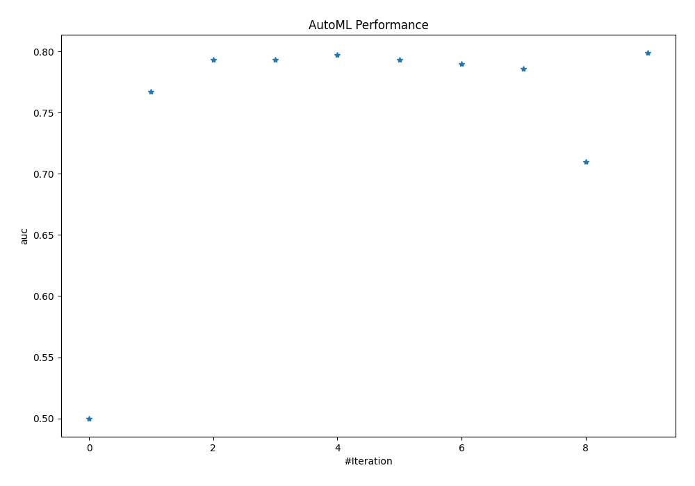
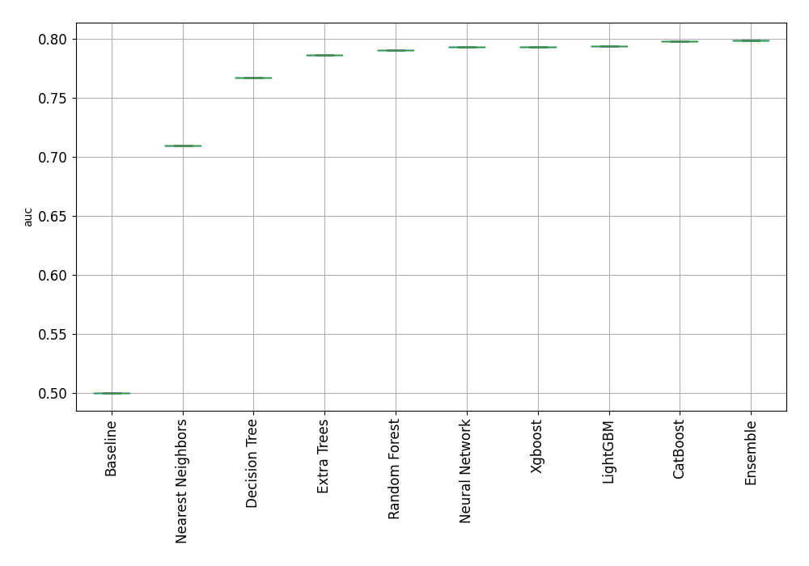
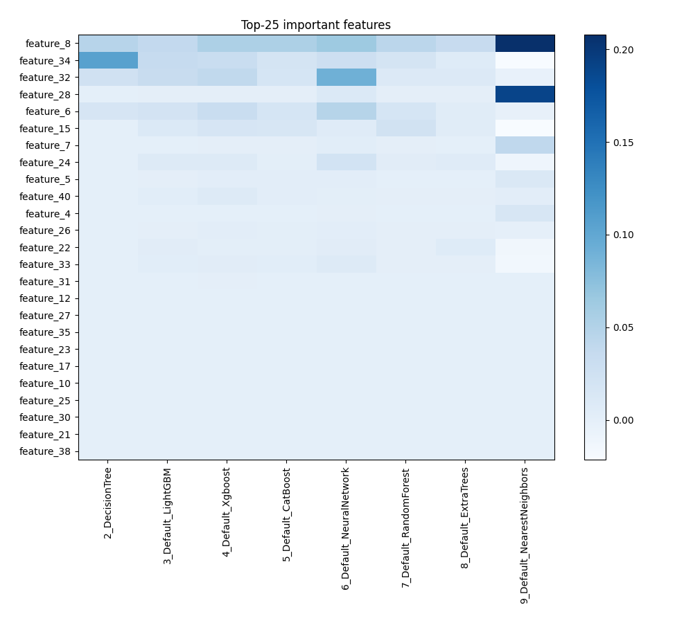
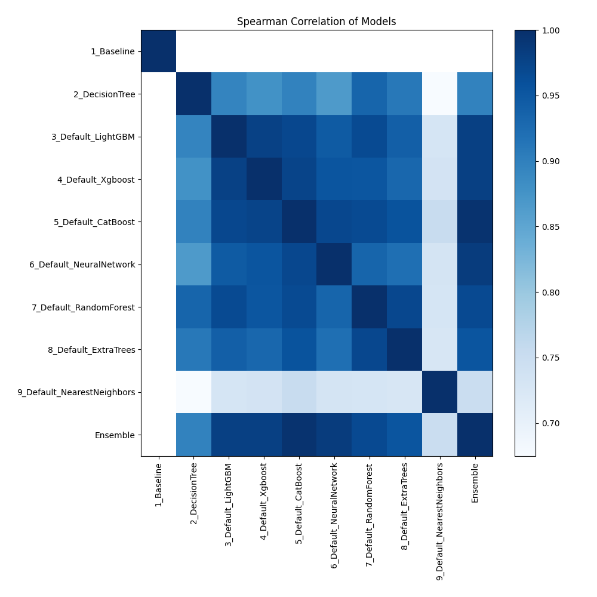

# AutoML Leaderboard

| Best model   | name                                                               | model_type        | metric_type   |   metric_value |   train_time |
|:-------------|:-------------------------------------------------------------------|:------------------|:--------------|---------------:|-------------:|
|              | [1_Baseline](1_Baseline/README.md)                                 | Baseline          | auc           |       0.5      |         0.92 |
|              | [2_DecisionTree](2_DecisionTree/README.md)                         | Decision Tree     | auc           |       0.767162 |         6.76 |
|              | [3_Default_LightGBM](3_Default_LightGBM/README.md)                 | LightGBM          | auc           |       0.793399 |         3.94 |
|              | [4_Default_Xgboost](4_Default_Xgboost/README.md)                   | Xgboost           | auc           |       0.79327  |        10.85 |
|              | [5_Default_CatBoost](5_Default_CatBoost/README.md)                 | CatBoost          | auc           |       0.797545 |         2.17 |
|              | [6_Default_NeuralNetwork](6_Default_NeuralNetwork/README.md)       | Neural Network    | auc           |       0.793175 |         4.92 |
|              | [7_Default_RandomForest](7_Default_RandomForest/README.md)         | Random Forest     | auc           |       0.790046 |         8.49 |
|              | [8_Default_ExtraTrees](8_Default_ExtraTrees/README.md)             | Extra Trees       | auc           |       0.78596  |         6.69 |
|              | [9_Default_NearestNeighbors](9_Default_NearestNeighbors/README.md) | Nearest Neighbors | auc           |       0.70975  |         3.27 |
| **the
best** | [Ensemble](Ensemble/README.md)                                     | Ensemble          | auc           |       0.798735 |         0.88 |

### AutoML Performance

### AutoML Performance Boxplot

### Features Importance

### Spearman Correlation of Models

