# Summary of 5_Default_RandomForest

[<< Go back](../README.md)

## Random Forest

- **n_jobs**: -1
- **criterion**: gini
- **max_features**: 0.9
- **min_samples_split**: 30
- **max_depth**: 4
- **eval_metric_name**: auc
- **explain_level**: 2

## Validation

- **validation_type**: split
- **train_ratio**: 0.75
- **shuffle**: True
- **stratify**: True

## Optimized metric

auc

## Training time

12.7 seconds

## Metric details

|           |    score |   threshold |
|:----------|---------:|------------:|
| logloss   | 0.614998 | nan         |
| auc       | 0.720098 | nan         |
| f1        | 0.697663 |   0.339689  |
| accuracy  | 0.663674 |   0.463685  |
| precision | 0.782828 |   0.756028  |
| recall    | 1        |   0.0893927 |
| mcc       | 0.332139 |   0.435307  |

## Metric details with threshold from accuracy metric

|           |    score |   threshold |
|:----------|---------:|------------:|
| logloss   | 0.614998 |  nan        |
| auc       | 0.720098 |  nan        |
| f1        | 0.669217 |    0.463685 |
| accuracy  | 0.663674 |    0.463685 |
| precision | 0.6431   |    0.463685 |
| recall    | 0.697546 |    0.463685 |
| mcc       | 0.329428 |    0.463685 |

## Confusion matrix (at threshold=0.463685)

|              |   Predicted as 0 |   Predicted as 1 |
|:-------------|-----------------:|-----------------:|
| Labeled as 0 |             1081 |              631 |
| Labeled as 1 |              493 |             1137 |

## Learning curves

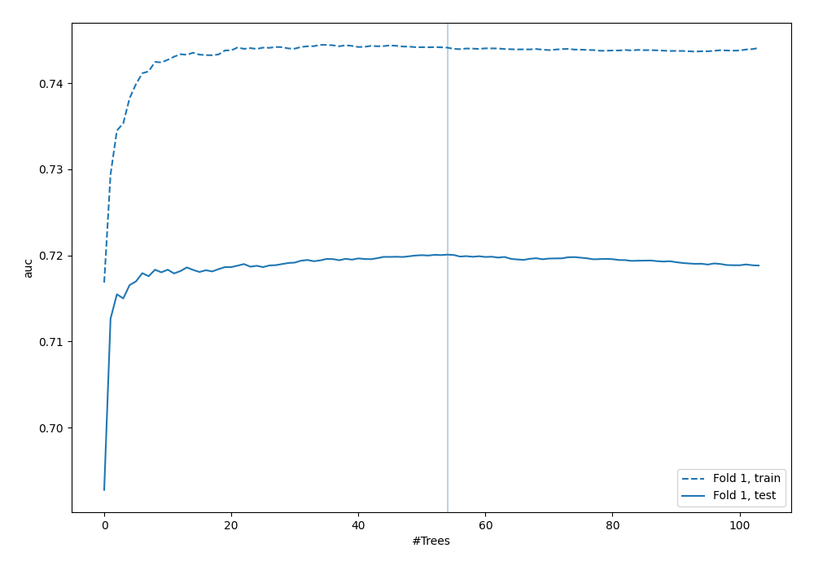

## Permutation-based Importance

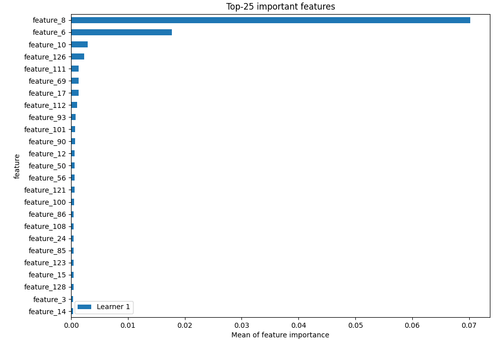

## Confusion Matrix

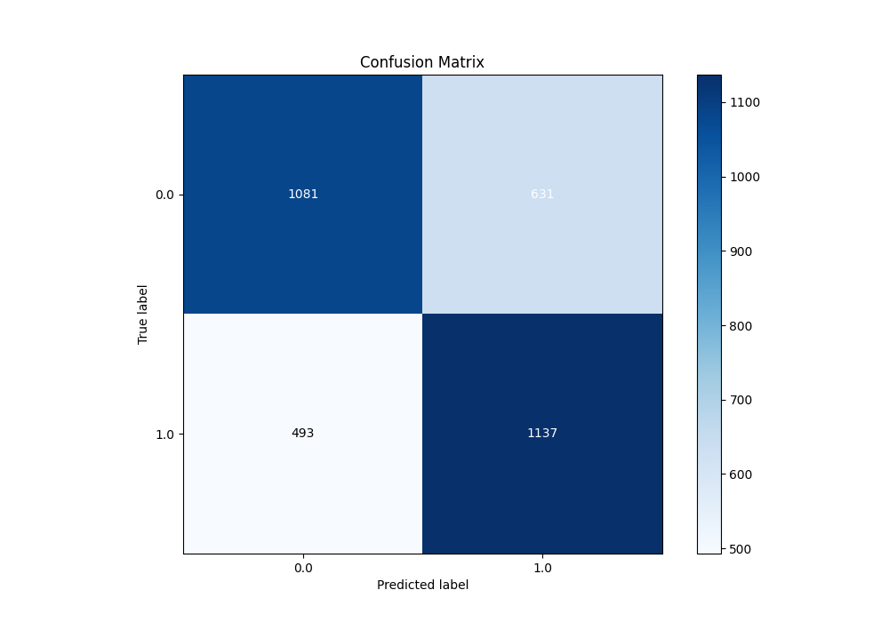

## Normalized Confusion Matrix

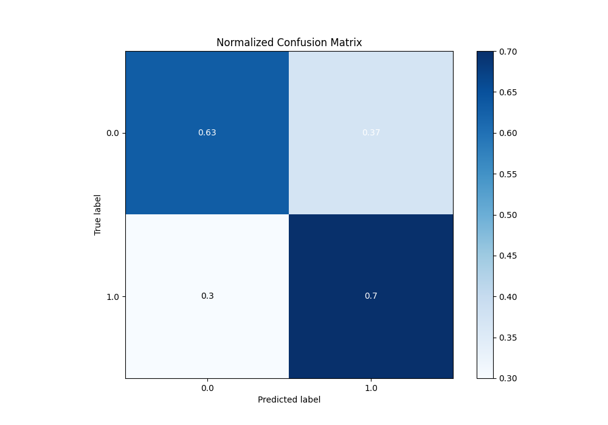

## ROC Curve

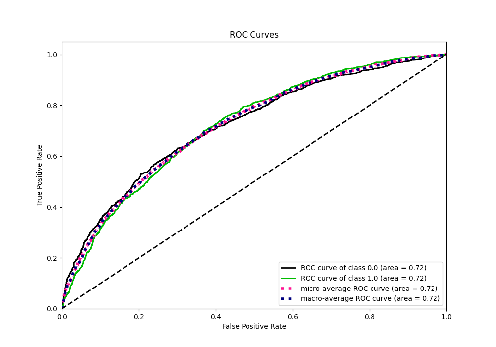

## Kolmogorov-Smirnov Statistic

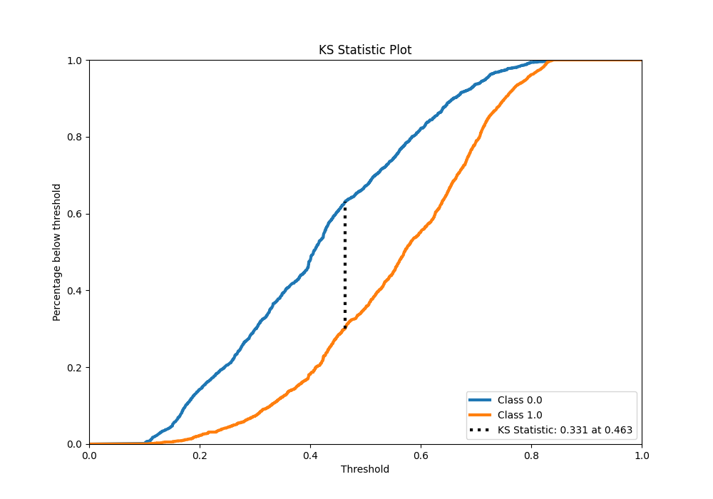

## Precision-Recall Curve

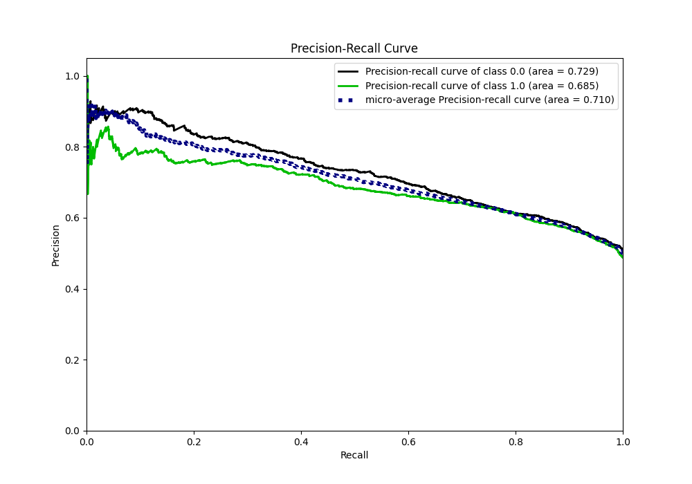

## Calibration Curve

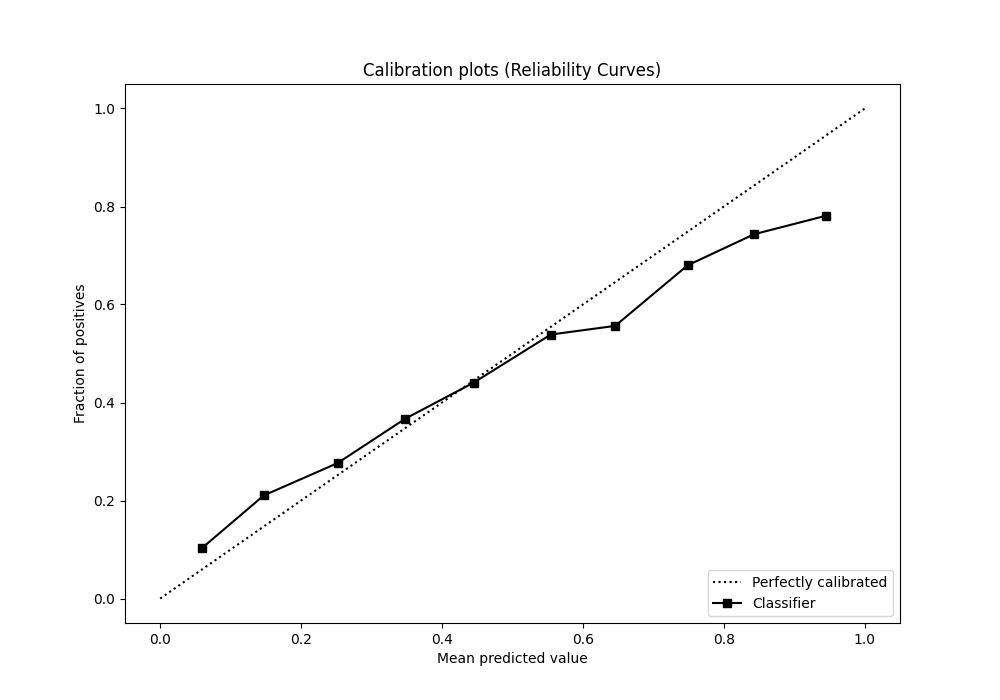

## Cumulative Gains Curve

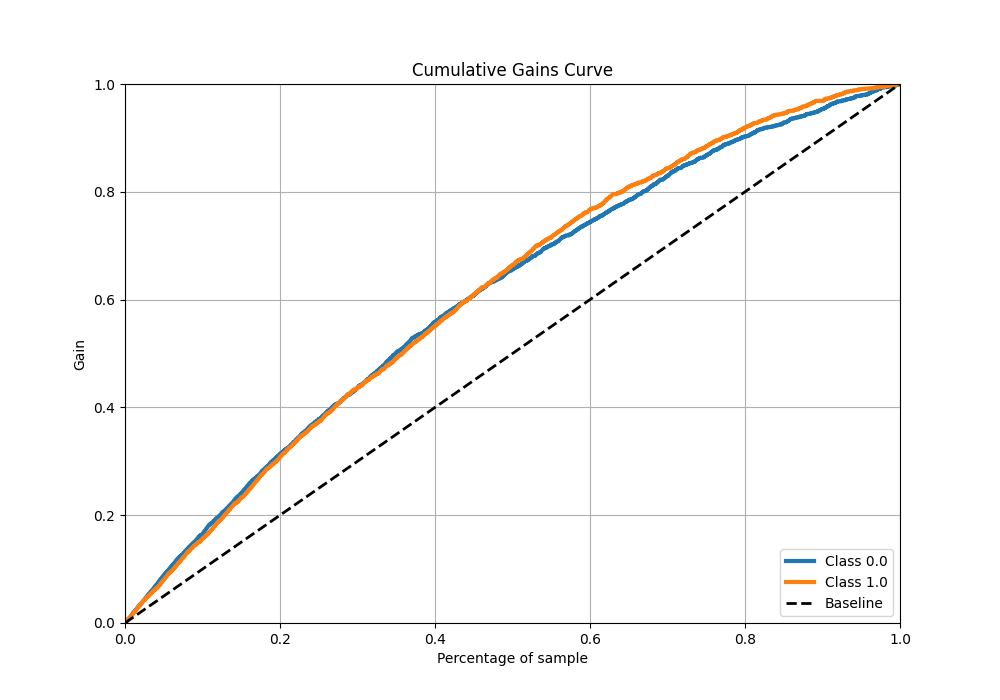

## Lift Curve

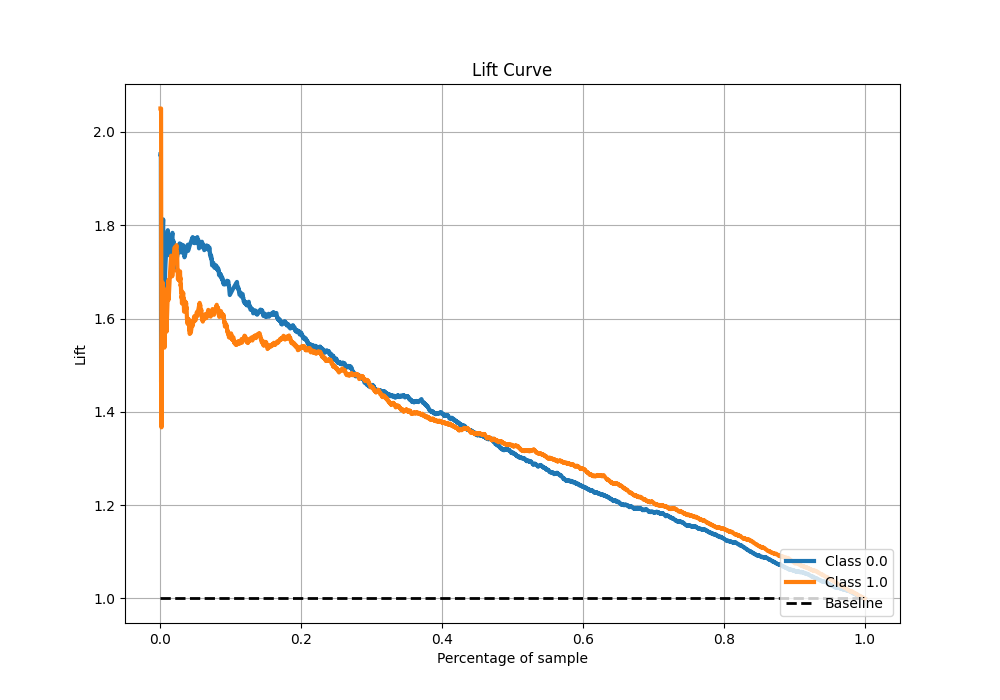

## SHAP Importance

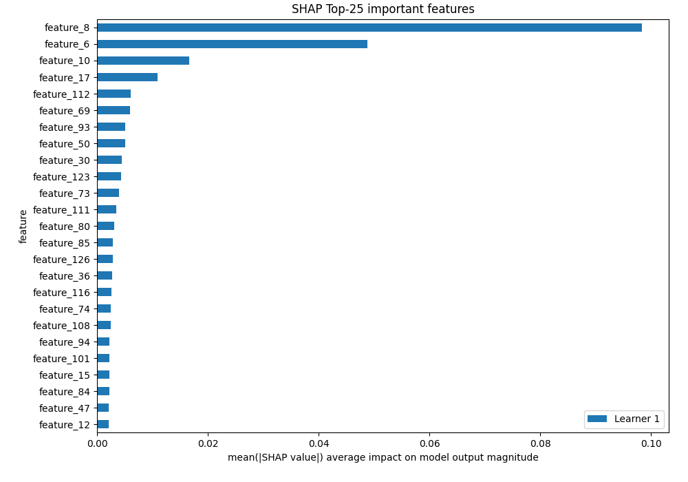

## SHAP Dependence plots

### Dependence (Fold 1)

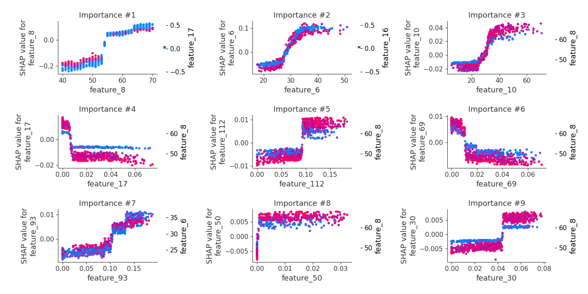

## SHAP Decision plots

[<< Go back](../README.md)
