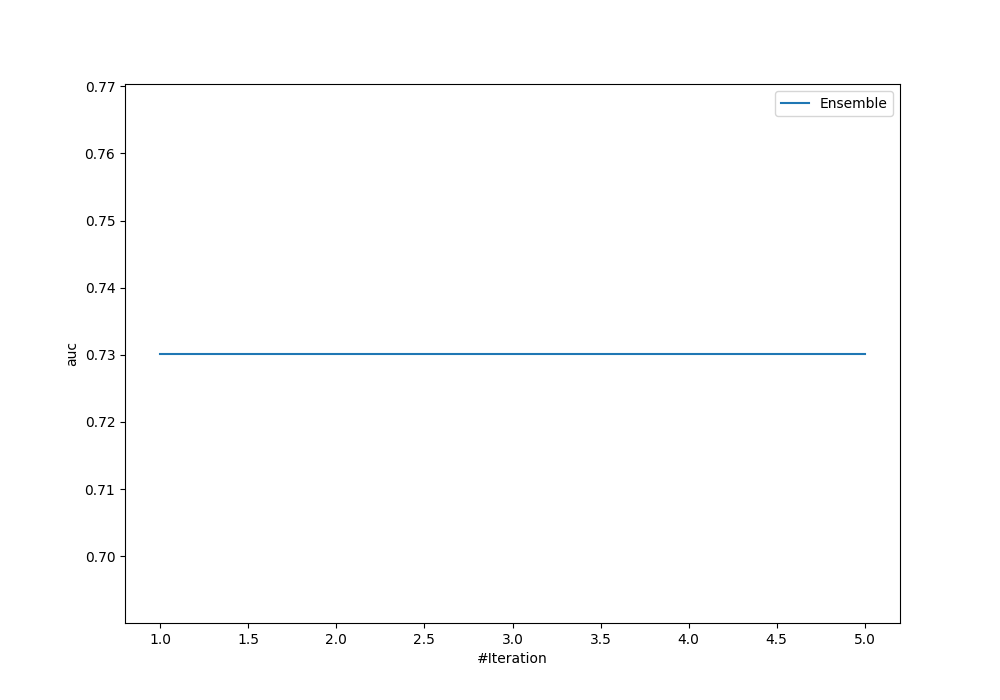
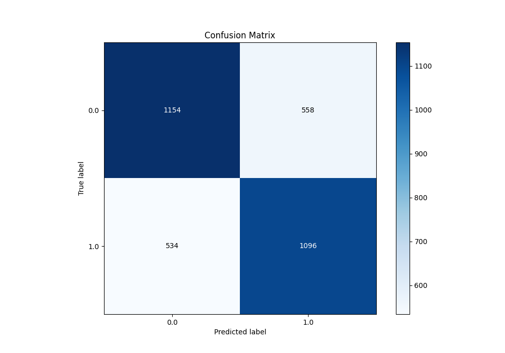
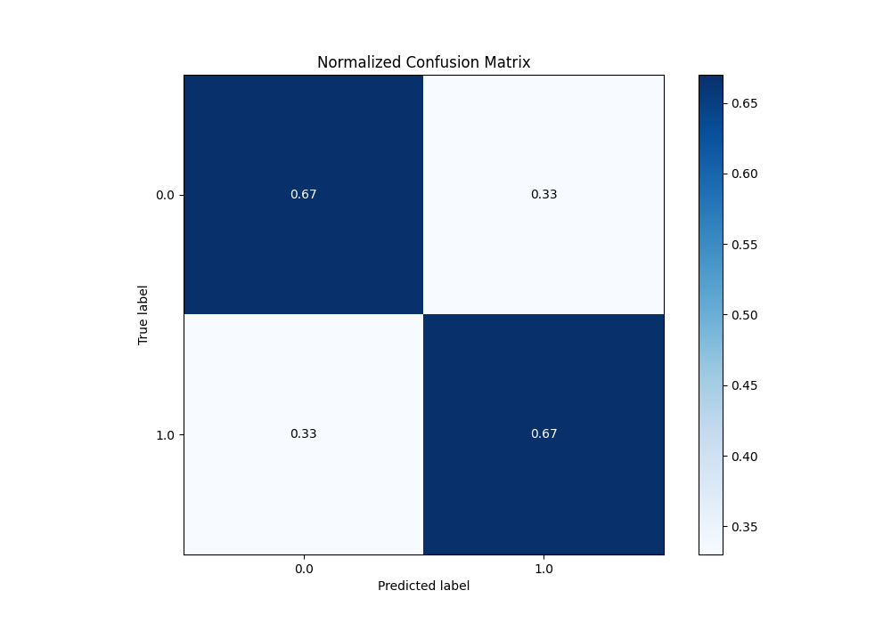
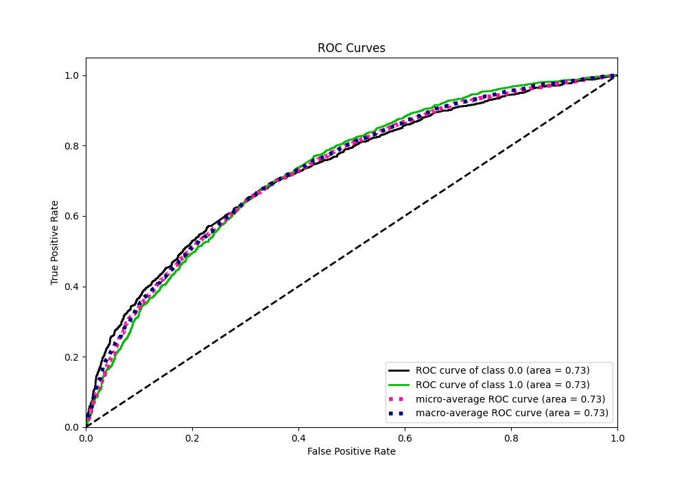
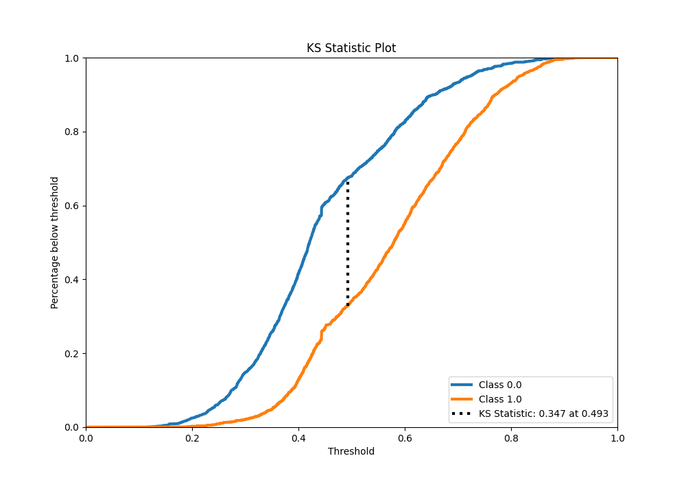
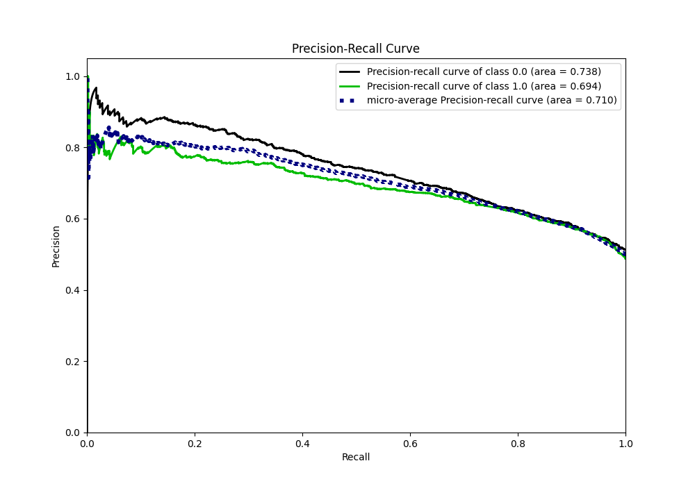
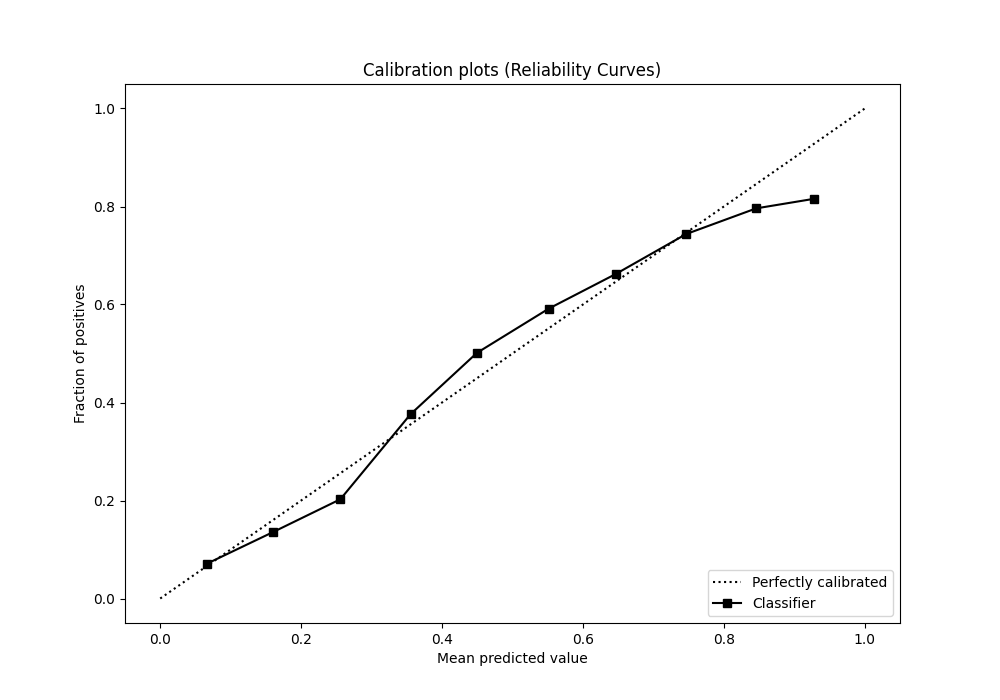
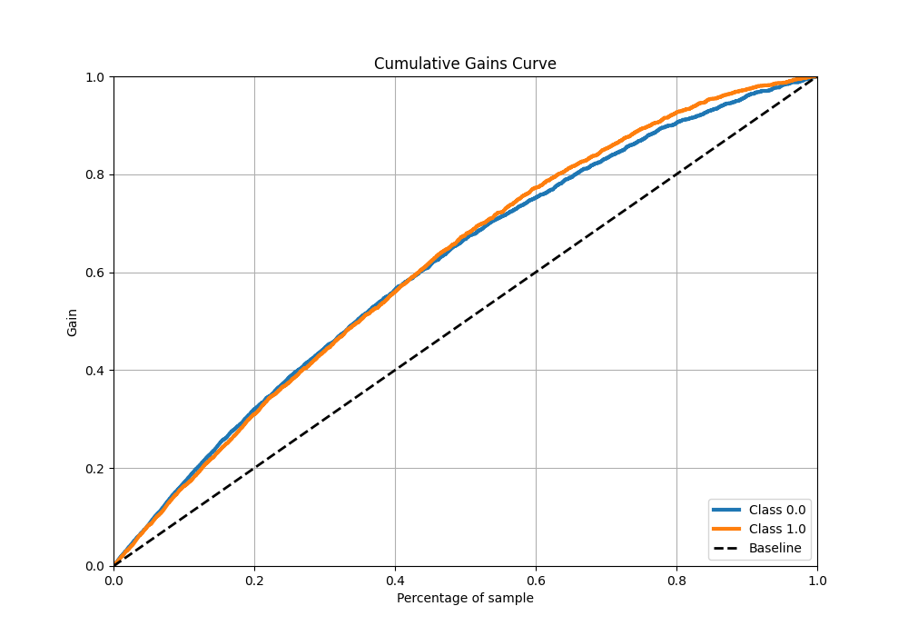

# Summary of Ensemble

[<< Go back](../README.md)

## Ensemble structure

| Model                   |   Weight |
|:------------------------|---------:|
| 4_Default_NeuralNetwork |        1 |

## Metric details

|           |    score |   threshold |
|:----------|---------:|------------:|
| logloss   | 0.615462 |  nan        |
| auc       | 0.730194 |  nan        |
| f1        | 0.702065 |    0.398721 |
| accuracy  | 0.67325  |    0.492145 |
| precision | 0.804054 |    0.747265 |
| recall    | 1        |    0.102519 |
| mcc       | 0.346372 |    0.492145 |

## Metric details with threshold from accuracy metric

|           |    score |   threshold |
|:----------|---------:|------------:|
| logloss   | 0.615462 |  nan        |
| auc       | 0.730194 |  nan        |
| f1        | 0.667479 |    0.492145 |
| accuracy  | 0.67325  |    0.492145 |
| precision | 0.662636 |    0.492145 |
| recall    | 0.672393 |    0.492145 |
| mcc       | 0.346372 |    0.492145 |

## Confusion matrix (at threshold=0.492145)

|              |   Predicted as 0 |   Predicted as 1 |
|:-------------|-----------------:|-----------------:|
| Labeled as 0 |             1154 |              558 |
| Labeled as 1 |              534 |             1096 |

## Learning curves

## Confusion Matrix

## Normalized Confusion Matrix

## ROC Curve

## Kolmogorov-Smirnov Statistic

## Precision-Recall Curve

## Calibration Curve

## Cumulative Gains Curve

## Lift Curve

[<< Go back](../README.md)
