# Summary of 2_DecisionTree

[<< Go back](../README.md)

## Decision Tree

- **n_jobs**: -1
- **criterion**: gini
- **max_depth**: 3
- **explain_level**: 2

## Validation

- **validation_type**: split
- **train_ratio**: 0.75
- **shuffle**: True
- **stratify**: True

## Optimized metric

auc

## Training time

8.9 seconds

## Metric details

|           |    score |   threshold |
|:----------|---------:|------------:|
| logloss   | 0.670126 | nan         |
| auc       | 0.618115 | nan         |
| f1        | 0.661785 |   0.240481  |
| accuracy  | 0.596266 |   0.543829  |
| precision | 0.630435 |   0.65111   |
| recall    | 1        |   0.0412844 |
| mcc       | 0.191693 |   0.543829  |

## Metric details with threshold from accuracy metric

|           |    score |   threshold |
|:----------|---------:|------------:|
| logloss   | 0.670126 |  nan        |
| auc       | 0.618115 |  nan        |
| f1        | 0.555841 |    0.543829 |
| accuracy  | 0.596266 |    0.543829 |
| precision | 0.602225 |    0.543829 |
| recall    | 0.516091 |    0.543829 |
| mcc       | 0.191693 |    0.543829 |

## Confusion matrix (at threshold=0.543829)

|              |   Predicted as 0 |   Predicted as 1 |
|:-------------|-----------------:|-----------------:|
| Labeled as 0 |             1178 |              572 |
| Labeled as 1 |              812 |              866 |

## Learning curves

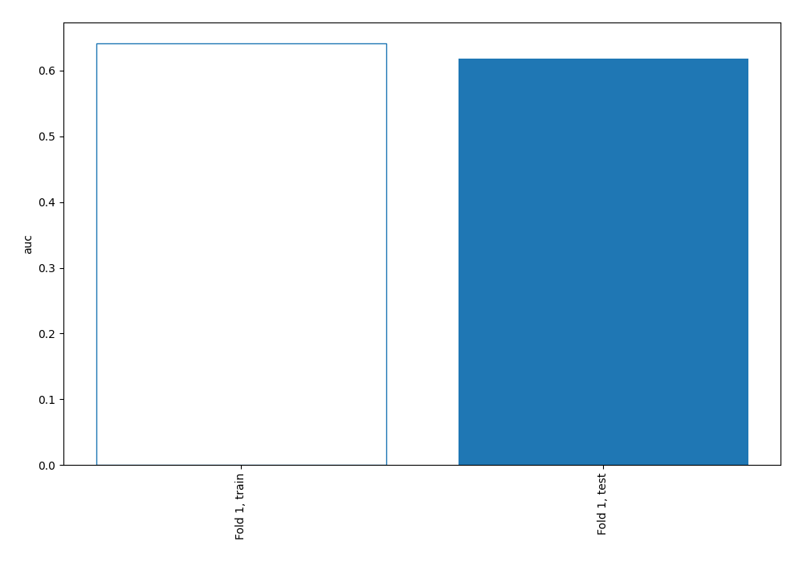

## Permutation-based Importance

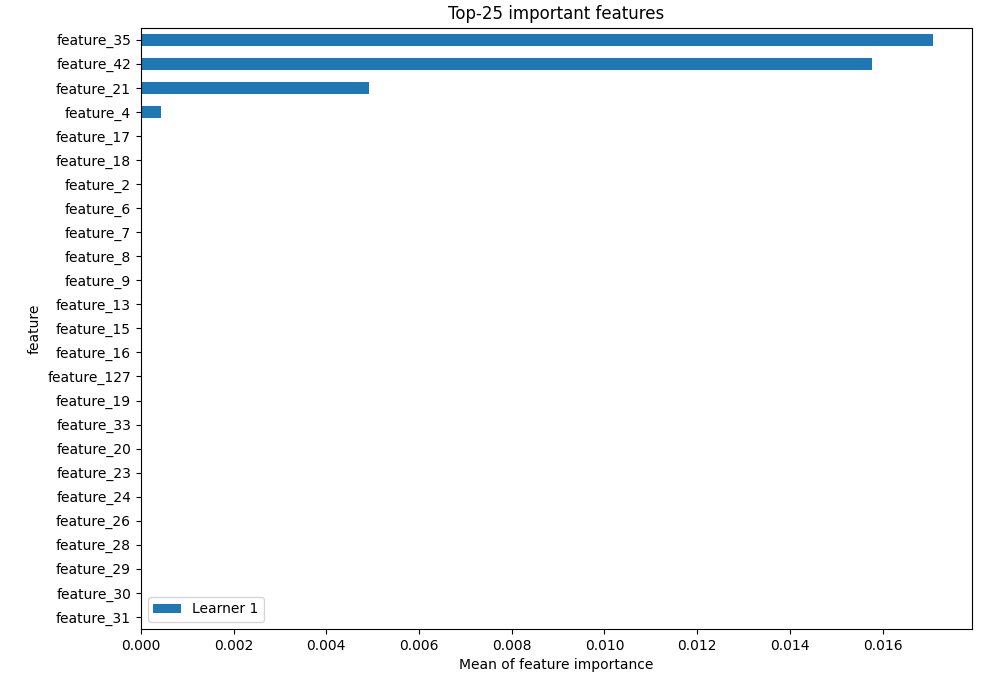

## Confusion Matrix

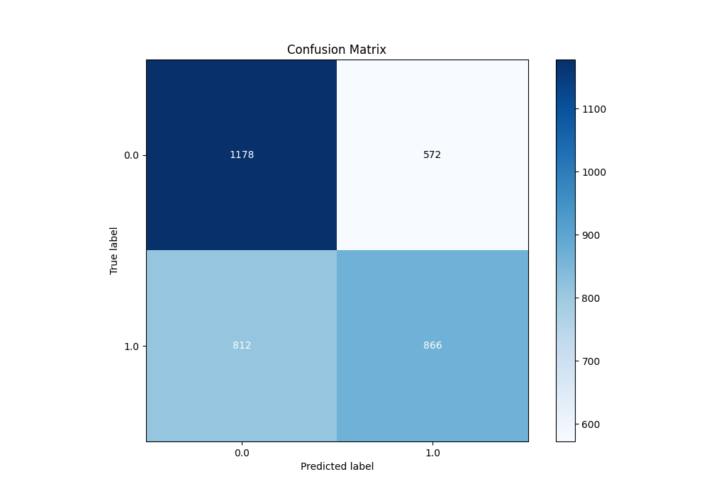

## Normalized Confusion Matrix

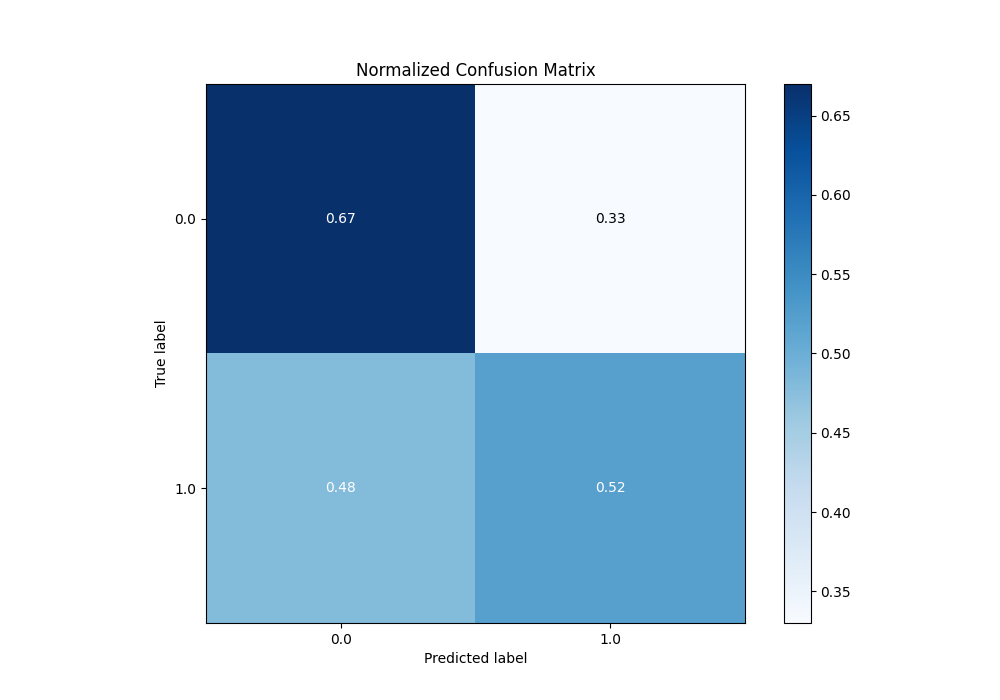

## ROC Curve

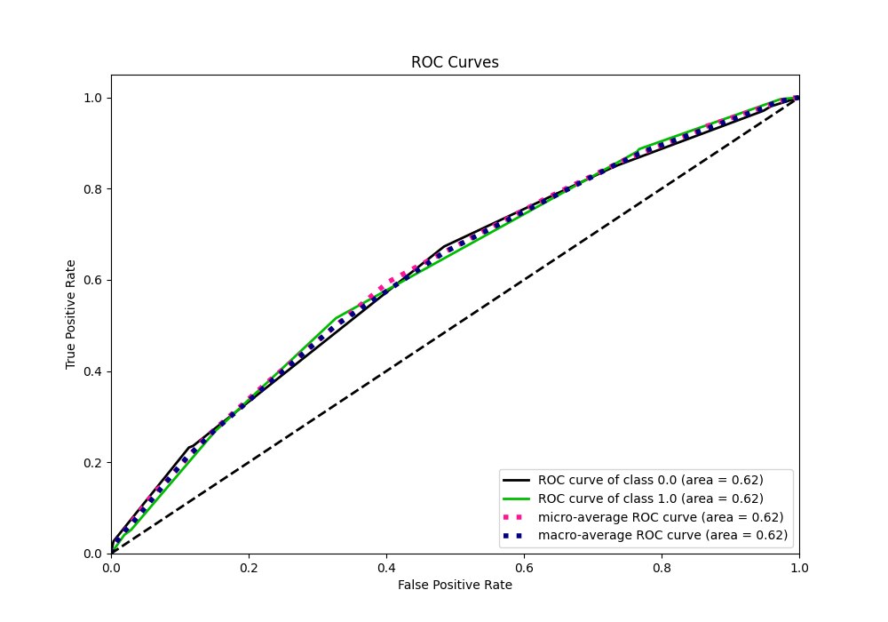

## Kolmogorov-Smirnov Statistic

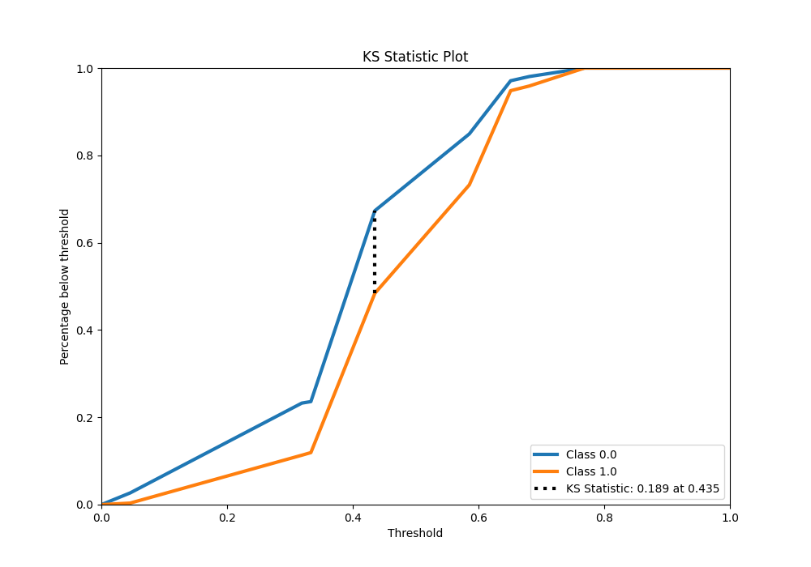

## Precision-Recall Curve

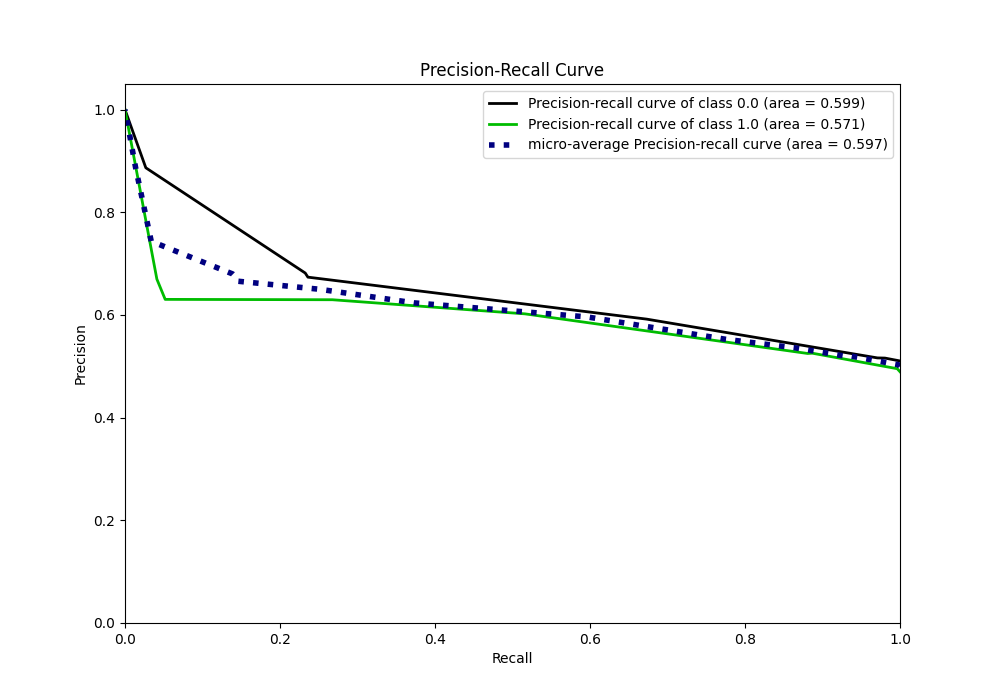

## Calibration Curve

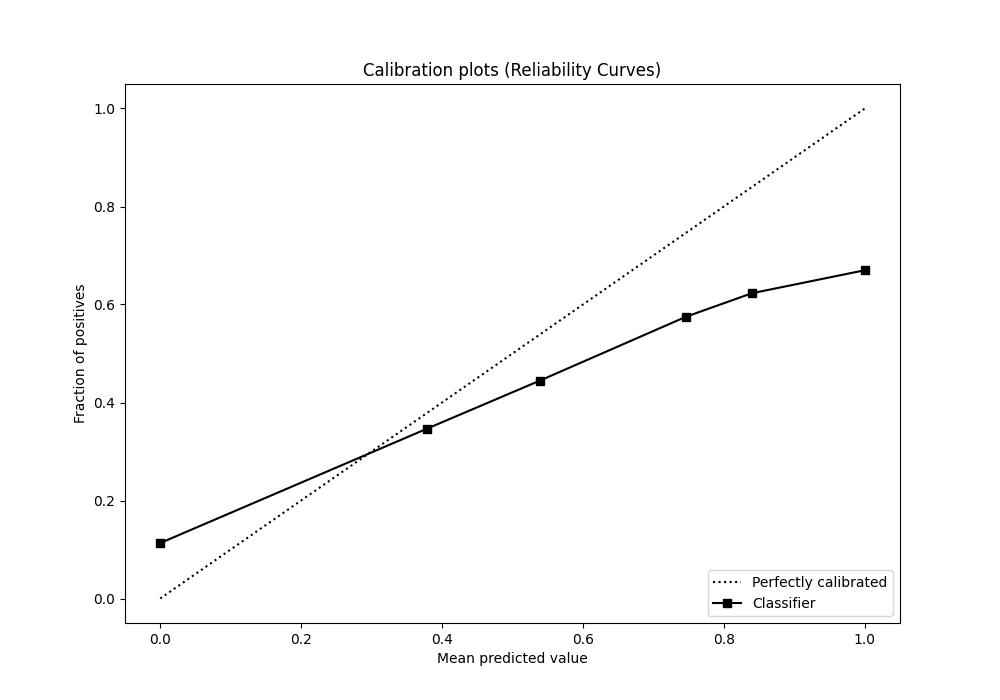

## Cumulative Gains Curve

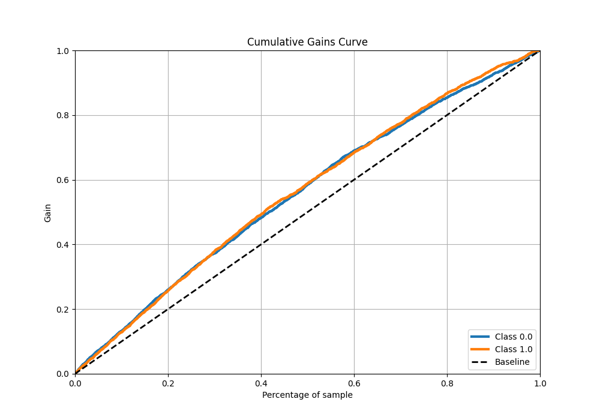

## Lift Curve

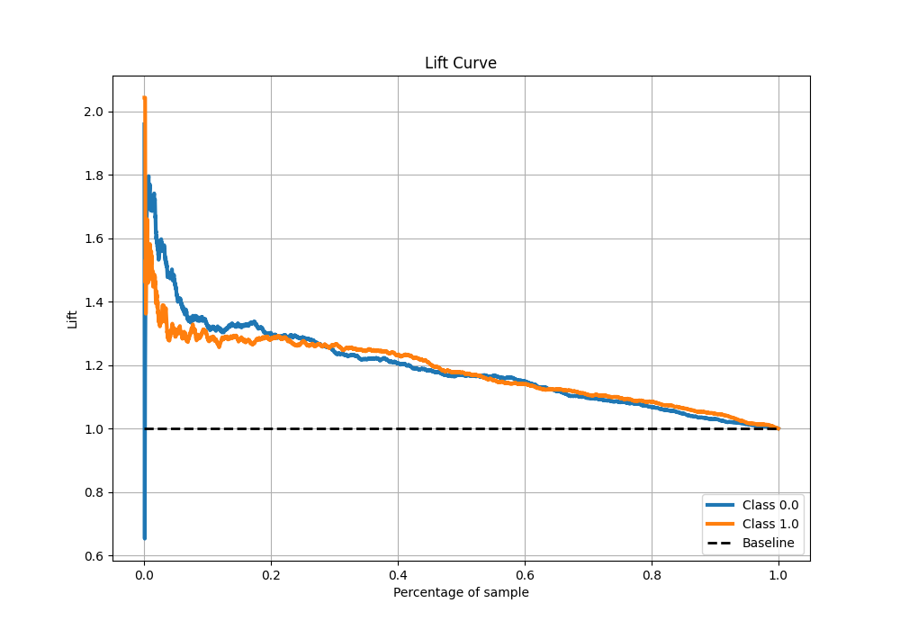

## SHAP Importance

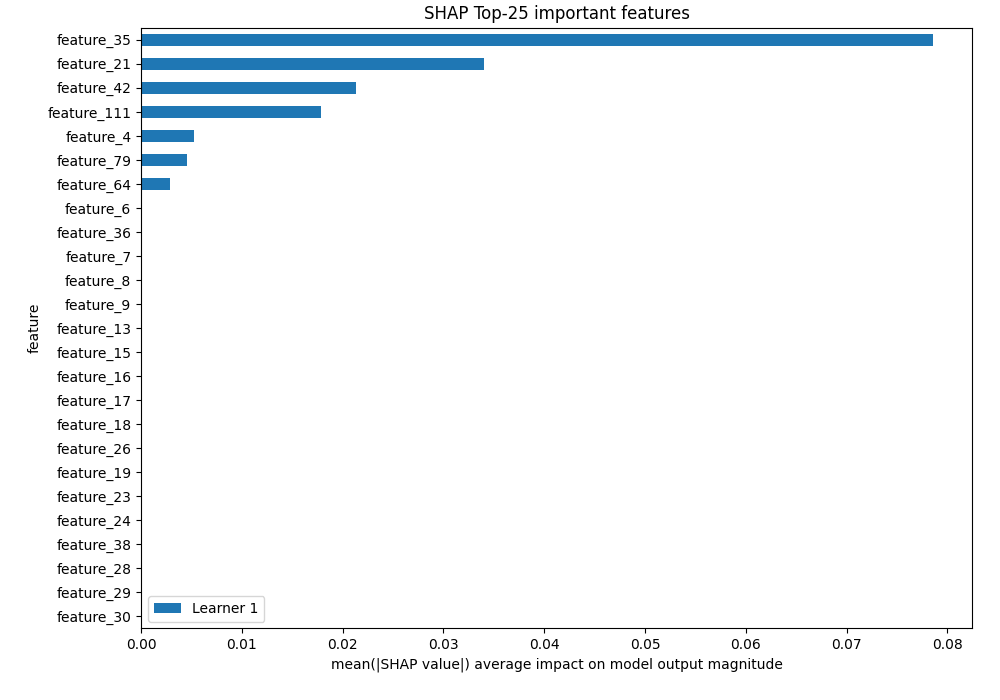

## SHAP Dependence plots

### Dependence (Fold 1)

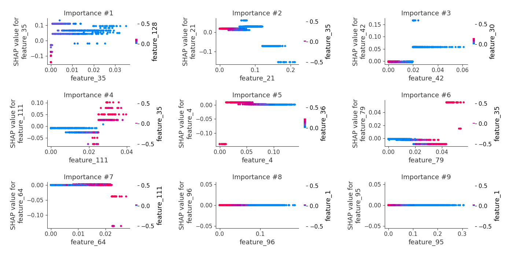

## SHAP Decision plots

[<< Go back](../README.md)
