# Summary of 3_Default_Xgboost

[<< Go back](../README.md)

## Extreme Gradient Boosting (Xgboost)

- **n_jobs**: -1
- **objective**: binary:logistic
- **eta**: 0.075
- **max_depth**: 6
- **min_child_weight**: 1
- **subsample**: 1.0
- **colsample_bytree**: 1.0
- **eval_metric**: auc
- **explain_level**: 2

## Validation

- **validation_type**: split
- **train_ratio**: 0.75
- **shuffle**: True
- **stratify**: True

## Optimized metric

auc

## Training time

24.9 seconds

## Metric details

|           |    score |   threshold |
|:----------|---------:|------------:|
| logloss   | 0.671266 | nan         |
| auc       | 0.619062 | nan         |
| f1        | 0.665819 |   0.346389  |
| accuracy  | 0.588098 |   0.464941  |
| precision | 0.62963  |   0.665024  |
| recall    | 1        |   0.0809205 |
| mcc       | 0.179022 |   0.464344  |

## Metric details with threshold from accuracy metric

|           |    score |   threshold |
|:----------|---------:|------------:|
| logloss   | 0.671266 |  nan        |
| auc       | 0.619062 |  nan        |
| f1        | 0.602029 |    0.464941 |
| accuracy  | 0.588098 |    0.464941 |
| precision | 0.571123 |    0.464941 |
| recall    | 0.636472 |    0.464941 |
| mcc       | 0.178889 |    0.464941 |

## Confusion matrix (at threshold=0.464941)

|              |   Predicted as 0 |   Predicted as 1 |
|:-------------|-----------------:|-----------------:|
| Labeled as 0 |              948 |              802 |
| Labeled as 1 |              610 |             1068 |

## Learning curves

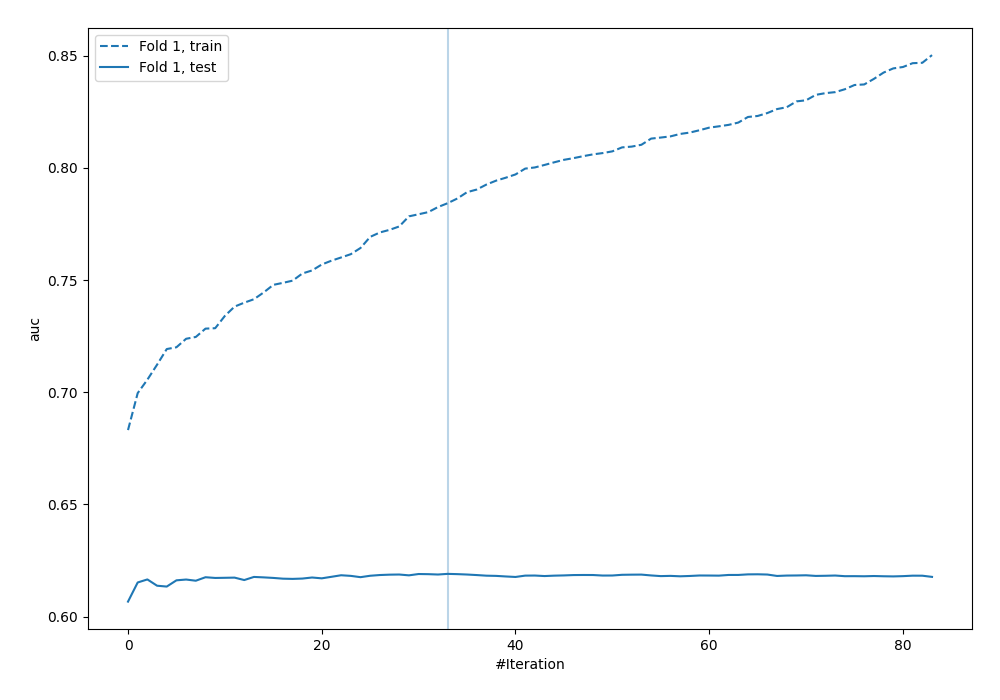

## Permutation-based Importance

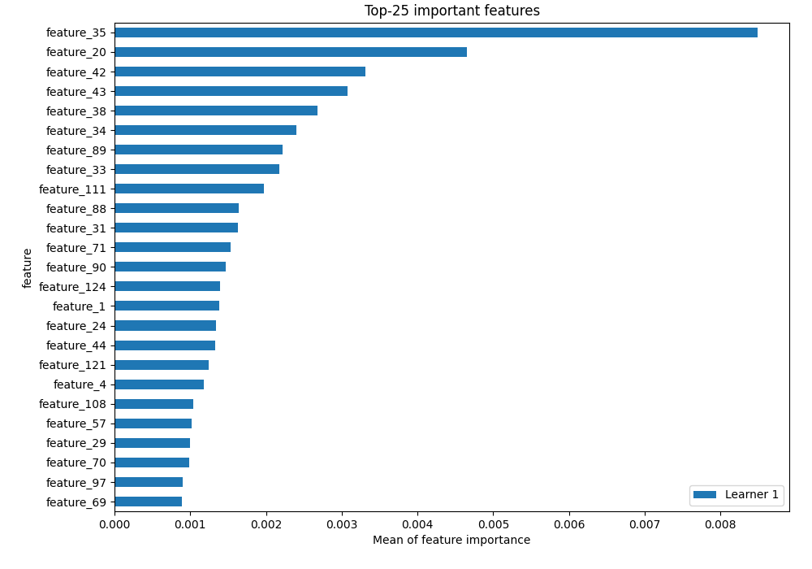

## Confusion Matrix

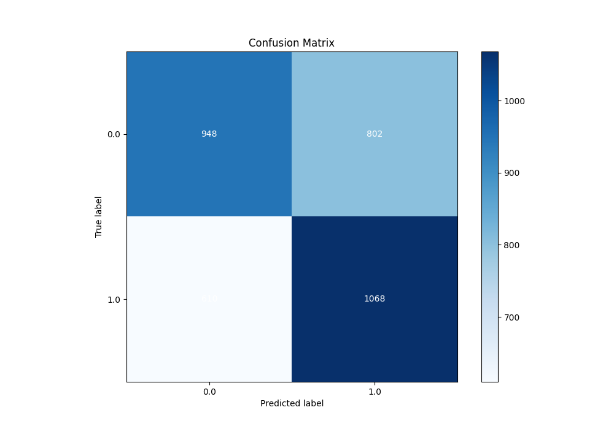

## Normalized Confusion Matrix

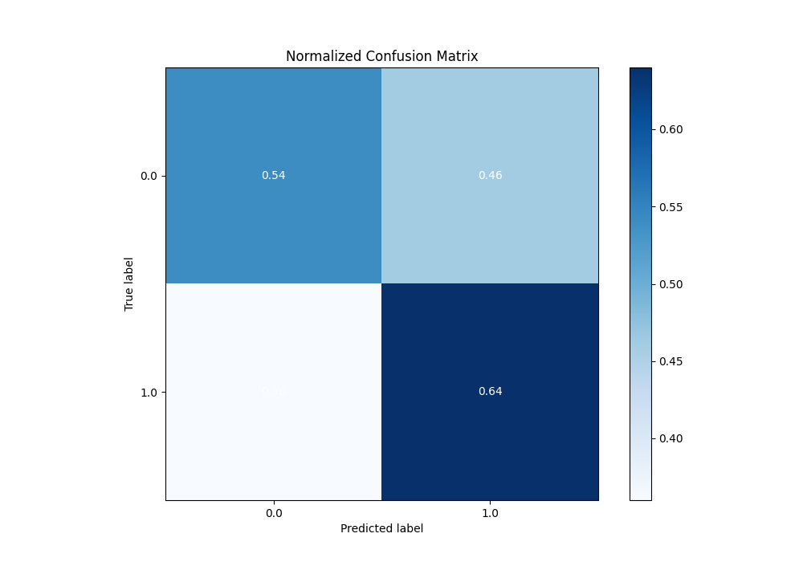

## ROC Curve

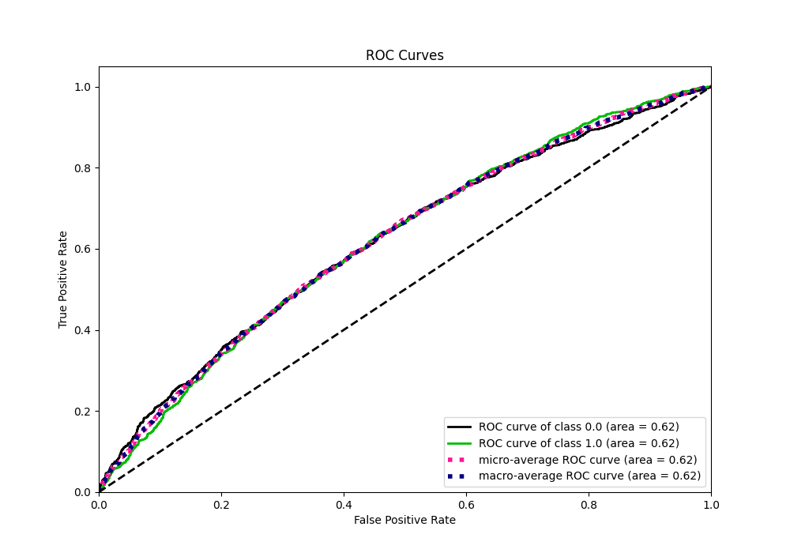

## Kolmogorov-Smirnov Statistic

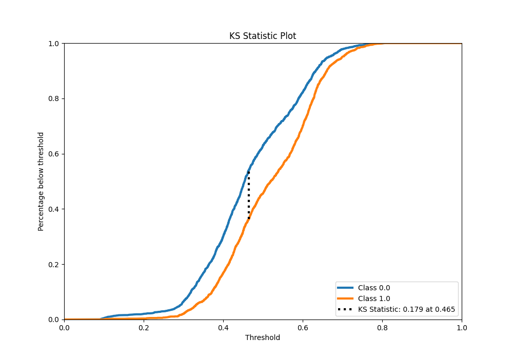

## Precision-Recall Curve

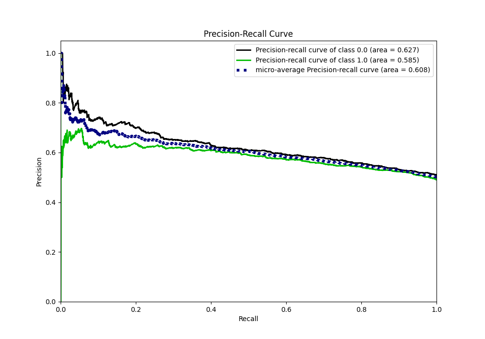

## Calibration Curve

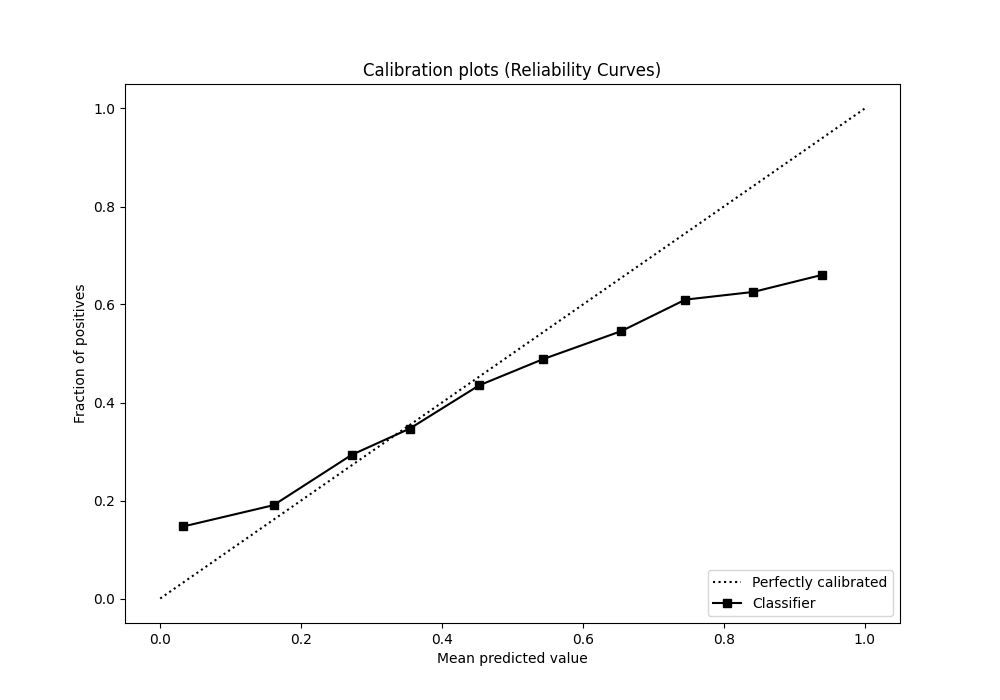

## Cumulative Gains Curve

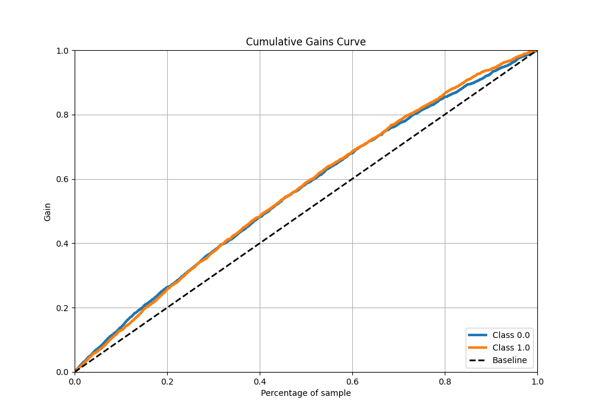

## Lift Curve

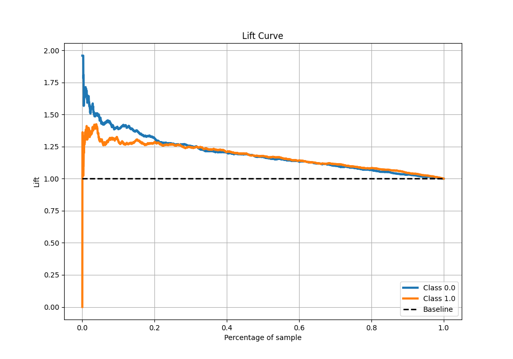

## SHAP Importance

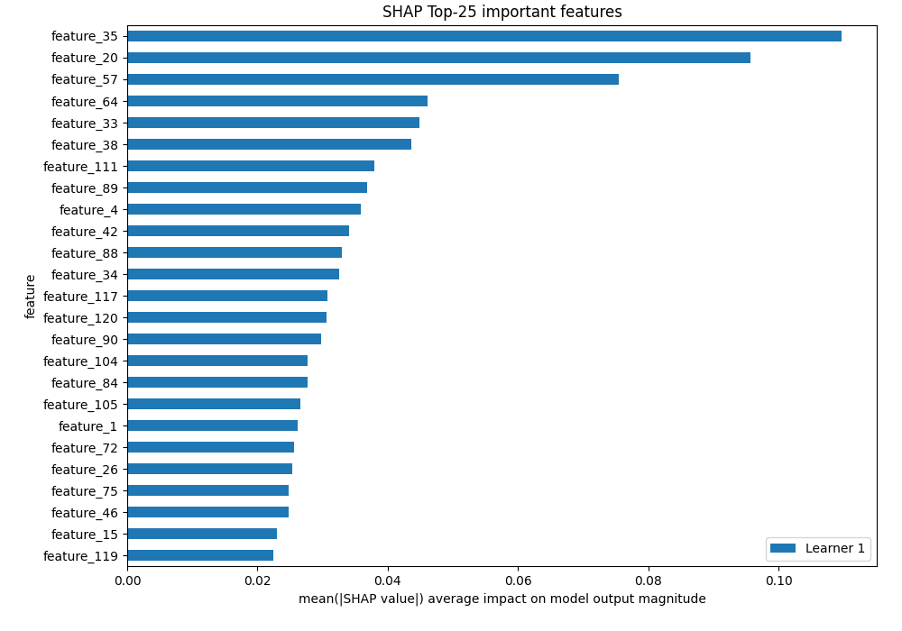

## SHAP Dependence plots

### Dependence (Fold 1)

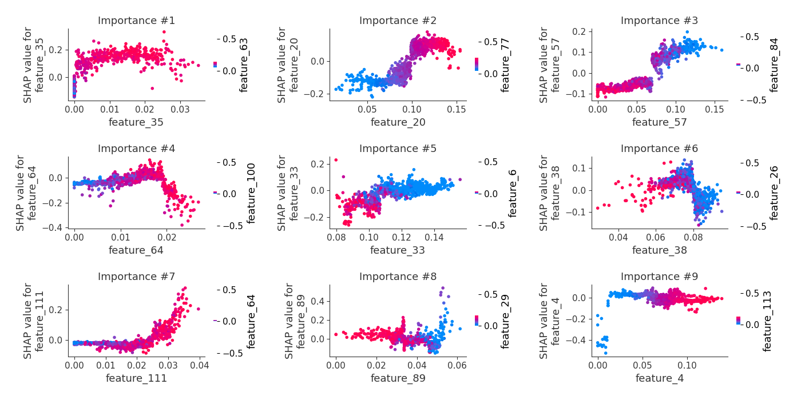

## SHAP Decision plots

[<< Go back](../README.md)
