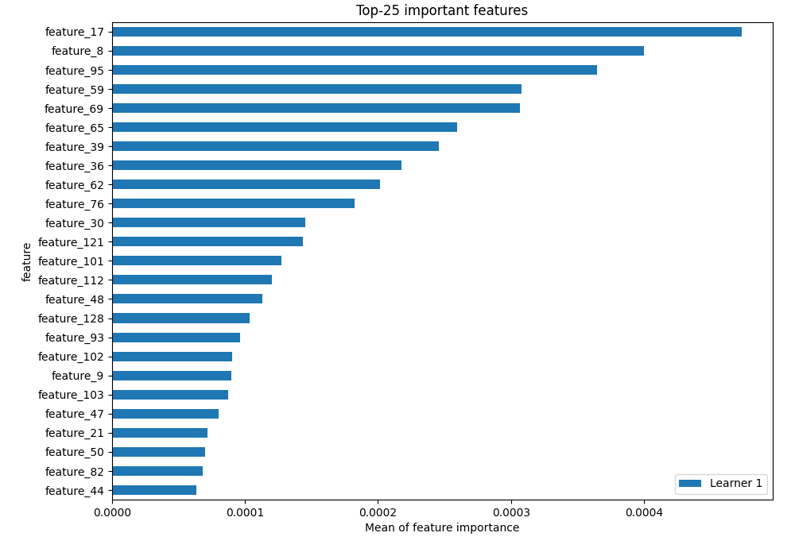
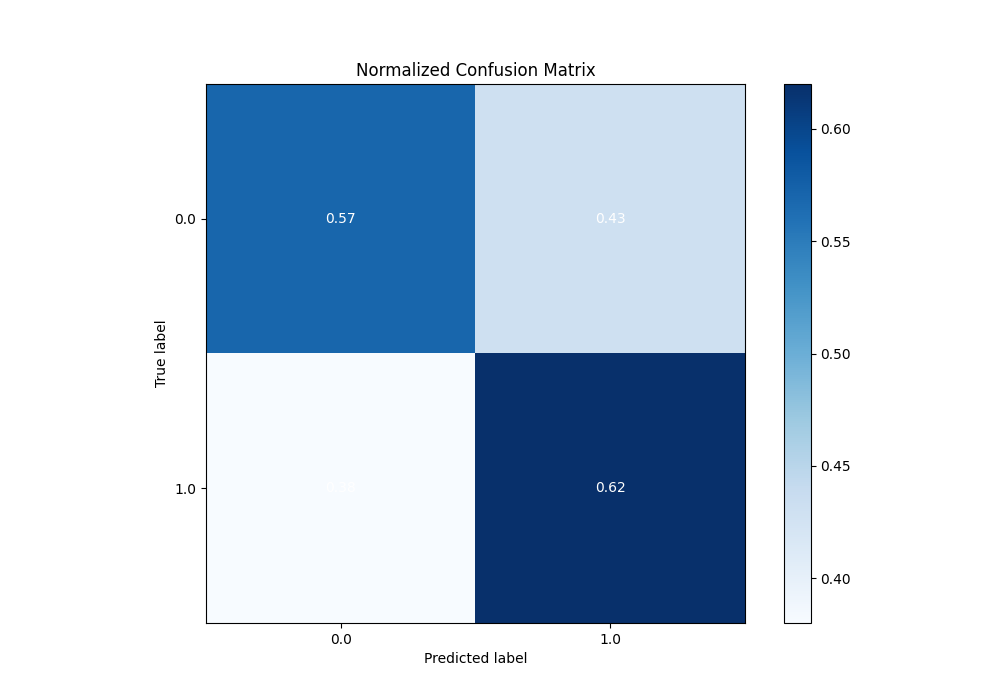

# Summary of 4_Default_NeuralNetwork

[<< Go back](../README.md)

## Neural Network

- **n_jobs**: -1
- **dense_1_size**: 32
- **dense_2_size**: 16
- **learning_rate**: 0.05
- **explain_level**: 2

## Validation

- **validation_type**: split
- **train_ratio**: 0.75
- **shuffle**: True
- **stratify**: True

## Optimized metric

auc

## Training time

2.9 seconds

## Metric details

|           |    score |   threshold |
|:----------|---------:|------------:|
| logloss   | 0.667389 |  nan        |
| auc       | 0.628768 |  nan        |
| f1        | 0.662236 |    0.257732 |
| accuracy  | 0.596849 |    0.461771 |
| precision | 0.58296  |    0.461771 |
| recall    | 1        |    0.118667 |
| mcc       | 0.194762 |    0.461771 |

## Metric details with threshold from accuracy metric

|           |    score |   threshold |
|:----------|---------:|------------:|
| logloss   | 0.667389 |  nan        |
| auc       | 0.628768 |  nan        |
| f1        | 0.600809 |    0.461771 |
| accuracy  | 0.596849 |    0.461771 |
| precision | 0.58296  |    0.461771 |
| recall    | 0.619785 |    0.461771 |
| mcc       | 0.194762 |    0.461771 |

## Confusion matrix (at threshold=0.461771)

|              |   Predicted as 0 |   Predicted as 1 |
|:-------------|-----------------:|-----------------:|
| Labeled as 0 |             1006 |              744 |
| Labeled as 1 |              638 |             1040 |

## Learning curves

## Permutation-based Importance

## Confusion Matrix

## Normalized Confusion Matrix

## ROC Curve

## Kolmogorov-Smirnov Statistic

## Precision-Recall Curve

## Calibration Curve

## Cumulative Gains Curve

## Lift Curve

[<< Go back](../README.md)
