# Summary of 5_Default_RandomForest

[<< Go back](../README.md)

## Random Forest

- **n_jobs**: -1
- **criterion**: gini
- **max_features**: 0.9
- **min_samples_split**: 30
- **max_depth**: 4
- **eval_metric_name**: auc
- **explain_level**: 2

## Validation

- **validation_type**: split
- **train_ratio**: 0.75
- **shuffle**: True
- **stratify**: True

## Optimized metric

auc

## Training time

11.9 seconds

## Metric details

|           |    score |   threshold |
|:----------|---------:|------------:|
| logloss   | 0.664804 | nan         |
| auc       | 0.631465 | nan         |
| f1        | 0.664857 |   0.322972  |
| accuracy  | 0.600058 |   0.521104  |
| precision | 0.661448 |   0.633334  |
| recall    | 1        |   0.0407189 |
| mcc       | 0.199213 |   0.521104  |

## Metric details with threshold from accuracy metric

|           |    score |   threshold |
|:----------|---------:|------------:|
| logloss   | 0.664804 |  nan        |
| auc       | 0.631465 |  nan        |
| f1        | 0.56407  |    0.521104 |
| accuracy  | 0.600058 |    0.521104 |
| precision | 0.604635 |    0.521104 |
| recall    | 0.528605 |    0.521104 |
| mcc       | 0.199213 |    0.521104 |

## Confusion matrix (at threshold=0.521104)

|              |   Predicted as 0 |   Predicted as 1 |
|:-------------|-----------------:|-----------------:|
| Labeled as 0 |             1170 |              580 |
| Labeled as 1 |              791 |              887 |

## Learning curves

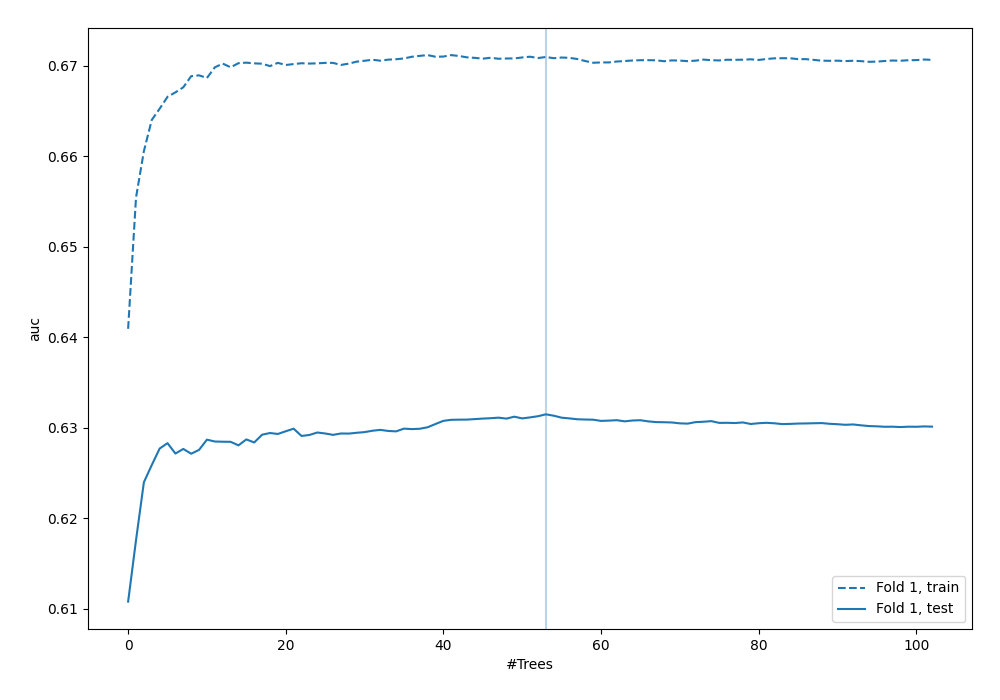

## Permutation-based Importance

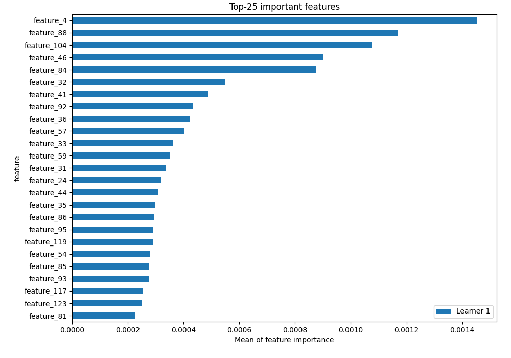

## Confusion Matrix

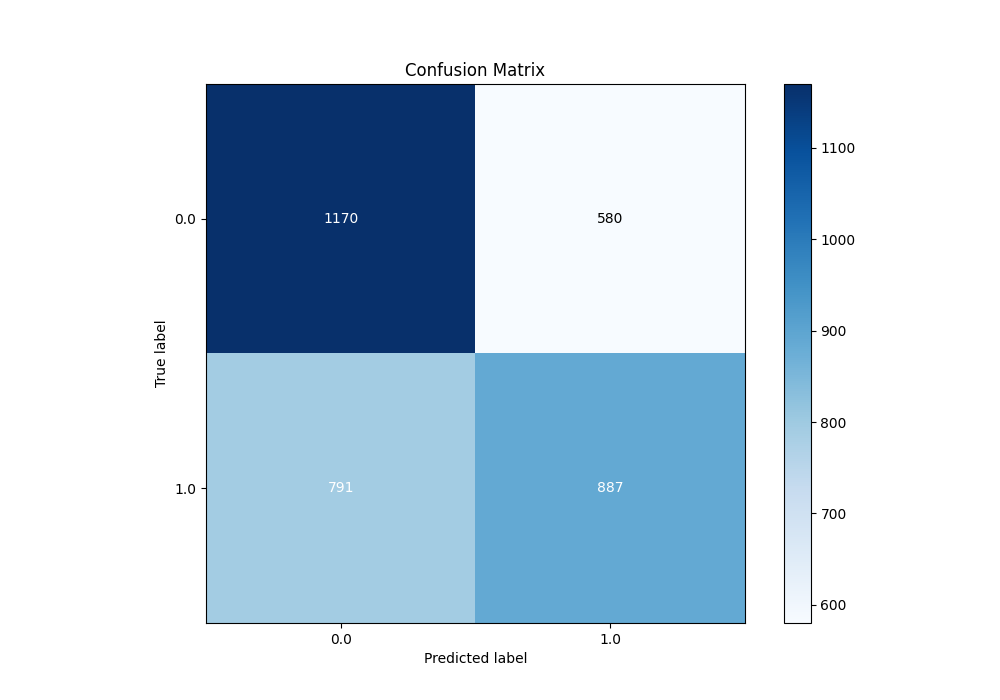

## Normalized Confusion Matrix

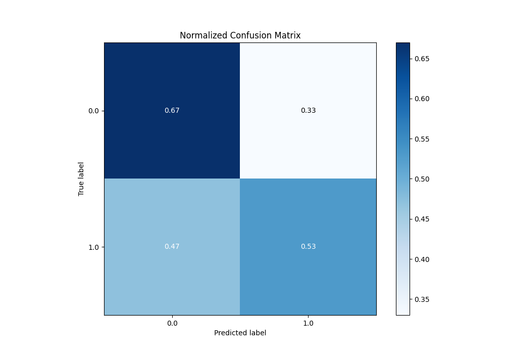

## ROC Curve

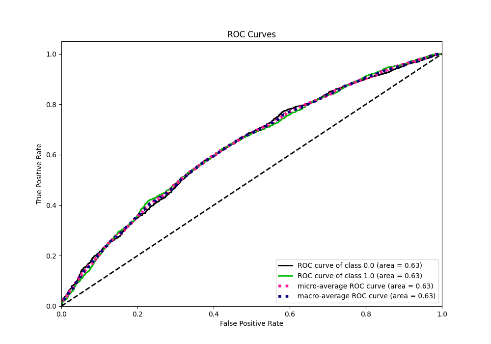

## Kolmogorov-Smirnov Statistic

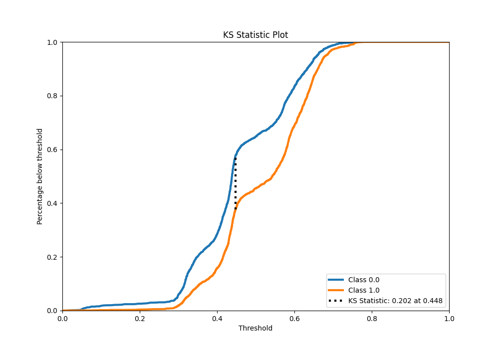

## Precision-Recall Curve

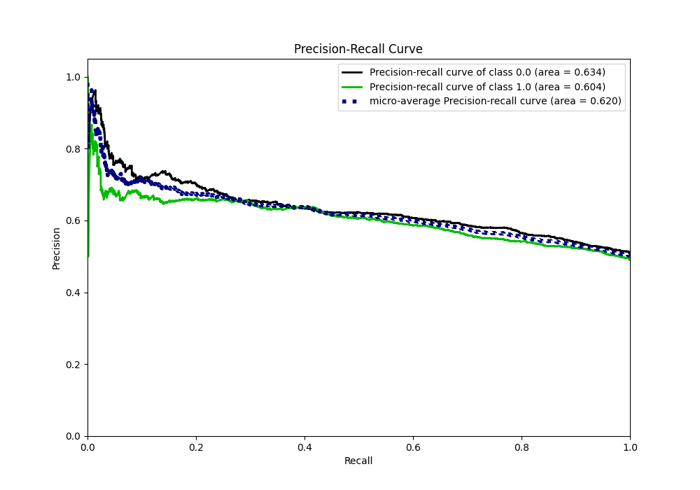

## Calibration Curve

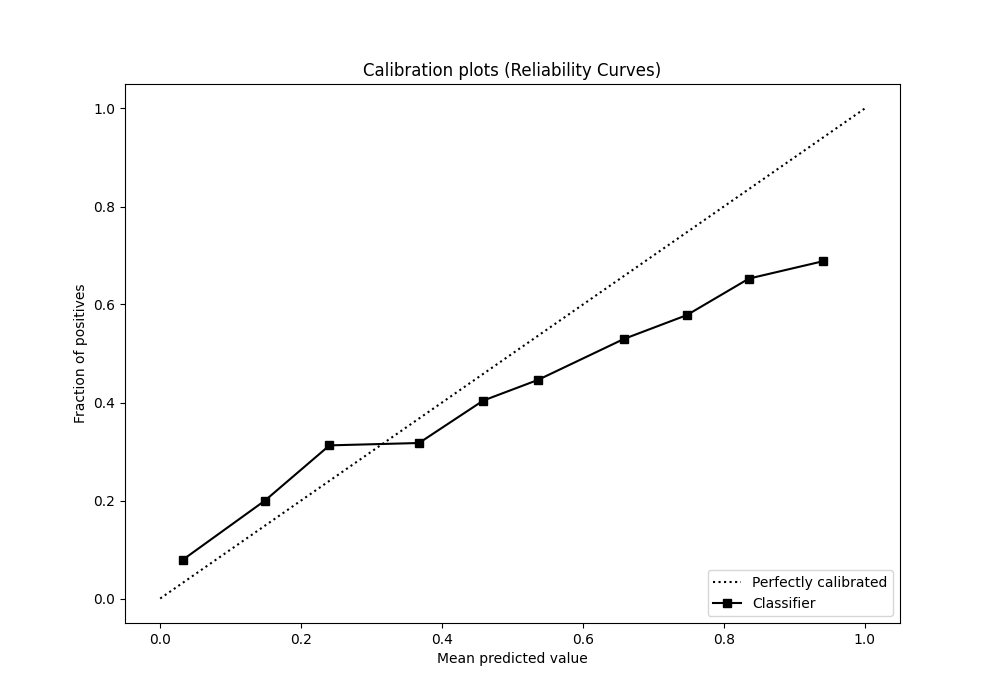

## Cumulative Gains Curve

## Lift Curve

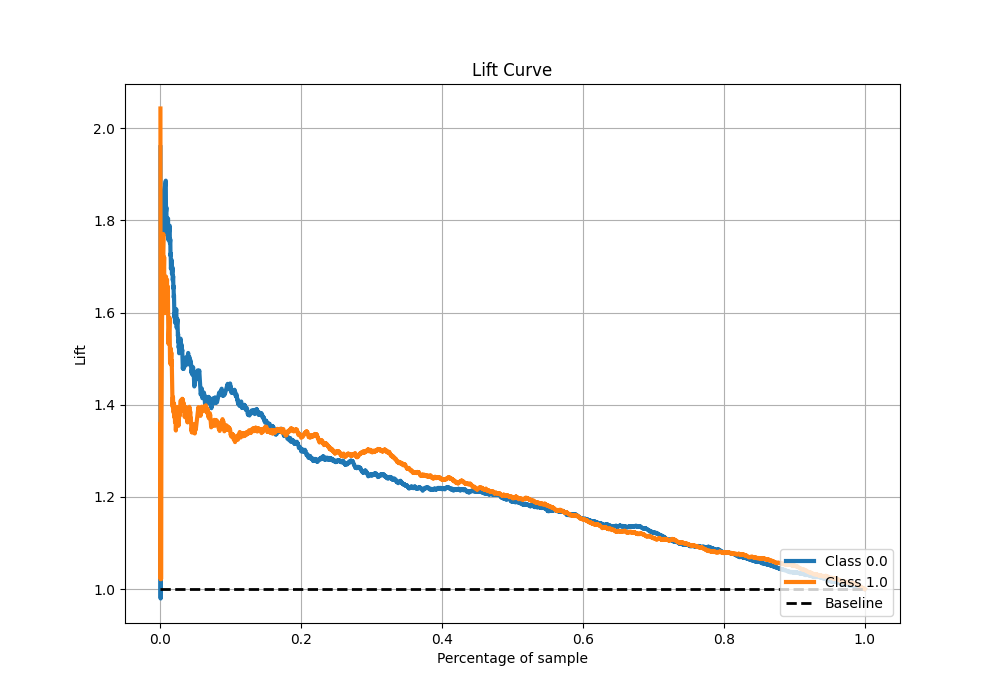

## SHAP Importance

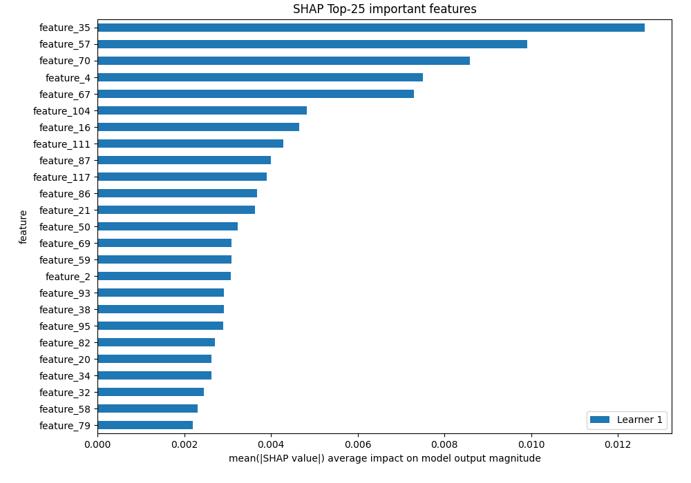

## SHAP Dependence plots

### Dependence (Fold 1)

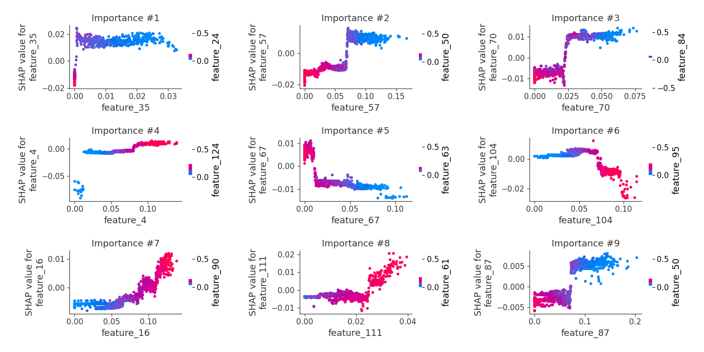

## SHAP Decision plots

[<< Go back](../README.md)
