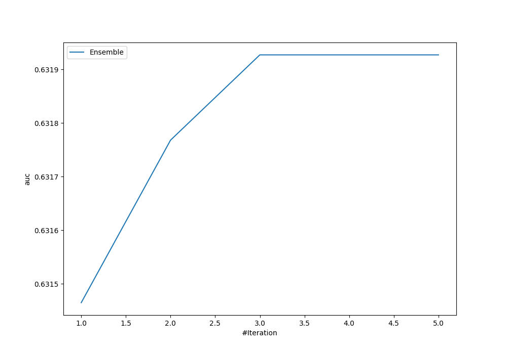
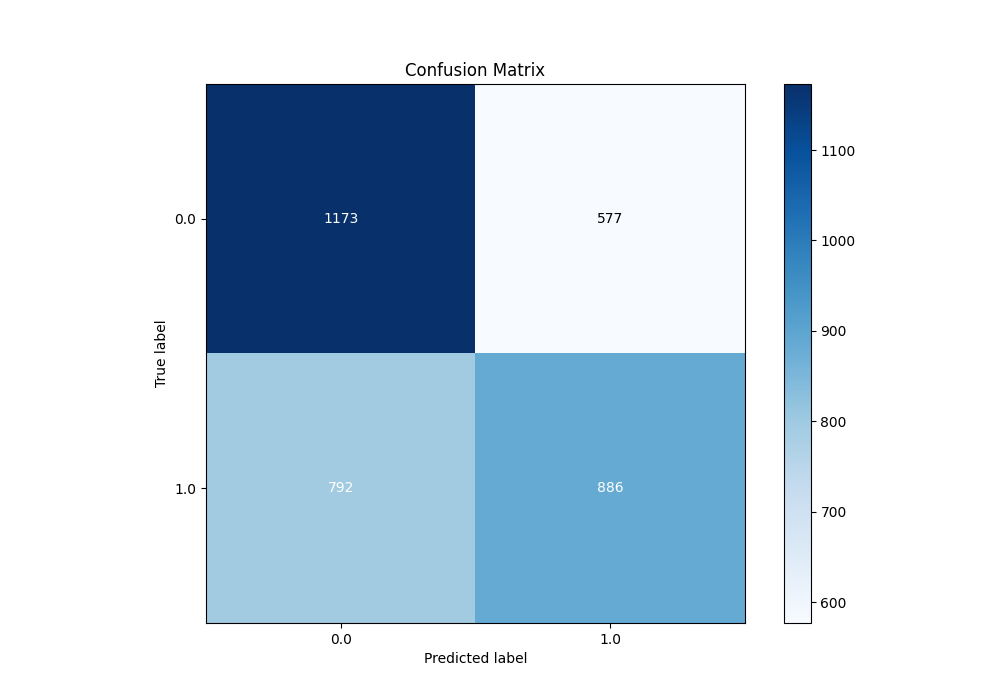
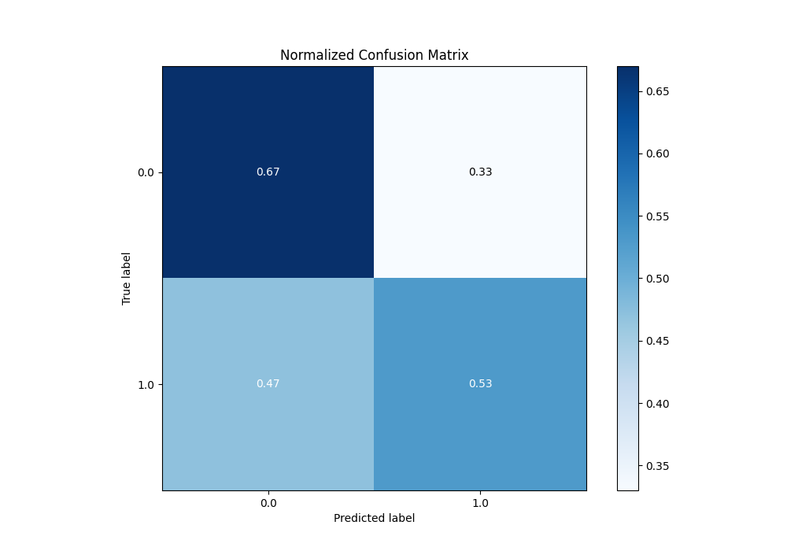
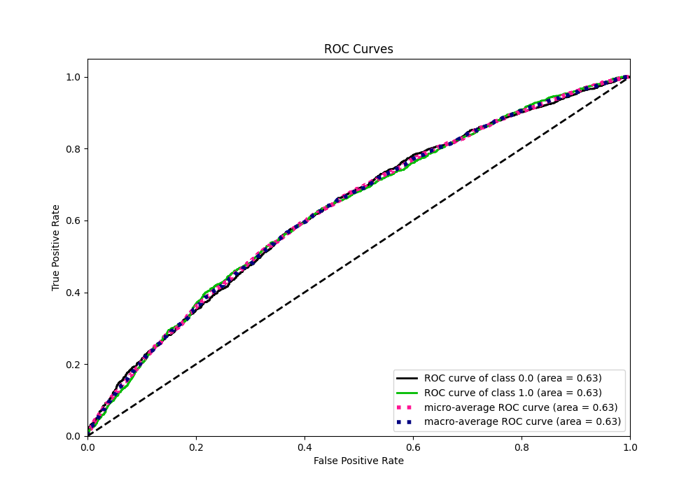
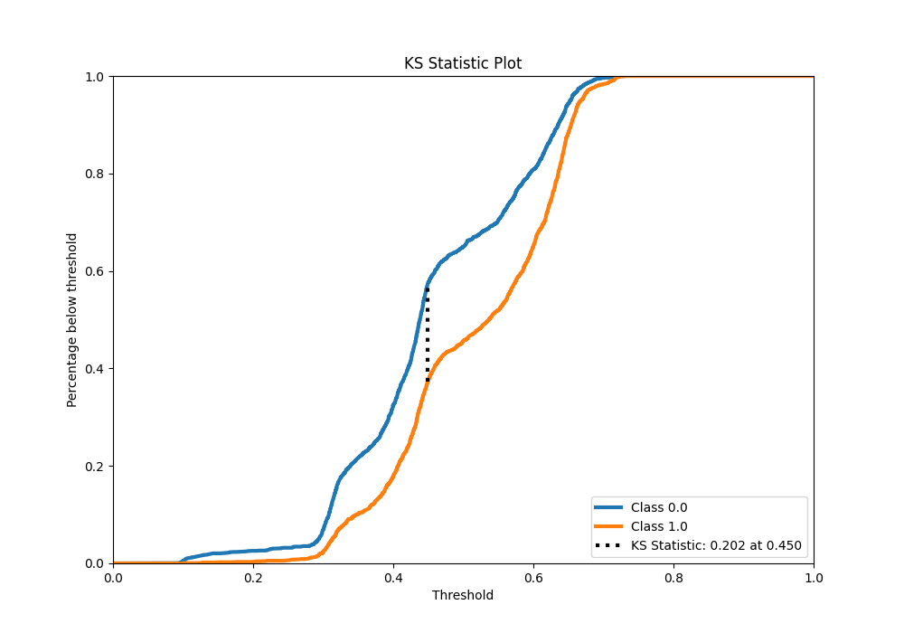
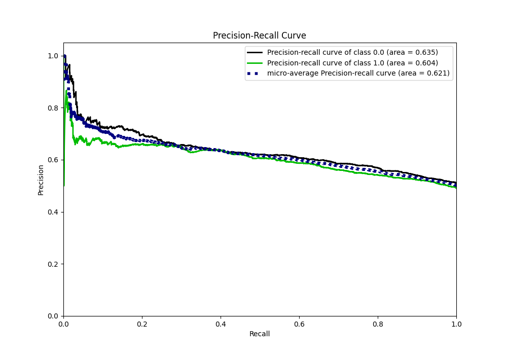
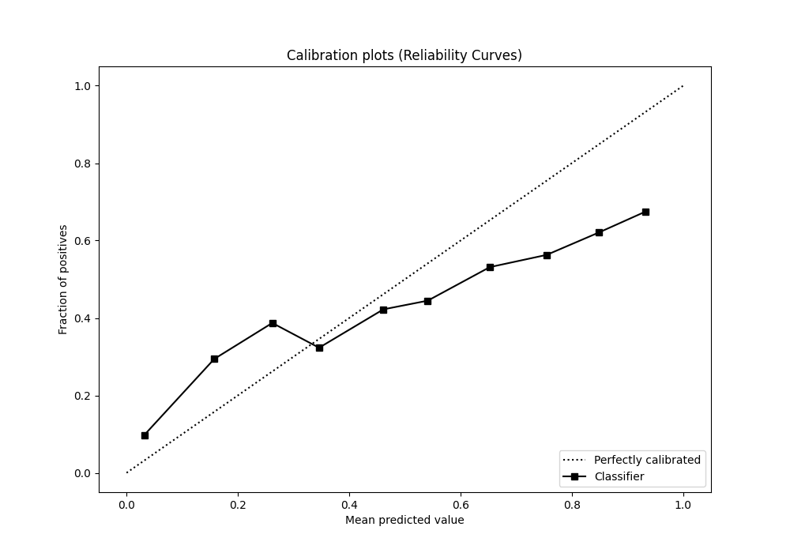
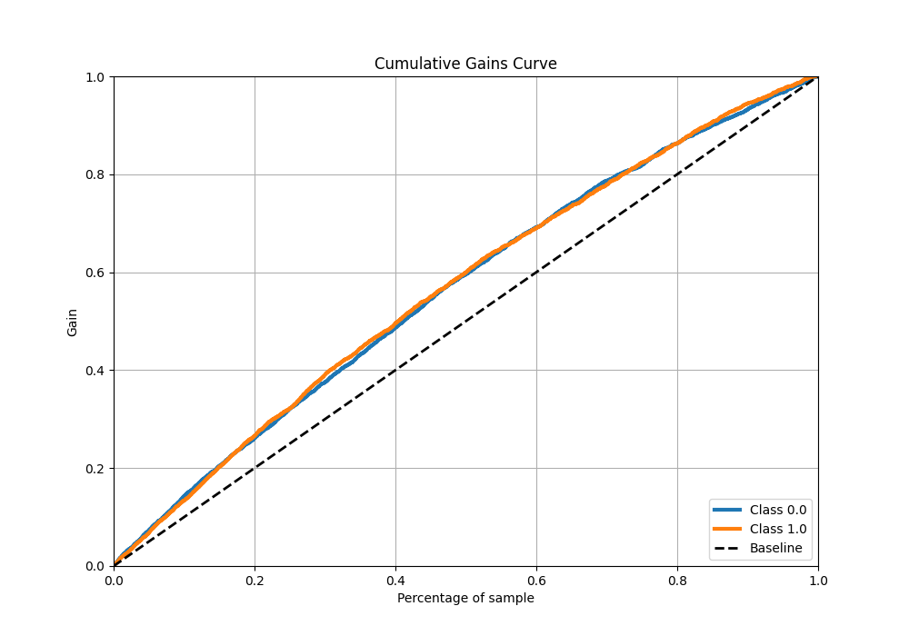
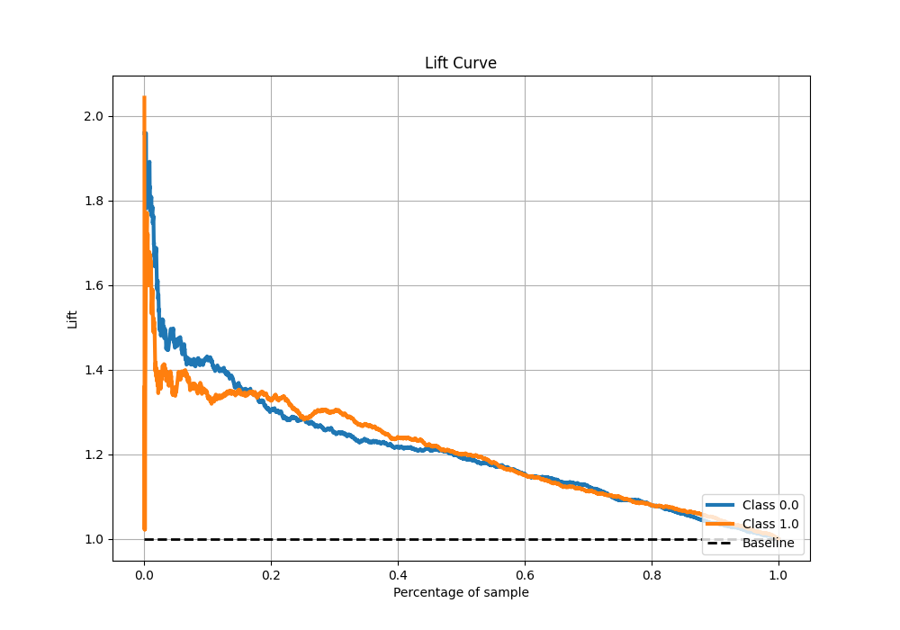

# Summary of Ensemble

[<< Go back](../README.md)

## Ensemble structure

| Model                   |   Weight |
|:------------------------|---------:|
| 4_Default_NeuralNetwork |        1 |
| 5_Default_RandomForest  |        2 |

## Metric details

|           |    score |   threshold |
|:----------|---------:|------------:|
| logloss   | 0.664883 | nan         |
| auc       | 0.631927 | nan         |
| f1        | 0.664653 |   0.332404  |
| accuracy  | 0.600642 |   0.515354  |
| precision | 0.661448 |   0.635542  |
| recall    | 1        |   0.0855096 |
| mcc       | 0.200412 |   0.515354  |

## Metric details with threshold from accuracy metric

|           |    score |   threshold |
|:----------|---------:|------------:|
| logloss   | 0.664883 |  nan        |
| auc       | 0.631927 |  nan        |
| f1        | 0.564152 |    0.515354 |
| accuracy  | 0.600642 |    0.515354 |
| precision | 0.605605 |    0.515354 |
| recall    | 0.52801  |    0.515354 |
| mcc       | 0.200412 |    0.515354 |

## Confusion matrix (at threshold=0.515354)

|              |   Predicted as 0 |   Predicted as 1 |
|:-------------|-----------------:|-----------------:|
| Labeled as 0 |             1173 |              577 |
| Labeled as 1 |              792 |              886 |

## Learning curves

## Confusion Matrix

## Normalized Confusion Matrix

## ROC Curve

## Kolmogorov-Smirnov Statistic

## Precision-Recall Curve

## Calibration Curve

## Cumulative Gains Curve

## Lift Curve

[<< Go back](../README.md)
