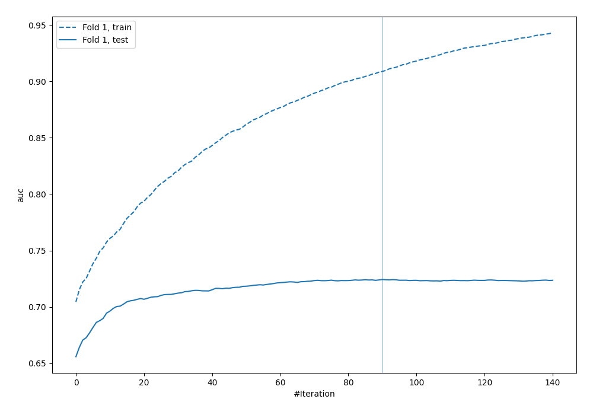
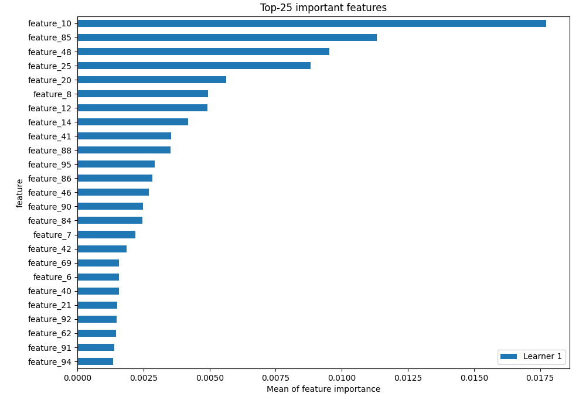
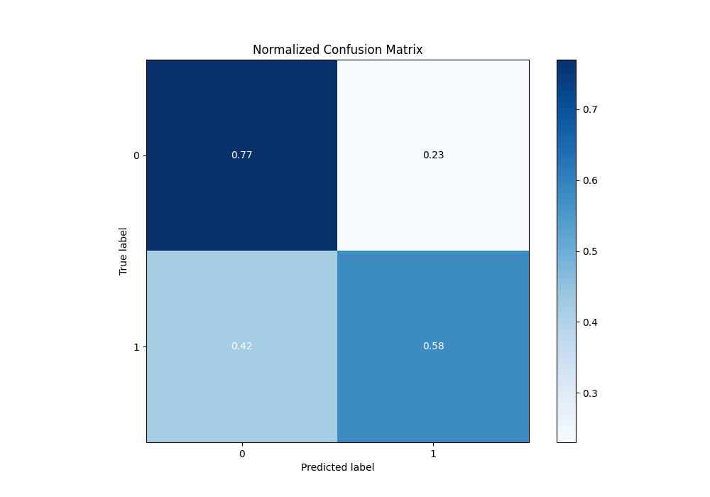
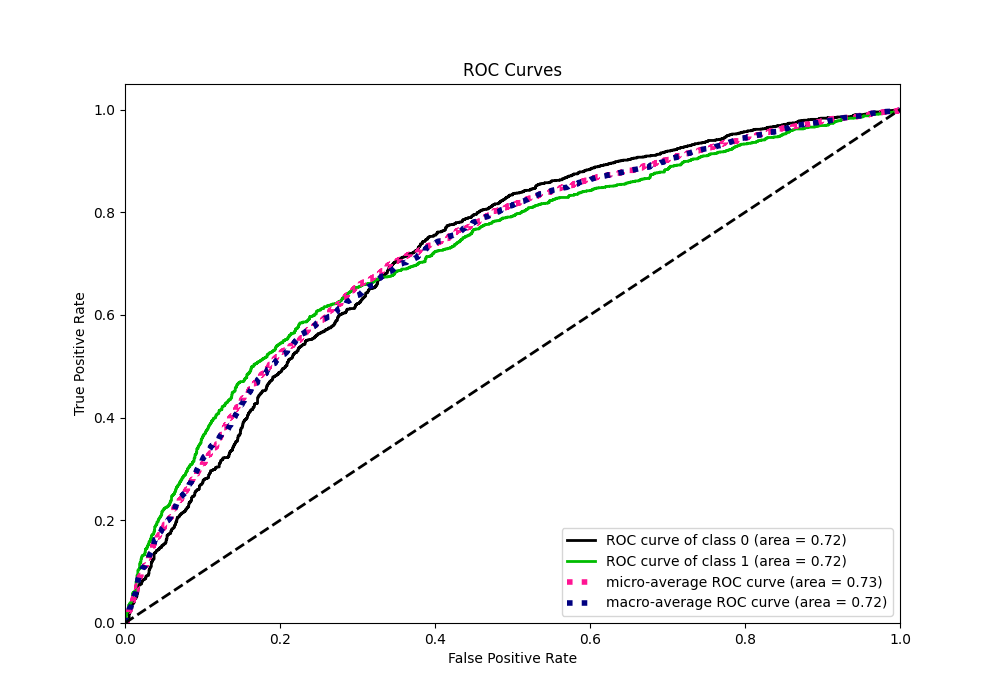
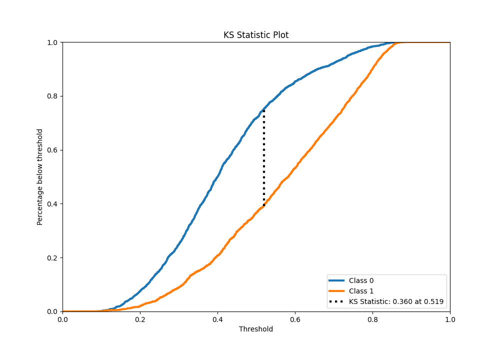
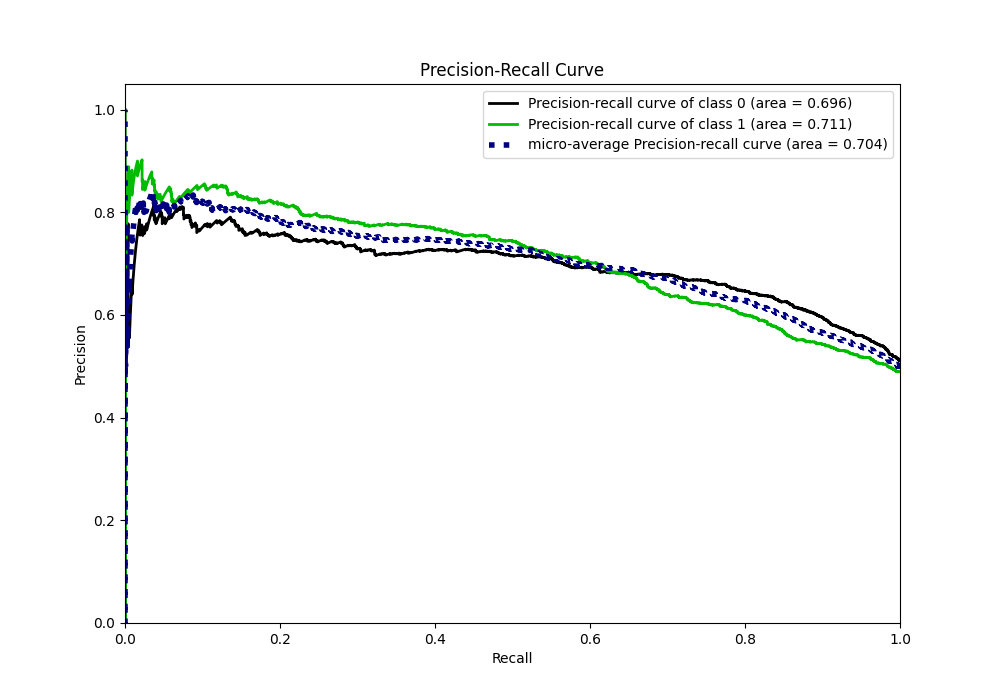
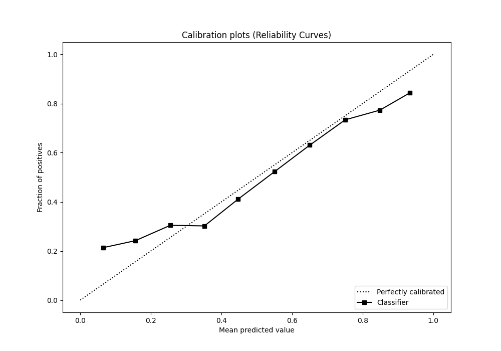
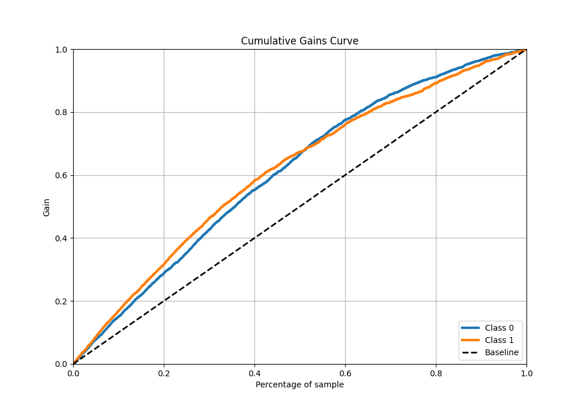
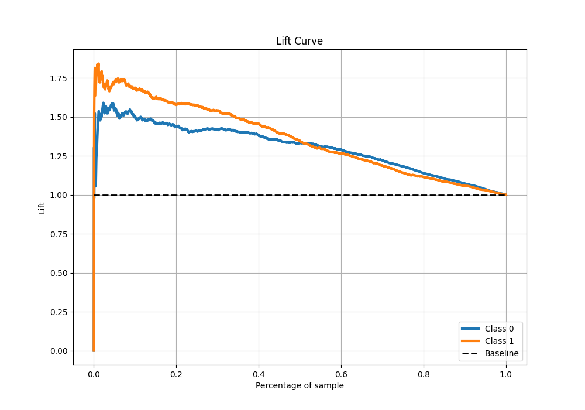
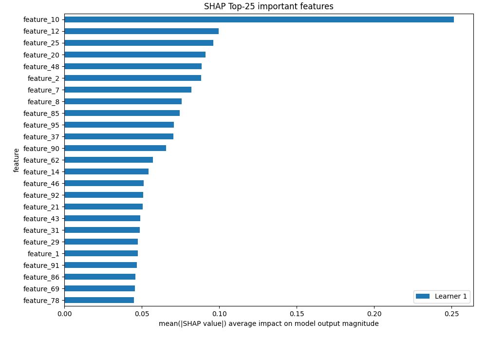

# Summary of 3_Default_Xgboost

[<< Go back](../README.md)

## Extreme Gradient Boosting (Xgboost)

- **n_jobs**: -1
- **objective**: binary:logistic
- **eta**: 0.075
- **max_depth**: 6
- **min_child_weight**: 1
- **subsample**: 1.0
- **colsample_bytree**: 1.0
- **eval_metric**: auc
- **explain_level**: 2

## Validation

- **validation_type**: split
- **train_ratio**: 0.75
- **shuffle**: True
- **stratify**: True

## Optimized metric

auc

## Training time

26.8 seconds

## Metric details

|           |    score |   threshold |
|:----------|---------:|------------:|
| logloss   | 0.613977 | nan         |
| auc       | 0.724321 | nan         |
| f1        | 0.687135 |   0.390441  |
| accuracy  | 0.680863 |   0.533547  |
| precision | 0.834483 |   0.778462  |
| recall    | 1        |   0.0796373 |
| mcc       | 0.364891 |   0.533547  |

## Metric details with threshold from accuracy metric

|           |    score |   threshold |
|:----------|---------:|------------:|
| logloss   | 0.613977 |  nan        |
| auc       | 0.724321 |  nan        |
| f1        | 0.641547 |    0.533547 |
| accuracy  | 0.680863 |    0.533547 |
| precision | 0.712518 |    0.533547 |
| recall    | 0.583433 |    0.533547 |
| mcc       | 0.364891 |    0.533547 |

## Confusion matrix (at threshold=0.533547)

|              |   Predicted as 0 |   Predicted as 1 |
|:-------------|-----------------:|-----------------:|
| Labeled as 0 |             1355 |              395 |
| Labeled as 1 |              699 |              979 |

## Learning curves

## Permutation-based Importance

## Confusion Matrix

## Normalized Confusion Matrix

## ROC Curve

## Kolmogorov-Smirnov Statistic

## Precision-Recall Curve

## Calibration Curve

## Cumulative Gains Curve

## Lift Curve

## SHAP Importance

[<< Go back](../README.md)
