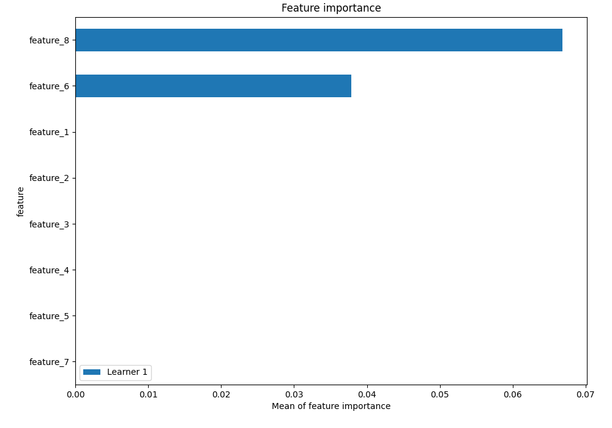
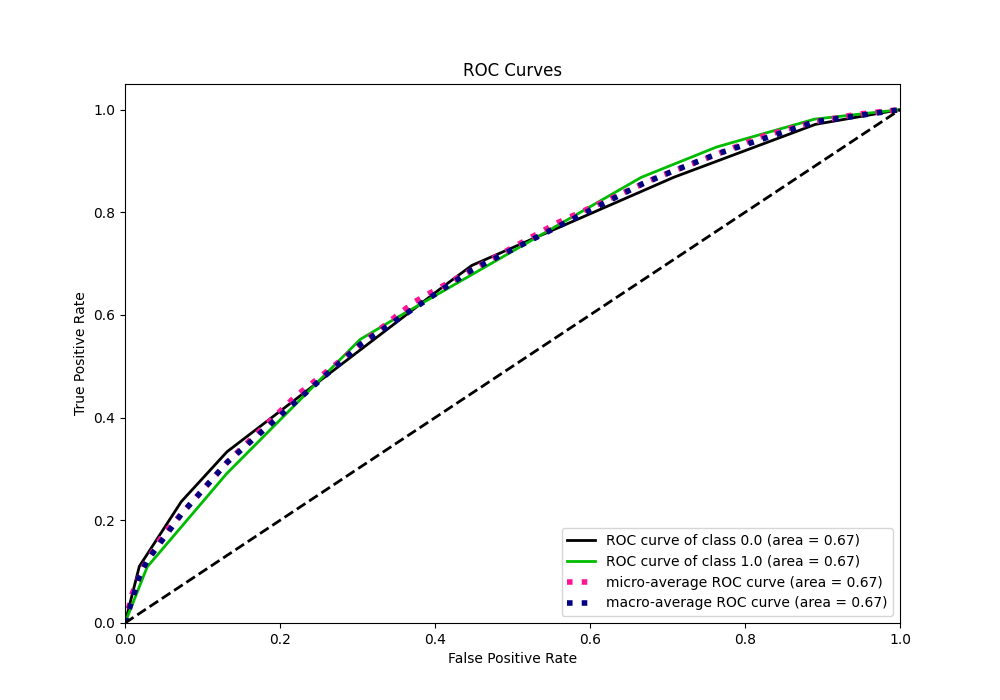
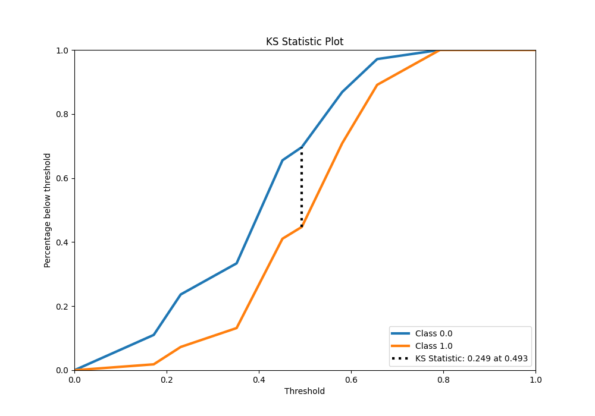
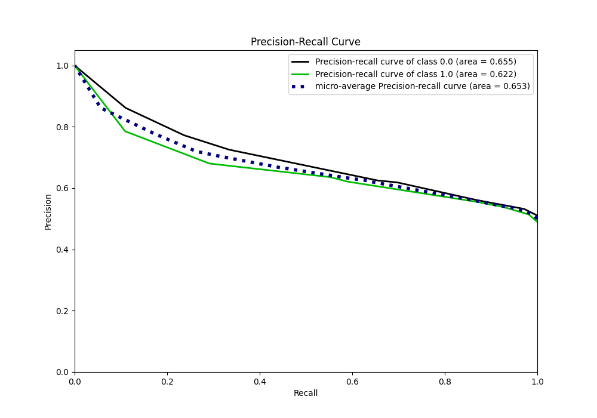
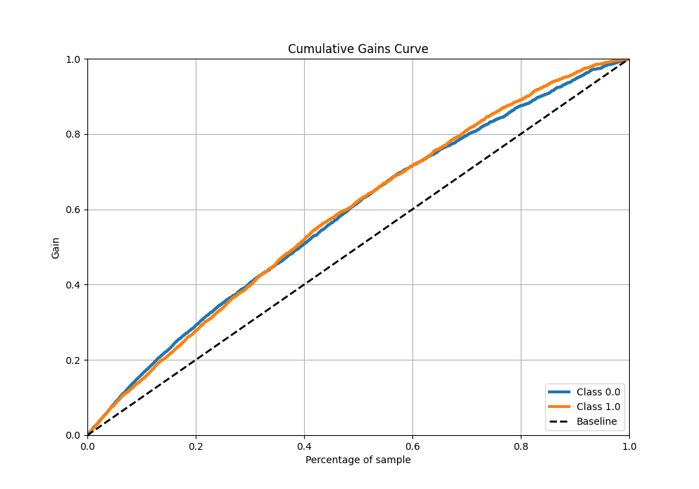
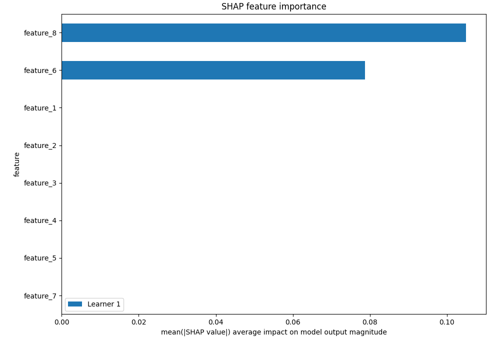

# Summary of 2_DecisionTree

[<< Go back](../README.md)

## Decision Tree

- **n_jobs**: -1
- **criterion**: gini
- **max_depth**: 3
- **explain_level**: 2

## Validation

- **validation_type**: split
- **train_ratio**: 0.75
- **shuffle**: True
- **stratify**: True

## Optimized metric

auc

## Training time

5.6 seconds

## Metric details

|           |    score |   threshold |
|:----------|---------:|------------:|
| logloss   | 0.652409 |  nan        |
| auc       | 0.657507 |  nan        |
| f1        | 0.67495  |    0.358235 |
| accuracy  | 0.628186 |    0.523812 |
| precision | 0.74     |    0.703406 |
| recall    | 1        |    0.164312 |
| mcc       | 0.260367 |    0.523812 |

## Metric details with threshold from accuracy metric

|           |    score |   threshold |
|:----------|---------:|------------:|
| logloss   | 0.652409 |  nan        |
| auc       | 0.657507 |  nan        |
| f1        | 0.643639 |    0.523812 |
| accuracy  | 0.628186 |    0.523812 |
| precision | 0.605708 |    0.523812 |
| recall    | 0.686639 |    0.523812 |
| mcc       | 0.260367 |    0.523812 |

## Confusion matrix (at threshold=0.523812)

|              |   Predicted as 0 |   Predicted as 1 |
|:-------------|-----------------:|-----------------:|
| Labeled as 0 |              998 |              746 |
| Labeled as 1 |              523 |             1146 |

## Learning curves

## Permutation-based Importance

## Confusion Matrix

## Normalized Confusion Matrix

## ROC Curve

## Kolmogorov-Smirnov Statistic

## Precision-Recall Curve

## Calibration Curve

## Cumulative Gains Curve

## Lift Curve

## SHAP Importance

[<< Go back](../README.md)
