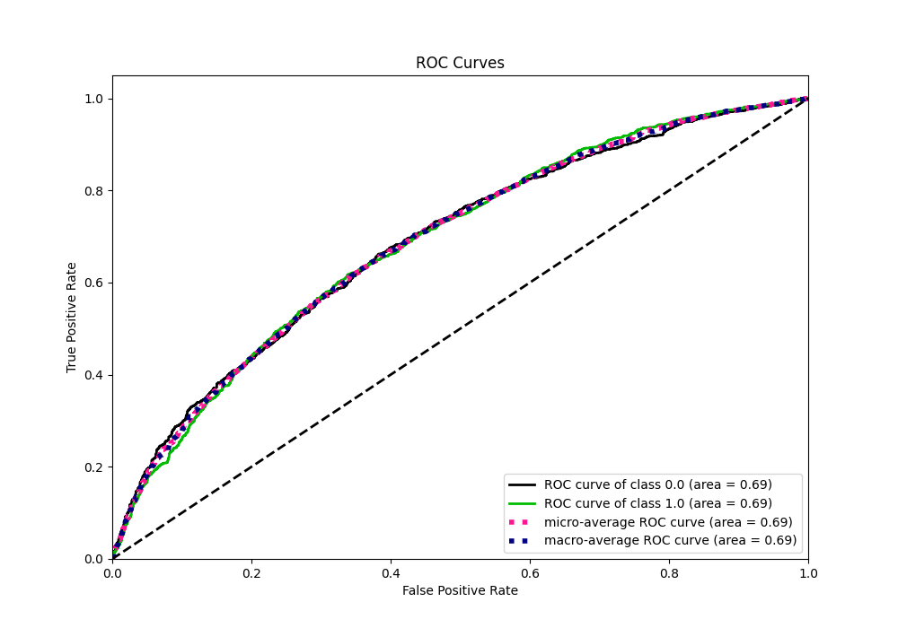
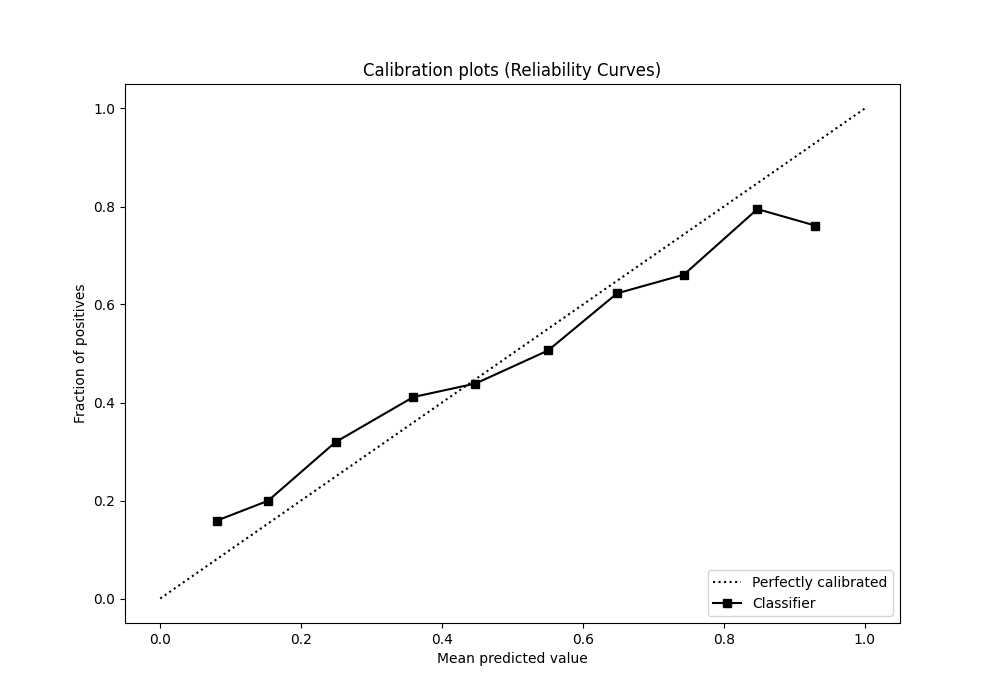
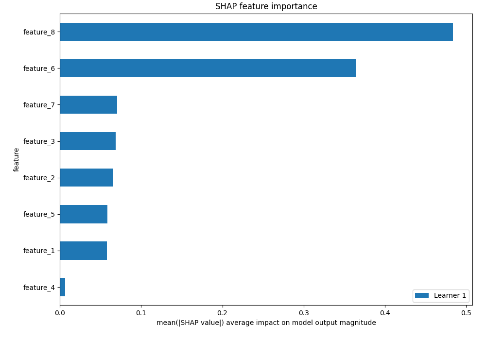

# Summary of 3_Default_Xgboost

[<< Go back](../README.md)

## Extreme Gradient Boosting (Xgboost)
- **n_jobs**: -1
- **objective**: binary:logistic
- **eta**: 0.075
- **max_depth**: 6
- **min_child_weight**: 1
- **subsample**: 1.0
- **colsample_bytree**: 1.0
- **eval_metric**: auc
- **explain_level**: 2

## Validation

- **validation_type**: split
- **train_ratio**: 0.75
- **shuffle**: True
- **stratify**: True

## Optimized metric

auc

## Training time

4.7 seconds

## Metric details

|           |    score |   threshold |
|:----------|---------:|------------:|
| logloss   | 0.636667 | nan         |
| auc       | 0.687464 | nan         |
| f1        | 0.68561  |   0.351141  |
| accuracy  | 0.639732 |   0.509639  |
| precision | 0.776786 |   0.700126  |
| recall    | 1        |   0.0870429 |
| mcc       | 0.278844 |   0.509639  |

## Metric details with threshold from accuracy metric

|           |    score |   threshold |
|:----------|---------:|------------:|
| logloss   | 0.636667 |  nan        |
| auc       | 0.687464 |  nan        |
| f1        | 0.627001 |    0.509639 |
| accuracy  | 0.639732 |    0.509639 |
| precision | 0.63564  |    0.509639 |
| recall    | 0.618594 |    0.509639 |
| mcc       | 0.278844 |    0.509639 |

## Confusion matrix (at threshold=0.509639)

|              |   Predicted as 0 |   Predicted as 1 |
|:-------------|-----------------:|-----------------:|
| Labeled as 0 |             1155 |              595 |
| Labeled as 1 |              640 |             1038 |

## Learning curves

## Permutation-based Importance

## Confusion Matrix

## Normalized Confusion Matrix

## ROC Curve

## Kolmogorov-Smirnov Statistic

## Precision-Recall Curve

## Calibration Curve

## Cumulative Gains Curve

## Lift Curve

## SHAP Importance

[<< Go back](../README.md)
