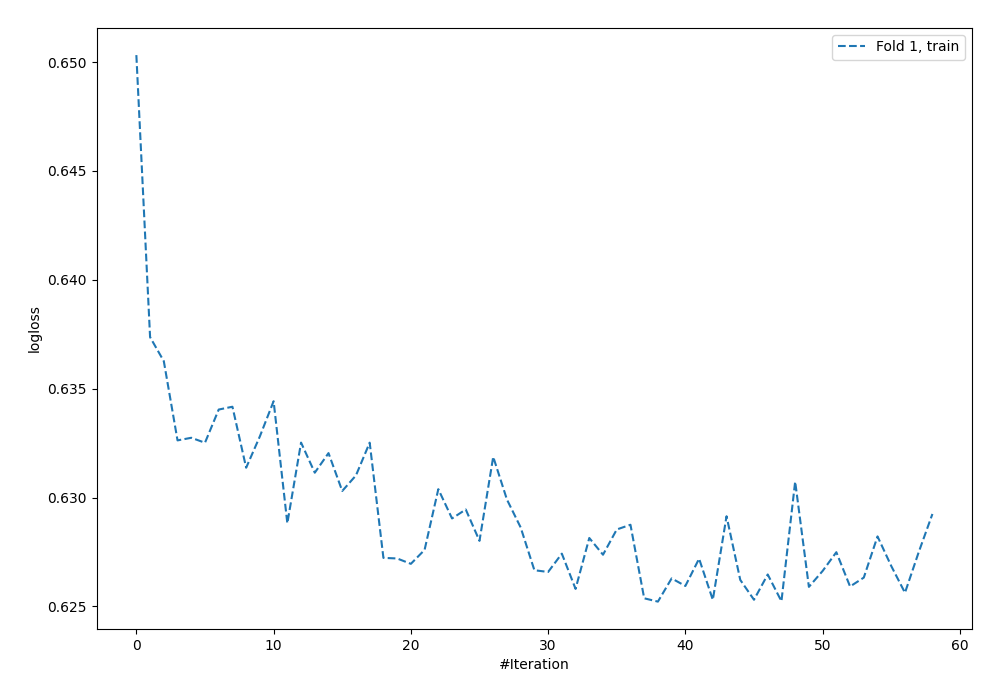
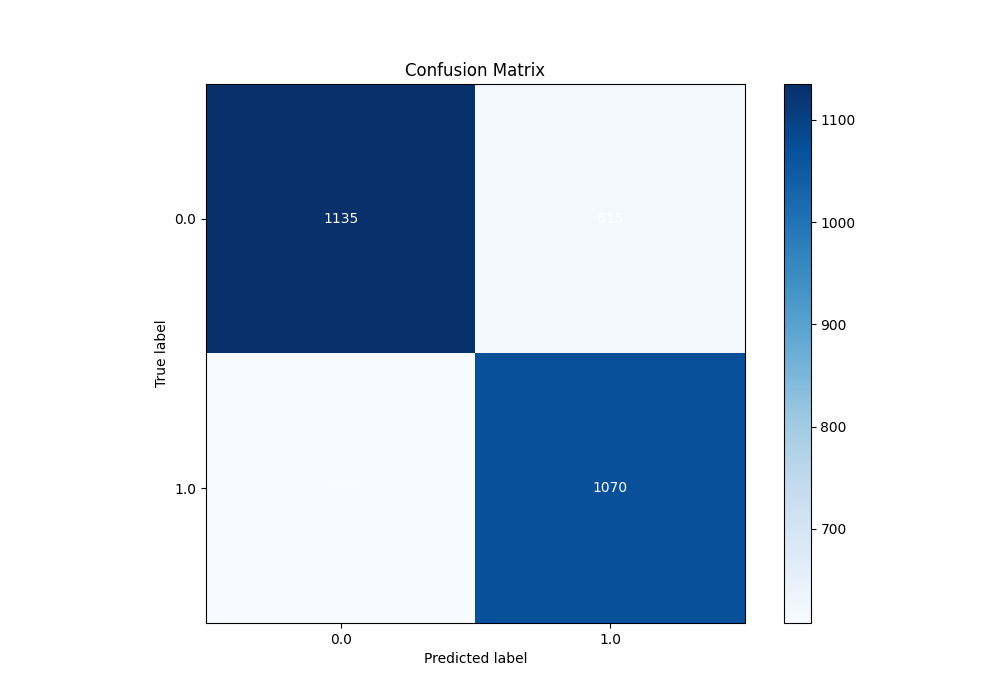

# Summary of 4_Default_NeuralNetwork

[<< Go back](../README.md)

## Neural Network
- **n_jobs**: -1
- **dense_1_size**: 32
- **dense_2_size**: 16
- **learning_rate**: 0.05
- **explain_level**: 2

## Validation

- **validation_type**: split
- **train_ratio**: 0.75
- **shuffle**: True
- **stratify**: True

## Optimized metric

auc

## Training time

2.3 seconds

## Metric details

|           |    score |   threshold |
|:----------|---------:|------------:|
| logloss   | 0.63519  | nan         |
| auc       | 0.693547 | nan         |
| f1        | 0.686734 |   0.314252  |
| accuracy  | 0.643232 |   0.528596  |
| precision | 0.791367 |   0.805116  |
| recall    | 1        |   0.0398851 |
| mcc       | 0.286213 |   0.528596  |

## Metric details with threshold from accuracy metric

|           |    score |   threshold |
|:----------|---------:|------------:|
| logloss   | 0.63519  |  nan        |
| auc       | 0.693547 |  nan        |
| f1        | 0.636337 |    0.528596 |
| accuracy  | 0.643232 |    0.528596 |
| precision | 0.635015 |    0.528596 |
| recall    | 0.637664 |    0.528596 |
| mcc       | 0.286213 |    0.528596 |

## Confusion matrix (at threshold=0.528596)

|              |   Predicted as 0 |   Predicted as 1 |
|:-------------|-----------------:|-----------------:|
| Labeled as 0 |             1135 |              615 |
| Labeled as 1 |              608 |             1070 |

## Learning curves

## Permutation-based Importance

## Confusion Matrix

## Normalized Confusion Matrix

## ROC Curve

## Kolmogorov-Smirnov Statistic

## Precision-Recall Curve

## Calibration Curve

## Cumulative Gains Curve

## Lift Curve

[<< Go back](../README.md)
