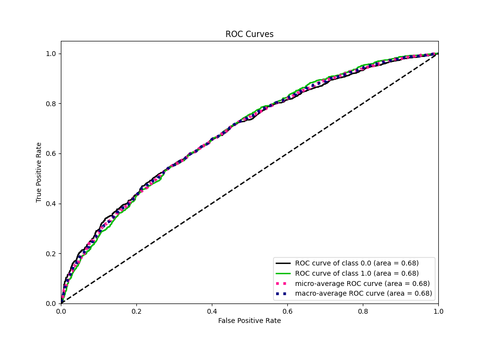

# Summary of 5_Default_RandomForest

[<< Go back](../README.md)

## Random Forest
- **n_jobs**: -1
- **criterion**: gini
- **max_features**: 0.9
- **min_samples_split**: 30
- **max_depth**: 4
- **eval_metric_name**: auc
- **explain_level**: 2

## Validation

- **validation_type**: split
- **train_ratio**: 0.75
- **shuffle**: True
- **stratify**: True

## Optimized metric

auc

## Training time

4.7 seconds

## Metric details

|           |    score |   threshold |
|:----------|---------:|------------:|
| logloss   | 0.637989 |  nan        |
| auc       | 0.684538 |  nan        |
| f1        | 0.685794 |    0.372137 |
| accuracy  | 0.628938 |    0.548799 |
| precision | 0.805263 |    0.769742 |
| recall    | 1        |    0.145221 |
| mcc       | 0.26522  |    0.427915 |

## Metric details with threshold from accuracy metric

|           |    score |   threshold |
|:----------|---------:|------------:|
| logloss   | 0.637989 |  nan        |
| auc       | 0.684538 |  nan        |
| f1        | 0.589942 |    0.548799 |
| accuracy  | 0.628938 |    0.548799 |
| precision | 0.642556 |    0.548799 |
| recall    | 0.545292 |    0.548799 |
| mcc       | 0.2581   |    0.548799 |

## Confusion matrix (at threshold=0.548799)

|              |   Predicted as 0 |   Predicted as 1 |
|:-------------|-----------------:|-----------------:|
| Labeled as 0 |             1241 |              509 |
| Labeled as 1 |              763 |              915 |

## Learning curves

## Permutation-based Importance

## Confusion Matrix

## Normalized Confusion Matrix

## ROC Curve

## Kolmogorov-Smirnov Statistic

## Precision-Recall Curve

## Calibration Curve

## Cumulative Gains Curve

## Lift Curve

## SHAP Importance

## SHAP Dependence plots

### Dependence (Fold 1)

## SHAP Decision plots

[<< Go back](../README.md)
